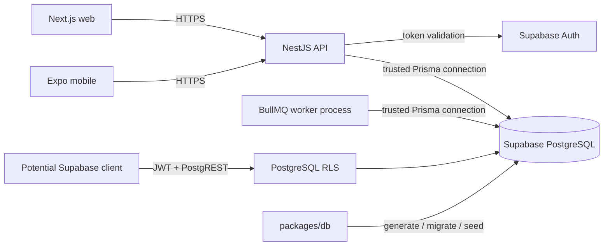

# Database architecture

Updated: 2026-07-17 - Current-state brownfield architecture for `packages/db` and
Supabase/PostgreSQL persistence.

<!-- markdownlint-disable MD013 -->

## Executive summary

CoutureCast persists application data in PostgreSQL hosted locally by the Supabase CLI and
remotely by externally configured Supabase projects. [`packages/db`](../../packages/db/) owns the
logical Prisma model, ordered SQL migrations, deterministic development seeds, and database-focused
tests. NestJS API repositories and the standalone BullMQ workers consume the generated Prisma
Client; they do not own the schema.

The architecture has two authorization lanes:

1. Direct Supabase/PostgREST access uses signed JWT claims, PostgreSQL grants, and row-level
   security (RLS).
2. NestJS uses a trusted Prisma connection and enforces request authorization in guards and
   owner-aware repository queries.

Those lanes are related but not interchangeable. The API does not propagate each caller's JWT
claims into its Prisma database session, so RLS cannot repair a missing API-side ownership filter.
Current web and mobile code does not use a Supabase data client, making the API lane the active
product path.

The implementation contains 25 Prisma models, five enums, and 25 ordered migrations. The current
schema covers identity and guardian consent, weather, wardrobe and recommendations, social data,
alert delivery, telemetry, feature flags, job failures, moderation, and immutable audit evidence.
Committed SQL is essential: it supplies partial indexes, checks, grants, RLS, security-definer
helpers, and triggers that Prisma cannot represent.

The largest current risks are the transitional email-based Auth identity bridge, selective RLS
coverage, trusted Prisma sessions without end-user RLS context, migrations running inside API
builds, no database rollback or readiness probe, and a seed rerun that conflicts with immutable
audit rows.

## Scope and evidence

This is a current-state document, not a target architecture. It is based on:

- the [Prisma schema](../../packages/db/prisma/schema.prisma);
- all [committed migrations](../../packages/db/prisma/migrations/);
- the [seed entry point](../../packages/db/prisma/seeds/index.ts) and seed modules;
- the five [database test suites](../../packages/db/test/);
- [local Supabase configuration](../../supabase/config.toml);
- the [migration deployment wrapper](../../scripts/prisma-migrate-deploy.mjs);
- API Prisma repositories and worker entry points; and
- generated brownfield documentation for the
  [data model](data-models-database.md),
  [integrations](integration-architecture.md),
  [development workflow](development-guide.md),
  [deployment](deployment-guide.md), and
  [source tree](source-tree-analysis.md).

Remote Supabase project settings, network controls, backups, extensions, connection pooling, and
provider-side policies are outside repository evidence. The configured local PostgreSQL version
must not be assumed to prove the remote version.

## Exact implemented stack

- Repository runtime: Node.js 24 or newer and npm 10.8.1.
- Database workspace: ESM TypeScript 5.9.3; its local engine declaration still permits Node 22 or
  newer, but repository commands require Node 24.
- ORM and migration tool: Prisma CLI 6.19.0 and `@prisma/client` 6.19.0.
- Database provider: PostgreSQL through Prisma's `postgresql` datasource and `DATABASE_URL`.
- Local database platform: Supabase CLI 2.62.5 with PostgreSQL 17 on port 54322.
- Local Supabase surfaces: API/PostgREST, Auth, Storage, Realtime, Studio, Inbucket, and Analytics.
- Seed runtime: `tsx` 4.20.6 and Faker 10.1.0 with a fixed random seed.
- Database tests: Vitest 4.0.9 in Node, serialized across files.
- Live SQL test driver: `pg` 8.16.3.

The package manifests and lockfile are version authority. Prisma Client is generated into installed
`@prisma/client` state; it is not checked in under `packages/db` and must not be hand-edited.

## Ownership and authority

Authority is intentionally split by concern:

- [`schema.prisma`](../../packages/db/prisma/schema.prisma) owns model names, scalar types,
  relations, Prisma-visible uniqueness/indexes, mappings, defaults, and client generation.
- [Ordered migration SQL](../../packages/db/prisma/migrations/) owns the deployed physical history.
  It is authoritative for checks, partial indexes, foreign-key actions, grants, RLS, helper
  functions, and triggers.
- [`migration_lock.toml`](../../packages/db/prisma/migrations/migration_lock.toml) locks the migration
  provider to PostgreSQL.
- [`packages/db/prisma/seeds`](../../packages/db/prisma/seeds/) owns synthetic development data.
- [`supabase/config.toml`](../../supabase/config.toml) owns the local Supabase service topology. It
  does not provision or document remote projects.
- [`scripts/prisma-migrate-deploy.mjs`](../../scripts/prisma-migrate-deploy.mjs) owns application
  startup migration deployment and environment-file precedence.
- [`apps/api/src/prisma`](../../apps/api/src/prisma/) owns the injectable runtime Prisma provider.
- Feature repositories under [`apps/api/src/modules`](../../apps/api/src/modules/) own query
  composition and application-level tenant filters.
- [`apps/api/src/workers`](../../apps/api/src/workers/) owns the standalone worker Prisma lifecycle.
- Supabase Auth owns signed identity. The application `User` table remains application-owned and is
  not foreign-keyed to `auth.users`.

Model comments containing `RLS` are documentation only. Enforcement exists only when committed SQL
enables RLS, creates policies, and grants or revokes role privileges.

## Persistence topology and runtime boundaries



API and workers connect through the URL selected by `DATABASE_URL`. Supabase Auth is consulted by
the API over HTTPS; Auth rows are not accessed through Prisma. A direct Supabase client may use the
public schema and RLS, but that path is not wired into the current web or mobile product.

Local Supabase exposes `public` and `graphql_public` through its API with `public` and `extensions`
on the extra search path. The local pooler is disabled. Remote pooler mode, role, and limits are not
declared in the repository.

## Domain model

Unless overridden in SQL, entity IDs are text values created with Prisma `cuid()`, creation times
default to database `now()`, and Prisma maintains `@updatedAt` fields. Raw SQL writers must maintain
those update timestamps themselves.

### Identity, profile, and guardian consent

- `User` is the application identity root, with a unique email and relations to most private data.
- `UserProfile` and `ComfortPreferences` are one-to-one user records.
- `GuardianConsent` joins a guardian `User` to a teen `User`, records read-only or full access, and
  tracks grant/revoke state and IP metadata. A guardian/teen pair is unique.
- `GuardianInvitation` records an expiring invitation before consent. A SQL partial unique index
  permits history while allowing only one unaccepted invitation per teen and guardian email.

The five enums are `ConsentStatus`, `ConsentLevel`, `ComfortRun`, `WindTolerance`, and
`PrecipPreparedness`. Profile compliance state is JSON rather than relational state.

### Weather and saved locations

- `WeatherSnapshot` stores normalized provider observations by canonical location.
- `ForecastSegment` contains time-specific forecast details under a snapshot.
- `WeatherIngestionState` records the latest provider success and failure per location key.
- `SavedLocation` stores user intent separately from provider observations.

A snapshot is unique by location key, provider, and provider update time. A forecast segment is
unique by snapshot and forecast time. Saved locations are unique by user and location key, permit
only one primary row per user through a partial index, bound latitude/longitude, and require a
lowercase hyphenated location key matching `^[a-z0-9]+(-[a-z0-9]+)*$`.

### Wardrobe, recommendation, and social data

- `GarmentItem` is a user-owned wardrobe record.
- `PaletteInsights` is a one-to-one derived analysis for a garment and also carries `user_id`.
- `OutfitRecommendation` combines a user, optional forecast segment, scenario, garment IDs, and
  reasoning badges.
- `LookbookPost` optionally references palette insight data.
- `EngagementEvent` joins a user to a required lookbook post.
- `ModerationEvent` can reference a post, garment, flagging user, and reviewing user.

Recommendation garment membership is JSON, not a join table, so deleted or foreign garment IDs can
survive without database enforcement. The recommendation unique key is user, forecast segment, and
scenario. PostgreSQL permits duplicate user/scenario rows when the segment is `NULL`.

The moderation model does not require a post or garment target and does not constrain action or
reason values. Community visibility is not implemented at the database policy layer; lookbook and
engagement records remain self/admin scoped.

### Alerting, events, and notification delivery

- `AlertRule` stores one enabled threshold per user and rule type.
- `NotificationPreference` is a one-to-one user record for push and quiet-hour behavior.
- `PushToken` stores a globally unique token owned by a user.
- `EventEnvelope` stores a channel and JSON payload for an optional user.
- `AlertDeliveryOutbox` is a one-to-one durable handoff from an event to BullMQ.
- `AlertCooldownReservation` stores rolling eligibility by deduplication fingerprint.

SQL limits rule types to `temperature`, `precipitation`, and `severe`. Temperature thresholds are
greater than zero and at most 100, precipitation thresholds are from zero through one, and severe
thresholds are `1`, `2`, or `3`.

The outbox event foreign key cascades on envelope deletion. Cooldown and outbox rows are worker-only
coordination state: RLS is enabled, no client policy exists, and `anon`/`authenticated` grants are
revoked.

### Operations, audit, telemetry, and configuration

- `JobFailure` records failed queue jobs, payloads, errors, attempts, and failure time.
- `AuditLog` records user-scoped compliance/security evidence and is append-only in SQL.
- `TelemetryEvent`, mapped to `telemetry_events`, stores typed event names and JSON properties.
- `FeatureFlag`, mapped to `feature_flags`, stores the last known typed JSON flag value.

Audit `UPDATE`, `DELETE`, and `TRUNCATE` operations raise SQLSTATE `42501` through triggers. RLS is
enabled and forced, and only admin/moderator reads are policy-authorized for authenticated callers.
Telemetry permits owned non-null rows for authenticated users and anonymous inserts only for the
service role.

## Relationships, constraints, and deletion behavior

The major relationship paths are:

1. `User` -> profile/comfort/wardrobe -> palette -> lookbook.
2. `WeatherSnapshot` -> `ForecastSegment` -> `OutfitRecommendation`.
3. `User` <-> `GuardianConsent` <-> `User`, with invitations preceding accepted links.
4. `User` -> saved locations/rules/preferences/tokens -> event -> outbox.
5. `User` -> audit/telemetry/moderation evidence.

Important physical constraints not fully visible in Prisma include:

- one open guardian invitation per teen/email through a partial unique index;
- one primary saved location per user through a partial unique index;
- saved-location key and coordinate checks;
- alert type and type-specific threshold checks;
- forced RLS and immutability triggers on `AuditLog`; and
- client grant revocation on worker coordination tables.

Deletion behavior is mixed. Newer saved-location, alert-setting, event, outbox, and telemetry links
often cascade. Older profile, consent, wardrobe, social, and audit links commonly restrict deletion
or set optional references to null. User erasure therefore requires an explicit dependency-aware
workflow; deleting a `User` is not uniformly cascading.

JSON fields remain application-governed. Database foreign keys do not validate recommendation
garment IDs, event payloads, telemetry properties, feature-flag shapes, profile compliance fields,
palette values, or image URL arrays.

## RLS, identity, and security architecture

### Identity mapping

`User.id` is text, normally a cuid, while Supabase Auth JWT `sub` values are UUIDs.
`private.current_app_user_id()` resolves the application identity in this order:

1. signed top-level `app_user_id`;
2. signed `app_metadata.app_user_id`;
3. a case-insensitive `User.email` lookup when the signed email claim is verified; then
4. JWT `sub` as a fallback.

Roles are read from signed top-level or `app_metadata` claims. Client-writable `user_metadata` is
ignored. This is tested explicitly. The verified-email lookup is transitional because email
reassignment can change the mapping. A durable signed `app_user_id` from an Auth hook is the safer
long-term identity invariant.

Seeded `User` records do not create corresponding `auth.users` rows. A seeded account becomes
addressable through RLS only when trusted claims or verified email map to it.

### Policy helpers

The shared helpers live in a locked-down `private` schema, use `SECURITY DEFINER`, and set explicit
search paths:

- `current_app_user_id()` and `current_app_role()` resolve trusted claims.
- `is_admin_actor()` recognizes `admin` and `moderator`.
- `has_active_guardian_consent()` checks status, revocation, and minimum consent level.
- `can_read_shared_user_row()` allows owner, admin, or active read guardian.
- `can_write_shared_user_row()` allows owner, admin, or active full-access guardian.
- `can_manage_self_row()` allows only owner or admin.
- `user_requires_guardian_consent()` blocks self-access when profile compliance JSON indicates
  pending guardian consent and the last active link is lost.

Public execution is revoked. The guardian-consent requirement helper is also unavailable directly
to `authenticated`; higher-level policy helpers invoke it under definer rights.

### Policy coverage

Guardian-shared owner columns:

- `UserProfile`, `ComfortPreferences`, `GarmentItem`, `PaletteInsights`, and
  `OutfitRecommendation`;
- owner/admin CRUD;
- active read-only guardian read;
- active full-access guardian CRUD.

Self/admin-only owner columns:

- `LookbookPost`, `EngagementEvent`, `SavedLocation`, `AlertRule`,
  `NotificationPreference`, and `PushToken`;
- owner/admin CRUD;
- no guardian access based only on the guardian link.

Special policies:

- `GuardianConsent`: guardian, teen, admin, or moderator read; no authenticated mutation policy.
- `EventEnvelope`: owned or global read, with admin visibility; no authenticated mutation policy.
- `telemetry_events`: owned authenticated read/insert; service-role anonymous insert.
- `AuditLog`: forced RLS, admin/moderator read only, and trigger-enforced immutability.
- `AlertDeliveryOutbox` and `AlertCooldownReservation`: RLS enabled, no client policies or grants.

No committed RLS policy was found for `User`, weather snapshots/segments/ingestion state,
`GuardianInvitation`, `JobFailure`, `ModerationEvent`, or `feature_flags`. These tables must remain
behind trusted roles and cannot be treated as tenant-safe for direct client access.

### API versus direct database enforcement

The HTTP guard validates bearer tokens against Supabase Auth, derives application user and role,
checks guardian state where required, and passes identity to services. Repositories then add user
filters to Prisma queries.

The trusted Prisma connection does not set `request.jwt.claims` per request. Depending on its
database role, it can bypass or operate outside end-user RLS semantics. Every API query therefore
needs explicit authorization and ownership scoping even when the same table has RLS for direct
Supabase access.

## Migration and schema lifecycle

The ordered migration chain starts at
[`20251125180510_init`](../../packages/db/prisma/migrations/20251125180510_init/migration.sql) and
currently ends at the
[`20260716120800` recommendation constraint](../../packages/db/prisma/migrations/20260716120800_add_outfit_recommendation_unique_constraint/migration.sql).
It includes incremental operational, consent, RLS, audit, weather, location, alert, telemetry, and
recommendation changes.

Development lifecycle:

1. Edit `schema.prisma` and, when needed, SQL behavior.
2. Run `npm run db:migrate` from the repository root. This invokes `prisma migrate dev` in
   `packages/db`, creates a migration, and applies it to the selected `DATABASE_URL`.
3. Review generated SQL for destructive changes and Prisma-inexpressible security behavior.
4. Run `npm run db:generate`.
5. Run the database tests and affected API integration tests.
6. Commit the schema and migration together.

Deployment lifecycle:

1. `scripts/prisma-migrate-deploy.mjs` loads root environment files.
2. It invokes `prisma migrate deploy` against the explicit schema path.
3. Only committed unapplied migrations run; no migration is generated and no seed runs.
4. The wrapper mirrors Prisma's exit status so API startup or build fails on migration failure.

The wrapper checks `.env.local`, then `.env.prod` when `NODE_ENV=production` or `.env.preview`
otherwise, then `.env`. Existing process values normally win. `TEST_ENV=local` allows `.env.local`
to override inherited values to reduce accidental remote targeting.

Migration deployment currently runs before local/API E2E startup and during the Vercel API build.
There is no repository-owned approval gate, backup step, post-migration database probe, down
migration, or automated restore. Reverting application code does not reverse applied SQL.

## Seed lifecycle

`npm run db:seed` invokes `prisma db seed`, configured as
`tsx prisma/seeds/index.ts`. The entry point fixes Faker's seed at `4242` and runs:

1. users, profiles, comfort settings, and guardian consent;
2. garments and palette analysis;
3. weather snapshots and forecast segments;
4. recommendations, lookbook, engagement, and audit rows; and
5. canonical and supplemental feature flags.

Fixtures are synthetic, use stable IDs, and mostly use `upsert`. They reuse factories from
`@couture/testing`. They do not provision Supabase Auth identities.

`npm run db:reset` is destructive: it executes `prisma migrate reset --force --skip-seed` and then
runs one explicit seed. The selected database must be verified before migration, reset, or seed
commands.

There is a known rerun defect. The ritual seed upserts existing audit rows with a non-empty update
branch, while the later audit trigger forbids all updates. A first seed into an empty migrated
database succeeds; a second direct `db:seed` can fail with SQLSTATE `42501`. Reset succeeds because
it recreates an empty database. Audit seeding needs insert-if-absent semantics to be rerunnable.

Supabase's local config separately enables a SQL seed path at `supabase/seed.sql`, but that file is
not present in the current tree. The repository's working seed authority is the Prisma TypeScript
entry point; do not assume `supabase db reset` has an equivalent seed lifecycle.

## Runtime integration

### API and repositories

The API's Prisma module provides the generated client to feature repositories. Current database
consumers include auth and guardian state, profiles, locations, weather, ritual recommendations,
alerts/outbox/fanout, events, push tokens, telemetry, feature flags, moderation/audit, and failed-job
administration.

Repository-level user filters are security controls, not just query optimizations. The API's
verified Auth identity must be carried into each owner-scoped query.

### Weather and recommendations

The standalone worker persists a normalized weather snapshot, 48 forecast segments, and ingestion
state. API reads use persisted weather rather than calling providers synchronously. Ritual
generation combines persisted segments, comfort settings, and garments, then finds or creates
recommendations. A Prisma `P2002` race path reloads an existing unique recommendation.

### Alert outbox

Alert evaluation persists an `EventEnvelope`, outbox handoff, and cooldown reservation before
BullMQ fanout. The outbox is the recoverable transaction boundary between PostgreSQL and Redis.
Workers mark dispatch only after queue handoff succeeds. Removing that boundary would reintroduce
lost or duplicate notification risk.

### Telemetry and feature flags

Telemetry is persisted independently from PostHog so one sink can fail without blocking the other.
An API cron deletes telemetry rows older than 24 hours. Feature flags use PostgreSQL as the middle
fallback between remote PostHog and code defaults.

### Supabase Storage

Storage is enabled in local Supabase configuration, but `packages/db` contains no bucket or object
policy migration. Database models store media URLs as strings/JSON. Bucket creation, object
ownership, retention, and remote Storage policy are not recoverable from this persistence package.

## Source tree

```text
packages/db/
├── package.json                  Prisma and test command authority
├── tsconfig.json                 strict TypeScript project
├── vitest.config.ts              serialized Node test configuration
├── prisma/
│   ├── schema.prisma             logical model and client generator
│   ├── migrations/
│   │   ├── migration_lock.toml   PostgreSQL provider lock
│   │   └── */migration.sql       ordered physical schema and security history
│   └── seeds/
│       ├── index.ts              deterministic seed orchestration
│       ├── users.ts              users, profiles, comfort, guardian links
│       ├── wardrobe.ts           garments and palette analysis
│       ├── weather.ts            snapshots and forecast segments
│       ├── rituals.ts            recommendations, social data, audit rows
│       ├── feature-flags.ts      persisted typed flag values
│       └── interop.ts            module interop and supplemental data
└── test/
    ├── rls-policies.spec.ts
    ├── audit-log-immutability.spec.ts
    ├── alert-schema.spec.ts
    ├── alert-delivery-security.spec.ts
    └── alert-outbox-schema.spec.ts
```

Adjacent boundaries are:

- [`supabase/config.toml`](../../supabase/config.toml): local service host configuration;
- [`scripts/prisma-migrate-deploy.mjs`](../../scripts/prisma-migrate-deploy.mjs): deploy migration
  wrapper;
- [`apps/api/src/prisma`](../../apps/api/src/prisma/): runtime client provider;
- [`apps/api/src/modules`](../../apps/api/src/modules/): feature repositories; and
- [`packages/testing`](../../packages/testing/): shared synthetic factories and cleanup helpers.

Ignored `packages/db/.env`, generated Prisma Client state, dependencies, and test caches are not
architecture authority and must never be used as documentation input.

## Development and deployment

Local setup requires Node 24, npm, Docker, and the Supabase CLI dependency. Typical commands are:

```bash
npm run supabase:start
npm run db:generate
npm run db:migrate
npm run db:seed
npm test --workspace packages/db
```

`npm run start:api` generates Prisma Client, applies committed migrations, and starts the API.
`npm run start:all` starts local Supabase, destructively resets/seeds its PostgreSQL database through
Prisma, then starts API and web. It must not target a database containing data that should survive.

Remote selection is entirely environment-driven. The repository distinguishes local, Preview, and
production URLs, but cannot prove that provider-side resources are separated. No populated
environment file belongs in version control or documentation.

Vercel's API build generates Prisma Client, applies committed migrations, and builds NestJS. This
couples schema deployment to application builds and can allow concurrent builds to contend for
migration deployment. The API health endpoint does not query PostgreSQL, so a successful health
response does not establish database readiness.

Workers require a separate long-running `start:workers` process. No hosted worker deployment is
declared, so weather ingestion, outbox dispatch, telemetry cleanup, and related persistence
lifecycle work should not be assumed active in production.

## Testing architecture

[`vitest.config.ts`](../../packages/db/vitest.config.ts) runs `test/**/*.spec.ts` in Node with file
parallelism disabled. Coverage combines static source assertions with live PostgreSQL behavior:

- `alert-schema.spec.ts` inspects the Prisma schema and alert persistence/RLS migration text.
- `alert-delivery-security.spec.ts` checks push-token, event, and worker-only SQL posture.
- `alert-outbox-schema.spec.ts` checks outbox/cooldown shape and threshold enforcement.
- `rls-policies.spec.ts` connects to migrated PostgreSQL and exercises roles, signed claims,
  guardian levels, revocation, self/admin access, isolation, event visibility, worker tables, and
  telemetry.
- `audit-log-immutability.spec.ts` verifies forced RLS and blocked update/delete/truncate behavior.

Live suites resolve `RLS_TEST_DATABASE_URL`, then `DATABASE_URL`, then the local Supabase default.
They require a migrated non-production target. RLS scenarios use randomized synthetic IDs and
dependency-aware cleanup. Audit tests use transaction rollback because committed audit rows cannot
be deleted.

Run:

```bash
npm run db:generate
npm test --workspace packages/db
npm run typecheck --workspace packages/db
npm run lint --workspace packages/db
```

Relevant changes also require API repository/integration tests. The full repository gate does not
replace live database tests against a correctly migrated target.

Known database test gaps include:

- seed rerun idempotence;
- guardian-invitation partial uniqueness;
- saved-location key, coordinate, and one-primary checks;
- weather uniqueness;
- recommendation uniqueness when forecast segment is null;
- deletion/erasure behavior across mixed foreign-key actions;
- direct access posture for tables without RLS; and
- migration deployment concurrency and post-migration readiness.

## Operational considerations

- Treat `DATABASE_URL` as target-sensitive. Confirm host, database, and environment before any
  migration, seed, reset, test, or load operation.
- Use direct PostgreSQL connections suitable for Prisma migration semantics. Remote pooler
  requirements are external and must be verified with the selected Supabase project.
- Migrations are forward-only in repository practice. Use expand/contract changes when old and new
  application versions may overlap.
- `@updatedAt` is Prisma-managed. Raw SQL and external writers must set update timestamps.
- Monitor migration duration, lock waits, connection exhaustion, query latency, outbox age and
  attempts, job failures, weather freshness, telemetry cleanup, and audit growth. Repository
  dashboards do not currently provide database-specific signals.
- Database health is absent from primary readiness probes. Startup success and HTTP health do not
  prove queryability, migration currency, RLS correctness, or worker progress.
- Backup, point-in-time recovery, restore drills, retention, and disaster recovery are not encoded
  in the repository. They require explicit Supabase project ownership.
- Audit rows are immutable and may contain IP metadata. Retention and user-erasure handling require
  a documented legal and operational policy rather than ad hoc deletion.
- Never log or persist service keys, JWTs, credentials, real wardrobe media, personal contact data,
  or identifiable fixtures in migrations, seeds, tests, or documentation.

## Concrete risks

1. **Identity bridge drift:** verified-email fallback can map the wrong application row after email
   reassignment. Durable signed `app_user_id` claims are not established by a repository Auth hook.
2. **Dual authorization lanes:** API Prisma sessions do not carry end-user JWT claims. A missed
   repository owner filter is not automatically blocked by direct-client RLS policy.
3. **Selective RLS:** identity roots, weather, invitations, failures, moderation, and feature flags
   have no committed RLS policy. Accidental direct grants could expose cross-tenant or operational
   data.
4. **Build-coupled migrations:** every API Vercel build can apply schema changes without a separate
   approval, backup, readiness check, or rollback stage.
5. **No schema rollback:** reverting code leaves forward migrations applied; incompatible
   destructive changes can strand the previous application version.
6. **Audit seed failure:** rerunning the TypeScript seed updates immutable audit rows and can fail
   with SQLSTATE `42501`.
7. **Missing Supabase SQL seed:** local Supabase config references `supabase/seed.sql`, but the file
   is absent. Supabase-native reset behavior is not equivalent to the documented Prisma reset.
8. **Nullable uniqueness:** recommendations with no forecast segment are not deduplicated by the
   current compound unique constraint.
9. **Unvalidated JSON references:** garment IDs, compliance state, event payloads, telemetry, and
   feature-flag values can drift from relational reality.
10. **Free-form domain values:** scenario, category, event/action type, platform, quiet-hour, and
    timezone strings lack comprehensive database validation.
11. **Mixed deletion semantics:** user erasure can fail or leave nullable historical links because
    cascade, restrict, and set-null behavior vary by model generation.
12. **Worker deployment gap:** no hosted process is declared for outbox dispatch, weather
    ingestion, and scheduled cleanup, so durable rows may accumulate without progress.
13. **No database readiness or metrics:** health checks and current observability do not establish
    database connectivity, migration state, RLS posture, locks, pool pressure, or outbox lag.
14. **Remote topology uncertainty:** PostgreSQL version, pooler, network restrictions, backups,
    extensions, service-role grants, and environment isolation are provider-side and unverified.
15. **Storage ownership gap:** media URL columns exist while bucket/object policy and lifecycle are
    absent from database migrations, leaving persistence and object authorization easy to diverge.
