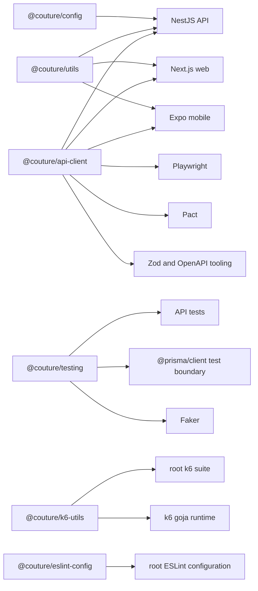
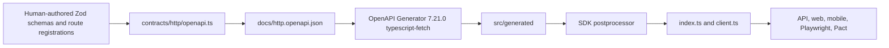

# Shared packages architecture

Updated: 2026-07-17 - Current-state brownfield architecture for shared packages,
excluding `packages/db`.

<!-- markdownlint-disable MD013 -->

## Executive summary

The shared layer is six private npm workspaces under [`packages/`](../../packages/):
`@couture/config`, `@couture/utils`, `@couture/api-client`, `@couture/testing`,
`@couture/k6-utils`, and `@couture/eslint-config`. This document excludes the database
workspace. It mentions Prisma only where `@couture/testing` deliberately exposes a
Prisma-aware test boundary.

The packages are independent at source level: none imports another shared package.
Applications and root test suites compose them through package exports. Root scripts impose
build order, while application `pre*` hooks prepare the packages required by a direct app
command. The main architectural center is `@couture/api-client`, which owns human-authored
Zod contracts, OpenAPI generation, the generated Fetch SDK, realtime payloads, polling, and
analytics contracts.

The current design has three important consequences:

- canonical HTTP truth begins in shared Zod modules, but NestJS controllers independently
  determine which routes actually exist;
- most shared packages emit CommonJS, while the k6 package emits ESM for the k6 `goja`
  runtime;
- generated OpenAPI and SDK files are checked in for consumers and review, but they are
  derived artifacts and must never be edited directly.

This architecture is based on the current code and manifests. The detailed inventories in
[shared packages](shared-packages.md), [integration architecture](integration-architecture.md),
[source tree analysis](source-tree-analysis.md), and
[development guide](development-guide.md) provide supporting evidence and wider context.

## Scope and authority

In scope:

- package manifests, TypeScript/module configuration, public exports, and source boundaries;
- canonical HTTP, realtime, analytics, configuration, utility, testing, k6, and lint contracts;
- package consumers, generation paths, build order, and validation workflows;
- concrete current-state limitations and risks.

Out of scope:

- the implementation, schema, migrations, and security model of `packages/db`;
- app-internal business architecture except where an app consumes or implements a shared
  contract;
- intended packages that do not exist in the current tree.

For disagreements, use this authority order:

1. Human-authored package source and current package manifests.
2. Root orchestration in [`package.json`](../../package.json), [`turbo.json`](../../turbo.json),
   and current scripts.
3. Generated OpenAPI and SDK artifacts as evidence of the latest successful generation.
4. Brownfield documentation.
5. Planning artifacts and older README prose.

Installed dependency versions come from [`package-lock.json`](../../package-lock.json).

## Workspace and technology baseline

The root manifest declares npm 10.8.1, Node.js 24 or newer, and workspaces at `apps/*` and
`packages/*`. TypeScript is 5.9.3. The root
[TypeScript configuration](../../tsconfig.json) uses ES2022, NodeNext modules and resolution,
strict mode, `noUncheckedIndexedAccess`, `useUnknownInCatchVariables`, and
`isolatedModules`.

All six packages are private internal workspaces. They are not independently versioned or
published registry products.

| Package                  | Source/build module model                   | Published runtime                     | Runtime dependencies           |
| ------------------------ | ------------------------------------------- | ------------------------------------- | ------------------------------ |
| `@couture/config`        | TypeScript CommonJS, Node resolution        | `dist/index.js` plus declarations     | None                           |
| `@couture/utils`         | TypeScript CommonJS, Node resolution        | `dist/index.js` plus declarations     | None                           |
| `@couture/api-client`    | TypeScript NodeNext in a `commonjs` package | CommonJS `dist` root and subpaths     | Zod, zod-to-openapi, `ts-node` |
| `@couture/testing`       | TypeScript NodeNext in a `commonjs` package | CommonJS `dist` root and subpaths     | Faker, Prisma Client           |
| `@couture/k6-utils`      | TypeScript ESNext with bundler resolution   | ESM `dist` root and explicit subpaths | k6 native/runtime modules      |
| `@couture/eslint-config` | Hand-authored CommonJS JavaScript           | `index.js` selected by `main`         | Root-hoisted lint toolchain    |

`@couture/config` and `@couture/utils` map `import`, `require`, and `default` to the same
CommonJS file. `@couture/api-client` and `@couture/testing` expose `default` conditions from
packages explicitly marked `commonjs`. `@couture/k6-utils` is explicitly `module`, compiles
ESNext with bundler resolution, and rewrites `.ts` relative import extensions during emit.
`@couture/eslint-config` has no export map and is loaded through its CommonJS `main`.

## Package boundaries and dependency flow



There are no arrows among the six package source trees. Their external dependency boundaries
are intentionally different:

- `@couture/config` and `@couture/utils` are dependency-free policy libraries;
- `@couture/api-client` depends on runtime schema and generation support;
- `@couture/testing` is test-only but coupled to generated Prisma types and schema shape;
- `@couture/k6-utils` targets k6 rather than Node or browser execution;
- `@couture/eslint-config` assumes parser, plugin, resolver, ESLint, and Prettier packages are
  available from the root workspace.

Current declared application consumers are:

- API: `@couture/api-client`, `@couture/config`, and `@couture/utils`; API development tests
  also declare `@couture/testing`;
- web and mobile: `@couture/api-client` and `@couture/utils`;
- root k6: `@couture/k6-utils`;
- root lint: `@couture/eslint-config`.

The application manifests currently use `file:../../packages/...` for shared runtime
dependencies, while the root uses `workspace:*` for the ESLint package. Consumers must still
treat package export maps, not filesystem layout, as the supported boundary.

## Public package surfaces

### `@couture/config`

[`packages/config/src/index.ts`](../../packages/config/src/index.ts) is the only public entry.
It exports:

- `FEATURE_FLAG_KEYS` and `FEATURE_FLAG_SYNC_DISTINCT_ID`;
- `coerceFeatureFlagValue`, `getDefaultFeatureFlagValue`, and `getFeatureFlag`;
- `FeatureFlagAdapters`, `FeatureFlagEvaluationSubject`, `FeatureFlagJsonValue`,
  `FeatureFlagKey`, `FeatureFlagRecord`, `FeatureFlagStoredValue`, and `FeatureFlagValue`.

The package owns feature-flag names, value definitions, defaults, and the evaluation algorithm.
The four current flags are `premium_themes_enabled`, `community_feed_enabled`,
`color_analysis_enabled`, and `weather_alerts_enabled`. Evaluation accepts only known keys,
tries the remote adapter, then the fallback adapter, then the code default. Remote errors
degrade to fallback; fallback-adapter errors propagate. Provider SDKs and persistence adapters
remain in the API.

### `@couture/utils`

[`packages/utils/src/index.ts`](../../packages/utils/src/index.ts) is the only public entry.
It exports:

- `parseBirthdateInput`, `calculateAge`, `evaluateAgeGate`, and
  `evaluateBirthdateInput`;
- `AGE_GATE_MESSAGES` and `INVALID_BIRTHDATE_MESSAGE`;
- `AgeGateAccountStatus`, `AgeGateResult`, and `BirthdateAgeGateEvaluation`.

The package is the canonical age and birthdate policy boundary. It accepts real trimmed
`YYYY-MM-DD` dates, calculates against UTC calendar fields, blocks users under 13, requires
guardian consent from 13 through 15, and activates users at 16. API, web, and mobile must not
duplicate these thresholds.

### `@couture/api-client`

The [export map](../../packages/api-client/package.json) exposes:

- `@couture/api-client`: every generated SDK export, `createApiClient`, client option types,
  analytics contracts, socket contracts, and `PollingService`;
- `@couture/api-client/contracts/http`: the combined HTTP contract barrel;
- `@couture/api-client/contracts/http/*`: individual contract modules;
- `@couture/api-client/realtime/*`: realtime implementation modules;
- `@couture/api-client/types/*`: analytics and socket modules;
- `@couture/api-client/testing/*`: framework-neutral assertion helpers.

The root [`index.ts`](../../packages/api-client/src/index.ts) intentionally re-exports all
generated classes, runtime helpers, and models. Generated symbols are therefore public, but
generated filesystem paths are not. Application client construction goes through
[`createApiClient`](../../packages/api-client/src/client.ts), which accepts a base URL and
either an access token or options for token, credentials, fetch implementation, and headers.
It returns the generated mixed-in `DefaultApi`.

The HTTP barrel exports alerts, auth, common, events, guardian, health, locations, moderation,
ritual, user, weather, and OpenAPI composition modules. These domain modules expose Zod
schemas, inferred types, and registration functions.

The `testing/*` subpaths export analytics and structured-log assertions plus the injected
`ExpectLike` shape. They avoid a direct Vitest dependency so API and integration suites can
reuse the checks.

### `@couture/testing`

The [export map](../../packages/testing/package.json) exposes the root, `./cleanup`,
`./factories`, and `./factories/*`. The root re-exports all factories and cleanup functions.

The factory surface includes:

- generic, teen, and guardian users;
- wardrobe items;
- outfit recommendations, named rituals in this package;
- weather snapshots with 48 forecast segments;
- saved locations, alert rules, and notification preferences;
- fresh-object builders, typed Prisma create-input builders, optional persistence helpers,
  registry operations, constants, fixture types, and override types.

The cleanup surface includes `cleanup`, `configureCleanup`, `resetCleanupConfiguration`,
`registerForCleanup`, `resetCleanupRegistry`, `snapshotCleanupRegistry`, and their types.
Cleanup snapshots tracked IDs, deletes dependent records before parents, and clears the
registry in `finally`.

This package is for test code only. Production code must not import it. Persistence remains an
optional adapter boundary: factories can build objects without a database, while `{ persist:
true, prisma }` performs schema-coupled writes and registers created IDs.

### `@couture/k6-utils`

The root and explicit subpaths export:

- `api-request`: `apiRequest` and request/response/HTTP method types;
- `config`: `applyEnvOverrides`, `getConfig`, `getEnvOverride`, and
  `getScenarioConfig`;
- `crypto`: `aesEncrypt`;
- `distributions`: hash helpers, weighted selection, and Zipfian selection;
- `handle-summary`: `handleSummary`;
- `infra-delay`: `measureInfraDelay`;
- `jwt`: decode, HMAC encode/verify, RS256 encode/verify, and token/algorithm types;
- `random-data`: random list and email helpers;
- `time`: date, range, Unix timestamp helpers, and `TimestampRange`.

Reusable smoke, constant-rate, ramp-up, soak, and spike profiles live under
[`templates/load-profiles`](../../packages/k6-utils/templates/load-profiles/). The package is
not a general-purpose Node/browser utility library. `getConfig` calls k6 `open()` and must run
during the k6 init phase.

### `@couture/eslint-config`

[`index.js`](../../packages/eslint-config/index.js) is the sole entry. It configures ES2021
Node and browser environments, type-aware TypeScript parsing, TypeScript import resolution,
recommended TypeScript/import rules, and Prettier integration.

Notable policy requires type-only imports/exports, handled promises, awaited thenables,
kebab-case filenames, underscore-prefixed intentionally unused arguments, Unix line endings,
single quotes, and no semicolons. Focused tests are errors and complexity above 15 is a
warning. The root [ESLint configuration](../../.eslintrc.js) supplies workspace-specific
TypeScript projects and test/k6 overrides.

## Canonical HTTP contract, OpenAPI, and SDK pipeline



The concrete pipeline is:

1. Edit human-authored schemas and `register*Contracts` functions under
   [`src/contracts/http`](../../packages/api-client/src/contracts/http/).
2. [`openapi.ts`](../../packages/api-client/src/contracts/http/openapi.ts) registers common
   schemas and every domain slice, then creates an OpenAPI 3.1 document.
3. [`generate-http-openapi.ts`](../../packages/api-client/scripts/generate-http-openapi.ts)
   writes deterministic
   [`docs/http.openapi.json`](../../packages/api-client/docs/http.openapi.json) without
   starting NestJS.
4. Root `generate:api-client` invokes OpenAPI Generator 7.21.0 with the
   `typescript-fetch` target configured in [`openapitools.json`](../../openapitools.json).
5. [`postprocess-generated-sdk.ts`](../../packages/api-client/scripts/postprocess-generated-sdk.ts)
   creates stable generated barrels and `DefaultApi`, normalizes generated nulls, strengthens
   the weather hourly tuple, removes unused/generated metadata, and formats the result.
6. `client.ts` wraps generated configuration, and `index.ts` publishes the supported package
   surface.

Generator settings enable ES6, preserve enum property names, use one request object per
operation, and disable generated runtime checks. Zod parsing therefore remains the runtime
trust boundary. Both `docs/http.openapi.json` and `src/generated/` are checked-in outputs,
not sources.

Controllers remain a separate implementation authority. Generation reads contract
registrations, not NestJS route metadata, so route, security annotation, and response behavior
can drift between the API and generated document. Contract review must compare both sides.

## Realtime and analytics contracts

### Socket events and polling

[`socket-events.ts`](../../packages/api-client/src/types/socket-events.ts) defines a common
runtime-validated envelope with `version`, ISO `timestamp`, `userId`, and event-specific
`data`. Current channels are:

- `lookbook:new`: post ID plus optional locale, climate band, and media URLs;
- `ritual:update`: ritual ID, lifecycle status, optional next run time, and message;
- `alert:weather`: alert type, location, message, and severity.

The package command `gen:openapi:events` runs
[`generate-events-openapi.ts`](../../packages/api-client/scripts/generate-events-openapi.ts)
to write
[`docs/socket-events.openapi.json`](../../packages/api-client/docs/socket-events.openapi.json).
This is a separate schema-document path and does not feed the HTTP SDK generator.

[`PollingService`](../../packages/api-client/src/realtime/polling-service.ts) is a generic
foreground fallback. It fetches immediately, then every 30 seconds by default, advances an
optional `nextSince` cursor, and reports activation, events, errors, and deactivation.
Applications own socket lifecycle, authentication, and the decision to activate fallback.

### Analytics

[`analytics-events.ts`](../../packages/api-client/src/types/analytics-events.ts) owns the
canonical event names, camelCase domain input schemas, snake_case provider property schemas,
inferred types, and `track*` normalization wrappers. Current names are:

- `ritual_created`, `wardrobe_upload_started`, and `first_outfit_generated`;
- `alert_received`, `alert_sent`, and `forecast_viewed`;
- `moderation_action` and `guardian_consent_granted`;
- `profile_completed`, `location_switched`, and `api_error_occurred`.

Each wrapper parses input, maps properties, validates the provider payload, and returns
`{ distinctId, event, properties }`. Provider calls stay in API, web, or mobile adapters.
API errors use `anonymous` when no user ID exists. Guardian consent uses the source timestamp
for both `timestamp` and `consent_timestamp`.

## Source tree

```text
packages/
├── api-client/
│   ├── src/
│   │   ├── contracts/http/       canonical HTTP Zod schemas and registrations
│   │   ├── generated/            generated Fetch SDK; checked in, never hand-edit
│   │   ├── realtime/             polling fallback
│   │   ├── testing/              framework-neutral assertions
│   │   ├── types/                socket and analytics contracts
│   │   ├── client.ts             stable configured SDK factory
│   │   └── index.ts              root public barrel
│   ├── scripts/                  HTTP/event generation and SDK post-processing
│   ├── docs/                     generated HTTP and socket OpenAPI documents
│   ├── testing/                  package contract/generated-client tests
│   └── dist/                     generated ignored build output
├── config/
│   └── src/                      feature-flag policy, tests, and root barrel
├── utils/
│   └── src/                      age/birthdate policy, tests, and root barrel
├── testing/
│   ├── src/factories/            builders, persistence adapters, and registry
│   ├── src/cleanup.ts            dependency-aware cleanup
│   └── test/                     package tests
├── k6-utils/
│   ├── src/                      k6-compatible helpers and root barrel
│   └── templates/load-profiles/  reusable scenario JSON
└── eslint-config/
    ├── index.js                  shared CommonJS lint policy
    └── .eslintrc.cjs             package-local lint setup
```

Package `dist/` trees and TypeScript build-info files are generated and ignored. The
api-client OpenAPI documents and generated SDK are exceptional generated artifacts that are
checked in and reviewed with their canonical source change.

## Development, build, and test workflow

Use Node.js 24 and npm 10.8.1. Run repository commands from the root unless a workspace command
is explicitly shown.

The explicit root shared-package build order is:

```text
@couture/config
  -> @couture/utils
  -> @couture/api-client
  -> @couture/testing
  -> @couture/k6-utils
```

This is orchestration order, not a source dependency chain. `@couture/eslint-config` has no
build step. Turbo independently models quality ordering as lint, then test, then build, with
upstream workspace dependencies preceding each task.

Common package commands are:

```bash
npm run lint --workspace <workspace>
npm run typecheck --workspace <workspace>
npm run test --workspace <workspace>
npm run build --workspace <workspace>
```

`config`, `utils`, `api-client`, and `testing` also expose `build:watch` and
`test:coverage`. In `k6-utils`, both `lint` and `test` are aliases for typechecking; it has no
runtime unit-test suite. The ESLint package's typecheck and test scripts only report that no
step is configured.

For HTTP contract changes:

```bash
npm run generate:http-openapi
npm test --workspace @couture/api-client
npm run optic:lint
npm run optic:diff
npm run generate:api-client
```

`generate:api-client` regenerates HTTP OpenAPI itself, so the first generation command is
useful for inspecting and testing the intermediate artifact. Commit the Zod change, OpenAPI
diff, and SDK diff together.

For repository validation:

```bash
npm run verify:changed
npm run typecheck
npm run lint
npm run test
npm run build
npm run validate
```

`verify:changed` maps uncommitted and untracked paths to workspace gates. Documentation is
ignored by that planner. `validate` runs typecheck, lint, workspace tests, and build, but does
not include API integration tests, Playwright, Pact, k6, Maestro, Optic diff, or Markdown link
checking.

Boundary-specific checks include:

- `npm run test:pact` for HTTP consumer/provider compatibility and deterministic Pact output;
- Playwright commands after `prepare:playwright`, which builds `utils` and `api-client`;
- `npm run test:k6:local`, `test:k6:preview`, or `test:k6:prod`, each after
  `prepare:k6`;
- `npm run gen:openapi:events --workspace @couture/api-client` for socket schema output.

## Consumption and change rules

1. Import only package roots or manifest-declared subpaths. Never import another package's
   `src`, `dist`, or generated filesystem path.
2. Define public REST request/response schemas in
   `@couture/api-client/contracts/http` before changing consumers. Regenerate OpenAPI and the
   SDK; do not patch outputs.
3. Use `createApiClient` for generated client configuration. Direct generated classes are
   public for compatibility, but applications should not duplicate base URL, token, or fetch
   setup when the stable wrapper is sufficient.
4. Parse external values with canonical Zod schemas. Generated SDK types have no runtime
   checks.
5. Keep socket and analytics payload contracts in `@couture/api-client`; keep transport,
   provider SDK calls, authentication, and lifecycle in applications.
6. Keep feature-flag definitions and fallback behavior in `@couture/config`; keep PostHog and
   persistence adapters in the API.
7. Keep age policy in `@couture/utils`; API, web, and mobile may own presentation but not
   duplicate policy thresholds.
8. Restrict `@couture/testing` to tests. Use synthetic, deterministic overrides for assertions,
   pass Prisma explicitly where practical, and always clean persisted fixtures.
9. Restrict `@couture/k6-utils` to k6-compatible code. Do not assume Node globals or browser
   APIs, and run configuration loading during k6 init.
10. Change repository-wide lint policy in `@couture/eslint-config`; keep workspace TypeScript
    project mappings and special overrides in the root ESLint file.
11. Export intentional new package APIs through the root barrel and, where needed, the
    package export map. A source file alone is private.
12. Build shared dependencies before directly invoking app tools; prefer manifest-backed app
    commands because their preparation hooks encode that requirement.

## Concrete risks and current limitations

1. **Contract/controller drift.** OpenAPI generation never inspects NestJS metadata. Implemented
   routes can be absent, documented routes can diverge, and guarded operations can omit
   security metadata.
2. **Runtime validation gap.** The Fetch generator uses `withoutRuntimeChecks`. Consumers that
   trust generated types without Zod parsing can accept malformed server responses.
3. **Partial generated-client adoption.** Web and mobile still use handwritten fetch adapters
   for several flows. Shared schemas reduce shape drift, but transport, authentication, and
   error behavior can still diverge.
4. **Broad generated root surface.** The api-client root wildcard-exports generated classes and
   models. Generator changes can therefore alter the public surface despite the stable client
   factory.
5. **Mixed module ecosystems.** CommonJS packages serve Node, Next.js, and Expo, while k6 is
   ESM-only. Resolver or bundler upgrades can reveal interop differences hidden by current
   workspace builds.
6. **No source-level shared dependency graph.** Root build order suggests dependencies that do
   not exist in package manifests. Future package-to-package imports must declare real
   dependencies instead of relying on incidental sequencing or hoisting.
7. **Testing package global state.** Its default registry and optional default Prisma client are
   process-global. Parallel suites can interfere unless they use isolated registries and
   explicit clients.
8. **Cleanup blast radius.** When tracked users exist,
   `alertCooldownReservation.deleteMany({})` is unscoped. Cleanup is not transaction-wrapped,
   so it is unsafe against shared or valuable databases.
9. **Fixture/schema coupling.** `@couture/testing` depends directly on Prisma Client and can drift
   from database relations. Some fixture fields are richer than the persistence mapping, and
   generated relation IDs may require pre-existing rows.
10. **Polling start race.** `PollingService.start` installs its timer only after the first awaited
    fetch. Concurrent starts during that fetch can run duplicate initial polls and activation
    callbacks; stopping before timer installation does not deactivate it.
11. **Socket document isolation.** Socket OpenAPI generation is separate from HTTP SDK
    generation and is not included in the canonical `generate:api-client` command. Event
    artifact drift needs its own check.
12. **Feature-flag type narrowness.** The model supports Boolean, string, number, and JSON, but
    all current defaults are Boolean literals. Focused casts bridge remote Boolean values to
    literal-inferred types.
13. **k6 cryptographic limits.** JWT verification does not enforce expiry, not-before, issuer,
    or audience; HMAC comparison is not constant-time; AES-CBC has no authentication tag.
    These helpers are test tooling and must not become production security primitives.
14. **k6 runtime and test gaps.** `lint` and `test` only typecheck. Summary rendering fetches a
    CDN module at runtime, `apiRequest` assumes non-empty responses are JSON, and `getConfig`
    has no real built-in development config fallback.
15. **Lint package is not standalone.** Its manifest declares no peer or direct parser/plugin
    dependencies. It works through root hoisting and cannot be installed independently as a
    complete shareable configuration.
16. **Age edge cases.** The age utility applies no future-date or maximum-age bound. A future
    birthdate yields a negative age and follows the under-13 branch rather than a distinct
    invalid-date result.

Review these risks when changing a package boundary, even if the narrow workspace test passes.
Use the integration, Pact, Playwright, or k6 gate appropriate to the affected consumer.
