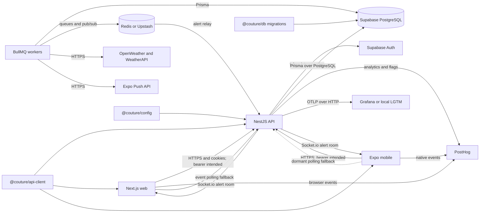
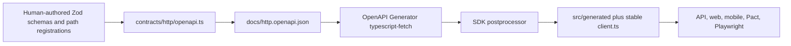
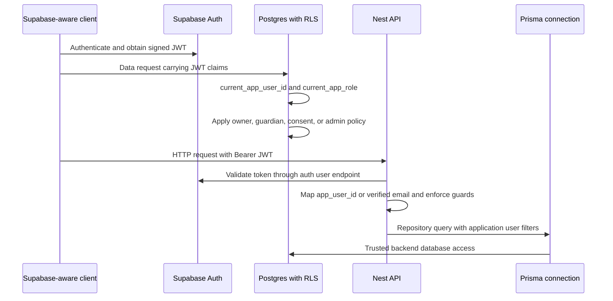
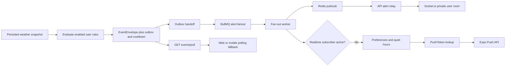

# Integration architecture

Updated: 2026-07-17 - BMAD brownfield deep scan of implemented integration boundaries.

<!-- markdownlint-disable MD013 -->

## Scope and authority

This document describes integrations present in the current working tree. It separates implemented
runtime paths from planned or dormant paths. The five logical parts are the NestJS API, Next.js web
app, Expo mobile app, PostgreSQL database package, and shared packages. Cross-cutting infrastructure
includes Supabase Auth, Redis and BullMQ, Socket.io, Expo Push, weather providers, PostHog,
OpenTelemetry, Grafana, Vercel, EAS, and test/contract tooling.

Use these detailed inventories for implementation-level navigation:

- [API contracts](api-contracts-api.md)
- [Web component inventory](component-inventory-web.md)
- [Mobile component inventory](component-inventory-mobile.md)
- [Database models and RLS](data-models-database.md)
- [Shared packages](shared-packages.md)
- [Deployment guide](deployment-guide.md)
- [Source tree analysis](source-tree-analysis.md)

Controllers decide which HTTP routes exist. Zod modules in
[`packages/api-client/src/contracts/http`](../../packages/api-client/src/contracts/http/) own
canonical request and response shapes for registered routes. The
[Prisma schema](../../packages/db/prisma/schema.prisma) owns the logical data model, while
[committed SQL migrations](../../packages/db/prisma/migrations/) own physical constraints, grants,
functions, triggers, and RLS. Provider-side configuration is not recoverable from this repository.

## System map

Solid arrows are implemented integration code, but they do not imply that every production process
is deployed or every client is wired. The mobile polling and client Socket.io paths are currently
dormant. The deployed Vercel API has additional limitations described below.

## Logical parts

### API

[`apps/api`](../../apps/api/) is the integration hub. Its
[`AppModule`](../../apps/api/src/app.module.ts) composes HTTP controllers, Supabase token
resolution, Prisma repositories, weather, alerts, notification delivery, event polling, feature
flags, telemetry, and optional Socket.io gateways.

It has three distinct entry points:

- [`src/main.ts`](../../apps/api/src/main.ts): long-running HTTP and Socket.io process with
  environment loading, request logs, exception telemetry, OpenAPI, startup analytics, and OTEL.
- [`api/index.ts`](../../apps/api/api/index.ts): cached Vercel serverless Express/Nest adapter.
- [`src/workers/bootstrap.ts`](../../apps/api/src/workers/bootstrap.ts): BullMQ scheduler and
  consumers for weather and alert fan-out, plus placeholder color and moderation processors.

These processes share code and data stores but do not have equivalent lifecycle behavior.

### Web

[`apps/web`](../../apps/web/) is a Next.js App Router application. Browser-side modules call either
an explicit `NEXT_PUBLIC_API_BASE_URL` or same-origin `/api/v1/*`; the latter can be rewritten to a
separate API origin by [`next.config.ts`](../../apps/web/next.config.ts). The stable generated-client
factory always sets `credentials: 'include'` in
[`src/lib/api-client.ts`](../../apps/web/src/lib/api-client.ts).

Only event polling currently uses the generated client. Signup, guardian, and profile modules use
handwritten `fetch` calls with shared Zod parsing. The app has no Supabase client, login/session
provider, access-token refresh, route middleware, or role guard. Including cookies does not satisfy
the API's Bearer guard unless an external proxy supplies an authorization header, and no such proxy
is implemented here.

PostHog browser analytics is active when configured. The home client polls persisted events every
30 seconds. The Socket.io-to-polling adapter exists but no route or component creates a socket or
wires its lifecycle.

### Mobile

[`apps/mobile`](../../apps/mobile/) is an Expo Router app. Its generated-client factory resolves
`EXPO_PUBLIC_API_BASE_URL` or `API_BASE_URL` and can accept an access-token provider. Production
code does not supply one. Feature calls for signup, guardian, and profile use direct `fetch` wrappers
instead of that factory.

The root layout installs PostHog and a foreground notification listener on supported native
runtimes. It does not request notification permission, obtain/register a push token, handle taps or
cold starts, or associate a device with an authenticated user. The polling fallback controller is
implemented and tested in isolation but unused by the app. No production Socket.io client,
Supabase session, secure token storage, refresh, logout, or role-aware navigation exists.

### Database

[`packages/db`](../../packages/db/) owns Prisma models, migrations, and deterministic seeds.
Applications generate `@prisma/client`; API and workers use that client against `DATABASE_URL`.
SQL migrations add constraints and security behavior not expressible in Prisma, especially partial
indexes, forced RLS, security-definer helpers, worker-only tables, and immutable audit triggers.

`User.id` is an application text ID, not a foreign key to Supabase `auth.users`. RLS helpers map
signed JWT claims to the application user. Several backend tables have no RLS and must remain
behind trusted server/database roles. See [database security](data-models-database.md#row-level-security-and-database-security)
for the complete policy matrix.

### Shared packages

The application boundary is npm workspaces, not source-level imports between apps:

- [`@couture/api-client`](../../packages/api-client/) owns canonical HTTP Zod contracts, generated
  Fetch SDK code, Socket.io event schemas, polling fallback, and analytics event schemas.
- [`@couture/config`](../../packages/config/) owns feature-flag keys, defaults, coercion, and
  remote-to-database-to-code fallback order.
- [`@couture/utils`](../../packages/utils/) owns shared age and birthdate policy.
- [`@couture/testing`](../../packages/testing/) owns Prisma-aware synthetic factories and cleanup.
- [`@couture/k6-utils`](../../packages/k6-utils/) owns helpers restricted to the k6 runtime.
- [`@couture/eslint-config`](../../packages/eslint-config/) owns shared static-analysis policy.

Generated OpenAPI, SDK, Prisma Client, framework builds, and package `dist` trees are downstream
artifacts. They are not authority and must not be hand-edited.

## Integration points

| From                 | To                  | Type                          | Protocol or mechanism                | Authority                                           |
| -------------------- | ------------------- | ----------------------------- | ------------------------------------ | --------------------------------------------------- |
| Web                  | API                 | Public and protected HTTP     | HTTPS JSON; cookies included         | Nest controllers plus shared Zod contracts          |
| Mobile               | API                 | Public and protected HTTP     | HTTPS JSON; Bearer intended          | Nest controllers plus shared Zod contracts          |
| Web/mobile/tests     | Shared SDK          | In-process library            | npm workspace, TypeScript Fetch      | `@couture/api-client` public exports                |
| API                  | Supabase Auth       | Token introspection           | HTTPS `GET /auth/v1/user`            | Supabase signed identity and app metadata           |
| API                  | PostgreSQL          | Application persistence       | Prisma over PostgreSQL               | Prisma schema plus committed migrations             |
| Supabase client role | PostgreSQL          | Tenant data access            | PostgREST/SQL with JWT claims        | SQL grants, RLS policies, private helpers           |
| Workers              | PostgreSQL          | Jobs, weather, outbox, tokens | Prisma over PostgreSQL               | Prisma schema plus migrations                       |
| API/workers          | Redis               | Cache, BullMQ, alert relay    | Redis protocol                       | Queue config and channel schemas in API             |
| Workers              | Weather providers   | Forecast ingestion            | Provider HTTPS JSON APIs             | Provider adapters and normalized weather types      |
| Worker               | Expo Push           | Notification delivery         | Expo HTTPS API                       | Push service plus Expo ticket responses             |
| Worker               | API gateway process | Alert relay                   | Redis pub/sub JSON                   | Shared alert Zod schema and relay schema            |
| API                  | Web/mobile socket   | User-targeted realtime        | Socket.io namespace and room         | Gateway authentication and event Zod schema         |
| Web/mobile           | Events API          | Realtime fallback             | HTTPS polling with timestamp cursor  | Events controller and shared poll contract          |
| API/web/mobile       | PostHog             | Analytics                     | Provider SDK over HTTPS              | Shared analytics schemas plus app adapters          |
| API                  | PostHog             | Feature-flag read             | Provider SDK                         | `@couture/config` definitions and API service       |
| API                  | FeatureFlag table   | Flag fallback cache           | Prisma                               | `@couture/config` coercion plus DB record           |
| Long-running API     | Grafana/LGTM        | Traces and metrics            | OTLP/HTTP with W3C propagation       | API instrumentation configuration                   |
| Vercel               | Web/API             | Hosted runtime                | Separate Vercel projects             | App config plus external project settings           |
| EAS                  | Mobile              | Native build                  | Expo EAS                             | `apps/mobile/app.json`, `app.config.ts`, `eas.json` |
| CI/tests             | All parts           | Contract and system checks    | Pact, Playwright, Maestro, k6, Optic | Checked-in test/configuration sources               |

## HTTP and authentication flow

1. Web or mobile resolves an API base URL. Web can use a Next rewrite; mobile requires a configured
   remote or development origin.
2. Public signup and guardian invitation/acceptance routes send JSON without a session. Most other
   domain routes require `Authorization: Bearer <access-token>`.
3. [`RequestAuthGuard`](../../apps/api/src/modules/auth/security.guards.ts) parses the Bearer token.
4. [`AccessTokenIdentityService`](../../apps/api/src/modules/auth/access-token-identity.service.ts)
   calls Supabase Auth's user endpoint with the token and anon key. Local/Preview-only test token
   formats are accepted under explicit test environment conditions.
5. The API trusts only signed `app_metadata` for role and preferred `app_user_id`. If no app user ID
   is present, a verified-email lookup maps the Supabase identity to `User.id`.
6. The guard attaches `{ token, userId, role }` to the request. Teen requests additionally require
   active guardian-consent state; `RolesGuard` applies route-specific role checks.
7. Controllers parse request and response data with shared Zod schemas where implemented, call
   services/repositories, and return JSON.

Socket.io accepts the same token through `handshake.auth.token` or a Bearer header, but resolves only
the user ID. It does not reproduce the HTTP teen-consent or role checks. Web and mobile currently do
not establish production sessions or supply tokens to protected feature calls, so their protected
dashboard and revoke/profile paths are incomplete despite the server-side guard being implemented.

## Zod to OpenAPI to SDK flow

The concrete flow is:

1. Edit domain schemas and `register*Contracts` functions under
   [`src/contracts/http`](../../packages/api-client/src/contracts/http/).
2. [`openapi.ts`](../../packages/api-client/src/contracts/http/openapi.ts) composes OpenAPI 3.1.
3. [`generate-http-openapi.ts`](../../packages/api-client/scripts/generate-http-openapi.ts) writes
   the checked-in JSON without inspecting or starting Nest.
4. The root `generate:api-client` command regenerates the document, runs OpenAPI Generator's
   `typescript-fetch` target, and executes
   [`postprocess-generated-sdk.ts`](../../packages/api-client/scripts/postprocess-generated-sdk.ts).
5. [`client.ts`](../../packages/api-client/src/client.ts) wraps generated configuration and exposes
   a stable `DefaultApi`.

Generated runtime checks are disabled. Zod remains the runtime trust boundary. Controller routes can
drift because generation does not inspect Nest metadata; several implemented routes are absent from
OpenAPI, and some guarded operations omit OpenAPI security metadata. Socket event OpenAPI uses a
separate generator and does not produce the HTTP SDK.

## Database and RLS identity flow

The database helper resolves application identity from a signed top-level `app_user_id`, signed
`app_metadata.app_user_id`, verified email lookup, then JWT `sub`. Roles come only from signed
claims; client-writable user metadata is ignored. Guardian-shared tables apply consent-level RLS,
self-only tables reject guardian access, worker outbox/cooldown tables expose no client policy, and
audit records are forced-RLS and immutable.

The current web and mobile apps do not use a Supabase data client, so the direct client-to-RLS lane
is not active in product UI. The Nest API uses Prisma and performs request authorization in guards
and owner-aware repositories. A trusted backend connection must not be assumed to gain tenant
isolation automatically from end-user JWT RLS because request claims are not propagated into the
Prisma session by the scanned API code.

## Weather ingestion flow

1. The standalone worker registers a repeatable weather sweep. Target sources combine saved
   locations from PostgreSQL with configured targets and deduplicate by canonical location key.
2. A sweep enqueues one idempotently bucketed BullMQ location job per target. Location jobs have
   three BullMQ attempts; provider calls have a separate 30-second ingestion timeout.
3. [`WeatherIngestionService`](../../apps/api/src/modules/weather/weather-ingestion.service.ts)
   calls OpenWeather first, retrying retryable timeout/HTTP failures after 5 and 15 seconds.
   Rate-limit and non-retryable failures go directly to WeatherAPI as the secondary provider.
4. Provider adapters normalize data to one forecast model. The repository persists a
   `WeatherSnapshot`, exactly 48 `ForecastSegment` rows, and ingestion success state.
5. Alert evaluation runs after persistence. Its failures are logged and do not undo weather
   persistence. Provider success is then recorded.
6. If both providers fail, failure state is persisted and the query service returns the latest
   snapshot as `cached` or `stale`, or returns `unavailable`. A snapshot older than one hour is
   stale.
7. Protected `GET /api/v1/weather/{locationKey}` and ritual reads consume the persisted query
   model; normal HTTP requests do not synchronously call a provider.

This flow is implemented but depends on the standalone worker process. The API Vercel function does
not register the scheduler or consume weather jobs.

## Alert delivery, realtime, push, and polling

Alert evaluation groups enabled rules by user and primary location. It creates schema-validated
`alert:weather` envelopes, SHA-256 deduplication keys, rolling cooldown reservations, and durable
outbox rows. Pending outbox records are enqueued in batches and marked dispatched only after the
Redis-backed BullMQ handoff succeeds.

The fan-out worker reloads and validates each stored event. It publishes a serialized event to the
`alert-weather-events` Redis channel. The API gateway process subscribes, validates again, and emits
to `alert:user:{userId}` in the authenticated `/alert:weather` namespace. Redis reports the number
of subscribers; a positive count suppresses push as `realtime_active`.

When realtime is absent or fails, notification preferences and quiet hours are checked, durable
push tokens are loaded, and the Expo server SDK sends batches. Invalid tokens can be pruned.
Delivery outcomes are audited and `alert_sent` telemetry is captured for successful realtime or
push channels.

Persisted `EventEnvelope` records also support `GET /api/v1/events/poll`. The shared polling service
defaults to 30 seconds and advances an ISO timestamp cursor. Web always polls on the landing page;
its socket-conditioned fallback is dormant. Mobile's fallback is entirely dormant. Poll storage
errors and invalid cursors are returned as HTTP 200 empty-style responses, and timestamp-only cursor
ties remain ambiguous.

## Ritual flow

1. Protected `GET /api/v1/ritual` resolves the authenticated user's requested, primary, or first
   saved location and rejects a location not owned by that user.
2. The service loads comfort preferences and the latest persisted weather snapshot in parallel.
   Production fails when weather is unavailable; local/Preview test modes may create or repair mock
   weather segments.
3. A Redis cache key combines user, canonical location, and target local date. Cached data is reused
   only when its weather fetch time matches and it is newer than comfort/wardrobe changes.
4. Timezone-aware 08:00, 13:00, and 19:00 forecast segments become morning, midday, and evening
   scenarios. The service loads the user's garments and adjusts matching for comfort, wind, and
   precipitation preferences.
5. `OutfitRecommendation` rows are found, refreshed, or created for each scenario. A unique-race
   path reloads after Prisma `P2002`.
6. The API returns weather, three outfits, comfort notes, and aggregate badges, then caches the
   result for 15 minutes. Redis read/write failures degrade to database computation.

The service implements recommendation generation, but current web and mobile primary CTAs only
record analytics; neither invokes this endpoint as a product flow. The Socket.io `ritual:update`
schema and namespace exist, but no server code emits ritual updates.

## Analytics, feature flags, and OpenTelemetry

Shared analytics Zod wrappers normalize domain inputs into PostHog event names and snake_case
properties. Web and mobile call PostHog directly through app-specific wrappers. API
[`TelemetryService`](../../apps/api/src/modules/telemetry/telemetry.service.ts) validates selected
events, persists short-lived `TelemetryEvent` rows, and independently captures PostHog events so one
sink's failure does not block the other. An hourly cron deletes telemetry rows older than 24 hours.

Feature-flag definitions live in `@couture/config`. The API's evaluation order is remote PostHog,
database `FeatureFlag`, then code default. Startup and a five-minute cron refresh the database cache
using a stable synthetic distinct ID and retain the last valid cached value during provider
outages. Repository search finds no production call to `FeatureFlagsService.getFeatureFlag`; the
API warms flags but does not gate behavior. Web and mobile do not import `@couture/config` or branch
on flags, although their PostHog SDKs may fetch provider flags.

The long-running API initializes OpenTelemetry before Nest modules load and exports traces and
periodic metrics over OTLP/HTTP when configuration is complete. W3C trace propagation and Node/HTTP
auto-instrumentation are present. The serverless entry does not initialize this path. Queue, Redis,
Socket.io, and database custom metrics are absent; local Grafana uses text placeholders for those
areas. See [observability](observability.md).

## Environment and deployment topology

| Environment | Web/API                                         | Database/Auth                               | Redis/workers                                        | Mobile                              | Observability                                   |
| ----------- | ----------------------------------------------- | ------------------------------------------- | ---------------------------------------------------- | ----------------------------------- | ----------------------------------------------- |
| Local       | Long-running API plus Next; optional built pair | Local Supabase CLI stack                    | Compose Redis; workers started separately            | Expo/Expo Go or native run          | Optional local LGTM                             |
| Preview     | Separate Vercel web and API projects            | Remote Supabase selected by injected values | Remote Redis expected; no worker deployment recorded | No Preview EAS profile              | Long-running OTEL path not used by Vercel entry |
| Production  | Separate Vercel projects                        | Remote Supabase selected by injected values | Remote Redis expected; no worker deployment recorded | Manual Android EAS production build | Serverless API omits OTEL bootstrap             |

Environment files are local and ignored. Inherited provider variables win over files. API, web, and
mobile loaders consult `.env.local`, then `.env.prod` when `NODE_ENV=production` or `.env.preview`
otherwise, then `.env`. Hosted Preview builds commonly set `NODE_ENV=production`, so separation
depends on correctly injected provider variables. No actual values or credentials belong in this
document; use [secrets management](secrets-management.md) and [`.env.example`](../../.env.example).

Vercel builds the API by generating Prisma Client, applying committed migrations, and building
Nest. The serverless function caches one Nest app per warm instance. Web and API deployment creation
is external to GitHub Actions; workflows wait for and test deployments. Mobile delivery queues a
manual Android EAS build without waiting or store submission. The root and mobile `app.json` files
name different EAS projects; repository commands intentionally run from `apps/mobile`.

## Broken or incomplete integration points

1. **Client authentication is not implemented.** Web and mobile have no Supabase login/session,
   refresh, logout, or role-aware route boundary. Web sends cookies and mobile sends no token;
   protected profile, guardian revoke, location, weather, ritual, alert, and poll calls require a
   Bearer token.
2. **Workers are not deployed.** Weather scheduling/ingestion, alert outbox dispatch, fan-out,
   Redis realtime publication, and Expo push depend on `start:workers`. No hosted process,
   container, workflow, or liveness probe starts it.
3. **Feature flags have no behavior consumers.** API cache warm/sync is active, but no production
   code calls request-time evaluation. Web and mobile have no flag-controlled branches or tested
   fallbacks.
4. **Notification registration is absent.** Mobile listens only for foreground receipt. It does not
   request permission, create/register/rotate a token, bind the token to a user, configure channels,
   or route notification taps/cold starts. The API has token persistence code but no public token
   registration endpoint in the implemented HTTP inventory.
5. **Serverless API behavior differs materially.** Vercel omits root environment loading, OTEL,
   request context/log middleware, global exception telemetry, OpenAPI mounting, and startup
   analytics. Socket.io and long-lived Redis subscription behavior are not a reliable serverless
   topology even though `AppModule` imports those modules.
6. **Realtime clients are unwired.** Neither app establishes Socket.io connections. Web polls
   continuously; both socket-to-polling controllers are dormant. Lookbook and ritual namespaces
   authenticate connections but emit no domain events.
7. **Socket authorization is weaker than HTTP.** Socket identity resolution omits teen consent and
   role checks, so adding new room subscriptions or emissions requires an explicit authorization
   design.
8. **Generated-client adoption is partial.** Most web/mobile feature calls duplicate paths and
   transport behavior in handwritten adapters. Generated SDK runtime checks are disabled, and the
   web event adapter casts poll JSON without Zod response parsing.
9. **OpenAPI and controller security drift.** Some implemented routes are unregistered; four guarded
   domain operations omit security metadata. Public admin replay/list routes and guardian invitation
   creation are particularly high-risk integration boundaries.
10. **Health checks do not prove integration readiness.** API health does not test PostgreSQL,
    Supabase Auth, Redis, BullMQ workers, weather providers, Expo, PostHog, or OTLP. Queue health
    reports names with empty metrics.
11. **RLS and API identity are separate enforcement lanes.** Direct Supabase RLS maps JWT claims,
    while API Prisma calls rely on guards and repository filters. The API does not set request JWT
    claims on Prisma sessions; gaps in application filtering are not automatically repaired by
    end-user RLS assumptions.
12. **Invitation/deep-link ownership is unresolved.** Web uses `/guardian/accept`; mobile uses
    `/guardian-accept`. Universal/app links, auth-aware continuation, and notification routing are
    not configured.
13. **Production verification is asymmetric.** Preview checks web and API deployment SHAs;
    production verifies web SHA but only an API route's HTTP 200. No workflow verifies worker
    deployment because no worker target exists.

## Change guidance

- Change REST contracts in shared Zod modules first, then regenerate and validate OpenAPI and SDK.
- Treat `main.ts`, Vercel `api/index.ts`, and worker bootstrap as separate runtime architectures.
- Preserve the outbox boundary when changing alerts; do not publish only in the weather transaction.
- Add client authentication before treating protected dashboard tests as production integration.
- Keep worker deployment and liveness in the same delivery scope as weather or notification launch.
- Define user identity once across Supabase claims, API guards, Prisma filters, RLS, analytics, and
  push-token ownership.
- Add a real feature-flag consumer only with a safe code fallback and tests for remote/cache/default.
- Validate changes at their boundary with package tests, API integration tests, Pact, Playwright,
  Maestro, or k6 as appropriate; see the [development guide](development-guide.md).
