# Couture Cast Learning Path (step by step)

Updated: 2026-04-22 - Step 4 and Step 14 reflect the completed guardian-aware
RLS rollout, revoke-consent enforcement, the shared guardian contract surface,
the DB-level policy coverage that now backs guardian consent, and Step 12 now
captures when a local API integration test is a better fit than browser E2E
for cron-driven policy transitions

## LLM collaborator prompt

Use this prompt when asking an LLM to improve this document and apply the same in-code comment
style:

```text
You are improving Couture Cast learning docs and code commentary.

Primary goals:
1) Keep `_bmad-output/project-knowledge/learning-path-step-by-step.md` clear, lean, and teachable.
2) Preserve one standardized section template across all steps.
3) Make the `Task owner map` the primary search surface for finding source code.
4) Keep implementation-anchor comments aligned with the same owner IDs used in this doc.

Step template rules:
- Every step must use this exact section order:
  `User/business impact`
  `Key takeaways`
  `Story/Task mapping`
  `Story reference`
  `Cross-links`
  `Sequence to follow`
  `Task owner map`
  optional `Current repo note`
  optional `Architecture diagram`
- Do not invent alternate section headings for the same idea.
- Do not add `Searchable strings:` sections.
- Do not add `Pattern summary:` sections.
- Do not add one-off headings that duplicate the owner map.
- If a section does not earn its keep, remove it instead of adding another section.

Task owner map rules:
- Use the section heading `Task owner map:` in every step.
- Treat the owner ID as the search key.
- Reuse the exact `Story X Task Y step Z owner` label already used at the implementation anchor whenever one exists.
- Prefer `Story X Task Y step Z owner` over `Step N step M owner` whenever the implementation already has a story/task anchor comment.
- Format owner-map bullets as:
  `- Story X Task Y step Z owner: <action> in \`path\``
  or
  `- Step N step M owner: <action> in \`path\``
- Keep each owner-map bullet on one physical line in the markdown source. Never wrap it.
- Keep every file path as one full contiguous searchable string on that same line.
- If multiple files matter, prefer separate owner bullets over hiding paths in wrapped prose.
- Aim for the exact owner ID to be discoverable in two places:
  1) this learning doc
  2) the implementation anchor
- Validate this with repo search before finishing. For real numbered owner IDs, the expected result is exactly 2 hits:
  1) this learning doc
  2) the implementation anchor
- If the primary target is non-commentable or unstable (for example `package.json`, `openapitools.json`, `package-lock.json`, generated files, or env files), add the second hit in `_bmad-output/project-knowledge/owner-anchor-exceptions.md`.
- Do not leave a real numbered owner ID with only one searchable hit.

Code comment rules:
- Keep behavior unchanged unless asked.
- Keep comments concise and ASCII.
- Preserve existing Story/Task mapping in docs and code.
- Add or adjust educational comments only where they improve understanding.
- Preferred comment style:
  - brief "what it is / problem solved / alternatives"
  - numbered setup steps `1) 2) 3) ...` when useful
  - "where we did this" anchor comments near actual implementation
  - searchable owner text that matches the learning doc

Working style:
- Minimize fluff and duplication.
- Prefer sharpening existing teaching prose over adding new explanatory sections.
- Preserve the current standardized format going forward.
- After edits, run formatting/lint checks and report changed files.
```

## How to use this

1. Follow steps in order.
2. For each step, read the story first, then open the evidence files.
3. Complete the exercise before moving on.

## Step 1 - Understand product-to-engineering traceability

User/business impact:

Clear traceability from brief to implementation keeps the team building features users actually
need, not speculative work. The business avoids scope drift and costly rework by tying every
delivery decision to defined goals and KPIs.

Key takeaways:

1. Traceability: `_bmad-output/project-knowledge/couturecast_brief.md` defines vision/KPIs, and downstream planning docs
   must map back to it.
2. Sequencing: `couturecast_roadmap.md` phase order drives `prd.md` scope and `epics.md` story
   decomposition.
3. Delivery alignment: implementation stories in `_bmad-output/implementation-artifacts/` should be
   explainable as outcomes of PRD + architecture decisions.

Story/Task mapping:

- Pre-story planning artifacts (source of truth before implementation stories)

Story reference:

- none; this step is the pre-story planning chain that later stories inherit.

Cross-links:

- Step 2 turns this planning chain into concrete runtime and package boundaries.
- Every implementation story in `_bmad-output/implementation-artifacts/` should still trace back to this chain.

Sequence to follow:

1. Read the brief for vision, target users, and success metrics.
2. Read the roadmap and PRD to understand release order and scoped requirements.
3. Read the architecture and epics to see how scope turns into implementation stories.

Task owner map:

- Step 1 step 1 owner: define the product vision, target users, and KPIs in `_bmad-output/project-knowledge/couturecast_brief.md`
- Step 1 step 2 owner: sequence the release plan in `_bmad-output/project-knowledge/couturecast_roadmap.md`
- Step 1 step 3 owner: translate the roadmap into scoped requirements in `_bmad-output/planning-artifacts/prd.md`
- Step 1 step 4 owner: capture the technical decision layer in `_bmad-output/planning-artifacts/architecture.md`
- Step 1 step 5 owner: decompose delivery into epics and implementation stories in `_bmad-output/planning-artifacts/epics.md` and `_bmad-output/implementation-artifacts/`

Architecture diagram:

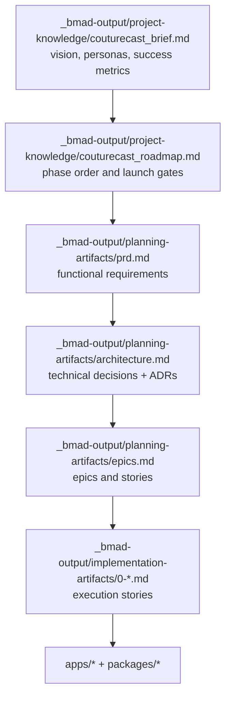

## Step 2 - Monorepo and app boundaries

User/business impact:

Strong app/package boundaries reduce cross-surface breakage, so users get more consistent behavior
across web, mobile, and API. The business gets faster parallel delivery because teams can ship
independently with fewer integration surprises.

Key takeaways:

1. Boundary clarity: `apps/web`, `apps/mobile`, and `apps/api` are separate runtime surfaces with
   distinct entrypoints.
2. Shared contracts and test primitives: common logic/types flow through workspace packages (not
   cross-app direct imports), especially `packages/api-client`, `packages/db`,
   `packages/testing`, and `packages/utils`.
3. Monorepo operations: root npm workspaces + `turbo.json` coordinate consistent `dev`, `test`,
   and `build` behavior.
4. **Runtime and app-owned deps:** Anything an app or package **imports** or any **script in that
   folder** runs (`nest build`, `tsc`, a CLI) must appear in **that** `package.json` (`dependencies`
   vs `devDependencies` by use). Do not satisfy those only from the repo root—hosted installs (for
   example Vercel) often do not see root the same way your laptop does.
5. **Root `package.json` deps:** Reserve the root for **repo-wide tooling** tied to root `npm run`
   scripts: ESLint, Prettier, TypeScript, Turbo, Vitest, Playwright, OpenAPI Generator CLI, Prisma
   CLI, `tsx`, `rimraf`, `cross-env`, Supabase CLI, Husky, etc. Treat that list as the pattern: if
   only root scripts need it, root `devDependencies` is fine.
6. **Exceptions (also at root on purpose):** A small set of **shared** runtime or CLI deps may stay
   at root when multiple workspaces or root scripts need the same version—here `@prisma/client` and
   `prisma` for `db:*` / generate flows. Anything else that **one app** imports at runtime should
   still be listed on that app even if duplicated at root (explicit beats implicit for deploys).

Story/Task mapping:

- Story 0.1
- Task 2 (mobile app init), Task 3 (web app init), Task 4 (API app init), Task 5 (workspace
  config)

Story reference:

- `_bmad-output/implementation-artifacts/0-1-initialize-turborepo-monorepo.md`

Cross-links:

- Step 1 explains why these boundaries exist before code is written.
- Step 3 and Step 14 both rely on shared packages instead of cross-app direct imports.

Sequence to follow:

1. Start at the root workspace and task graph in the repo root.
2. Open the web, mobile, and API entrypoints to see each runtime boundary.
3. Trace shared contracts and utilities through `packages/api-client`, `packages/db`,
   `packages/testing`, and `packages/utils` instead of cross-app imports.

Task owner map:

- Step 2 step 1 owner: define the workspace and task graph boundaries in `package.json` and `turbo.json`
- Step 2 step 2 owner: define the web runtime boundary in `apps/web/src/app/layout.tsx`
- Step 2 step 3 owner: define the mobile runtime boundary in `apps/mobile/app/_layout.tsx` and `apps/mobile/app/(tabs)/_layout.tsx`
- Step 2 step 4 owner: define the API runtime boundary in `apps/api/src/main.ts`
- Step 2 step 5 owner: define shared package boundaries in `packages/api-client/package.json`, `packages/db/package.json`, `packages/testing/package.json`, and `packages/utils/package.json`

Current repo note:

- **Rule of thumb:** Apps and packages own their direct usage; root owns cross-cutting dev tooling
  and a few intentional monorepo pins (Prisma). Repeating a package name under `apps/api` and the
  root is normal when both need it for different reasons—check the lockfile once, not “did I avoid
  duplication.”
- **Workspace install baseline:** Use Node 24 from `.nvmrc` when adding or reconciling workspaces.
  The root preinstall guard fails fast on older runtimes before npm can update the workspace graph.
- **Testing workspace boundary:** `packages/testing` now owns shared factories, cleanup helpers, and
  starter templates; its workspace lint/typecheck scripts intentionally include both `src` and
  `templates` so the CLI reports the same red files the IDE does.
- **Pure shared logic boundary:** `packages/utils` is where small runtime-safe policy helpers should
  live when web, mobile, and API all need the same answer. The current example is the signup
  age-gate flow: parse birthdates once, calculate age once, and let app-specific adapters reuse the
  same behavior instead of cloning that logic per surface.
- **Test review baseline:** PRs that touch automated tests should use the shared checklist in
  `.github/PULL_REQUEST_TEMPLATE.md` and the expectations in
  `_bmad-output/test-artifacts/testing-standards.md`; default to `@couture/testing` fixtures and
  reset or clean up any registered entities in `afterEach`.

Architecture diagram:

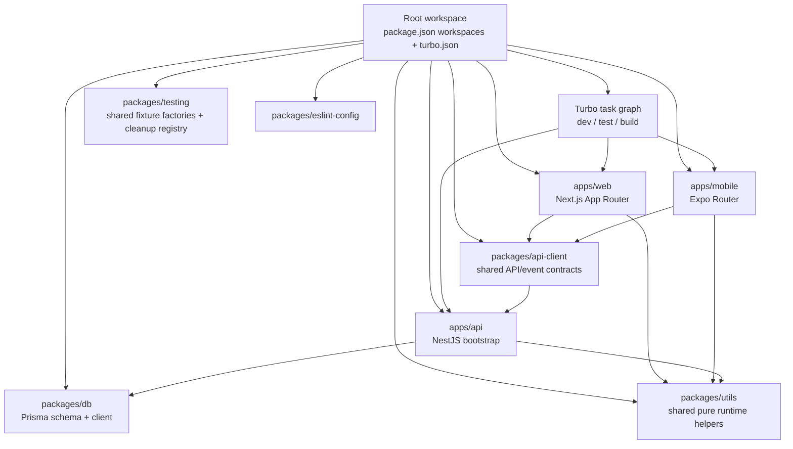

## Step 3 - Data model and deterministic seeds

User/business impact:

A stable schema plus deterministic seeds makes user-facing logic like recommendations and lookbook
flows predictable in every environment. The business gains safer releases and faster debugging
because test data and migrations are reproducible.

Key takeaways:

1. Schema-first modeling: `packages/db/prisma/schema.prisma` is the single source for relational
   models, enums, and user-scoped tables.
2. Deterministic seeding: seeds use stable IDs and seeded randomness (`faker.seed(4242)`) with
   `upsert` to keep reruns reproducible.
3. Dependency-safe order: `seedUsers -> seedWardrobe -> seedWeather -> seedRituals` ensures
   foreign-key-ready data for recommendations and lookbook flows.

Story/Task mapping:

- Story 0.2
- Task 2 (core schema tables), Task 5 (seed scripts), Task 7 (validation/testing)

Story reference:

- `_bmad-output/implementation-artifacts/0-2-configure-prisma-schema-migrations-and-seed-data.md`

Cross-links:

- Step 2 explains why schema and seed logic belongs in `packages/db`.
- Step 4 applies these schema and seed rules across Supabase environments.

Sequence to follow:

1. Read `schema.prisma` first because it is the relational source of truth.
2. Read the seed index to understand deterministic ordering and rerun safety.
3. Inspect a concrete seed module to see how stable IDs and seeded randomness are applied.

Task owner map:

- Step 3 step 1 owner: define the relational source of truth in `packages/db/prisma/schema.prisma`
- Step 3 step 2 owner: orchestrate deterministic seed execution in `packages/db/prisma/seeds/index.ts`
- Step 3 step 3 owner: prove a deterministic seeded domain slice in `packages/db/prisma/seeds/weather.ts`

Architecture diagram:

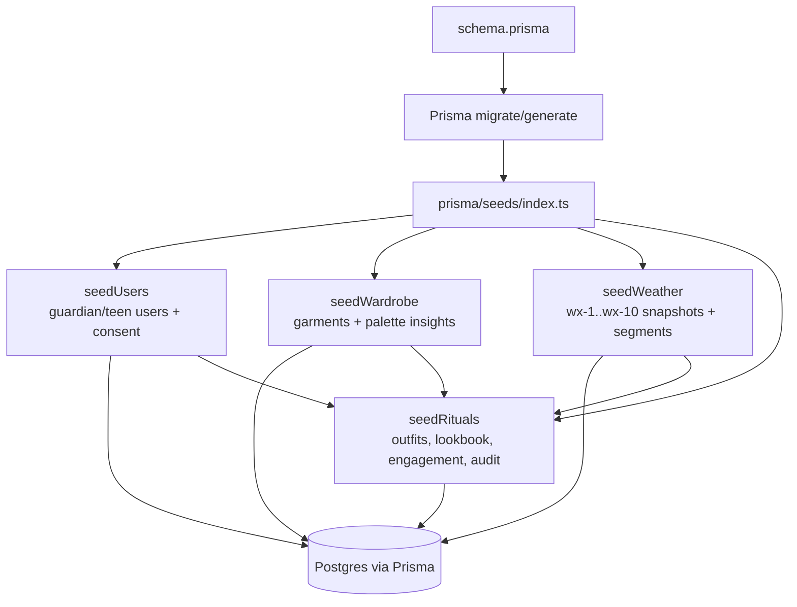

## Step 4 - Environment setup and Supabase operations

User/business impact:

Disciplined Supabase environment and secret management reduces auth, storage, and database
misconfiguration issues that users experience as outages or login failures. The business gets more
reliable deployments and cleaner recovery operations across Preview and Production.

Key takeaways:

1. Supabase env isolation is explicit: local/CI stacks plus cloud Preview and Production projects.
2. Reliability depends on env-aware operations: `npx supabase start/link/db push`,
   `npx prisma migrate deploy --schema packages/db/prisma/schema.prisma`, pool targets
   (Preview 50, Production 100), and plan-gated PITR/backups.
3. Config hygiene is a core skill: keep `SUPABASE_URL`, `SUPABASE_ANON_KEY`,
   `SUPABASE_SERVICE_KEY`, and `DATABASE_URL` aligned across `.env.local`, `.env.preview`, `.env.prod`,
   and secrets manager.
4. Auth is not finished at signup. Supabase JWT claims still have to resolve to the app's text
   `User.id` model before guardian-aware RLS can safely protect teen wardrobe data.

Story/Task mapping:

- Story 0.3
- Task 3 (Supabase CLI), Task 4 (pooling/backups), Task 5 (env configuration)
- Story 0.11
- Task 4 (guardian-aware RLS migration rollout and validation)

Story reference:

- `_bmad-output/implementation-artifacts/0-3-set-up-supabase-projects-dev-staging-prod.md`

Cross-links:

- Step 3 defines the schema and seeds these environments must run.
- Step 14 explains why signup age-verification and guardian-consent rules must also land at the
  database policy layer, not only in the HTTP contract.
- Step 7 carries the same environment contract into CI and deployment automation.

Sequence to follow:

1. Identify the active environment names and which ones are intentionally deferred.
2. Trace how Supabase CLI and Prisma target those environments.
3. Read the guardian-aware RLS migration and understand the JWT-claim bridge from Supabase Auth to
   the repo's text `User.id` values.
4. Verify teen, guardian, outsider, anon, and admin policy behavior in DB-level tests before
   deploying to shared environments.
5. Keep datasource and secret names aligned across local, CI, and hosted environments.

Task owner map:

- Step 4 step 1 owner: anchor the application datasource and database contract in `packages/db/prisma/schema.prisma`
- Step 4 step 2 owner: define Supabase environment and operational rules in `_bmad-output/implementation-artifacts/0-3-set-up-supabase-projects-dev-staging-prod.md`
- Step 4 step 3 owner: keep local, CI, and hosted environment naming aligned in `_bmad-output/implementation-artifacts/0-3-set-up-supabase-projects-dev-staging-prod.md`
- Story 0.11 Task 4 owner: enforce guardian-aware RLS and the auth-claim bridge in `packages/db/prisma/migrations/20260420113000_add_guardian_shared_rls_policies/migration.sql`

Current repo note:

- Step 4 now includes the first real Supabase policy rollout, not only environment scaffolding.
  `packages/db/prisma/migrations/20260420113000_add_guardian_shared_rls_policies/migration.sql`
  applies guardian-aware access rules across the private wardrobe tables, and
  `packages/db/test/rls-policies.spec.ts` proves the resulting teen/guardian/admin personas
  against a live Postgres policy surface before deploy. Task 6 then extends that model with
  `packages/db/prisma/migrations/20260421090000_block_revoked_teens_from_self_access/migration.sql`,
  which blocks teen self-access again when the last active guardian consent is revoked.

Architecture diagram:

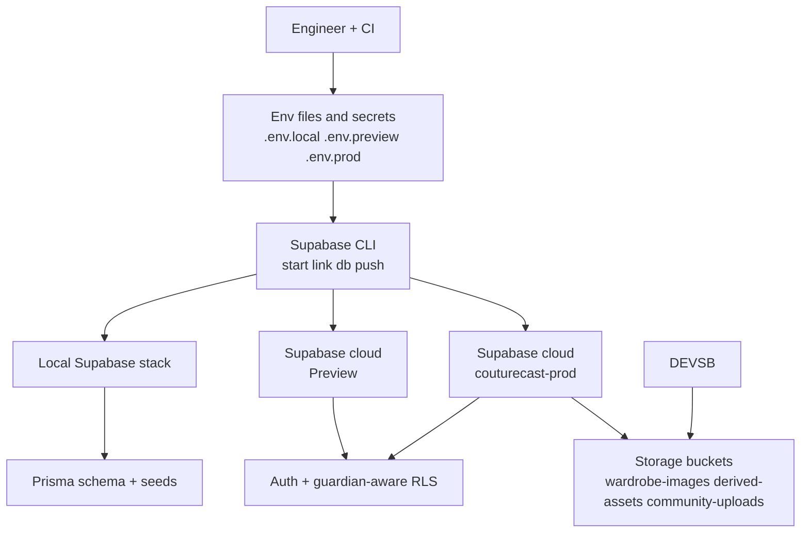

## Step 5 - Queueing and worker reliability

User/business impact:

Queue retries, backoff, and failure replay ensure critical async tasks still complete during spikes
or transient failures, so users do not miss core updates. The business protects engagement and
operations by preventing silent job loss and shortening incident recovery.

Key takeaways:

1. Parallelization: workers process jobs concurrently outside request threads.
2. Resiliency: retries, backoff, and DLQ-style failure capture prevent job loss.
3. Debuggability/operability: persisted failures + admin replay/prune flows make incidents
   traceable and recoverable.

Story/Task mapping:

- Story 0.4
- Task 2 (BullMQ queues), Task 3 (DLQ), Task 4 (concurrency), Task 5 (worker process group)

Story reference:

- `_bmad-output/implementation-artifacts/0-4-configure-redis-upstash-and-bullmq-queues.md`

Cross-links:

- Step 2 separates request-serving apps from background worker processes.
- Steps 10 and 11 extend these queues into telemetry and structured logging.

Sequence to follow:

1. Read the shared queue config and retry policy first.
2. Read worker bootstrap to see concurrency and rate-limit policy.
3. Read DLQ capture and admin replay/prune flows so failure recovery is explicit.

Task owner map:

- Story 0.4 Task 2 owner: define shared BullMQ queue names, retry policy, timeouts, and queue construction in `apps/api/src/config/queues.ts`
- Story 0.4 Task 3 owner: persist failed job context as durable DLQ records for operator workflows in `apps/api/src/workers/base.worker.ts`
- Story 0.4 Task 4 owner: apply per-queue concurrency and rate-limit policy during worker startup in `apps/api/src/workers/bootstrap.ts`
- Story 0.4 Task 5 owner: bootstrap and shut down the dedicated worker process group cleanly in `apps/api/src/workers/bootstrap.ts`
- Step 5 support owner: expose operator read, replay, and prune flows in `apps/api/src/admin/admin.service.ts` and `apps/api/src/admin/admin.controller.ts`

Architecture diagram:

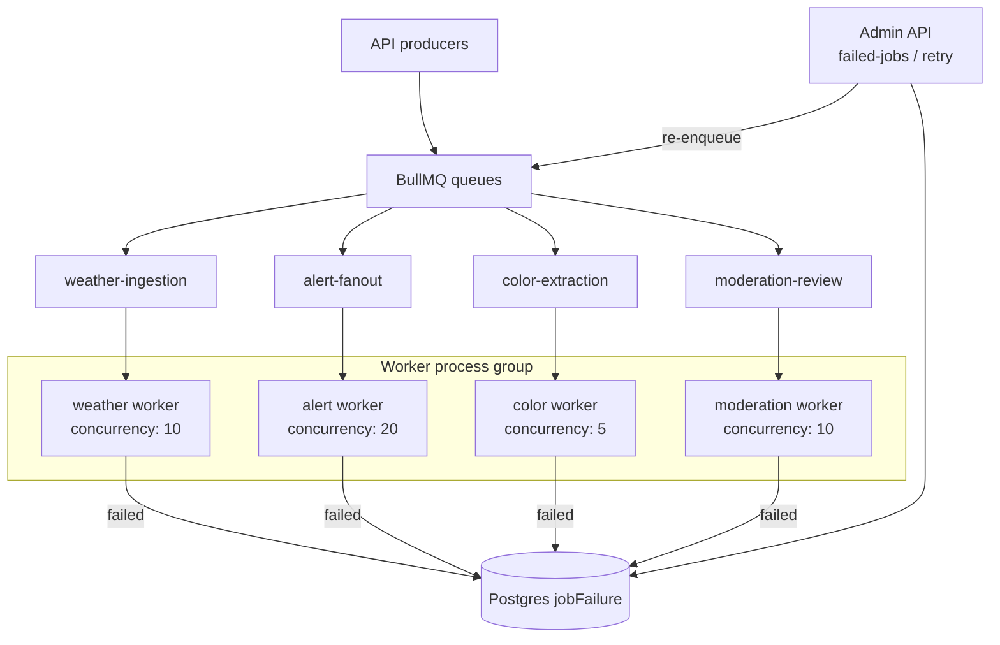

## Step 6 - Realtime and push delivery

User/business impact:

For users, Step 6 means faster ritual updates and more reliable alerts even when connectivity is
unstable. For the business, it protects engagement and retention by reducing missed notifications
and delivery-related churn.

Key takeaways:

1. Delivery is intentionally redundant with Socket+Push+Polling so alerts survive disconnects and
   degraded networks.
2. Shared payload contracts keep channels aligned: `lookbook:new`, `ritual:update`, and
   `alert:weather` all use `{ version, timestamp, userId, data }`.
3. Runtime fallback is deterministic: reconnect backoff (1s/3s/9s, max 5) then polling
   `GET /api/v1/events/poll` until socket recovery.

Story/Task mapping:

- Story 0.5
- Task 1 (Socket.io server), Task 2 (connection lifecycle), Task 3 (Expo Push), Task 4 (shared
  payload schema), Task 5 (fallback)

Story reference:

- `_bmad-output/implementation-artifacts/0-5-initialize-socketio-gateway-and-expo-push-api.md`

Cross-links:

- Step 5 explains the async work that feeds alert and ritual delivery.
- Step 12 verifies these fallback paths through end-to-end coverage.

Sequence to follow:

1. Start with the gateway and connection lifecycle rules.
2. Trace push-token persistence and push dispatch for offline delivery.
3. Follow the polling fallback path used when realtime is unavailable.

Task owner map:

- Story 0.5 Task 1 owner: expose the Socket.io gateway surface and attach the core auth + connection orchestration in `apps/api/src/modules/gateway/gateway.gateway.ts`
- Story 0.5 Task 2 owner: decide retry vs fallback based on connection lifecycle state in `apps/api/src/modules/gateway/connection-manager.service.ts`
- Step 6 polling backend owner: provide the incremental polling data path in `apps/api/src/modules/events/events.service.ts`
- Step 6 push token owner: keep push token persistence durable in `apps/api/src/modules/notifications/push-token.repository.ts`
- Story 0.5 Task 3 owner: dispatch Expo push notifications for users who are not on an active realtime session in `apps/api/src/modules/notifications/push-notification.service.ts`
- Story 0.5 Task 4 owner: define shared socket payload schemas for realtime namespaces in `packages/api-client/src/types/socket-events.ts`
- Story 0.5 Task 5 owner: activate, advance, and stop client polling when realtime is unavailable in `packages/api-client/src/realtime/polling-service.ts`

Architecture diagram:

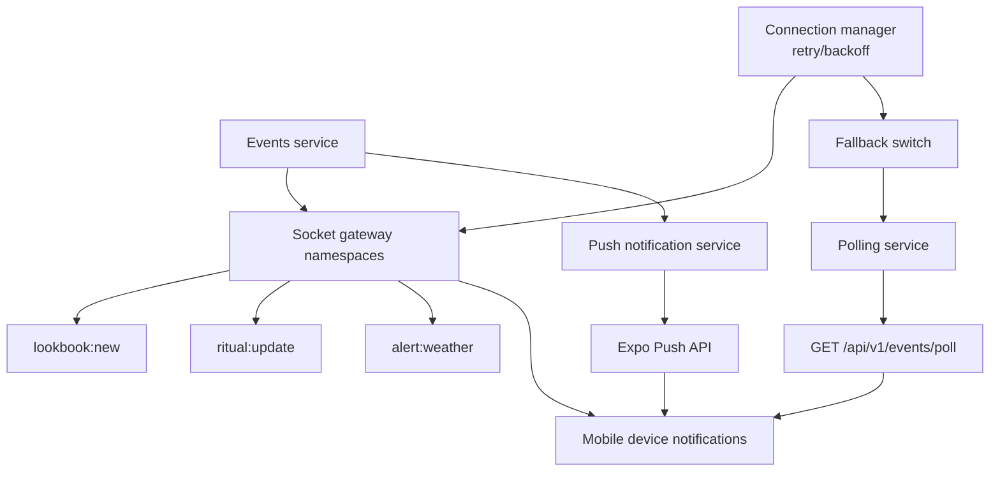

## Step 7 - CI/CD and automated quality gates

User/business impact:

Automated CI/CD quality gates catch regressions before merge and release, so users encounter fewer
broken core flows. The business lowers hotfix load and ships faster with predictable release
confidence.

Key takeaways:

1. PR quality gates are split intentionally: `pr-checks.yml` blocks typecheck/lint/test/build,
   while `pr-pw-e2e-local.yml` runs sharded Playwright and enforces the required E2E gate.
2. Flake control is explicit: `rwf-burn-in.yml` reruns changed Playwright specs 3x (with
   `SKIP_BURN_IN` override) before full E2E proceeds.
3. Deployment confidence is surface-aware: Vercel Preview smoke runs from `deployment_status`
   (`pr-pw-e2e-vercel-preview.yml`), while mobile deploy remains manual via `deploy-mobile.yml`.
4. Coverage visibility is baked into the PR loop: `pr-checks.yml` runs all workspace tests with
   coverage, passes workspace coverage directories into the composite action, posts a sticky PR
   comment with statements/branches/functions/lines metrics, and updates four shields.io badges on
   push to main.

Story/Task mapping:

- Story 0.6 (status: review), Story 0.14 Task 7 (coverage reporting)
- Task 1 (test workflow), Task 2 (parallelization), Task 12 (PR preview smoke), Task 13 (API
  deployment prep), Story 0.14 Task 7 (coverage PR comments and badges)

Story reference:

- `_bmad-output/implementation-artifacts/0-6-scaffold-cicd-pipelines-github-actions.md`

Cross-links:

- Step 2 defines the apps and packages these workflows exercise.
- Step 12 plugs cross-surface smoke coverage into this gate.
- Step 15 adds contract automation to the same quality-gate model.
- Story 0.14 Task 7 extends this gate with merged monorepo coverage, PR comments, and badges.

Sequence to follow:

1. Read the required PR workflows first.
2. See how burn-in, preview smoke, and secret scanning complement the base checks.
3. Note which deploy paths are automated and which remain manual by design.
4. Trace how monorepo coverage is collected, merged, and surfaced in PRs and badges.

Task owner map:

- Step 7 step 1 owner: enforce base PR quality gates in `.github/workflows/pr-checks.yml`
- Step 7 step 2 owner: enforce local Playwright E2E gating in `.github/workflows/pr-pw-e2e-local.yml`
- Step 7 step 3 owner: control flake burn-in behavior in `.github/workflows/rwf-burn-in.yml`
- Step 7 step 4 owner: verify preview deployments with targeted smoke checks in `.github/workflows/pr-pw-e2e-vercel-preview.yml`
- Step 7 step 5 owner: enforce secret scanning in `.github/workflows/gitleaks-check.yml`
- Step 7 step 6 owner: keep the mobile deployment path explicit in `.github/workflows/deploy-mobile.yml`
- Step 7 support owner: centralize install and browser setup in `.github/actions/install/action.yml` and `.github/actions/setup-playwright-browsers/action.yml`
- Step 7 step 7 owner: wire monorepo workspace coverage directories and badge inputs in `.github/workflows/pr-checks.yml`
- Step 7 step 8 owner: merge workspace summaries, upload coverage artifact, parse metrics, comment on PR, and update four gist-backed badges in `.github/actions/unit-test-coverage-comment/action.yml`

Architecture diagram:

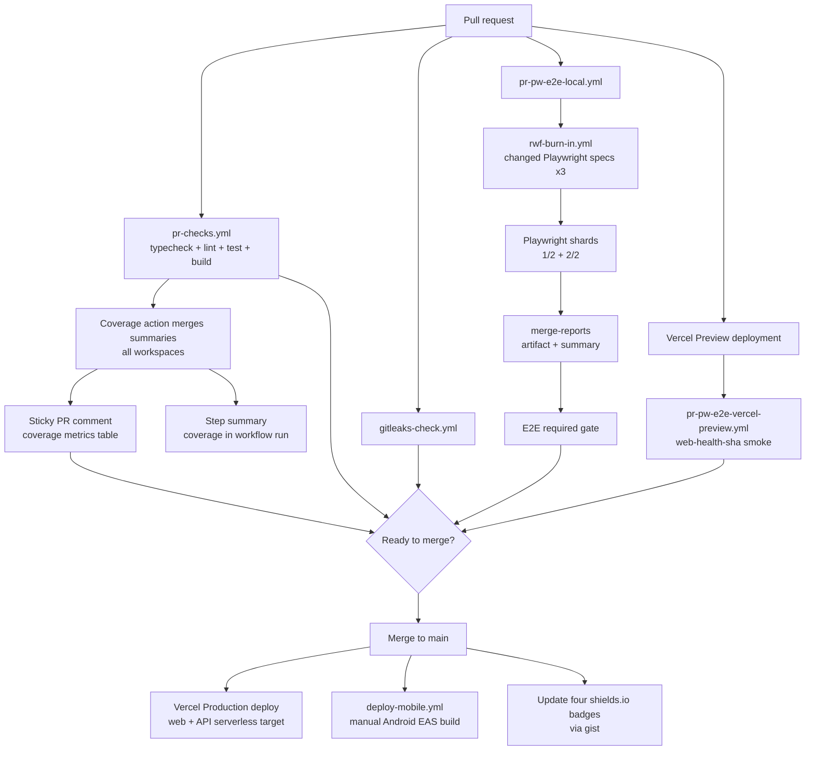

### Coverage reporting and badges — reproducible setup

This is the full recipe for adding unit test coverage PR comments and a shields.io badge to any
repo. Works for single repos and monorepos. In Couture Cast, the same setup writes four badges
(`statements`, `branches`, `functions`, `lines`) into gist-backed JSON files.

#### Prerequisites

- Test runner produces `coverage-summary.json` in Istanbul/v8 format (Vitest `json-summary`,
  Jest `json-summary`, or a normalized output from pytest-cov / JaCoCo).
- GitHub Actions CI workflow that runs tests.

#### Step 1: Configure test runner to emit `json-summary`

Files: `apps/api/vitest.config.ts`, `apps/web/vitest.config.ts`, `apps/mobile/vitest.config.ts`,
`packages/api-client/vitest.config.ts`, `packages/config/vitest.config.ts`

Add `"json-summary"` to the coverage reporter array in each test config:

```typescript
// vitest.config.ts
coverage: {
  reporter: ['text', 'json-summary', 'lcov'],
}
```

For Jest, add `"json-summary"` to `coverageReporters` in `jest.config.js`.

#### Step 2: Add `test:coverage` scripts

Files: `package.json` (root), `apps/api/package.json`, `apps/web/package.json`,
`apps/mobile/package.json`, `packages/api-client/package.json`, `packages/config/package.json`

Each workspace (or root for non-monorepo) needs a script that runs tests with `--coverage`:

```json
"test:coverage": "vitest run --coverage"
```

For monorepos, add a root script that fans out:

```json
"test:coverage": "node scripts/run-workspace-test-coverage.mjs"
```

#### Step 3: Create the composite action

File: `.github/actions/unit-test-coverage-comment/action.yml`

Copy this file into the target repo. This action:

1. **Merges** workspace coverage summaries (monorepo only — when `workspace-dirs` input is provided,
   reads each workspace's `coverage-summary.json`, sums totals, always writes a merged summary,
   emits `::warning::` with any missing summaries, and emits `::error::` if all are missing).
2. **Uploads** the coverage directory as an artifact.
3. **Parses** `coverage-summary.json` with `jq` to extract statements/branches/functions/lines.
4. **Builds** a direct artifact download URL from the upload step output.
5. **Writes** a markdown coverage table to `$GITHUB_STEP_SUMMARY`.
6. **Posts** a sticky PR comment (find-and-update via `<!-- unit-test-coverage-comment: {label} -->`
   HTML marker) with the coverage table and download link.
7. **Updates** four shields.io badge JSON files via a GitHub gist in one `curl`/`jq` PATCH request
   (only on push to the default branch and only when the test run succeeded).

Security: all `${{ inputs.* }}` values are passed via `env:` blocks (never interpolated directly in
`run:` or `script:` blocks). All bash steps use `set -euo pipefail`. The gist write uses
`Authorization: Bearer`, not `Authorization: token`, so fine-grained PATs work correctly.

#### How the PR comment works (implementation details)

File: `.github/actions/unit-test-coverage-comment/action.yml` (the "Comment coverage on PR" step)

The comment step uses `actions/github-script@v7` to create or update a PR comment via the GitHub
API. The key pattern is **sticky comments**: one comment per suite label, updated on each push.

**1. HTML marker for identity**

Each comment starts with a hidden HTML marker that the script searches for:

```html
<!-- unit-test-coverage-comment: Unit Tests -->
```

The marker includes `test-suite-label` so multiple suites (e.g. "Unit Tests" and "Integration
Tests") get separate sticky comments without colliding.

**2. Find-and-update logic**

```javascript
// List all comments on the PR
const comments = await github.paginate(github.rest.issues.listComments, {
  owner: context.repo.owner,
  repo: context.repo.repo,
  issue_number: context.issue.number,
  per_page: 100,
})

// Search for existing comment by marker
const marker = `<!-- unit-test-coverage-comment: ${label} -->`
const existing = comments.find((c) => c.body && c.body.includes(marker))

if (existing) {
  // Update in place — no new comment, no spam
  await github.rest.issues.updateComment({
    owner: context.repo.owner,
    repo: context.repo.repo,
    comment_id: existing.id,
    body,
  })
} else {
  // First push on this PR — create the comment
  await github.rest.issues.createComment({
    owner: context.repo.owner,
    repo: context.repo.repo,
    issue_number: context.issue.number,
    body,
  })
}
```

**3. Comment body format**

The body is built from step outputs (coverage percentages, test outcome, artifact URL):

```markdown
<!-- unit-test-coverage-comment: Unit Tests -->

## 🧪 Unit Tests Coverage: ✅ **SUCCESS**

| Metric     | Coverage | Threshold |
| ---------- | -------- | --------- |
| Statements | 92.5%    | 90%       |
| Branches   | 83.1%    | 80%       |
| Functions  | 91.2%    | 90%       |
| Lines      | 93.0%    | 90%       |

📦 **[Download Full Report](https://github.com/.../artifacts/123)**

_Thresholds enforced by test runner in CI_
```

The threshold column and footer are conditional — they only appear when the `thresholds` input is
provided. Without thresholds, the table has two columns instead of three.

**4. Guard rails**

- `if: github.event_name == 'pull_request'` — comments are only posted on PRs, not push events.
- Fork PRs are skipped explicitly because the canonical action only comments when head and base are
  in the same repository.
- The `continue-on-error: true` + deferred fail pattern on the test step ensures the comment is
  posted even when tests fail, so reviewers see coverage on red PRs too.

**5. Required permission**

The workflow needs `pull-requests: write` at the top level:

```yaml
permissions:
  contents: read
  pull-requests: write
```

**6. Reusing this pattern for other PR comments**

The same marker-based sticky comment pattern works for any PR automation. Replace the marker
string and body builder:

```javascript
const marker = `<!-- my-custom-check: ${someLabel} -->`
const body = [marker, '## My Check Results', '', '...details...'].join('\n')
// then the same find-and-update logic as above
```

#### Step 4: Create a GitHub gist for the badge

1. Go to [gist.github.com](https://gist.github.com) and create a **public** gist.
2. Add any placeholder file (content can be `{}`) so the gist exists.
3. Copy the gist ID from the URL (the hex string after the username).
4. The action will later write four files using `badge-filename-prefix`:
   `<repo-name>-statements.json`, `<repo-name>-branches.json`,
   `<repo-name>-functions.json`, and `<repo-name>-lines.json`.
5. Optional: pre-seed those four files with valid shields JSON if you want the README badges to
   render immediately instead of showing `no resource found` until the first successful default
   branch push.

#### Step 5: Create a PAT with `gist` scope

1. Go to [github.com/settings/tokens](https://github.com/settings/tokens) on the account that
   owns the gist.
2. Create a fine-grained or classic token with **only the `gist` scope**.
3. Store it as a repo secret named `COVERAGE_GIST_TOKEN` in the target repo
   (Settings → Secrets and variables → Actions).

#### Step 6: Wire the workflow

File: `.github/workflows/pr-checks.yml`

For a **single repo**, add coverage + action after the test step:

```yaml
on:
  pull_request:
  push:
    branches: [main]

permissions:
  contents: read
  pull-requests: write

steps:
  - name: Run tests with coverage
    id: tests
    continue-on-error: true
    run: npm run test:coverage

  - name: Coverage report and PR comment
    uses: ./.github/actions/unit-test-coverage-comment
    with:
      coverage-path: ./coverage
      coverage-summary-path: ./coverage/coverage-summary.json
      report-name: coverage-report-${{ github.event.pull_request.number || github.sha }}
      test-outcome: ${{ steps.tests.outcome }}
      thresholds: '{"statements":90,"branches":80,"functions":90,"lines":90}'
      badge-gist-id: <your-gist-id>
      badge-filename-prefix: <repo-name>
      badge-gist-auth: ${{ secrets.COVERAGE_GIST_TOKEN }}

  - name: Fail if tests failed
    if: steps.tests.outcome == 'failure'
    run: exit 1
```

For a **monorepo**, pass `workspace-dirs` — the action handles the merge internally:

```yaml
- name: Coverage report and PR comment
  uses: ./.github/actions/unit-test-coverage-comment
  with:
    coverage-path: ./coverage
    coverage-summary-path: ./coverage/coverage-summary.json
    report-name: coverage-report-${{ github.event.pull_request.number || github.sha }}
    test-outcome: ${{ steps.tests.outcome }}
    workspace-dirs: '["apps/api/coverage","apps/web/coverage","apps/mobile/coverage"]'
    badge-gist-id: <your-gist-id>
    badge-filename-prefix: <repo-name>
    badge-gist-auth: ${{ secrets.COVERAGE_GIST_TOKEN }}
```

When `workspace-dirs` is provided, the action reads each workspace's `coverage-summary.json`,
sums the raw totals across all workspaces, and writes a merged summary before parsing. If one or
more expected workspace summaries are missing, it emits a warning listing the missing files; if all
are missing, it also emits an error while still producing zeroed metrics for visibility.

#### Step 7: Add the badge to the README

File: `README.md`

```markdown


```

The badges auto-color from red to bright green based on the percentage bucket selected in the
composite action's `color_for_pct` helper. They update in one gist PATCH request on every
successful push to the default branch.

For Couture Cast specifically:

- GitHub username: `muratkeremozcan`
- Gist ID: `64348ebdc6e662b93ade9f40bdc03442`
- Badge prefix: `couture-cast`

#### Step 8: Verify

1. Open a PR — the sticky coverage comment should appear for same-repo PRs.
2. Push another commit to the same PR — the existing comment updates (no spam).
3. Merge to main — the gist updates with the four badge JSON files, and the README badges reflect
   the new coverage percentages.
4. Expect `not found` badges until the first successful push to the default branch populates the
   gist files.

#### Python and Java repos

The composite action is language-agnostic; it only reads `coverage-summary.json`. For non-JS
repos, add a normalization step in the calling workflow before the action:

- **Python** (`pytest-cov`): run `coverage json -o coverage-raw.json`, then transform
  `totals.percent_covered` / `totals.num_statements` / etc. into the Istanbul shape.
- **Java** (`JaCoCo`): parse `jacoco.csv`, sum `INSTRUCTION`, `BRANCH`, `LINE`, `METHOD` columns,
  and write the same Istanbul-shaped JSON.

The `functions` metric will be `0` for Python (coverage.py does not track functions). The PR
comment displays `N/A` for missing metrics.

## Step 8 - Shared analytics contracts and event tracking

User/business impact:

Shared analytics contracts keep event names and payloads consistent across web, mobile, and API,  
reducing tracking bugs that can affect user journeys. The business gets trustworthy funnel and  
retention data for faster, higher-confidence product decisions.

Key takeaways:

1. Analytics contracts are centralized in `packages/api-client/src/types/analytics-events.ts` to
   prevent event-name and payload drift.
2. Contract wrappers validate inputs, normalize to snake_case PostHog properties, and emit
   consistent payloads across web, mobile, and API.
3. Governance comes from integration checks that enforce the five core events and catch schema
   regressions early.

Story/Task mapping:

- Story 0.7
- Task 2 (event schema), Task 3 (event tracking in apps)

Story reference:

- `_bmad-output/implementation-artifacts/0-7-configure-posthog-opentelemetry-and-grafana-cloud.md`

Cross-links:

- Step 2 explains why analytics logic belongs in shared packages.
- Step 15 mirrors the same contract-first idea for REST generation and client usage.

Sequence to follow:

1. Start with the shared analytics event contracts and flag defaults.
2. Read the wrappers that normalize and emit events.
3. Trace consumption in web, mobile, API, and feature-flag evaluation.

Task owner map:

- Story 0.7 Task 2 step 1 owner: define canonical event names and input/property schemas in `packages/api-client/src/types/analytics-events.ts`
- Story 0.7 Task 2 step 2 owner: normalize domain inputs to snake_case analytics properties in track\* wrappers in `packages/api-client/src/types/analytics-events.ts`
- Story 0.7 Task 3 step 1 owner: publish shared track\* wrappers for app-layer reuse and integration assertions in `packages/api-client/src/types/analytics-events.ts`
- Step 8 app reuse owner: consume the shared analytics wrappers in `apps/mobile/src/analytics/track-events.ts` and `apps/web/src/app/components/analytics-event-actions.tsx`
- Step 8 lightweight DOM path owner: cover attribute-driven tracking in `apps/web/src/app/components/posthog-click-tracker.tsx`
- Step 8 API analytics owner: keep server-side tracking aligned in `apps/api/src/modules/auth/auth.service.ts` and `apps/api/integration/analytics-tracking.integration.spec.ts`
- Story 0.7 Task 8 step 1 owner: shared flag keys, value kinds, and code defaults in `packages/config/src/flags.ts`
- Story 0.7 Task 8 step 2 owner: remote PostHog flag evaluation in `apps/api/src/posthog/posthog.service.ts`
- Story 0.7 Task 8 step 3 owner: request-time fallback order in `packages/config/src/flags.ts`
- Story 0.7 Task 8 step 4 owner: fallback cache warmup and refresh in `apps/api/src/modules/feature-flags/feature-flags.cron.ts`
- Step 8 feature-flag coordination owner: connect the request path and persistence layer in `apps/api/src/modules/feature-flags/feature-flags.service.ts` and `apps/api/src/modules/feature-flags/feature-flags.repository.ts`

Architecture diagram:

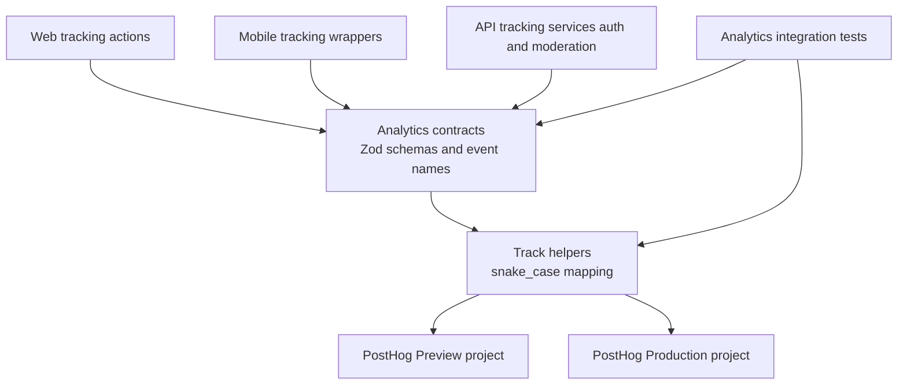

## Step 9 - Observability bootstrap with OpenTelemetry

User/business impact:

OpenTelemetry from process startup gives full-path visibility, enabling faster detection and
diagnosis when user-impacting issues occur. The business reduces downtime and MTTR with
standardized traces and metrics flowing to one observability backend.

Key takeaways:

1. Bootstrap order is the control point: OpenTelemetry starts before Nest app creation so startup
   and request paths are instrumented from the first tick.
2. Guardrails prevent noisy telemetry: missing `GRAFANA_OTLP_ENDPOINT`, `GRAFANA_INSTANCE_ID`, or
   `GRAFANA_API_KEY`, `NODE_ENV=test`, `OTEL_SDK_DISABLED=true`, or prior SDK init all no-op
   safely.
3. Root env loading is part of the local contract: the API now reads root `.env.local`, `.env.preview`
   / `.env.prod`, and `.env` before OTEL startup, so env changes require a full API restart.
   Hosted Vercel deployments do not read those repo files at runtime; they must be configured in
   Vercel project environment variables separately.
4. Exported identity matters: set a stable OpenTelemetry `service.name` so Grafana shows
   `couturecast-api` instead of `unknown_service:node`.
5. Vendor-neutral observability is explicit: W3C trace propagation + Node auto-instrumentations +
   OTLP exporters stream metrics/traces to Grafana with minimal app-level coupling.

Story/Task mapping:

- Story 0.7
- Task 4 (OpenTelemetry setup in NestJS)

Story reference:

- `_bmad-output/implementation-artifacts/0-7-configure-posthog-opentelemetry-and-grafana-cloud.md`

Cross-links:

- Step 7 carries the required OTLP credentials into CI and hosted environments.
- Step 10 consumes the traces and metrics emitted here.
- Step 11 layers structured logs on the same observability foundation.

Sequence to follow:

1. Load the OTLP credential and env-loading rules first.
2. Read instrumentation bootstrap before `main.ts` so startup order stays clear.
3. Verify the guardrails and tests before relying on hosted telemetry.

Task owner map:

- Story 0.7 Task 4 step 1 owner: define OTLP backend endpoint + auth resolution in `apps/api/src/instrumentation.ts`
- Story 0.7 Task 4 step 2 owner: create OTLP exporters for traces and metrics in `apps/api/src/instrumentation.ts`
- Story 0.7 Task 4 step 3 owner: enable instrumentation + W3C propagation in `apps/api/src/instrumentation.ts`
- Story 0.7 Task 4 step 4 owner: initialize the SDK before app bootstrap in `apps/api/src/instrumentation.ts`
- Step 9 bootstrap order owner: preserve pre-Nest startup ordering in `apps/api/src/main.ts`
- Step 9 env-loading owner: keep root env loading aligned with OTEL startup in `apps/api/src/load-env.ts`
- Step 9 verification owner: validate instrumentation and env-loading behavior in `apps/api/src/instrumentation.spec.ts` and `apps/api/src/load-env.spec.ts`

Architecture diagram:

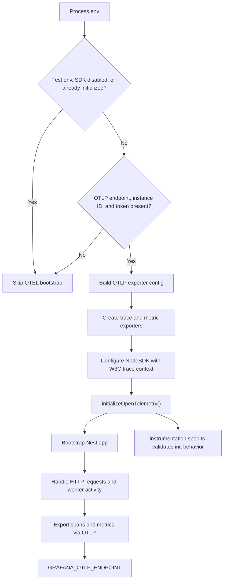

## Step 10 - Grafana Cloud setup, telemetry inventory, and dashboard planning

User/business impact:

A working Grafana Cloud stack turns local OpenTelemetry instrumentation into an actual
observability workflow the team can use. The business gets faster debugging and safer rollout
decisions once traces and metrics can be verified in a shared hosted backend instead of only in
local code.

Key takeaways:

1. Grafana Cloud account setup is part of the implementation, not an external prerequisite:
   without a stack and OTLP credentials, the API's OpenTelemetry bootstrap safely no-ops.
2. This repository uses three exact placeholders for Grafana OTLP setup:
   `GRAFANA_OTLP_ENDPOINT`, `GRAFANA_INSTANCE_ID`, and `GRAFANA_API_KEY`.
3. Those same three names must be used across local root env files, GitHub Actions repository
   secrets, and Vercel API project environment variables so local, CI, Preview, and Production all
   read the same contract.
4. Grafana Cloud usually provisions the core stack data sources already, including Tempo
   (traces), Loki (logs), and Prometheus/Mimir (metrics), and it may also add other
   Grafana-managed sources such as alert history, profiles, or usage views. First-time setup
   should verify those built-in data sources before creating duplicates.
5. Dashboard work starts with telemetry inventory, not panel creation: use the Prometheus metric
   browser/selector to record what actually exists under prefixes like `http`, `nodejs`, and
   `v8js` before writing PromQL.
6. Honest dashboards are better than empty charts: if queue/cache/socket/database metrics are not
   instrumented yet, use a `Text` panel that says so instead of implying coverage that the repo
   does not have.
7. Manual Grafana verification is trace-first in this repo: confirm Tempo traces in Grafana, but
   do not treat Loki as a required success signal yet because log ingestion is not wired.

Story/Task mapping:

- Story 0.7
- Task 6 (Grafana Cloud account setup)
- Task 6.5 (telemetry inventory before dashboards)
- Task 7 (Grafana dashboards built from real metrics)

Story reference:

- `_bmad-output/implementation-artifacts/0-7-configure-posthog-opentelemetry-and-grafana-cloud.md`

Cross-links:

- Step 9 is the source of the telemetry this step inspects.
- Step 11 adds correlated logs to the same operational picture.
- Step 7 is where these checks can later become stricter automation.

Sequence to follow:

1. Provision or verify the Grafana stack and OTLP credentials.
2. Confirm traces and real metric families from the local verification path.
3. Import dashboards only after the inventory matches what the repo actually emits.

Task owner map:

- Step 10 step 1 owner: emit traces and metrics toward Grafana Cloud in `apps/api/src/instrumentation.ts`
- Step 10 step 2 owner: provide the local verification endpoint in `apps/api/src/controllers/health.controller.ts`
- Step 10 step 3 owner: define the first queue-related telemetry inventory targets in `apps/api/src/config/queues.ts` and `apps/api/src/admin/admin.service.ts`
- Step 10 step 4 owner: define the realtime telemetry inventory target in `apps/api/src/modules/gateway/connection-manager.service.ts`
- Step 10 step 5 owner: keep local and hosted Grafana credentials aligned in `.env.local`, `.env.preview`, and `.env.prod`
- Step 10 support owner: document the manual verification workflow in `_bmad-output/project-knowledge/observability.md`

Architecture diagram:

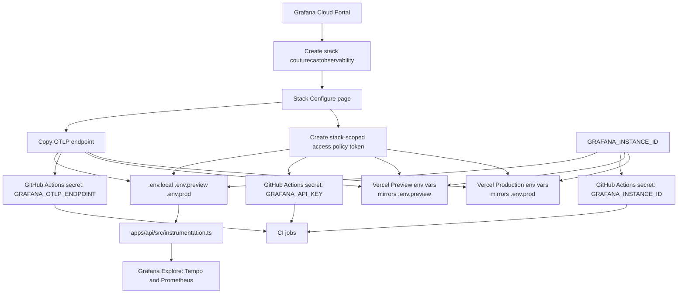

## Step 11 - API observability with structured logging

User/business impact:

Structured request logging makes production failures diagnosable without guesswork across API,
trace, and queue activity. The business gets faster incident response and stronger release
confidence because every request can be tied to a request ID, user context, feature area, and
OpenTelemetry trace.

Key takeaways:

1. Structured logs are part of the contract: API logs emit stable JSON fields including
   `timestamp`, `requestId`, `userId`, `feature`, `level`, and `message`.
2. Request context survives the full request lifecycle: middleware generates or reuses
   `x-request-id`, auth guards enrich `userId`, and later logs inherit that context automatically.
3. Trace correlation is built into the logger: active OpenTelemetry span IDs are attached so logs
   and traces line up in Grafana during debugging.
4. Environment policy matters: local defaults to `debug`, dev to `info`, and prod to `warn`,
   keeping signal-to-noise appropriate per environment.
5. Verification now has two layers: automated integration coverage proves OTLP trace export and
   `requestId` log correlation locally, while the manual Grafana check confirms Tempo visibility in
   the hosted stack. Loki remains optional until log ingestion is wired.

Story/Task mapping:

- Story 0.7
- Task 5 (Pino structured logging)
- Task 10 (observability tests)

Story reference:

- `_bmad-output/implementation-artifacts/0-7-configure-posthog-opentelemetry-and-grafana-cloud.md`

Cross-links:

- Step 9 provides the trace context this logger attaches to.
- Step 10 is where those correlated traces and logs are inspected operationally.
- Step 7 is where observability verification can become a stronger gate over time.

Sequence to follow:

1. Start with log-level policy and the base logger shape.
2. Trace request ID and AsyncLocalStorage propagation.
3. Finish with the middleware and tests that prove log/trace correlation.

Task owner map:

- Story 0.7 Task 5 step 1 owner: resolve environment-driven log level policy in `apps/api/src/logger/pino.config.ts`
- Story 0.7 Task 5 step 2 owner: inject request + trace context via the shared logger mixin in `apps/api/src/logger/pino.config.ts`
- Story 0.7 Task 5 step 3 owner: keep the base logger reusable for HTTP middleware and feature-specific child loggers in `apps/api/src/logger/pino.config.ts`
- Step 11 request-context owner: handle request ID and AsyncLocalStorage propagation in `apps/api/src/logger/request-context.ts`
- Step 11 HTTP-boundary owner: apply the shared logger contract in `apps/api/src/logger/request-logger.middleware.ts`
- Step 11 verification owner: validate logger behavior and observability integration in `apps/api/integration/observability.integration.spec.ts`, `apps/api/src/logger/pino.config.spec.ts`, `apps/api/src/logger/request-context.spec.ts`, `apps/api/src/logger/request-logger.middleware.spec.ts`, and `packages/api-client/src/testing/observability-assertions.ts`

Architecture diagram:

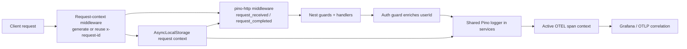

## Step 12 - Cross-surface E2E confidence

User/business impact:

Cross-surface smoke E2E coverage catches critical web and mobile regressions before users hit them
in production. The business can release more frequently with less manual QA effort and clearer
pass/fail evidence.

Key takeaways:

1. Cross-surface execution is standardized at the root: Playwright (`test:pw-local`) and Maestro
   (`test:mobile:e2e`) run from shared workspace scripts.
2. Smoke coverage is purpose-built by surface: web validates API health, core hero rendering, and
   accessibility; Playwright API specs validate boundary-critical backend contracts such as auth and
   moderation; mobile validates Expo launch/connect and basic tab navigation flow.
3. Confidence comes from artifacts plus policy: Playwright HTML/trace outputs and Maestro
   screenshots/logs support fast triage, while web is PR-gated and mobile remains manual/local by
   default.
4. Expo Go orchestration is part of the test harness: `scripts/run-maestro.mjs` now resolves the
   active mobile target, waits for Expo Go on iOS when needed, and reuses a healthy Metro server
   before running Maestro.

Story/Task mapping:

- Story 0.13
- Task 1 (Playwright harness), Task 2 (Maestro harness), Task 4 (CI integration)

Story reference:

- `_bmad-output/implementation-artifacts/0-13-scaffold-cross-surface-e2e-automation.md`

Cross-links:

- Step 6 defines the realtime fallback behavior this step exercises.
- Step 7 connects these smoke flows to PR automation.

Sequence to follow:

1. Read the shared web and mobile harness config first.
2. Inspect the Playwright smoke specs and Maestro flow.
3. Trace how artifacts and CI wiring turn these runs into release confidence.

Task owner map:

- Step 12 step 1 owner: define shared Playwright harness behavior in `playwright/config/base.config.ts` and `playwright/config/local.config.ts`
- Step 12 step 2 owner: define the core web and API smoke flows in `playwright/tests/home.spec.ts`, `playwright/tests/web-health-sha.spec.ts`, `playwright/tests/api/auth-moderation-security.spec.ts`, and `playwright/tests/api/auth-signup-age-gate.spec.ts`
- Step 12 step 3 owner: define the mobile smoke flow in `maestro/sanity.yaml`
- Step 12 step 4 owner: orchestrate the mobile test harness in `scripts/run-maestro.mjs` and `scripts/start-mobile-server.sh`
- Step 12 step 5 owner: keep the mobile fallback runtime behavior aligned in `apps/mobile/src/realtime/mobile-fallback-controller.ts`
- Step 12 step 6 owner: connect web and mobile E2E execution to CI in `.github/workflows/pr-pw-e2e-local.yml` and `.github/workflows/pr-mobile-e2e.yml`

Current repo note:

- Playwright is intentionally doing two different jobs now: thin browser smoke for stable
  user-visible pages and thin API contract coverage for boundary-critical write paths. The signup
  age-gate check in `playwright/tests/api/auth-signup-age-gate.spec.ts` is the pattern to copy
  when the real risk is backend policy enforcement, not a long multi-page browser journey.
- Do not force browser E2E onto scheduled backend state changes. The guardian adulthood sweep in
  `apps/api/integration/guardian-emancipation.integration.spec.ts` is the better pattern when the
  risk sits at the Nest guard/controller boundary plus a cron-driven policy transition; without a
  deterministic trigger or injectable clock, browser coverage adds more flake than signal.
- Keep these API specs time-stable and isolated: use dynamic dates for age boundaries, unique IDs
  or emails for create flows, and skip production for tests that mutate real state.

Architecture diagram:

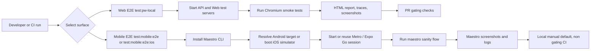

**Overall goal for Steps 13-15**

This is the contract loop the repo is trying to enforce:

`Zod contracts -> inferred types + runtime validation + OpenAPI registration -> canonical spec -> live docs + generated SDK -> app usage`

CI is adjacent to that loop, not part of the authoring chain. Its job is to regenerate derived
artifacts, detect drift, and enforce breaking-change policy automatically.

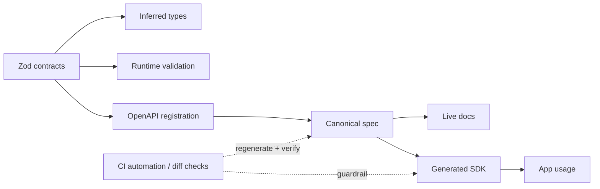

## Step 13 - Serve one canonical OpenAPI contract from the API boundary

User/business impact:

Frontend, mobile, CI, and human docs should all see the same contract. If the API serves one
canonical contract instead of authoring a second one at runtime, the business gets fewer invisible
drift bugs and a cleaner upgrade path for every client.

Key takeaways:

1. `/api/v1/openapi.json` and `/api/docs` should be two views of the same contract, not two
   independently authored specs.
2. The API app publishes the canonical contract that comes from shared Zod modules; it should not
   become a second contract authoring system.
3. `main.ts` owns when the OpenAPI surface is attached during bootstrap, and `openapi.ts` owns how
   the canonical contract is served or rendered.
4. Swagger UI can still be useful as a renderer, but Swagger decorators are not part of the
   permanent authoring model for public REST endpoints.
5. The right verification is parity testing: prove that the served `/api/v1/openapi.json` contract
   matches the canonical contract builder output.

Story/Task mapping:

- Story 0.9
- Task 4 (replace Swagger-authored live docs with the canonical contract output)
- Task 6 (add canonical contract parity tests for the live API)

Story reference:

- `_bmad-output/implementation-artifacts/0-9-initialize-openapi-spec-generation-and-api-client-sdk.md`

Cross-links:

- Step 2 clarifies why `apps/api/src/main.ts` is the API bootstrap boundary.
- Step 7 frames contract publication as part of the repo quality-gates story.
- Step 14 defines where contracts are authored.
- Step 15 shows how SDKs and apps consume the same published contract.

Sequence to follow:

1. Start from the canonical contract builder, not the runtime docs endpoint.
2. Trace how `main.ts` and `openapi.ts` publish JSON and rendered docs.
3. Verify parity between the published API contract and the canonical spec output.

Task owner map:

- Story 0.9 Task 1 step 3 owner: attach the OpenAPI publication seam during API bootstrap in `apps/api/src/main.ts`
- Story 0.9 Task 1 step 2 owner: serve or render the API-facing contract outputs in `apps/api/src/openapi.ts`
- Step 13 step 3 owner: assemble the canonical contract from shared Zod registrations in `packages/api-client/src/contracts/http/openapi.ts`
- Step 13 step 4 owner: write the canonical contract artifact to disk in `packages/api-client/scripts/generate-http-openapi.ts`
- Story 0.9 Task 1 step 5 owner: prove the published API contract surface in `apps/api/src/openapi.spec.ts`

Current repo note:

- Today `apps/api/src/openapi.ts` publishes the canonical document from
  `@couture/api-client/contracts/http` to both `/api/v1/openapi.json` and `/api/docs`, and
  `apps/api/src/openapi.spec.ts` proves the served JSON equals the canonical builder output.
  Swagger is still present only as the UI renderer, not as the contract authoring path for new
  REST endpoints.

Architecture diagram:

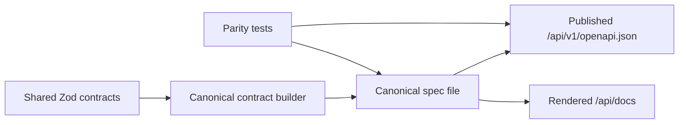

## Step 14 - Author public REST contracts in shared Zod modules

User/business impact:

If Couture Cast is meant to be a reference-quality foundation, public REST contracts cannot live in
controllers, generated clients, or one-off DTOs. They have to live in one shared contract layer
that every runtime trusts.

Key takeaways:

1. The permanent order is: define Zod contracts first, register them into OpenAPI second, generate
   the canonical document third, then derive SDKs and adapters from that stable output.
2. The shared contract package owns request schemas, response schemas, error envelopes, inferred
   TypeScript types, and OpenAPI metadata in one place.
3. Each contract slice should keep schema definition and path registration close together, so the
   module that owns an endpoint also owns its OpenAPI description.
4. Nest controllers and services should stay thin: parse inputs, shape outputs, and delegate real
   work. They are adapters, not contract authors.
5. The first migrated slice is only the proof point. The architecture is not finished until every
   public REST endpoint used by web/mobile follows the same model.
6. Keep pure business-policy helpers separate from the contract layer. Shared policy logic such as
   age calculation belongs in `packages/utils`; the contract layer still owns request/response
   schemas, inferred types, and OpenAPI metadata.

Story/Task mapping:

- Story 0.9
- Task 2 (establish the Zod-first contract foundation)
- Task 5 (finish migrating the remaining public REST slices)

Story reference:

- `_bmad-output/implementation-artifacts/0-9-initialize-openapi-spec-generation-and-api-client-sdk.md`

Cross-links:

- Step 2 explains why package boundaries matter before contract authoring starts.
- Step 13 shows how the API should publish the contract once it exists.
- Step 15 shows what happens downstream after the contract is validated.

Sequence to follow:

1. Start with reusable primitives before endpoint-specific schemas.
2. Register paths next to the schema definitions and compose them into one canonical builder.
3. Write and validate the canonical document before any downstream consumer uses it.
4. Keep Nest controllers and services thin by consuming the shared schemas instead of redefining them.

Task owner map:

- Story 0.9 Task 2 step 1 owner: define reusable HTTP primitives in `packages/api-client/src/contracts/http/common.ts`
- Story 0.9 Task 2 step 2 owner: define endpoint-specific health contracts in `packages/api-client/src/contracts/http/health.ts`
- Story 0.9 Task 2 step 3 owner: define endpoint-specific feature contracts in `packages/api-client/src/contracts/http/events.ts`
- Story 0.9 Task 2 step 4 owner: compose slice registrations into one canonical builder in `packages/api-client/src/contracts/http/openapi.ts`
- Story 0.9 Task 2 step 5 owner: write the canonical contract artifact to disk in `packages/api-client/scripts/generate-http-openapi.ts`
- Story 0.9 Task 2 step 6 owner: validate the canonical contract in `packages/api-client/testing/http-openapi.spec.ts`
- Story 0.9 Task 2 step 7 owner: consume the shared schemas from the API adapter boundary in `apps/api/src/contracts/http.ts`
- Story 0.9 Task 5 step 1 owner: define the shared auth REST contract slice in `packages/api-client/src/contracts/http/auth.ts`
- Story 0.9 Task 5 step 2 owner: define the shared moderation REST contract slice in `packages/api-client/src/contracts/http/moderation.ts`
- Story 0.9 Task 5 step 3 owner: define the first shared user REST contract slice in `packages/api-client/src/contracts/http/user.ts`
- Story 0.9 Task 5 step 4 owner: shape the DB-backed authenticated user profile through shared contracts in `apps/api/src/modules/user/user.service.ts`
- Story 0.9 Task 5 step 5 owner: expose the thin authenticated user REST adapter in `apps/api/src/modules/user/user.controller.ts`

Current repo note:

- Health, polling, auth, moderation, and the first authenticated user profile slice now follow
  this model. The auth slice now includes signup age verification as well as guardian consent, with
  `packages/api-client/src/contracts/http/auth.ts` owning the public request/response contract while
  `packages/utils/src/age.ts` owns the reusable age-policy calculation. Guardian invitation and
  revoke flows now live in `packages/api-client/src/contracts/http/guardian.ts`, with the generated
  `packages/api-client/docs/http.openapi.json` publishing the matching `/api/v1/guardian/*`
  endpoints. That contract path is now backed by guardian-aware DB enforcement in
  `packages/db/prisma/migrations/20260420113000_add_guardian_shared_rls_policies/migration.sql`,
  including the Supabase-JWT-to-app-user bridge required by the repo's text `User.id` model, plus
  the revoke-specific follow-up in
  `packages/db/prisma/migrations/20260421090000_block_revoked_teens_from_self_access/migration.sql`
  and persona coverage in `packages/db/test/rls-policies.spec.ts`. The remaining work is to migrate
  later public REST endpoints as they land so every web/mobile-facing API starts in the same
  shared-contract path. Task 6 also reinforced that shared Zod modules are not enough on their
  own: parity tests and runtime guard checks were both needed to make revoked-consent behavior real
  at the Nest adapter boundary.

Architecture diagram:

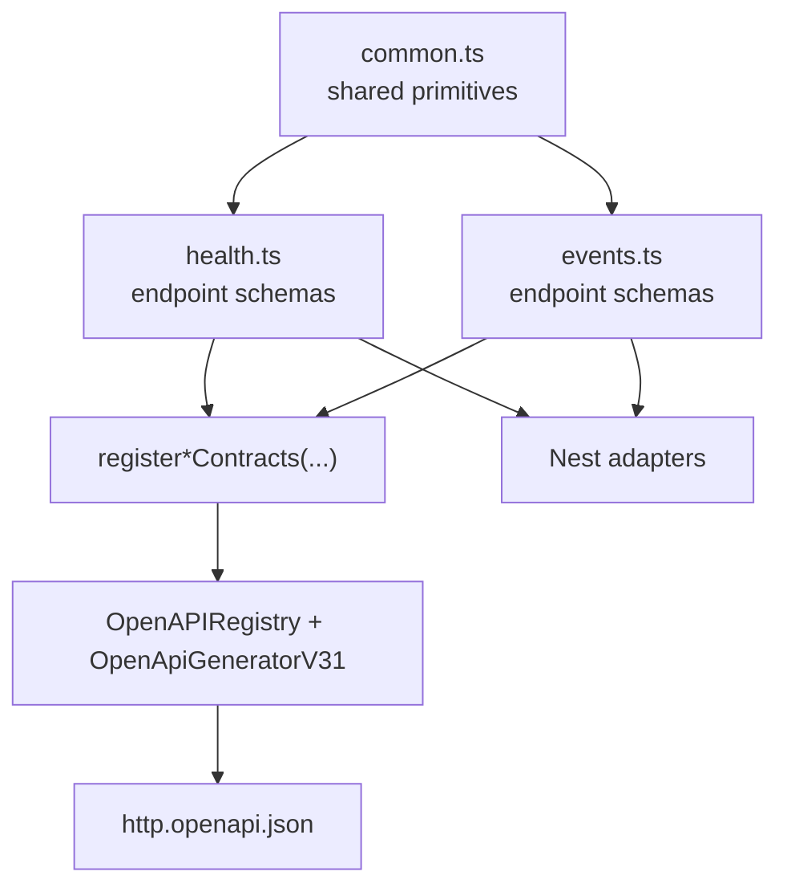

## Step 15 - Validate, generate, and consume the canonical contract

User/business impact:

A canonical contract only becomes valuable once every downstream consumer trusts it. Generated SDKs,
CI diff checks, and real app usage turn the contract from documentation into an enforced delivery
boundary.

Key takeaways:

1. SDK generation is a downstream operation. It starts only after the canonical contract has been
   generated and validated.
2. Root-level **npm scripts and the lockfile** should orchestrate contract regeneration (not “npm
   hoisting” of arbitrary packages) so developers and CI do not need a manually running API server.
3. Generated output is not the package's final public API. The repo should keep a small
   human-authored wrapper surface such as `createApiClient(...)`, then let each app wrap that
   again with runtime-local base URL and auth defaults.
4. CI breaking-change checks, live API parity tests, repo-level validation commands, and
   web/mobile runtime usage should all depend on the same canonical spec file and normalized
   generated surface.
5. The contract loop closes only when real app flows use the generated client instead of handwritten
   request typing.

Story/Task mapping:

- Story 0.9
- Task 3 (generate SDK from the canonical contract-derived spec and add wrapper exports)
- Task 6 (add contract parity tests)
- Task 7 (integrate the generated SDK into real web/mobile flows)
- Task 8 (implement canonical OpenAPI diff checks in CI)
- Task 9 (document versioning and regeneration workflow)

Story reference:

- `_bmad-output/implementation-artifacts/0-9-initialize-openapi-spec-generation-and-api-client-sdk.md`

Cross-links:

- Step 13 explains how the API publishes the contract.
- Step 14 explains how the contract is authored.
- Step 7 frames CI automation here as part of the repo quality-gates model.

Sequence to follow:

1. Keep canonical spec generation and validation green first.
2. Generate and normalize the SDK from the checked-in canonical spec, not from a live URL.
3. Consume the stable wrapper surface from app-local factories, typed helpers, and tests.
4. Re-run repo-level `typecheck`, `lint`, and `test` after regeneration so generator drift is
   caught where real consumers compile.
5. Use CI only to regenerate, detect drift, and enforce contract guardrails automatically.

Task owner map:

- Story 0.9 Task 3 step 1 owner: install and expose generator tooling from the repo root in `package.json` and `package-lock.json`
- Story 0.9 Task 3 step 2 owner: point the generator at the checked-in canonical spec in `openapitools.json`
- Story 0.9 Task 3 step 3 owner: normalize raw generated output and prune generator-only import noise in `packages/api-client/scripts/postprocess-generated-sdk.ts`
- Story 0.9 Task 3 step 4 owner: publish the stable human-authored client factory in `packages/api-client/src/client.ts`
- Step 15 step 4 owner: re-export the stable package surface in `packages/api-client/src/index.ts`
- Step 15 step 5 owner: validate the canonical spec before downstream consumption in `packages/api-client/testing/http-openapi.spec.ts`
- Story 0.9 Task 3 step 5 owner: prove the generated wrapper surface in `packages/api-client/testing/generated-client.spec.ts`
- Story 0.9 Task 7 step 1 owner: wrap the generated client for web runtime defaults in `apps/web/src/lib/api-client.ts`
- Story 0.9 Task 7 step 2 owner: wrap the generated client for mobile runtime defaults in `apps/mobile/src/lib/api-client.ts`
- Story 0.9 Task 7 step 3 owner: route web polling through the generated client in `apps/web/src/lib/events-client.ts`
- Story 0.9 Task 7 step 4 owner: consume generated polling in the web analytics runtime flow in `apps/web/src/app/components/analytics-event-actions.tsx`
- Story 0.9 Task 7 step 5 owner: route mobile API health checks through the generated client in `apps/mobile/src/lib/api-health.ts`
- Story 0.9 Task 7 step 6 owner: consume generated-client health state in the mobile tab runtime in `apps/mobile/app/(tabs)/two.tsx`

Current repo note:

- The repo now enforces a four-layer contract loop: package-level builder validation and checked-in
  spec sync in `packages/api-client/testing/http-openapi.spec.ts`, API-published OpenAPI parity in
  `apps/api/src/openapi.spec.ts`, representative API integration parity in
  `apps/api/integration/http-contract-parity.integration.spec.ts`, and thin live-endpoint smoke in
  `playwright/tests/api/*.spec.ts` including signup age-gate coverage. The SDK postprocess layer
  also strips unused generated model imports so repo-level `npm run typecheck`, `npm run lint`, and
  `npm run test` stay green after regeneration. Task 7 also landed app-local SDK factories plus
  real web/mobile runtime consumers, so the generated surface now reaches production-facing paths
  instead of package-only tests. The remaining work is CI diff enforcement and the
  versioning/regeneration documentation closeout.

Architecture diagram:

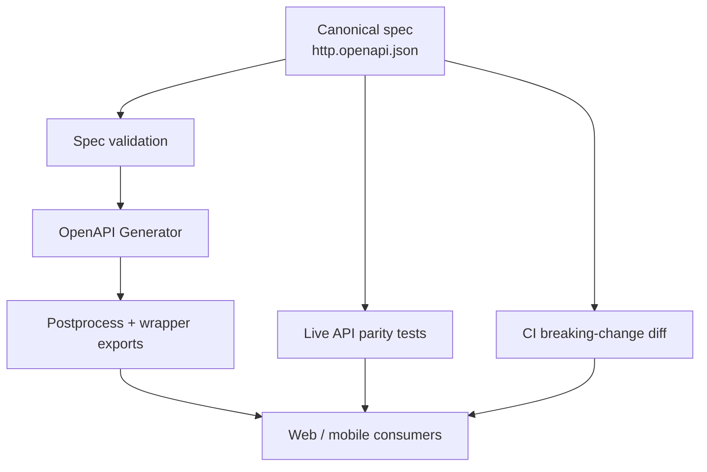
