# Couture Cast Learning Path (step by step)

Updated: 2026-03-31 - added Story 0.9 Task 1 OpenAPI/Swagger learning flow and cross-links

## LLM collaborator prompt

Use this prompt when asking an LLM to improve this document and apply the same in-code comment
style:

```text
You are improving Couture Cast learning docs and code commentary.

Goals:
1) Improve _bmad-output/project-knowledge/learning-path-step-by-step.md with clearer teaching content.
2) For each step touched, explicitly list impacted files in the step section.
3) Add/adjust in-file educational comments for impacted code using this style:
   - brief "what it is / problem solved / alternatives"
   - numbered setup steps `1) 2) 3) ...`
   - "where we did this" anchor comments near actual implementation
   - searchable step text appears in two places in the same file:
     a) overview list, b) implementation anchor

Rules:
- Keep behavior unchanged unless asked.
- Keep comments concise and ASCII.
- Preserve existing Story/Task mapping in docs.
- After edits, run formatting/lint checks and report changed files.
```

## How to use this

1. Follow steps in order.
2. For each step, read the story first, then open the evidence files.
3. Complete the exercise before moving on.

## Step 1 - Understand product-to-engineering traceability

User/business impact:

Clear traceability from brief to implementation keeps the team building features users actually
need, not speculative work. The business avoids scope drift and costly rework by tying every
delivery decision to defined goals and KPIs.

Key takeaways:

1. Traceability: `_bmad-output/project-knowledge/couturecast_brief.md` defines vision/KPIs, and downstream planning docs
   must map back to it.
2. Sequencing: `couturecast_roadmap.md` phase order drives `prd.md` scope and `epics.md` story
   decomposition.
3. Delivery alignment: implementation stories in `_bmad-output/implementation-artifacts/` should be
   explainable as outcomes of PRD + architecture decisions.

Story/Task mapping:

- Pre-story planning artifacts (source of truth before implementation stories)

Read first:

- `_bmad-output/project-knowledge/couturecast_brief.md`
- `_bmad-output/project-knowledge/couturecast_roadmap.md`
- `_bmad-output/planning-artifacts/prd.md`
- `_bmad-output/planning-artifacts/architecture.md`
- `_bmad-output/planning-artifacts/epics.md`

Architecture diagram:

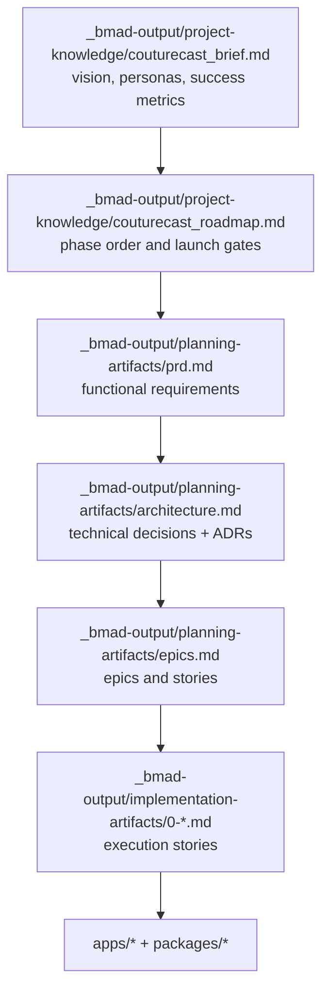

## Step 2 - Monorepo and app boundaries

User/business impact:

Strong app/package boundaries reduce cross-surface breakage, so users get more consistent behavior
across web, mobile, and API. The business gets faster parallel delivery because teams can ship
independently with fewer integration surprises.

Key takeaways:

1. Boundary clarity: `apps/web`, `apps/mobile`, and `apps/api` are separate runtime surfaces with
   distinct entrypoints.
2. Shared contracts: common logic/types flow through workspace packages (not cross-app direct
   imports), especially `packages/api-client` and `packages/db`.
3. Monorepo operations: root npm workspaces + `turbo.json` coordinate consistent `dev`, `test`,
   and `build` behavior.

Story/Task mapping:

- Story 0.1
- Task 2 (mobile app init), Task 3 (web app init), Task 4 (API app init), Task 5 (workspace
  config)

Story reference:

- `_bmad-output/implementation-artifacts/0-1-initialize-turborepo-monorepo.md`

Code evidence:

- `apps/web/src/app/layout.tsx`
- `apps/mobile/app/_layout.tsx`
- `apps/mobile/app/(tabs)/_layout.tsx`
- `apps/api/src/main.ts`

Architecture diagram:

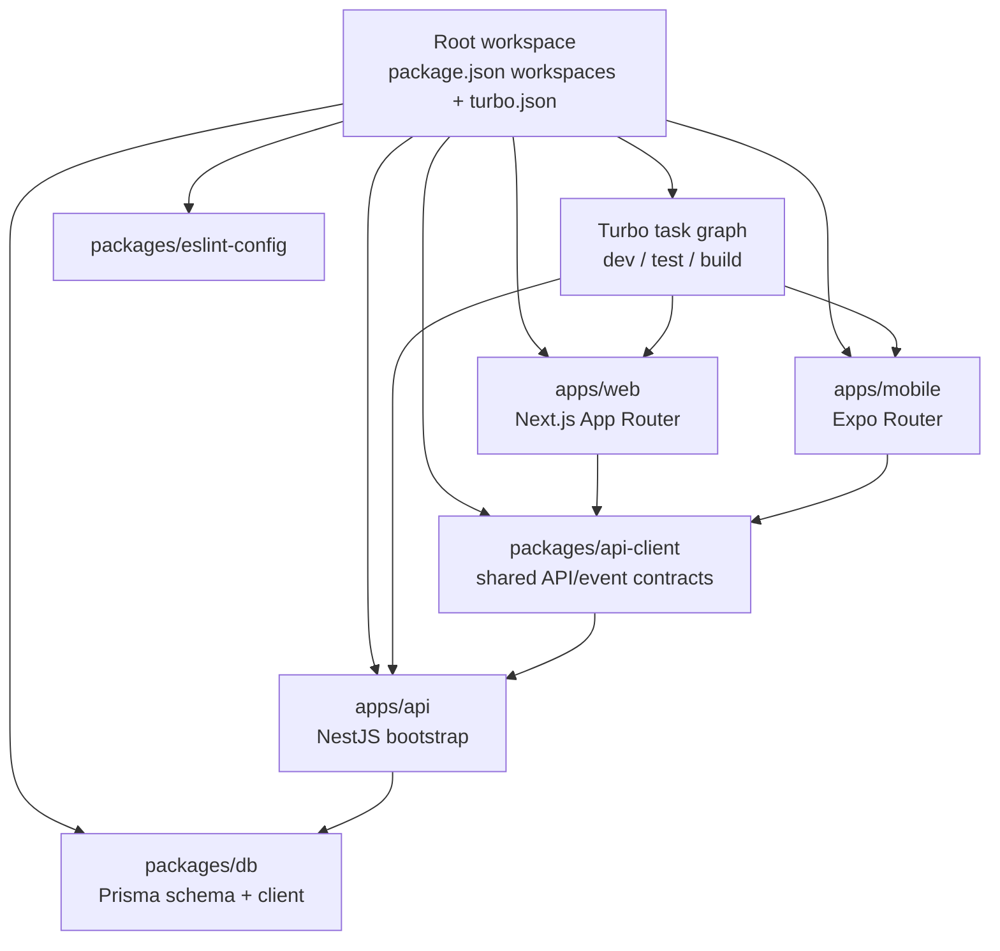

## Step 3 - Data model and deterministic seeds

User/business impact:

A stable schema plus deterministic seeds makes user-facing logic like recommendations and lookbook
flows predictable in every environment. The business gains safer releases and faster debugging
because test data and migrations are reproducible.

Key takeaways:

1. Schema-first modeling: `packages/db/prisma/schema.prisma` is the single source for relational
   models, enums, and user-scoped tables.
2. Deterministic seeding: seeds use stable IDs and seeded randomness (`faker.seed(4242)`) with
   `upsert` to keep reruns reproducible.
3. Dependency-safe order: `seedUsers -> seedWardrobe -> seedWeather -> seedRituals` ensures
   foreign-key-ready data for recommendations and lookbook flows.

Story/Task mapping:

- Story 0.2
- Task 2 (core schema tables), Task 5 (seed scripts), Task 7 (validation/testing)

Story reference:

- `_bmad-output/implementation-artifacts/0-2-configure-prisma-schema-migrations-and-seed-data.md`

Code evidence:

- `packages/db/prisma/schema.prisma`
- `packages/db/prisma/seeds/index.ts`
- `packages/db/prisma/seeds/weather.ts`

Architecture diagram:

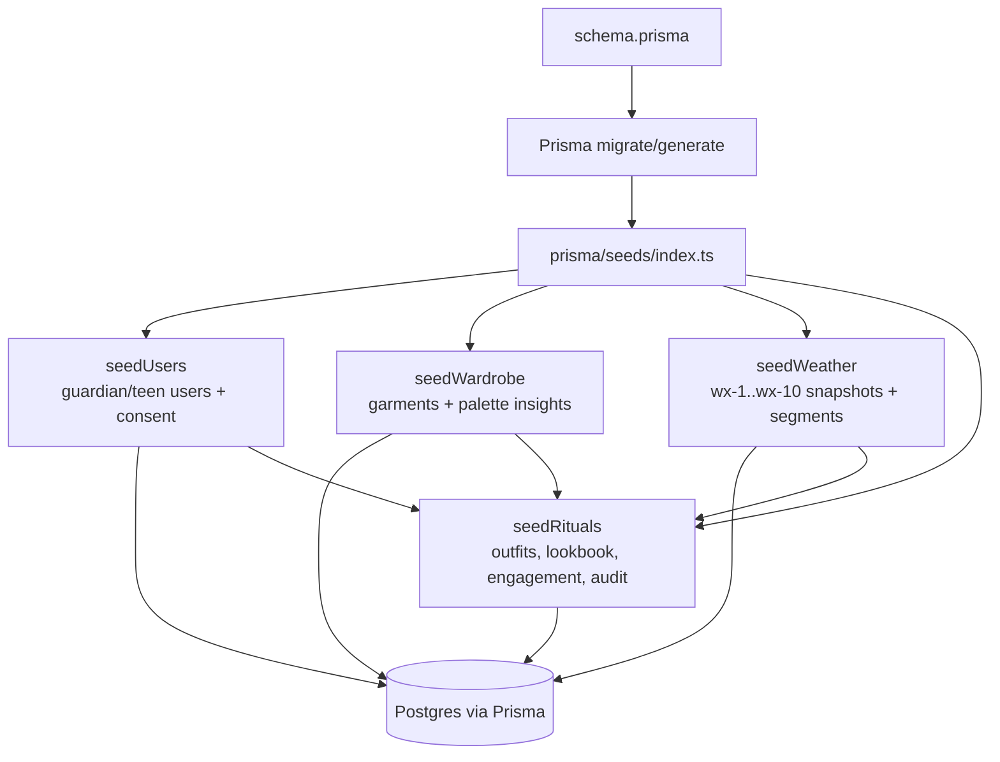

## Step 4 - Environment setup and Supabase operations

Supabase is the managed backend platform in this repo that provides PostgreSQL, Auth, and Storage.

User/business impact:

Disciplined Supabase environment and secret management reduces auth, storage, and database
misconfiguration issues that users experience as outages or login failures. The business gets more
reliable deployments and cleaner recovery operations across dev and prod.

Key takeaways:

1. Supabase env isolation is explicit: local/CI stacks plus cloud `couturecast-dev` and
   `couturecast-prod`, with staging deferred until plan/budget allows.
2. Reliability depends on env-aware operations: `npx supabase start/link/db push`, pool targets
   (dev 50, prod 100), and plan-gated PITR/backups.
3. Config hygiene is a core skill: keep `SUPABASE_URL`, `SUPABASE_ANON_KEY`,
   `SUPABASE_SERVICE_KEY`, and `DATABASE_URL` aligned across `.env.local`, `.env.dev`, `.env.prod`,
   and secrets manager.

Story/Task mapping:

- Story 0.3
- Task 3 (Supabase CLI), Task 4 (pooling/backups), Task 5 (env configuration)

Story reference:

- `_bmad-output/implementation-artifacts/0-3-set-up-supabase-projects-dev-staging-prod.md`

Code and config evidence:

- `packages/db/prisma/schema.prisma`
- root env conventions in implementation docs

Architecture diagram:

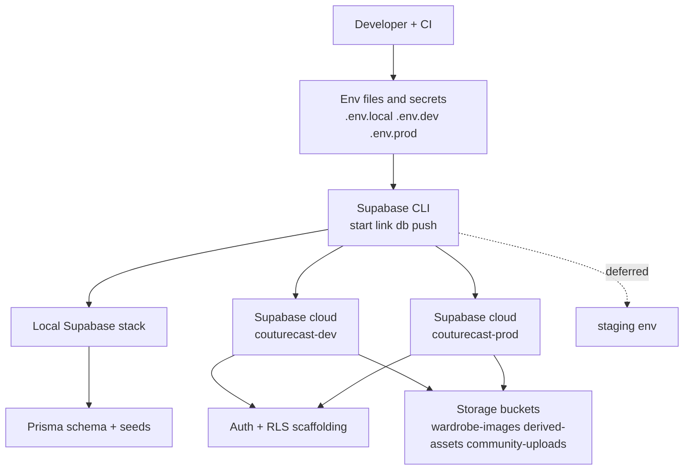

## Step 5 - Queueing and worker reliability

BullMQ is the Redis-backed job queue system in this repo for background work like weather ingestion,
alert fan-out, and moderation processing. It separates slow/retryable workloads from request
handling so the API stays responsive under load.

User/business impact:

Queue retries, backoff, and failure replay ensure critical async tasks still complete during spikes
or transient failures, so users do not miss core updates. The business protects engagement and
operations by preventing silent job loss and shortening incident recovery.

Key takeaways:

1. Parallelization: workers process jobs concurrently outside request threads.
2. Resiliency: retries, backoff, and DLQ-style failure capture prevent job loss.
3. Debuggability/operability: persisted failures + admin replay/prune flows make incidents
   traceable and recoverable.

Story/Task mapping:

- Story 0.4
- Task 2 (BullMQ queues), Task 3 (DLQ), Task 4 (concurrency), Task 5 (worker process group)

Story reference:

- `_bmad-output/implementation-artifacts/0-4-configure-redis-upstash-and-bullmq-queues.md`

Code evidence:

- `apps/api/src/config/queues.ts`
- `apps/api/src/workers/base.worker.ts`
- `apps/api/src/workers/bootstrap.ts`
- `apps/api/src/admin/admin.service.ts`
- `apps/api/src/admin/admin.controller.ts`

Owner map:

- Story 0.4 Task 2 owner: define shared BullMQ queue names, retry policy, timeouts, and queue
  construction in `apps/api/src/config/queues.ts`
- Story 0.4 Task 3 owner: persist failed job context as durable DLQ records for operator
  workflows in `apps/api/src/workers/base.worker.ts`
- Story 0.4 Task 4 owner: apply per-queue concurrency and rate-limit policy during worker startup
  in `apps/api/src/workers/bootstrap.ts`
- Story 0.4 Task 5 owner: bootstrap and shut down the dedicated worker process group cleanly in
  `apps/api/src/workers/bootstrap.ts`

Support refs:

- `apps/api/src/admin/admin.service.ts` and `apps/api/src/admin/admin.controller.ts` expose the
  operator read, replay, and prune path for DLQ records.

Architecture diagram:

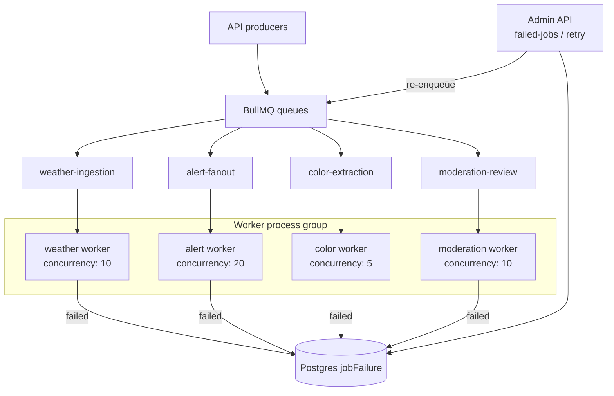

## Step 6 - Realtime and push delivery

User/business impact:

For users, Step 6 means faster ritual updates and more reliable alerts even when connectivity is
unstable. For the business, it protects engagement and retention by reducing missed notifications
and delivery-related churn.

Ritual context:

- In Couture Cast, a ritual is the daily outfit + weather decision loop a user follows.
- Available ritual-related streams are `ritual:update`, `alert:weather`, and `lookbook:new`.
- They exist to keep recommendations timely, alerts trustworthy, and daily engagement high.

Key takeaways:

1. Delivery is intentionally redundant with Socket+Push+Polling so alerts survive disconnects and
   degraded networks.
2. Shared payload contracts keep channels aligned: `lookbook:new`, `ritual:update`, and
   `alert:weather` all use `{ version, timestamp, userId, data }`.
3. Runtime fallback is deterministic: reconnect backoff (1s/3s/9s, max 5) then polling
   `GET /api/v1/events/poll` until socket recovery.

Story/Task mapping:

- Story 0.5
- Task 1 (Socket.io server), Task 2 (connection lifecycle), Task 3 (Expo Push), Task 4 (shared
  payload schema), Task 5 (fallback)

Story reference:

- `_bmad-output/implementation-artifacts/0-5-initialize-socketio-gateway-and-expo-push-api.md`

Code evidence:

- `apps/api/src/modules/gateway/gateway.gateway.ts`
- `apps/api/src/modules/gateway/connection-manager.service.ts`
- `apps/api/src/modules/events/events.service.ts`
- `apps/api/src/modules/notifications/push-token.repository.ts`
- `apps/api/src/modules/notifications/push-notification.service.ts`
- `packages/api-client/src/types/socket-events.ts`
- `packages/api-client/src/realtime/polling-service.ts`

Owner map:

- Story 0.5 Task 1 owner: expose the Socket.io gateway surface and attach the core auth +
  connection orchestration in `apps/api/src/modules/gateway/gateway.gateway.ts`
- Story 0.5 Task 2 owner: decide retry vs fallback based on connection lifecycle state in
  `apps/api/src/modules/gateway/connection-manager.service.ts`
- Story 0.5 Task 3 owner: dispatch Expo push notifications for users who are not on an active
  realtime session in `apps/api/src/modules/notifications/push-notification.service.ts`
- Story 0.5 Task 4 owner: define shared socket payload schemas for realtime namespaces in
  `packages/api-client/src/types/socket-events.ts`
- Story 0.5 Task 5 owner: activate, advance, and stop client polling when realtime is
  unavailable in `packages/api-client/src/realtime/polling-service.ts`

Support refs:

- `apps/api/src/modules/events/events.service.ts` provides the incremental polling data path.
- `apps/api/src/modules/notifications/push-token.repository.ts` keeps push token storage durable
  across reconnects and app restarts.

Architecture diagram:

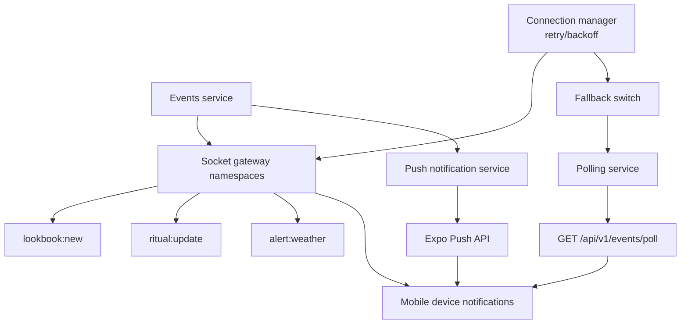

## Step 7 - CI/CD and automated quality gates

User/business impact:

Automated CI/CD quality gates catch regressions before merge and release, so users encounter fewer
broken core flows. The business lowers hotfix load and ships faster with predictable release
confidence.

Key takeaways:

1. PR quality gates are split intentionally: `pr-checks.yml` blocks typecheck/lint/test/build,
   while `pr-pw-e2e-local.yml` runs sharded Playwright and enforces the required E2E gate.
2. Flake control is explicit: `rwf-burn-in.yml` reruns changed Playwright specs 3x (with
   `SKIP_BURN_IN` override) before full E2E proceeds.
3. Deployment confidence is surface-aware: Vercel Preview smoke runs from `deployment_status`
   (`pr-pw-e2e-vercel-preview.yml`), while mobile deploy remains manual via `deploy-mobile.yml`.

Story/Task mapping:

- Story 0.6 (status: review)
- Task 1 (test workflow), Task 2 (parallelization), Task 12 (PR preview smoke), Task 13 (API
  deployment prep)

Story reference:

- `_bmad-output/implementation-artifacts/0-6-scaffold-cicd-pipelines-github-actions.md`

Code evidence:

- `.github/workflows/pr-checks.yml`
- `.github/workflows/pr-pw-e2e-local.yml`
- `.github/workflows/rwf-burn-in.yml`
- `.github/workflows/pr-pw-e2e-vercel-preview.yml`
- `.github/workflows/gitleaks-check.yml`
- `.github/workflows/deploy-mobile.yml`
- `.github/actions/install/action.yml`
- `.github/actions/setup-playwright-browsers/action.yml`

Supporting docs:

- `_bmad-output/test-artifacts/ci-cd-pipeline.md`

Architecture diagram:

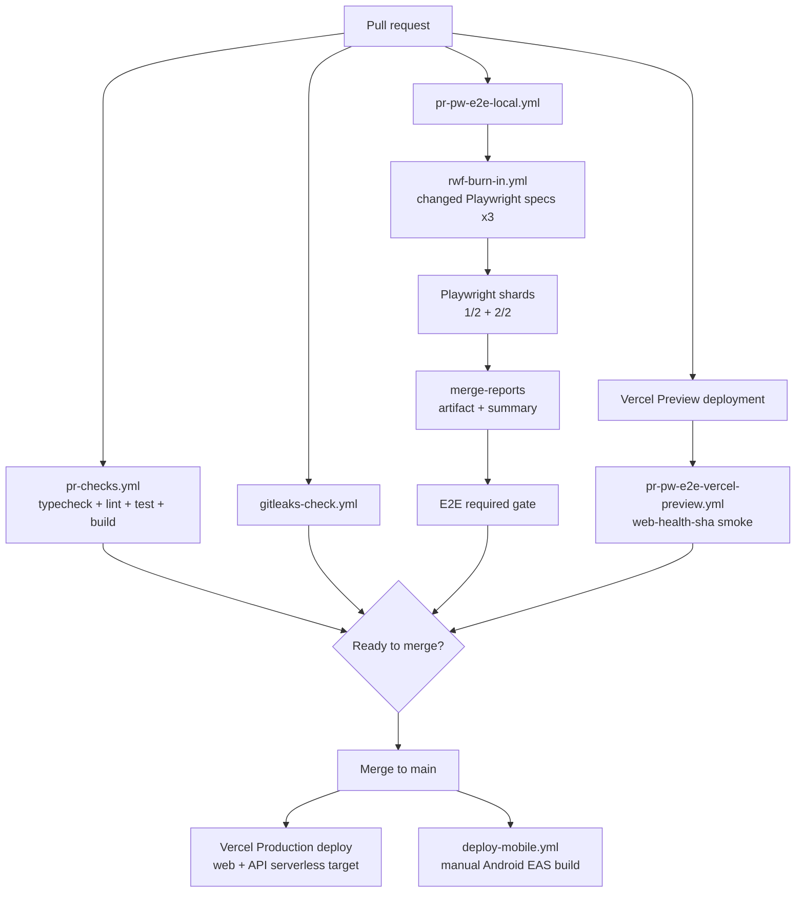

## Step 8 - Shared analytics contracts and event tracking

PostHog is the product analytics and feature-flag platform in this repo, used to capture behavior
events consistently across web, mobile, and API. It gives the team reliable funnel and retention
signals for product decisions and experiment rollout control.

User/business impact:

Shared analytics contracts keep event names and payloads consistent across web, mobile, and API,  
reducing tracking bugs that can affect user journeys. The business gets trustworthy funnel and  
retention data for faster, higher-confidence product decisions.

Key takeaways:

1. Analytics contracts are centralized in `packages/api-client/src/types/analytics-events.ts` to
   prevent event-name and payload drift.
2. Contract wrappers validate inputs, normalize to snake_case PostHog properties, and emit
   consistent payloads across web, mobile, and API.
3. Governance comes from integration checks that enforce the five core events and catch schema
   regressions early.

Story/Task mapping:

- Story 0.7
- Task 2 (event schema), Task 3 (event tracking in apps)

Story reference:

- `_bmad-output/implementation-artifacts/0-7-configure-posthog-opentelemetry-and-grafana-cloud.md`

Code evidence:

- `packages/api-client/src/types/analytics-events.ts`
- `apps/mobile/src/analytics/track-events.ts`
- `apps/web/src/app/components/analytics-event-actions.tsx`
- `apps/web/src/app/components/posthog-click-tracker.tsx`
- `apps/api/src/modules/auth/auth.service.ts`
- `apps/api/integration/analytics-tracking.integration.spec.ts`

Task 2/3 analytics owners:

- Story 0.7 Task 2 step 1 owner: define canonical event names and input/property schemas in
  `packages/api-client/src/types/analytics-events.ts`
- Story 0.7 Task 2 step 2 owner: normalize domain inputs to snake_case analytics properties in
  track\* wrappers in `packages/api-client/src/types/analytics-events.ts`
- Story 0.7 Task 3 step 1 owner: publish shared track\* wrappers for app-layer reuse and
  integration assertions in `packages/api-client/src/types/analytics-events.ts`

Task 2/3 support refs:

- `apps/mobile/src/analytics/track-events.ts` and
  `apps/web/src/app/components/analytics-event-actions.tsx` reuse the shared wrappers in app
  code.
- `apps/web/src/app/components/posthog-click-tracker.tsx` covers the lighter DOM-attribute-based
  tracking path.
- `apps/api/src/modules/auth/auth.service.ts` and
  `apps/api/integration/analytics-tracking.integration.spec.ts` keep API-side analytics aligned
  with the same shared contract.

Task 8 feature-flag flow owners:

- Story 0.7 Task 8 step 1 owner: shared flag keys, value kinds, and code defaults in
  `packages/config/src/flags.ts`
- Story 0.7 Task 8 step 2 owner: remote PostHog flag evaluation in
  `apps/api/src/posthog/posthog.service.ts`
- Story 0.7 Task 8 step 3 owner: request-time fallback order in
  `packages/config/src/flags.ts`
- Story 0.7 Task 8 step 4 owner: fallback cache warmup and refresh in
  `apps/api/src/modules/feature-flags/feature-flags.cron.ts`

Task 8 support refs:

- `apps/api/src/modules/feature-flags/feature-flags.service.ts` coordinates the full flow
  without owning a single exact step anchor.
- `apps/api/src/modules/feature-flags/feature-flags.repository.ts` persists fallback reads and
  sync writes for the cache-backed path.

Architecture diagram:

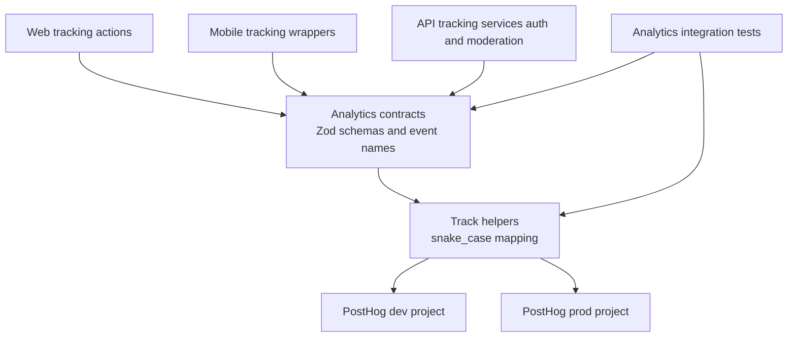

## Step 9 - Observability bootstrap with OpenTelemetry

User/business impact:

OpenTelemetry from process startup gives full-path visibility, enabling faster detection and
diagnosis when user-impacting issues occur. The business reduces downtime and MTTR with
standardized traces and metrics flowing to one observability backend.

Key takeaways:

1. Bootstrap order is the control point: OpenTelemetry starts before Nest app creation so startup
   and request paths are instrumented from the first tick.
2. Guardrails prevent noisy telemetry: missing `GRAFANA_OTLP_ENDPOINT`, `GRAFANA_INSTANCE_ID`, or
   `GRAFANA_API_KEY`, `NODE_ENV=test`, `OTEL_SDK_DISABLED=true`, or prior SDK init all no-op
   safely.
3. Root env loading is part of the local contract: the API now reads root `.env.local`, `.env.dev`
   / `.env.prod`, and `.env` before OTEL startup, so env changes require a full API restart.
   Hosted Vercel deployments do not read those repo files at runtime; they must be configured in
   Vercel project environment variables separately.
4. Exported identity matters: set a stable OpenTelemetry `service.name` so Grafana shows
   `couturecast-api` instead of `unknown_service:node`.
5. Vendor-neutral observability is explicit: W3C trace propagation + Node auto-instrumentations +
   OTLP exporters stream metrics/traces to Grafana with minimal app-level coupling.

Environment setup:

- Put the OTLP endpoint into `GRAFANA_OTLP_ENDPOINT`.
- Put the Grafana OTLP `Instance ID` into `GRAFANA_INSTANCE_ID`.
- Put the generated Grafana token into `GRAFANA_API_KEY`.
- Add all three keys to the root `.env.local`, `.env.dev`, and `.env.prod` files.
- Add matching GitHub Actions repository secrets named `GRAFANA_OTLP_ENDPOINT`,
  `GRAFANA_INSTANCE_ID`, and `GRAFANA_API_KEY`.
- Add the same three keys to the Vercel API project environment variables:
  Preview should mirror `.env.dev`, and Production should mirror `.env.prod`.
- In this repo there is no separate hosted Vercel Development environment in active use:
  PRs deploy to Vercel Preview, and merges to `main` deploy to Vercel Production.
- The API exports `service.name = couturecast-api` by default; use `OTEL_SERVICE_NAME` only if you
  intentionally need to override that.

Story/Task mapping:

- Story 0.7
- Task 4 (OpenTelemetry setup in NestJS)

Story reference:

- `_bmad-output/implementation-artifacts/0-7-configure-posthog-opentelemetry-and-grafana-cloud.md`

Code evidence:

- `apps/api/src/instrumentation.ts`
- `apps/api/src/main.ts`
- `apps/api/src/instrumentation.spec.ts`
- `apps/api/src/load-env.ts`
- `apps/api/src/load-env.spec.ts`

Owner map:

- Story 0.7 Task 4 step 1 owner: define OTLP backend endpoint + auth resolution in
  `apps/api/src/instrumentation.ts`
- Story 0.7 Task 4 step 2 owner: create OTLP exporters for traces and metrics in
  `apps/api/src/instrumentation.ts`
- Story 0.7 Task 4 step 3 owner: enable instrumentation + W3C propagation in
  `apps/api/src/instrumentation.ts`
- Story 0.7 Task 4 step 4 owner: initialize the SDK before app bootstrap in
  `apps/api/src/instrumentation.ts`

Support refs:

- `apps/api/src/main.ts` preserves the bootstrap order so OTEL starts before Nest app creation.
- `apps/api/src/load-env.ts` keeps local root env loading aligned with OTEL startup expectations.

Architecture diagram:

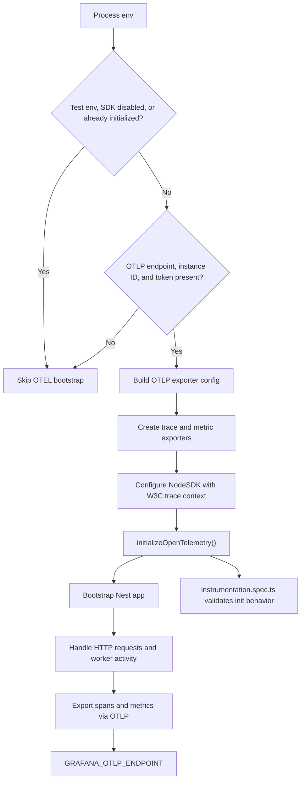

## Step 10 - Grafana Cloud setup, telemetry inventory, and dashboard planning

User/business impact:

A working Grafana Cloud stack turns local OpenTelemetry instrumentation into an actual
observability workflow the team can use. The business gets faster debugging and safer rollout
decisions once traces and metrics can be verified in a shared hosted backend instead of only in
local code.

Key takeaways:

1. Grafana Cloud account setup is part of the implementation, not an external prerequisite:
   without a stack and OTLP credentials, the API's OpenTelemetry bootstrap safely no-ops.
2. This repository uses three exact placeholders for Grafana OTLP setup:
   `GRAFANA_OTLP_ENDPOINT`, `GRAFANA_INSTANCE_ID`, and `GRAFANA_API_KEY`.
3. Those same three names must be used across local root env files, GitHub Actions repository
   secrets, and Vercel API project environment variables so local, CI, Preview, and Production all
   read the same contract.
4. Grafana Cloud usually provisions the core stack data sources already, including Tempo
   (traces), Loki (logs), and Prometheus/Mimir (metrics), and it may also add other
   Grafana-managed sources such as alert history, profiles, or usage views. First-time setup
   should verify those built-in data sources before creating duplicates.
5. Dashboard work starts with telemetry inventory, not panel creation: use the Prometheus metric
   browser/selector to record what actually exists under prefixes like `http`, `nodejs`, and
   `v8js` before writing PromQL.
6. Honest dashboards are better than empty charts: if queue/cache/socket/database metrics are not
   instrumented yet, use a `Text` panel that says so instead of implying coverage that the repo
   does not have.
7. Manual Grafana verification is trace-first in this repo: confirm Tempo traces in Grafana, but
   do not treat Loki as a required success signal yet because log ingestion is not wired.

Actual working flow in this repo:

1. Verify telemetry first.
   Start the API locally, hit `http://localhost:3000/api/v1/health/queues`, confirm traces, then
   confirm the metric families you actually have.
   Current local inventory: `http_server_duration_milliseconds_*`, `http_client_*`,
   `nodejs_eventloop_*`, and `v8js_*` are present; `process*`, `redis*`, `bull*`, `socket*`, and
   `db*` were not present in the same pass.
2. Use repo JSON as the dashboard source of truth.
   Files live in `infra/grafana/dashboards/`.
3. In Grafana, import the JSON instead of building from scratch.
   Official path: `Dashboards` -> `New` -> `Import`.
   In newer UI, the same action may be under the top-right `Add` dropdown.
4. If the dashboard renders and looks useful, save it and move on.
   For this repo, API Health has real panels; the queue/cache, realtime, and database dashboards
   are intentionally placeholders until those metric families exist.
5. Re-export only if Grafana materially changed the JSON model.

Story/Task mapping:

- Story 0.7
- Task 6 (Grafana Cloud account setup)
- Task 6.5 (telemetry inventory before dashboards)
- Task 7 (Grafana dashboards built from real metrics)

Story reference:

- `_bmad-output/implementation-artifacts/0-7-configure-posthog-opentelemetry-and-grafana-cloud.md`

Impacted files:

- `_bmad-output/implementation-artifacts/0-7-configure-posthog-opentelemetry-and-grafana-cloud.md`
- `_bmad-output/project-knowledge/learning-path-step-by-step.md`
- `apps/api/src/instrumentation.ts`
- `apps/api/src/controllers/health.controller.ts`
- `apps/api/src/modules/gateway/connection-manager.service.ts`
- `apps/api/src/config/queues.ts`
- `apps/api/src/admin/admin.service.ts`
- `.env.local`
- `.env.dev`
- `.env.prod`

Supporting references:

- `_bmad-output/project-knowledge/observability.md`
- `https://grafana.com/docs/grafana-cloud/get-started/create-account/`
- `https://grafana.com/docs/grafana-cloud/security-and-account-management/cloud-stacks/create-update-stacks/`
- `https://grafana.com/docs/grafana-cloud/send-data/otlp/send-data-otlp/`
- `https://grafana.com/docs/grafana-cloud/security-and-account-management/authentication-and-permissions/access-policies/create-access-policies/`
- `https://grafana.com/docs/grafana/latest/dashboards/build-dashboards/create-dashboard/`
- `https://grafana.com/docs/grafana/latest/panels-visualizations/visualizations/text/`
- `https://grafana.com/docs/grafana/latest/datasources/prometheus/query-editor/`
- `https://grafana.com/docs/grafana/latest/alerting/alerting-rules/create-grafana-managed-rule/`
- `https://grafana.com/docs/grafana/latest/dashboards/share-dashboards-panels/`

Architecture diagram:

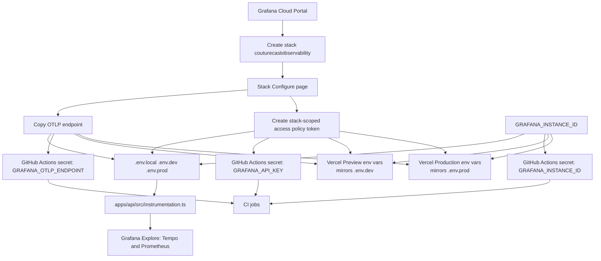

Quick translation cheat sheet:

| Grafana term                       | Plain English                   | What it means in this project                                                               | Rough DataDog equivalent          | Rough AWS equivalent                         |
| ---------------------------------- | ------------------------------- | ------------------------------------------------------------------------------------------- | --------------------------------- | -------------------------------------------- |
| Tempo / `-traces`                  | Distributed traces              | Request flows, spans, and timing for API calls such as `GET /api/v1/health/queues`          | APM Traces / Trace Explorer       | AWS X-Ray traces                             |
| Prometheus / Mimir / `-prom`       | Metrics store                   | Numeric time-series data such as request duration, process metrics, and exporter metrics    | Metrics Explorer / custom metrics | CloudWatch Metrics                           |
| Loki / `-logs`                     | Log store                       | Centralized application logs; for this story it may exist before log ingestion is wired up  | Log Explorer / Log Management     | CloudWatch Logs                              |
| Profiles                           | Continuous profiling            | CPU and runtime profiling for deeper performance debugging; not the main focus of Story 0.7 | Continuous Profiler               | CodeGuru Profiler                            |
| Alertmanager / alert state history | Alert routing and alert history | Where alert notifications and state transitions live after dashboards and alerts are added  | Monitors / monitor state history  | CloudWatch Alarms plus SNS notification flow |
| Usage / usage insights             | Grafana account usage data      | Grafana's own billing or platform usage views, not your app telemetry                       | Usage / billing views             | Cost Explorer or service usage dashboards    |

Quick way to think about it:

- `Tempo` answers: "What happened during this request?"
- `Prometheus` answers: "How much, how often, how long?"
- `Loki` answers: "What did the app log?"
- `Profiles` answers: "Where is the CPU or runtime time going?"

## Step 11 - API observability with structured logging

User/business impact:

Structured request logging makes production failures diagnosable without guesswork across API,
trace, and queue activity. The business gets faster incident response and stronger release
confidence because every request can be tied to a request ID, user context, feature area, and
OpenTelemetry trace.

Key takeaways:

1. Structured logs are part of the contract: API logs emit stable JSON fields including
   `timestamp`, `requestId`, `userId`, `feature`, `level`, and `message`.
2. Request context survives the full request lifecycle: middleware generates or reuses
   `x-request-id`, auth guards enrich `userId`, and later logs inherit that context automatically.
3. Trace correlation is built into the logger: active OpenTelemetry span IDs are attached so logs
   and traces line up in Grafana during debugging.
4. Environment policy matters: local defaults to `debug`, dev to `info`, and prod to `warn`,
   keeping signal-to-noise appropriate per environment.
5. Verification now has two layers: automated integration coverage proves OTLP trace export and
   `requestId` log correlation locally, while the manual Grafana check confirms Tempo visibility in
   the hosted stack. Loki remains optional until log ingestion is wired.

Story/Task mapping:

- Story 0.7
- Task 5 (Pino structured logging)
- Task 10 (observability tests)

Story reference:

- `_bmad-output/implementation-artifacts/0-7-configure-posthog-opentelemetry-and-grafana-cloud.md`

Code evidence:

- `apps/api/src/main.ts`
- `apps/api/integration/observability.integration.spec.ts`
- `apps/api/src/logger/pino.config.ts`
- `apps/api/src/logger/request-context.ts`
- `apps/api/src/logger/request-logger.middleware.ts`
- `apps/api/src/logger/pino.config.spec.ts`
- `apps/api/src/logger/request-context.spec.ts`
- `apps/api/src/logger/request-logger.middleware.spec.ts`
- `packages/api-client/testing/observability-assertions.ts`

Owner map:

- Story 0.7 Task 5 step 1 owner: resolve environment-driven log level policy in
  `apps/api/src/logger/pino.config.ts`
- Story 0.7 Task 5 step 2 owner: inject request + trace context via the shared logger mixin in
  `apps/api/src/logger/pino.config.ts`
- Story 0.7 Task 5 step 3 owner: keep the base logger reusable for HTTP middleware and
  feature-specific child loggers in `apps/api/src/logger/pino.config.ts`

Support refs:

- `apps/api/src/logger/request-context.ts` handles request ID and AsyncLocalStorage context
  propagation.
- `apps/api/src/logger/request-logger.middleware.ts` applies the shared logger contract at the
  HTTP boundary.
- `apps/api/integration/observability.integration.spec.ts` verifies OTLP export requests and
  request log correlation against the real Nest module wiring.
- `_bmad-output/project-knowledge/observability.md` holds the current manual Grafana trace check
  and the note that Loki log verification is not part of the required path yet.

Architecture diagram:

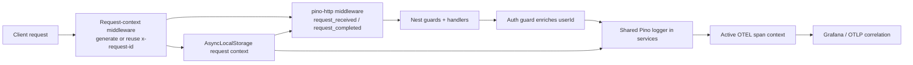

## Step 12 - Cross-surface E2E confidence

User/business impact:

Cross-surface smoke E2E coverage catches critical web and mobile regressions before users hit them
in production. The business can release more frequently with less manual QA effort and clearer
pass/fail evidence.

Key takeaways:

1. Cross-surface execution is standardized at the root: Playwright (`test:pw-local`) and Maestro
   (`test:mobile:e2e`) run from shared workspace scripts.
2. Smoke coverage is purpose-built by surface: web validates API health, core hero rendering, and
   accessibility; mobile validates Expo launch/connect and basic tab navigation flow.
3. Confidence comes from artifacts plus policy: Playwright HTML/trace outputs and Maestro
   screenshots/logs support fast triage, while web is PR-gated and mobile remains manual/local by
   default.
4. Expo Go orchestration is part of the test harness: `scripts/run-maestro.mjs` now resolves the
   active mobile target, waits for Expo Go on iOS when needed, and reuses a healthy Metro server
   before running Maestro.

Story/Task mapping:

- Story 0.13
- Task 1 (Playwright harness), Task 2 (Maestro harness), Task 4 (CI integration)

Story reference:

- `_bmad-output/implementation-artifacts/0-13-scaffold-cross-surface-e2e-automation.md`

Supporting docs:

- `_bmad-output/test-artifacts/test-design-system.md`

Code evidence:

- `playwright/config/base.config.ts`
- `playwright/config/local.config.ts`
- `playwright/tests/home.spec.ts`
- `playwright/tests/web-health-sha.spec.ts`
- `maestro/sanity.yaml`
- `scripts/run-maestro.mjs`
- `scripts/start-mobile-server.sh`
- `apps/mobile/src/realtime/mobile-fallback-controller.ts`
- `.github/workflows/pr-pw-e2e-local.yml`
- `.github/workflows/pr-mobile-e2e.yml`

Architecture diagram:

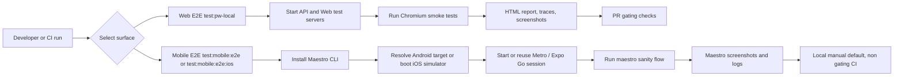

## Step 13 - OpenAPI document assembly and Swagger bootstrap

User/business impact:

OpenAPI turns the API surface into a machine-readable contract, which lets frontend and mobile
work from generated types instead of hand-maintained guesses. The business gets safer releases
because contract drift becomes visible early and SDK generation can be automated later in the
story.

Key takeaways:

1. NestJS decorators do two jobs in this step: route decorators such as `@Controller` and `@Get`
   define runtime endpoints, while Swagger decorators such as `@ApiTags`, `@ApiOperation`, and
   `@ApiOkResponse` add documentation metadata to the same handlers.
2. `SwaggerModule.createDocument(app, config)` is the assembly step: it reads Nest's route graph
   plus Swagger metadata after the app has been created and produces one OpenAPI document.
3. `SwaggerModule.setup(...)` exposes two outputs from the same generated document: Swagger UI at
   `/api/docs` for humans and raw JSON at `/api/v1/openapi.json` for tooling.
4. This step follows the same bootstrap discipline as the OpenTelemetry work in Step 9: keep the
   delayed imports in `main.ts`, create the Nest app, attach shared middleware, then attach the
   OpenAPI surface before `listen()`.
5. The verification test is an in-process integration test, not a pure unit test: it creates a
   real Nest app, serves the in-memory HTTP server, issues HTTP requests with `supertest`, and
   closes the app after each test.

Story/Task mapping:

- Story 0.9
- Task 1 (NestJS Swagger decorators and OpenAPI bootstrap)

Story reference:

- `_bmad-output/implementation-artifacts/0-9-initialize-openapi-spec-generation-and-api-client-sdk.md`

Cross-links to earlier steps:

- Step 2 explains why `apps/api/src/main.ts` is the API bootstrap boundary.
- Step 7 explains why contract generation belongs in the broader quality-gates story.
- Step 9 explains the delayed-import bootstrap pattern already used in `main.ts`.

Impacted files:

- `_bmad-output/implementation-artifacts/0-9-initialize-openapi-spec-generation-and-api-client-sdk.md`
- `_bmad-output/project-knowledge/learning-path-step-by-step.md`
- `apps/api/package.json`
- `apps/api/src/main.ts`
- `apps/api/src/openapi.ts`
- `apps/api/src/openapi.spec.ts`
- `apps/api/src/controllers/api-health.controller.ts`
- `apps/api/src/controllers/health.controller.ts`
- `package-lock.json`

Task 1 owner map:

- Story 0.9 Task 1 step 1 owner: install Swagger runtime dependencies in `apps/api/package.json`
  and `package-lock.json`
- Story 0.9 Task 1 step 2 owner: build the shared Swagger/OpenAPI assembly helper in
  `apps/api/src/openapi.ts`
- Story 0.9 Task 1 step 3 owner: hook OpenAPI setup into the Nest bootstrap flow in
  `apps/api/src/main.ts`
- Story 0.9 Task 1 step 4 owner: attach Swagger metadata to health endpoints in
  `apps/api/src/controllers/api-health.controller.ts` and
  `apps/api/src/controllers/health.controller.ts`
- Story 0.9 Task 1 step 5 owner: prove `/api/docs` and `/api/v1/openapi.json` through the
  in-process integration test in `apps/api/src/openapi.spec.ts`

Support refs:

- `apps/api/src/openapi.ts` contains the teaching comments for the full Swagger lifecycle.
- `apps/api/src/main.ts` shows the exact hook point in the Nest bootstrap sequence.
- `apps/api/src/openapi.spec.ts` documents why this is an integration test and how the app
  lifecycle is managed during testing.

Architecture diagram:

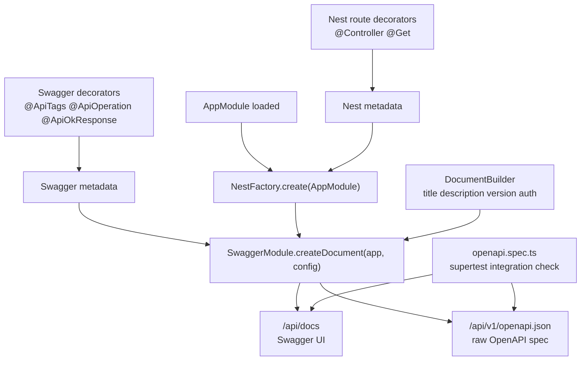
