# Couture Cast Learning Path (step by step)

Updated: 2026-08-12. Reworked Step 33 for completed Story 5.1 into the full learning format,
including implementation lessons, traceability, a code-reading sequence, and an architecture
diagram.
Story 5.2 is ready for development and is the next learning milestone. Added an authoritative LLM
update contract so future steps keep the same evidence-backed structure. Added test coverage maps
and searchable test-file cross-links for Steps 1 through 33.

## Instructions for LLMs updating this file

This contract is authoritative. Read it before changing or adding a numbered step.

1. Use Step 33 as the complete structural reference. Use Steps 25 through 32 as additional
   story-specific examples. Read the completed story artifact, review log, test evidence, and live
   implementation before writing the new step.
2. Do not turn a planned story into implementation lessons. A story with status `ready-for-dev`
   belongs in `Current position`. Add its numbered learning step only after implementation and
   review produce verified evidence.
3. Every numbered step must use this exact order:
   - `## Step N: Title`
   - `User/business impact:`
   - `Key takeaways:`
   - `Hard-won lessons from the implementation and code review of this story:` when verified
     lessons exist
   - `Story/Task mapping:`
   - `Story reference:`
   - `Cross-links:`
   - `Sequence to follow:`
   - `Task owner map:`
   - `Tests that cover this step:`
   - `Architecture diagram:` when a diagram materially improves understanding
4. Do not omit a required section because the source story used a different layout. Derive each
   section from repository evidence. If evidence is missing, state the evidence boundary instead
   of inventing content.
5. Update the `Updated` line, `Current position`, and `The whole project in plain English` table in
   the same edit. Keep story statuses aligned with
   `_bmad-output/implementation-artifacts/sprint-status.yaml`.
6. Use exact repository paths and task numbers. Verify every referenced file exists. Preserve
   security rules, failure modes, numeric thresholds, and known verification gaps.
7. Keep `Key takeaways` focused on reusable architecture and product lessons. Put defects, review
   discoveries, flaky-test causes, and integration surprises under `Hard-won lessons`.
8. Treat tests as executable documentation. Group direct coverage by test level, link every test
   file, explain what it proves, and add a Step cross-link comment to every listed test file. When
   a step has no direct executable coverage, state that evidence boundary. Do not pad the map with
   indirect suites.
9. Run Markdown, owner-anchor, reference-path, and Mermaid checks after editing. Do not claim a
   check passed unless it ran successfully.

## How to use this

1. Read the project map below.
2. Jump to the step you need. You do not need to read the file from top to bottom.
3. Read the story, then open the files in `Sequence to follow`.
4. Use `Task owner map` when you need the exact code location.
5. Use `Tests that cover this step` when you want executable examples of the behavior and its
   boundaries.

## Current position

- Latest completed step: Step 33, Story 5.1, Affiliate "Shop this look" CTA.
- Next implementation story: Story 5.2, Premium subscription lifecycle, status
  `ready-for-dev`. Its plan is in
  `_bmad-output/implementation-artifacts/5-2-premium-subscription-lifecycle.md`.
- Step 34 will capture verified Story 5.2 implementation lessons after the story is completed.

## The whole project in plain English

| Step | Caveman version                                                  |
| ---: | ---------------------------------------------------------------- |
|    1 | Decide what to build and why.                                    |
|    2 | Know which app or package owns each job.                         |
|    3 | Define data once. Seed predictable examples.                     |
|    4 | Keep local, test, and production settings separate and safe.     |
|    5 | Put slow or retryable work in queues.                            |
|    6 | Send live updates. Poll when live updates fail.                  |
|    7 | Make CI catch broken code before release.                        |
|    8 | Track the same analytics events everywhere.                      |
|    9 | Start tracing before the API starts.                             |
|   10 | Send useful telemetry to Grafana. Build dashboards from it.      |
|   11 | Log API requests without leaking secrets.                        |
|   12 | Test real user flows across the API, Web, and Mobile.            |
|   13 | Serve one OpenAPI contract from the API.                         |
|   14 | Write public API rules once in Zod.                              |
|   15 | Validate the contract. Generate clients. Use those clients.      |
|   16 | Fetch weather, store it, and survive provider failures.          |
|   17 | Match weather to alert rules and deliver notifications.          |
|   18 | Record telemetry and audit events without blocking users.        |
|   19 | Build and cache daily outfit recommendations.                    |
|   20 | Let users say they run hot or cold.                              |
|   21 | Explain why an outfit was recommended.                           |
|   22 | Keep translations complete and consistent.                       |
|   23 | Send small, ready-to-display data to phone widgets.              |
|   24 | Send glanceable weather and outfit data to Apple Watch.          |
|   25 | Make the wardrobe and community grid fit every screen.           |
|   26 | Keep navigation simple on desktop and mobile.                    |
|   27 | Open the correct screen from widgets and notifications.          |
|   28 | Make the product usable with keyboards and assistive technology. |
|   29 | Upload a garment safely and process it in the background.        |
|   30 | Use AI to suggest garment tags. Let the user decide.             |
|   31 | Group ready garments into outfit capsules with optimistic UI.    |
|   32 | Guide a new user through closet setup, then model their body.    |
|   33 | Add disclosed affiliate links and durable purchase attribution.  |

## Special feature: AI garment tagging

### Caveman version

1. User uploads clothing photo.
2. Backend AI compares photo with fixed clothing labels.
3. AI guesses category and material.
4. Normal TypeScript rules turn those guesses into a comfort range.
5. User confirms or fixes the tags. User has final say.

### What "AI" means here

- FashionCLIP is a pretrained image classifier. It runs through ONNX and Transformers.js.
- It compares the image with fixed text prompts such as `a photo of a coat` and `a garment made
from wool`. It returns scores rather than free-form text.
- It is not an LLM. It does not call OpenAI, generate content, learn from wardrobe photos, or
  fine-tune itself.
- "Local" means local to the backend wardrobe worker. The model does not run on the phone or in the
  browser.
- Model preparation downloads one pinned FashionCLIP snapshot from Hugging Face and verifies its
  SHA-256 hashes. Runtime inference loads those local files with remote model access disabled.

### How the app uses it

1. Garment commit adds a BullMQ `color-extraction` job.
2. A dedicated wardrobe worker process downloads the stored image.
3. `FashionClipTaggingEngine` sends the image to a separate Node worker thread. The thread runs one
   inference request at a time so model work does not block API requests or overlap in memory.
4. FashionCLIP scores six category prompts and nine material prompts. The API converts the scores
   into probabilities and confidence flags.
5. Category is confident at score `0.55` with a `0.15` lead. Material is confident at score `0.45`
   with a `0.10` lead. Low-confidence values require user review.
6. TypeScript rules derive `cold`, `cool`, `mild`, `warm`, or `hot`. For example, wool maps to
   `cold` and linen maps to `hot`. FashionCLIP does not predict this field directly.
7. The worker stores the suggestions and changes the garment to `awaiting_tags`.
8. Web or Mobile asks the user to confirm or correct the tags. Both clients support ten locales,
   accessible radio choices, and screen reader status. Confirmation uses
   `PATCH /api/v1/wardrobe/garments/{garmentId}/tags` and changes the garment to `ready`.
9. Confirmation records telemetry and clears the Ritual cache so future outfits use the new tags.
10. If inference fails, the garment still moves to `awaiting_tags`. The user can enter tags
    manually. If the dedicated wardrobe worker is not running, queued garments remain in
    `processing`, so production must deploy the worker and verified model snapshot with the API.

### Stored data

- `tag_suggestions`: values, confidence scores, confidence flags, and model version.
- `tagging_failure_code`: why inference failed, when applicable.
- `tags_confirmed_at`: when the user accepted or corrected the tags.
- `awaiting_tags`: processing finished and user confirmation is required.

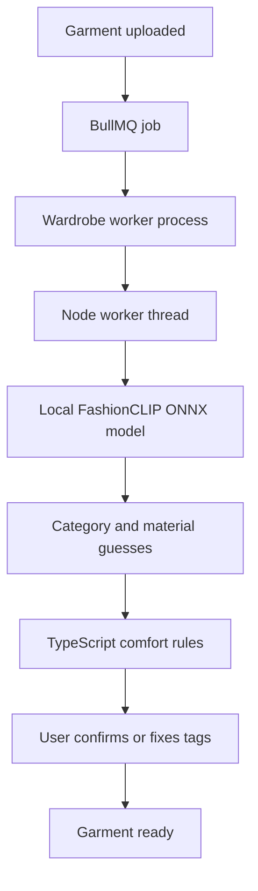
```mermaid
flowchart TD
  Upload[Garment uploaded] --> Queue[BullMQ job]
  Queue --> Worker[Wardrobe worker process]
  Worker --> Thread[Node worker thread]
  Thread --> Model[Local FashionCLIP ONNX model]
  Model --> Guess[Category and material guesses]
  Guess --> Rules[TypeScript comfort rules]
  Rules --> Review[User confirms or fixes tags]
  Review --> Ready[Garment ready]
```

## LLM collaborator prompt

Use this prompt when asking an LLM to improve this document or its matching code comments:

```text
You are improving Couture Cast learning docs and code commentary.

Primary goals:
1) Keep `_bmad-output/project-knowledge/learning-path-step-by-step.md` clear, lean, and teachable.
2) Preserve one standardized section template across every numbered step.
3) Keep the plain-English project map and special feature sections accurate.
4) Make `Task owner map` the main search surface for finding source code.
5) Keep implementation-anchor comments aligned with owner IDs in this document.

"Caveman but professional" style:
- Write for a smart engineer who is new to this repository.
- Explain the idea as if drawing it on a whiteboard.
- State the outcome first. Add implementation detail after it.
- Prefer short subject-verb-object sentences.
- Put one main idea in each sentence.
- Use common words. Define necessary jargon once.
- Use concrete examples when a rule is abstract.
- Keep paragraphs short. Prefer lists for sequences and choices.
- Preserve exact paths, contracts, thresholds, failure states, and security rules.
- Keep technical depth in the detailed step. Keep the opening summary simple.
- Do not use childish fragments, slang, marketing language, or vague claims.
- Do not remove a useful explanation only because the same topic has a short summary elsewhere.

Step template rules:
- The authoritative contract is `Instructions for LLMs updating this file` near the top.
- Every numbered step uses this order:
  `User/business impact`
  `Key takeaways`
  optional `Hard-won lessons from the implementation and code review of this story`
  `Story/Task mapping`
  `Story reference`
  `Cross-links`
  `Sequence to follow`
  `Task owner map`
  `Tests that cover this step`
  optional `Current repo note`
  optional `Architecture diagram`
- Special feature sections may appear before the numbered steps.
- A `ready-for-dev` story belongs in `Current position`; it does not receive a numbered learning
  step until implementation and review provide verified lessons.
- Do not add `Searchable strings:` or `Pattern summary:` sections.
- Remove a section only when it adds no useful information.

Mermaid rules:
- Open with exactly three backticks plus `mermaid` and close with three backticks.
- Close each diagram before the next heading.
- Parse or render every diagram after editing it.

Task owner map rules:
- Use the heading `Task owner map:` in every numbered step.
- Reuse the exact `Story X Task Y step Z owner` or `Step N step M owner` implementation anchor.
- Keep each owner bullet and full file path on one physical line.
- Prefer separate bullets when multiple files matter.
- Each numbered owner ID should appear exactly twice: here and at its implementation anchor.
- Use `_bmad-output/project-knowledge/owner-anchor-exceptions.md` when the target cannot hold a
  stable comment.

Test coverage map rules:
- Use the heading `Tests that cover this step:` in every numbered step.
- Group tests by level: unit/repository, component/client, integration, Pact, Playwright, mobile
  E2E, and performance. Omit only levels that genuinely have no coverage.
- List each direct test file once and explain the behavior or boundary it proves.
- If no direct executable test applies, state the evidence boundary instead of listing an indirect
  suite.
- Add a comment at the top of every listed test file naming the learning step and linking back to
  `_bmad-output/project-knowledge/learning-path-step-by-step.md`.
- Keep helpers and fixtures out of the list unless they contain assertions or are executable test
  entrypoints.

Code comment rules:
- Keep behavior unchanged unless the task asks for a behavior change.
- Keep comments concise and ASCII.
- Preserve Story/Task mapping and exact owner IDs.
- Explain what the code owns, the problem it solves, and any important alternative or failure path.

Working style:
- Make small edits. Preserve facts and working explanations.
- Remove fluff and true duplication.
- Run formatting, Markdown, owner-anchor, and Mermaid checks after editing.
```

## Step 1: Understand product-to-engineering traceability

User/business impact:

Clear traceability from brief to implementation keeps the team building features users actually
need, not speculative work. The business avoids scope drift and costly rework by tying every
delivery decision to defined goals and KPIs.

Key takeaways:

1. Traceability: `_bmad-output/project-knowledge/couturecast_brief.md` defines vision/KPIs, and downstream planning docs
   must map back to it.
2. Sequencing: `couturecast_roadmap.md` phase order drives `prd.md` scope and `epics.md` story
   decomposition.
3. Delivery alignment: implementation stories in `_bmad-output/implementation-artifacts/` should be
   explainable as outcomes of PRD + architecture decisions.

Story/Task mapping:

- Pre-story planning artifacts (source of truth before implementation stories)

Story reference:

- none; this step is the pre-story planning chain that later stories inherit.

Cross-links:

- Step 2 turns this planning chain into concrete runtime and package boundaries.
- Every implementation story in `_bmad-output/implementation-artifacts/` should still trace back to this chain.

Sequence to follow:

1. Read the brief for vision, target users, and success metrics.
2. Read the roadmap and PRD to understand release order and scoped requirements.
3. Read the architecture and epics to see how scope turns into implementation stories.

Task owner map:

- Step 1 step 1 owner: define the product vision, target users, and KPIs in `_bmad-output/project-knowledge/couturecast_brief.md`
- Step 1 step 2 owner: sequence the release plan in `_bmad-output/project-knowledge/couturecast_roadmap.md`
- Step 1 step 3 owner: translate the roadmap into scoped requirements in `_bmad-output/planning-artifacts/prd.md`
- Step 1 step 4 owner: capture the technical decision layer in `_bmad-output/planning-artifacts/architecture.md`
- Step 1 step 5 owner: decompose delivery into epics and implementation stories in `_bmad-output/planning-artifacts/epics.md` and `_bmad-output/implementation-artifacts/`

Tests that cover this step:

No direct executable test file is mapped to this step. This step defines the planning chain from
product intent to implementation stories. Its evidence is the traceability between the brief,
roadmap, PRD, architecture, epics, and story artifacts.

Architecture diagram:

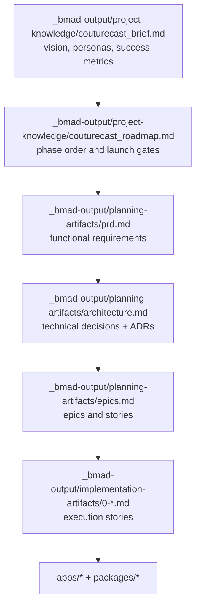
```mermaid
flowchart TD
  BRIEF[_bmad-output/project-knowledge/couturecast_brief.md<br/>vision, personas, success metrics]
  ROADMAP[_bmad-output/project-knowledge/couturecast_roadmap.md<br/>phase order and launch gates]
  PRD[_bmad-output/planning-artifacts/prd.md<br/>functional requirements]
  ARCH[_bmad-output/planning-artifacts/architecture.md<br/>technical decisions + ADRs]
  EPICS[_bmad-output/planning-artifacts/epics.md<br/>epics and stories]
  STORIES[_bmad-output/implementation-artifacts/0-*.md<br/>execution stories]
  CODE[apps/* + packages/*]

  BRIEF --> ROADMAP --> PRD --> ARCH --> EPICS --> STORIES --> CODE
```

## Step 2: Monorepo and app boundaries

User/business impact:

Strong app/package boundaries reduce cross-surface breakage, so users get more consistent behavior
across web, mobile, and API. The business gets faster parallel delivery because teams can ship
independently with fewer integration surprises.

Key takeaways:

1. Boundary clarity: `apps/web`, `apps/mobile`, and `apps/api` are separate runtime surfaces with
   distinct entrypoints.
2. Shared contracts and test primitives: common logic/types flow through workspace packages (not
   cross-app direct imports), especially `packages/api-client`, `packages/db`,
   `packages/testing`, and `packages/utils`.
3. Monorepo operations: root npm workspaces + `turbo.json` coordinate consistent `dev`, `test`,
   and `build` behavior.
4. **Runtime and app-owned deps:** Anything an app or package **imports** or any **script in that
   folder** runs (`nest build`, `tsc`, a CLI) must appear in **that** `package.json` (`dependencies`
   vs `devDependencies` by use). Do not satisfy those only from the repo root—hosted installs (for
   example Vercel) often do not see root the same way your laptop does.
5. **Root `package.json` deps:** Reserve the root for **repo-wide tooling** tied to root `npm run`
   scripts: ESLint, Prettier, TypeScript, Turbo, Vitest, Playwright, OpenAPI Generator CLI, Prisma
   CLI, `tsx`, `rimraf`, `cross-env`, Supabase CLI, Husky, etc. Treat that list as the pattern: if
   only root scripts need it, root `devDependencies` is fine.
6. **Exceptions (also at root on purpose):** A small set of **shared** runtime or CLI deps may stay
   at root when multiple workspaces or root scripts need the same version—here `@prisma/client` and
   `prisma` for `db:*` / generate flows. Anything else that **one app** imports at runtime should
   still be listed on that app even if duplicated at root (explicit beats implicit for deploys).

Story/Task mapping:

- Story 0.1
- Task 2 (mobile app init), Task 3 (web app init), Task 4 (API app init), Task 5 (workspace
  config)

Story reference:

- `_bmad-output/implementation-artifacts/0-1-initialize-turborepo-monorepo.md`

Cross-links:

- Step 1 explains why these boundaries exist before code is written.
- Step 3 and Step 14 both rely on shared packages instead of cross-app direct imports.

Sequence to follow:

1. Start at the root workspace and task graph in the repo root.
2. Open the web, mobile, and API entrypoints to see each runtime boundary.
3. Trace shared contracts and utilities through `packages/api-client`, `packages/db`,
   `packages/testing`, and `packages/utils` instead of cross-app imports.

Task owner map:

- Step 2 step 1 owner: define the workspace and task graph boundaries in `package.json` and `turbo.json`
- Step 2 step 2 owner: define the web runtime boundary in `apps/web/src/app/layout.tsx`
- Step 2 step 3 owner: define the mobile runtime boundary in `apps/mobile/app/_layout.tsx` and `apps/mobile/app/(tabs)/_layout.tsx`
- Step 2 step 4 owner: define the API runtime boundary in `apps/api/src/main.ts`
- Step 2 step 5 owner: define shared package boundaries in `packages/api-client/package.json`, `packages/db/package.json`, `packages/testing/package.json`, and `packages/utils/package.json`

Tests that cover this step:

No direct executable test file is mapped to this step. Workspace manifests, Turbo tasks, build
boundaries, and application entrypoints are the evidence for this repository-structure step.

Current repo note:

- **Rule of thumb:** Apps and packages own their direct usage; root owns cross-cutting dev tooling
  and a few intentional monorepo pins (Prisma). Repeating a package name under `apps/api` and the
  root is normal when both need it for different reasons—check the lockfile once, not “did I avoid
  duplication.”
- **Workspace install baseline:** Use Node 24 from `.nvmrc` when adding or reconciling workspaces.
  The root preinstall guard fails fast on older runtimes before npm can update the workspace graph.
- **Testing workspace boundary:** `packages/testing` now owns shared factories, cleanup helpers, and
  starter templates; its workspace lint/typecheck scripts intentionally include both `src` and
  `templates` so the CLI reports the same red files the IDE does.
- **Pure shared logic boundary:** `packages/utils` is where small runtime-safe policy helpers should
  live when web, mobile, and API all need the same answer. The current example is the signup
  age-gate flow: parse birthdates once, calculate age once, and let app-specific adapters reuse the
  same behavior instead of cloning that logic per surface.
- **Test review baseline:** PRs that touch automated tests should use the shared checklist in
  `.github/PULL_REQUEST_TEMPLATE.md` and the expectations in
  `_bmad-output/test-artifacts/testing-standards.md`; default to `@couture/testing` fixtures and
  reset or clean up any registered entities in `afterEach`.

Architecture diagram:

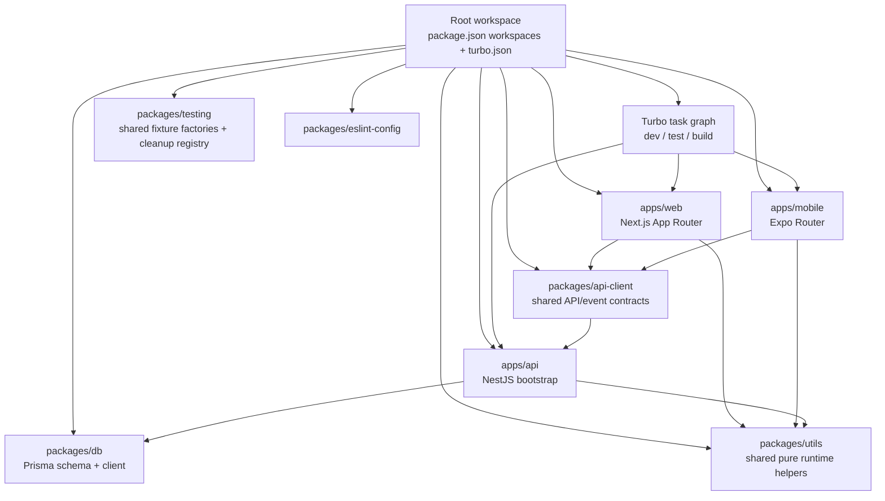
```mermaid
flowchart TD
  ROOT[Root workspace<br/>package.json workspaces + turbo.json]
  TURBO[Turbo task graph<br/>dev / test / build]

  ROOT --> WEB[apps/web<br/>Next.js App Router]
  ROOT --> MOBILE[apps/mobile<br/>Expo Router]
  ROOT --> API[apps/api<br/>NestJS bootstrap]
  ROOT --> APICLIENT[packages/api-client<br/>shared API/event contracts]
  ROOT --> DB[packages/db<br/>Prisma schema + client]
  ROOT --> TESTING[packages/testing<br/>shared fixture factories + cleanup registry]
  ROOT --> UTILS[packages/utils<br/>shared pure runtime helpers]
  ROOT --> ESLINT[packages/eslint-config]

  ROOT --> TURBO
  TURBO --> WEB
  TURBO --> MOBILE
  TURBO --> API

  WEB --> APICLIENT
  WEB --> UTILS
  MOBILE --> APICLIENT
  MOBILE --> UTILS
  APICLIENT --> API
  API --> DB
  API --> UTILS
```

## Step 3: Data model and deterministic seeds

User/business impact:

A stable schema plus deterministic seeds makes user-facing logic like recommendations and lookbook
flows predictable in every environment. The business gains safer releases and faster debugging
because test data and migrations are reproducible.

Key takeaways:

1. Schema-first modeling: `packages/db/prisma/schema.prisma` is the single source for relational
   models, enums, and user-scoped tables.
2. Deterministic seeding: seeds use stable IDs and seeded randomness (`faker.seed(4242)`) with
   `upsert` to keep reruns reproducible.
3. Dependency-safe order: `seedUsers -> seedWardrobe -> seedWeather -> seedRituals` ensures
   foreign-key-ready data for recommendations and lookbook flows.

Story/Task mapping:

- Story 0.2
- Task 2 (core schema tables), Task 5 (seed scripts), Task 7 (validation/testing)

Story reference:

- `_bmad-output/implementation-artifacts/0-2-configure-prisma-schema-migrations-and-seed-data.md`

Cross-links:

- Step 2 explains why schema and seed logic belongs in `packages/db`.
- Step 4 applies these schema and seed rules across Supabase environments.

Sequence to follow:

1. Read `schema.prisma` first because it is the relational source of truth.
2. Read the seed index to understand deterministic ordering and rerun safety.
3. Inspect a concrete seed module to see how stable IDs and seeded randomness are applied.

Task owner map:

- Step 3 step 1 owner: define the relational source of truth in `packages/db/prisma/schema.prisma`
- Step 3 step 2 owner: orchestrate deterministic seed execution in `packages/db/prisma/seeds/index.ts`
- Step 3 step 3 owner: prove a deterministic seeded domain slice in `packages/db/prisma/seeds/weather.ts`

Tests that cover this step:

No direct executable test file currently proves the complete seed order, repeatable seed identity,
and idempotent upsert behavior described here. The current evidence boundary is Prisma migration,
reset, and seed execution. Later domain factory and schema suites cover their own slices.

Architecture diagram:

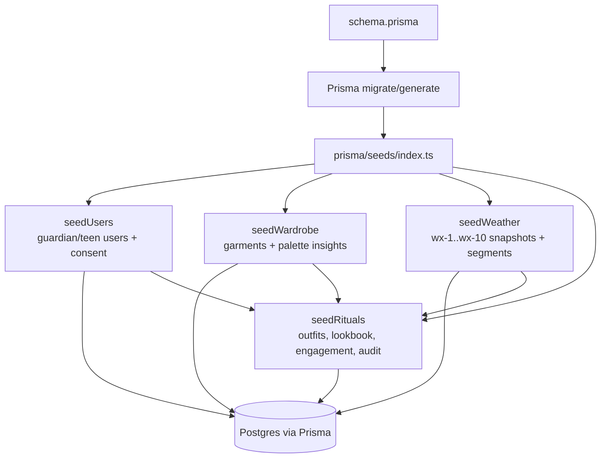
```mermaid
flowchart TD
  SCHEMA[schema.prisma]
  MIGRATE[Prisma migrate/generate]
  SEEDINDEX[prisma/seeds/index.ts]

  USERS[seedUsers<br/>guardian/teen users + consent]
  WARDROBE[seedWardrobe<br/>garments + palette insights]
  WEATHER[seedWeather<br/>wx-1..wx-10 snapshots + segments]
  RITUALS[seedRituals<br/>outfits, lookbook, engagement, audit]
  DB[(Postgres via Prisma)]

  SCHEMA --> MIGRATE --> SEEDINDEX
  SEEDINDEX --> USERS
  SEEDINDEX --> WARDROBE
  SEEDINDEX --> WEATHER
  SEEDINDEX --> RITUALS

  USERS --> DB
  WARDROBE --> DB
  WEATHER --> DB
  RITUALS --> DB

  USERS --> RITUALS
  WARDROBE --> RITUALS
  WEATHER --> RITUALS
```

## Step 4: Environment setup and Supabase operations

User/business impact:

Disciplined Supabase environment and secret management reduces auth, storage, and database
misconfiguration issues that users experience as outages or login failures. The business gets more
reliable deployments and cleaner recovery operations across Preview and Production.

Key takeaways:

1. Supabase env isolation is explicit: local/CI stacks plus cloud Preview and Production projects.
2. Reliability depends on env-aware operations: `npx supabase start/link/db push`,
   `npx prisma migrate deploy --schema packages/db/prisma/schema.prisma`, pool targets
   (Preview 50, Production 100), and plan-gated PITR/backups.
3. Config hygiene is a core skill: keep `SUPABASE_URL`, `SUPABASE_ANON_KEY`,
   `SUPABASE_SERVICE_KEY`, and `DATABASE_URL` aligned across `.env.local`, `.env.preview`, `.env.prod`,
   and secrets manager.
4. Auth is not finished at signup. Supabase JWT claims still have to resolve to the app's text
   `User.id` model before guardian-aware RLS can safely protect teen wardrobe data.

Story/Task mapping:

- Story 0.3
- Task 3 (Supabase CLI), Task 4 (pooling/backups), Task 5 (env configuration)
- Story 0.11
- Task 4 (guardian-aware RLS migration rollout and validation)

Story reference:

- `_bmad-output/implementation-artifacts/0-3-set-up-supabase-projects-dev-staging-prod.md`

Cross-links:

- Step 3 defines the schema and seeds these environments must run.
- Step 14 explains why signup age-verification and guardian-consent rules must also land at the
  database policy layer, not only in the HTTP contract.
- Step 7 carries the same environment contract into CI and deployment automation.

Sequence to follow:

1. Identify the active environment names and which ones are intentionally deferred.
2. Trace how Supabase CLI and Prisma target those environments.
3. Read the guardian-aware RLS migration and understand the JWT-claim bridge from Supabase Auth to
   the repo's text `User.id` values.
4. Verify teen, guardian, outsider, anon, and admin policy behavior in DB-level tests before
   deploying to shared environments.
5. Keep datasource and secret names aligned across local, CI, and hosted environments.

Task owner map:

- Step 4 step 1 owner: anchor the application datasource and database contract in `packages/db/prisma/schema.prisma`
- Step 4 step 2 owner: define Supabase environment and operational rules in `_bmad-output/implementation-artifacts/0-3-set-up-supabase-projects-dev-staging-prod.md`
- Step 4 step 3 owner: keep local, CI, and hosted environment naming aligned in `_bmad-output/implementation-artifacts/0-3-set-up-supabase-projects-dev-staging-prod.md`
- Story 0.11 Task 4 owner: enforce guardian-aware RLS and the auth-claim bridge in `packages/db/prisma/migrations/20260420113000_add_guardian_shared_rls_policies/migration.sql`

Tests that cover this step:

Real PostgreSQL integration test:

- [`packages/db/test/rls-policies.spec.ts`](../../packages/db/test/rls-policies.spec.ts):
  exercises the live Supabase-style claim bridge and the
  teen, guardian, administrator, and revoked-consent policy boundaries.

Current repo note:

- Step 4 now includes the first real Supabase policy rollout, not only environment scaffolding.
  `packages/db/prisma/migrations/20260420113000_add_guardian_shared_rls_policies/migration.sql`
  applies guardian-aware access rules across the private wardrobe tables, and
  `packages/db/test/rls-policies.spec.ts` proves the resulting teen/guardian/admin personas
  against a live Postgres policy surface before deploy. Task 6 then extends that model with
  `packages/db/prisma/migrations/20260421090000_block_revoked_teens_from_self_access/migration.sql`,
  which blocks teen self-access again when the last active guardian consent is revoked.

Architecture diagram:

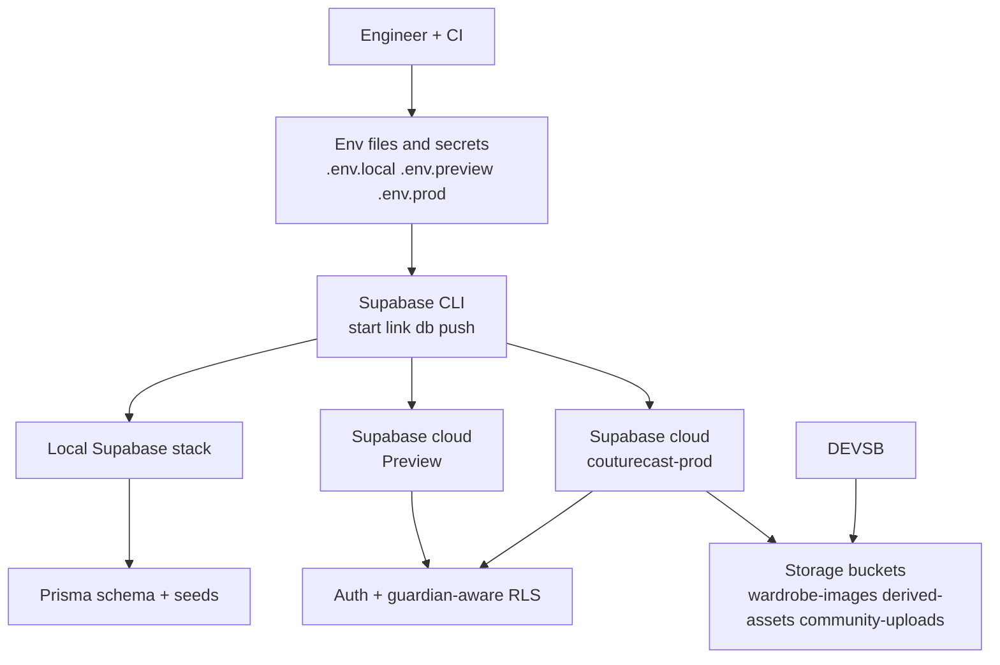
```mermaid
flowchart TD
  ENGINEER[Engineer + CI] --> ENV[Env files and secrets<br/>.env.local .env.preview .env.prod]
  ENV --> CLI[Supabase CLI<br/>start link db push]
  CLI --> LOCAL[Local Supabase stack]
  LOCAL --> PRISMA[Prisma schema + seeds]

  CLI --> PREVIEWSB[Supabase cloud<br/>Preview]
  CLI --> PRODSB[Supabase cloud<br/>couturecast-prod]

  PREVIEWSB --> AUTH[Auth + guardian-aware RLS]
  PRODSB --> AUTH
  DEVSB --> BUCKETS[Storage buckets<br/>wardrobe-images derived-assets community-uploads]
  PRODSB --> BUCKETS
```

## Step 5: Queueing and worker reliability

User/business impact:

Queue retries, backoff, and failure replay ensure critical async tasks still complete during spikes
or transient failures, so users do not miss core updates. The business protects engagement and
operations by preventing silent job loss and shortening incident recovery.

Key takeaways:

1. Parallelization: workers process jobs concurrently outside request threads.
2. Resiliency: retries, backoff, and DLQ-style failure capture prevent job loss.
3. Debuggability/operability: persisted failures + admin replay/prune flows make incidents
   traceable and recoverable.

Story/Task mapping:

- Story 0.4
- Task 2 (BullMQ queues), Task 3 (DLQ), Task 4 (concurrency), Task 5 (worker process group)

Story reference:

- `_bmad-output/implementation-artifacts/0-4-configure-redis-upstash-and-bullmq-queues.md`

Cross-links:

- Step 2 separates request-serving apps from background worker processes.
- Steps 10 and 11 extend these queues into telemetry and structured logging.

Sequence to follow:

1. Read the shared queue config and retry policy first.
2. Read worker bootstrap to see concurrency and rate-limit policy.
3. Read DLQ capture and admin replay/prune flows so failure recovery is explicit.

Task owner map:

- Story 0.4 Task 2 owner: define shared BullMQ queue names, retry policy, timeouts, and queue construction in `apps/api/src/config/queues.ts`
- Story 0.4 Task 3 owner: persist failed job context as durable DLQ records for operator workflows in `apps/api/src/workers/base.worker.ts`
- Story 0.4 Task 4 owner: apply per-queue concurrency and rate-limit policy during worker startup in `apps/api/src/workers/bootstrap.ts`
- Story 0.4 Task 5 owner: bootstrap and shut down the dedicated worker process group cleanly in `apps/api/src/workers/bootstrap.ts`
- Step 5 support owner: expose operator read, replay, and prune flows in `apps/api/src/admin/admin.service.ts` and `apps/api/src/admin/admin.controller.ts`

Tests that cover this step:

Worker and operator unit tests:

- [`apps/api/src/workers/base.worker.spec.ts`](../../apps/api/src/workers/base.worker.spec.ts):
  proves shared retry settings, queue concurrency,
  processor wiring, and durable dead-letter writes on failed jobs.
- [`apps/api/src/admin/admin.service.spec.ts`](../../apps/api/src/admin/admin.service.spec.ts):
  proves bounded DLQ listing, queue filtering, retention,
  replay, and preservation of a failed record when requeueing fails.
- [`apps/api/src/admin/admin.controller.spec.ts`](../../apps/api/src/admin/admin.controller.spec.ts):
  proves the operator controller delegates list and
  replay requests to the service with the requested queue and job identity.
- [`apps/api/src/admin/admin.cron.spec.ts`](../../apps/api/src/admin/admin.cron.spec.ts):
  proves scheduled 30-day pruning and scheduler survival
  when pruning fails.
- [`apps/api/src/workers/shutdown-resources.spec.ts`](../../apps/api/src/workers/shutdown-resources.spec.ts):
  proves dependency-ordered shutdown, continued
  cleanup after rejection, and forced disconnect after the graceful deadline.

Architecture diagram:

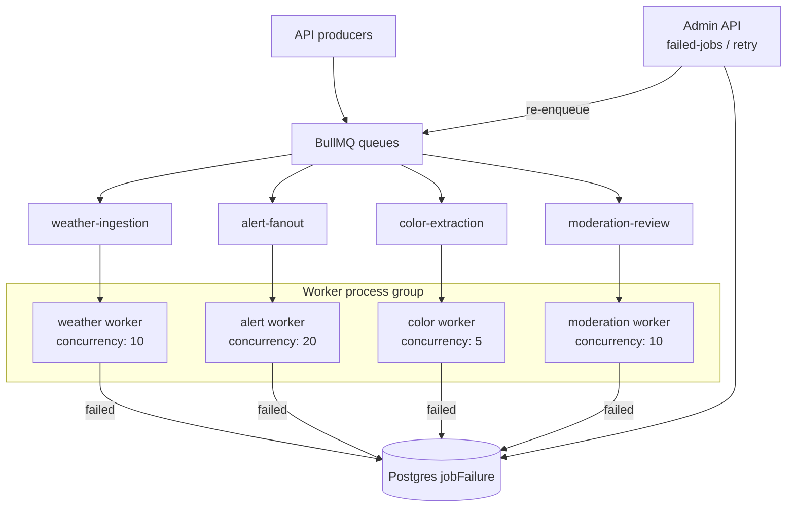
```mermaid
flowchart TD
  API[API producers] --> Q[BullMQ queues]

  Q --> WQ[weather-ingestion]
  Q --> AQ[alert-fanout]
  Q --> CQ[color-extraction]
  Q --> MQ[moderation-review]

  subgraph WG[Worker process group]
    WW[weather worker<br/>concurrency: 10]
    AW[alert worker<br/>concurrency: 20]
    CW[color worker<br/>concurrency: 5]
    MW[moderation worker<br/>concurrency: 10]
  end

  WQ --> WW
  AQ --> AW
  CQ --> CW
  MQ --> MW

  WW -->|failed| DLQ[(Postgres jobFailure)]
  AW -->|failed| DLQ
  CW -->|failed| DLQ
  MW -->|failed| DLQ

  ADM[Admin API<br/>failed-jobs / retry] --> DLQ
  ADM -->|re-enqueue| Q
```

## Step 6: Realtime and push delivery

User/business impact:

For users, Step 6 means faster ritual updates and more reliable alerts even when connectivity is
unstable. For the business, it protects engagement and retention by reducing missed notifications
and delivery-related churn.

Key takeaways:

1. Delivery is intentionally redundant with Socket+Push+Polling so alerts survive disconnects and
   degraded networks.
2. Shared payload contracts keep channels aligned: `lookbook:new`, `ritual:update`, and
   `alert:weather` all use `{ version, timestamp, userId, data }`.
3. Runtime fallback is deterministic: reconnect backoff (1s/3s/9s, max 5) then polling
   `GET /api/v1/events/poll` until socket recovery.

Story/Task mapping:

- Story 0.5
- Task 1 (Socket.io server), Task 2 (connection lifecycle), Task 3 (Expo Push), Task 4 (shared
  payload schema), Task 5 (fallback)

Story reference:

- `_bmad-output/implementation-artifacts/0-5-initialize-socketio-gateway-and-expo-push-api.md`

Cross-links:

- Step 5 explains the async work that feeds alert and ritual delivery.
- Step 12 verifies these fallback paths through end-to-end coverage.

Sequence to follow:

1. Start with the gateway and connection lifecycle rules.
2. Trace push-token persistence and push dispatch for offline delivery.
3. Follow the polling fallback path used when realtime is unavailable.

Task owner map:

- Story 0.5 Task 1 owner: expose the Socket.io gateway surface and attach the core auth + connection orchestration in `apps/api/src/modules/gateway/gateway.gateway.ts`
- Story 0.5 Task 2 owner: decide retry vs fallback based on connection lifecycle state in `apps/api/src/modules/gateway/connection-manager.service.ts`
- Step 6 polling backend owner: provide the incremental polling data path in `apps/api/src/modules/events/events.service.ts`
- Step 6 push token owner: keep push token persistence durable in `apps/api/src/modules/notifications/push-token.repository.ts`
- Story 0.5 Task 3 owner: dispatch Expo push notifications for users who are not on an active realtime session in `apps/api/src/modules/notifications/push-notification.service.ts`
- Story 0.5 Task 4 owner: define shared socket payload schemas for realtime namespaces in `packages/api-client/src/types/socket-events.ts`
- Story 0.5 Task 5 owner: activate, advance, and stop client polling when realtime is unavailable in `packages/api-client/src/realtime/polling-service.ts`

Tests that cover this step:

API and shared-client unit tests:

- [`apps/api/src/modules/gateway/gateway.test.ts`](../../apps/api/src/modules/gateway/gateway.test.ts):
  proves reconnect backoff, fallback activation,
  lifecycle reset, and structured retry metadata.
- [`apps/api/src/modules/gateway/gateway.gateway.spec.ts`](../../apps/api/src/modules/gateway/gateway.gateway.spec.ts):
  proves namespace boundaries, socket
  authentication, server-owned user rooms, and user-targeted weather delivery.
- [`apps/api/src/modules/events/events.controller.spec.ts`](../../apps/api/src/modules/events/events.controller.spec.ts):
  proves authenticated polling, an empty
  initial result, and invalid cursor rejection.
- [`apps/api/src/modules/events/events.service.spec.ts`](../../apps/api/src/modules/events/events.service.spec.ts):
  proves event delivery with an advancing
  cursor and the empty-result cursor contract.
- [`apps/api/src/modules/events/events.repository.spec.ts`](../../apps/api/src/modules/events/events.repository.spec.ts):
  proves user and global event scoping with
  and without a cursor.
- [`apps/api/src/modules/notifications/notifications.test.ts`](../../apps/api/src/modules/notifications/notifications.test.ts):
  proves Expo token validation,
  100-message batching, selective retries, timeouts, and mixed ticket handling.
- [`apps/api/src/modules/notifications/push-token.repository.spec.ts`](../../apps/api/src/modules/notifications/push-token.repository.spec.ts):
  proves normalized token
  persistence, user lookup, provider-invalid token deletion, and deduplication.
- [`packages/api-client/testing/polling-service.spec.ts`](../../packages/api-client/testing/polling-service.spec.ts):
  proves immediate polling, cursor progress,
  the 30-second cadence, failure recovery, stop, and restart behavior.

Performance test:

- [`k6/tests/couture-api-baseline.k6test.ts`](../../k6/tests/couture-api-baseline.k6test.ts):
  exercises the realtime polling endpoint and applies its
  environment-adjusted P95 latency and aggregate failure thresholds.

Architecture diagram:

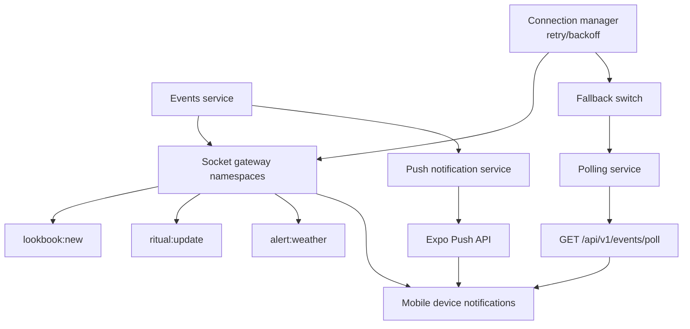
```mermaid
flowchart TD
  ES[Events service] --> GW[Socket gateway namespaces]
  GW --> LB[lookbook:new]
  GW --> RU[ritual:update]
  GW --> AW[alert:weather]

  ES --> PUSH[Push notification service]
  PUSH --> EXPO[Expo Push API]
  EXPO --> DEVICE[Mobile device notifications]

  CM[Connection manager<br/>retry/backoff] --> GW
  CM --> FALLBACK[Fallback switch]
  FALLBACK --> POLL[Polling service]
  POLL --> API[GET /api/v1/events/poll]
  API --> DEVICE
  GW --> DEVICE
```

## Step 7: CI and CD automated quality gates

User/business impact:

Automated CI/CD quality gates catch regressions before merge and release, so users encounter fewer
broken core flows. The business lowers hotfix load and ships faster with predictable release
confidence.

Key takeaways:

1. PR quality gates are split intentionally: `pr-checks.yml` blocks typecheck/lint/test/build,
   while `pr-pw-e2e-local.yml` runs sharded Playwright and enforces the required E2E gate.
2. Flake control is explicit: `rwf-burn-in.yml` reruns changed Playwright specs 3x (with
   `SKIP_BURN_IN` override) before full E2E proceeds.
3. Deployment confidence is surface-aware: Vercel Preview smoke runs from `deployment_status`
   (`pr-pw-e2e-vercel-preview.yml`), while mobile deploy remains manual via `deploy-mobile.yml`.
4. Coverage visibility is baked into the PR loop: `pr-checks.yml` runs all workspace tests with
   coverage, passes workspace coverage directories into the composite action, posts a sticky PR
   comment with statements/branches/functions/lines metrics, and updates four shields.io badges on
   push to main.

Story/Task mapping:

- Story 0.6 (status: review), Story 0.14 Task 7 (coverage reporting)
- Task 1 (test workflow), Task 2 (parallelization), Task 12 (PR preview smoke), Task 13 (API
  deployment prep), Story 0.14 Task 7 (coverage PR comments and badges)

Story reference:

- `_bmad-output/implementation-artifacts/0-6-scaffold-cicd-pipelines-github-actions.md`

Cross-links:

- Step 2 defines the apps and packages these workflows exercise.
- Step 12 plugs cross-surface smoke coverage into this gate.
- Step 15 adds contract automation to the same quality-gate model.
- Story 0.14 Task 7 extends this gate with merged monorepo coverage, PR comments, and badges.

Sequence to follow:

1. Read the required PR workflows first.
2. See how burn-in, preview smoke, and secret scanning complement the base checks.
3. Note which deploy paths are automated and which remain manual by design.
4. Trace how monorepo coverage is collected, merged, and surfaced in PRs and badges.

Task owner map:

- Step 7 step 1 owner: enforce base PR quality gates in `.github/workflows/pr-checks.yml`
- Step 7 step 2 owner: enforce local Playwright E2E gating in `.github/workflows/pr-pw-e2e-local.yml`
- Step 7 step 3 owner: control flake burn-in behavior in `.github/workflows/rwf-burn-in.yml`
- Step 7 step 4 owner: verify preview deployments with targeted smoke checks in `.github/workflows/pr-pw-e2e-vercel-preview.yml`
- Step 7 step 5 owner: enforce secret scanning in `.github/workflows/gitleaks-check.yml`
- Step 7 step 6 owner: keep the mobile deployment path explicit in `.github/workflows/deploy-mobile.yml`
- Step 7 support owner: centralize install and browser setup in `.github/actions/install/action.yml` and `.github/actions/setup-playwright-browsers/action.yml`
- Step 7 step 7 owner: wire monorepo workspace coverage directories and badge inputs in `.github/workflows/pr-checks.yml`
- Step 7 step 8 owner: merge workspace summaries, upload coverage artifact, parse metrics, comment on PR, and update four gist-backed badges in `.github/actions/unit-test-coverage-comment/action.yml`

Tests that cover this step:

Workflow structure unit test:

- [`apps/api/integration/deployment-workflows.spec.ts`](../../apps/api/integration/deployment-workflows.spec.ts):
  asserts the preview and mobile deployment
  workflow files, unified Vercel configuration, CI-safe API preparation, and migration-before-build
  ordering.

Playwright deployed smoke test:

- [`playwright/tests/web-health-sha.spec.ts`](../../playwright/tests/web-health-sha.spec.ts):
  verifies deployed health metadata and the expected Git
  revision used by preview smoke gating.

Architecture diagram:

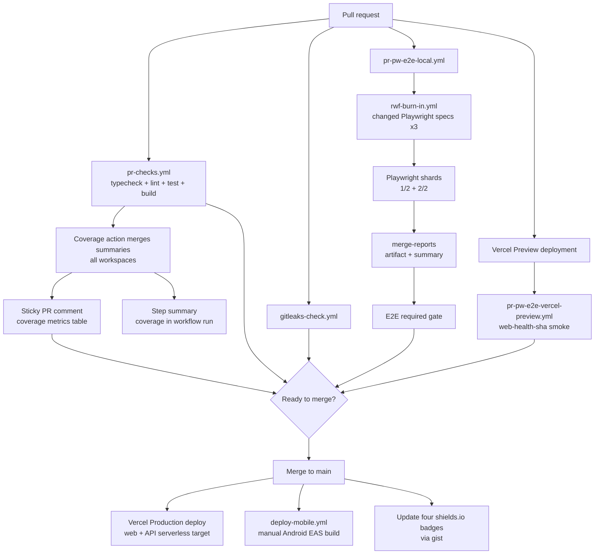
```mermaid
flowchart TD
  PR[Pull request] --> PRCHECKS[pr-checks.yml<br/>typecheck + lint + test + build]
  PR --> GITLEAKS[gitleaks-check.yml]
  PR --> E2E[pr-pw-e2e-local.yml]

  E2E --> BURNIN[rwf-burn-in.yml<br/>changed Playwright specs x3]
  BURNIN --> SHARDS[Playwright shards<br/>1/2 + 2/2]
  SHARDS --> MERGE_REPORTS[merge-reports<br/>artifact + summary]
  MERGE_REPORTS --> E2E_GATE[E2E required gate]

  PR --> PREVIEW[Vercel Preview deployment]
  PREVIEW --> PREVIEW_SMOKE[pr-pw-e2e-vercel-preview.yml<br/>web-health-sha smoke]

  PRCHECKS --> COV[Coverage action merges summaries<br/>all workspaces]
  COV --> COMMENT[Sticky PR comment<br/>coverage metrics table]
  COV --> SUMMARY[Step summary<br/>coverage in workflow run]

  PRCHECKS --> READY{Ready to merge?}
  GITLEAKS --> READY
  E2E_GATE --> READY
  PREVIEW_SMOKE --> READY
  COMMENT --> READY

  READY --> MAIN[Merge to main]
  MAIN --> PROD[Vercel Production deploy<br/>web + API serverless target]
  MAIN --> MOBILE[deploy-mobile.yml<br/>manual Android EAS build]
  MAIN --> BADGE[Update four shields.io badges<br/>via gist]
```

### Coverage reporting and badges — reproducible setup

This is the full recipe for adding unit test coverage PR comments and a shields.io badge to any
repo. Works for single repos and monorepos. In Couture Cast, the same setup writes four badges
(`statements`, `branches`, `functions`, `lines`) into gist-backed JSON files.

#### Prerequisites

- Test runner produces `coverage-summary.json` in Istanbul/v8 format (Vitest `json-summary`,
  Jest `json-summary`, or a normalized output from pytest-cov / JaCoCo).
- GitHub Actions CI workflow that runs tests.

#### Step 1: Configure test runner to emit `json-summary`

Files: `apps/api/vitest.config.ts`, `apps/web/vitest.config.ts`, `apps/mobile/vitest.config.ts`,
`packages/api-client/vitest.config.ts`, `packages/config/vitest.config.ts`

Add `"json-summary"` to the coverage reporter array in each test config:

```typescript
// vitest.config.ts
coverage: {
  reporter: ['text', 'json-summary', 'lcov'],
}
```

For Jest, add `"json-summary"` to `coverageReporters` in `jest.config.js`.

#### Step 2: Add `test:coverage` scripts

Files: `package.json` (root), `apps/api/package.json`, `apps/web/package.json`,
`apps/mobile/package.json`, `packages/api-client/package.json`, `packages/config/package.json`

Each workspace (or root for non-monorepo) needs a script that runs tests with `--coverage`:

```json
"test:coverage": "vitest run --coverage"
```

For monorepos, add a root script that fans out:

```json
"test:coverage": "node scripts/run-workspace-test-coverage.mjs"
```

#### Step 3: Create the composite action

File: `.github/actions/unit-test-coverage-comment/action.yml`

Copy this file into the target repo. This action:

1. **Merges** workspace coverage summaries (monorepo only — when `workspace-dirs` input is provided,
   reads each workspace's `coverage-summary.json`, sums totals, always writes a merged summary,
   emits `::warning::` with any missing summaries, and emits `::error::` if all are missing).
2. **Uploads** the coverage directory as an artifact.
3. **Parses** `coverage-summary.json` with `jq` to extract statements/branches/functions/lines.
4. **Builds** a direct artifact download URL from the upload step output.
5. **Writes** a markdown coverage table to `$GITHUB_STEP_SUMMARY`.
6. **Posts** a sticky PR comment (find-and-update via `<!-- unit-test-coverage-comment: {label} -->`
   HTML marker) with the coverage table and download link.
7. **Updates** four shields.io badge JSON files via a GitHub gist in one `curl`/`jq` PATCH request
   (only on push to the default branch and only when the test run succeeded).

Security: all `${{ inputs.* }}` values are passed via `env:` blocks (never interpolated directly in
`run:` or `script:` blocks). All bash steps use `set -euo pipefail`. The gist write uses
`Authorization: Bearer`, not `Authorization: token`, so fine-grained PATs work correctly.

#### How the PR comment works (implementation details)

File: `.github/actions/unit-test-coverage-comment/action.yml` (the "Comment coverage on PR" step)

The comment step uses `actions/github-script@v7` to create or update a PR comment via the GitHub
API. The key pattern is **sticky comments**: one comment per suite label, updated on each push.

**1. HTML marker for identity**

Each comment starts with a hidden HTML marker that the script searches for:

```html
<!-- unit-test-coverage-comment: Unit Tests -->
```

The marker includes `test-suite-label` so multiple suites (e.g. "Unit Tests" and "Integration
Tests") get separate sticky comments without colliding.

**2. Find-and-update logic**

```javascript
// List all comments on the PR
const comments = await github.paginate(github.rest.issues.listComments, {
  owner: context.repo.owner,
  repo: context.repo.repo,
  issue_number: context.issue.number,
  per_page: 100,
})

// Search for existing comment by marker
const marker = `<!-- unit-test-coverage-comment: ${label} -->`
const existing = comments.find((c) => c.body && c.body.includes(marker))

if (existing) {
  // Update in place — no new comment, no spam
  await github.rest.issues.updateComment({
    owner: context.repo.owner,
    repo: context.repo.repo,
    comment_id: existing.id,
    body,
  })
} else {
  // First push on this PR — create the comment
  await github.rest.issues.createComment({
    owner: context.repo.owner,
    repo: context.repo.repo,
    issue_number: context.issue.number,
    body,
  })
}
```

**3. Comment body format**

The body is built from step outputs (coverage percentages, test outcome, artifact URL):

```markdown
<!-- unit-test-coverage-comment: Unit Tests -->

## 🧪 Unit Tests Coverage: ✅ **SUCCESS**

| Metric     | Coverage | Threshold |
| ---------- | -------- | --------- |
| Statements | 92.5%    | 90%       |
| Branches   | 83.1%    | 80%       |
| Functions  | 91.2%    | 90%       |
| Lines      | 93.0%    | 90%       |

📦 **[Download Full Report](https://github.com/.../artifacts/123)**

_Thresholds enforced by test runner in CI_
```

The threshold column and footer are conditional — they only appear when the `thresholds` input is
provided. Without thresholds, the table has two columns instead of three.

**4. Guard rails**

- `if: github.event_name == 'pull_request'` — comments are only posted on PRs, not push events.
- Fork PRs are skipped explicitly because the canonical action only comments when head and base are
  in the same repository.
- The `continue-on-error: true` + deferred fail pattern on the test step ensures the comment is
  posted even when tests fail, so reviewers see coverage on red PRs too.

**5. Required permission**

The workflow needs `pull-requests: write` at the top level:

```yaml
permissions:
  contents: read
  pull-requests: write
```

**6. Reusing this pattern for other PR comments**

The same marker-based sticky comment pattern works for any PR automation. Replace the marker
string and body builder:

```javascript
const marker = `<!-- my-custom-check: ${someLabel} -->`
const body = [marker, '## My Check Results', '', '...details...'].join('\n')
// then the same find-and-update logic as above
```

#### Step 4: Create a GitHub gist for the badge

1. Go to [gist.github.com](https://gist.github.com) and create a **public** gist.
2. Add any placeholder file (content can be `{}`) so the gist exists.
3. Copy the gist ID from the URL (the hex string after the username).
4. The action will later write four files using `badge-filename-prefix`:
   `<repo-name>-statements.json`, `<repo-name>-branches.json`,
   `<repo-name>-functions.json`, and `<repo-name>-lines.json`.
5. Optional: pre-seed those four files with valid shields JSON if you want the README badges to
   render immediately instead of showing `no resource found` until the first successful default
   branch push.

#### Step 5: Create a PAT with `gist` scope

1. Go to [github.com/settings/tokens](https://github.com/settings/tokens) on the account that
   owns the gist.
2. Create a fine-grained or classic token with **only the `gist` scope**.
3. Store it as a repo secret named `COVERAGE_GIST_TOKEN` in the target repo
   (Settings → Secrets and variables → Actions).

#### Step 6: Wire the workflow

File: `.github/workflows/pr-checks.yml`

For a **single repo**, add coverage + action after the test step:

```yaml
on:
  pull_request:
  push:
    branches: [main]

permissions:
  contents: read
  pull-requests: write

steps:
  - name: Run tests with coverage
    id: tests
    continue-on-error: true
    run: npm run test:coverage

  - name: Coverage report and PR comment
    uses: ./.github/actions/unit-test-coverage-comment
    with:
      coverage-path: ./coverage
      coverage-summary-path: ./coverage/coverage-summary.json
      report-name: coverage-report-${{ github.event.pull_request.number || github.sha }}
      test-outcome: ${{ steps.tests.outcome }}
      thresholds: '{"statements":90,"branches":80,"functions":90,"lines":90}'
      badge-gist-id: <your-gist-id>
      badge-filename-prefix: <repo-name>
      badge-gist-auth: ${{ secrets.COVERAGE_GIST_TOKEN }}

  - name: Fail if tests failed
    if: steps.tests.outcome == 'failure'
    run: exit 1
```

For a **monorepo**, pass `workspace-dirs` — the action handles the merge internally:

```yaml
- name: Coverage report and PR comment
  uses: ./.github/actions/unit-test-coverage-comment
  with:
    coverage-path: ./coverage
    coverage-summary-path: ./coverage/coverage-summary.json
    report-name: coverage-report-${{ github.event.pull_request.number || github.sha }}
    test-outcome: ${{ steps.tests.outcome }}
    workspace-dirs: '["apps/api/coverage","apps/web/coverage","apps/mobile/coverage"]'
    badge-gist-id: <your-gist-id>
    badge-filename-prefix: <repo-name>
    badge-gist-auth: ${{ secrets.COVERAGE_GIST_TOKEN }}
```

When `workspace-dirs` is provided, the action reads each workspace's `coverage-summary.json`,
sums the raw totals across all workspaces, and writes a merged summary before parsing. If one or
more expected workspace summaries are missing, it emits a warning listing the missing files; if all
are missing, it also emits an error while still producing zeroed metrics for visibility.

#### Step 7: Add the badge to the README

File: `README.md`

```markdown


```

The badges auto-color from red to bright green based on the percentage bucket selected in the
composite action's `color_for_pct` helper. They update in one gist PATCH request on every
successful push to the default branch.

For Couture Cast specifically:

- GitHub username: `muratkeremozcan`
- Gist ID: `64348ebdc6e662b93ade9f40bdc03442`
- Badge prefix: `couture-cast`

#### Step 8: Verify

1. Open a PR — the sticky coverage comment should appear for same-repo PRs.
2. Push another commit to the same PR — the existing comment updates (no spam).
3. Merge to main — the gist updates with the four badge JSON files, and the README badges reflect
   the new coverage percentages.
4. Expect `not found` badges until the first successful push to the default branch populates the
   gist files.

#### Python and Java repos

The composite action is language-agnostic; it only reads `coverage-summary.json`. For non-JS
repos, add a normalization step in the calling workflow before the action:

- **Python** (`pytest-cov`): run `coverage json -o coverage-raw.json`, then transform
  `totals.percent_covered` / `totals.num_statements` / etc. into the Istanbul shape.
- **Java** (`JaCoCo`): parse `jacoco.csv`, sum `INSTRUCTION`, `BRANCH`, `LINE`, `METHOD` columns,
  and write the same Istanbul-shaped JSON.

The `functions` metric will be `0` for Python (coverage.py does not track functions). The PR
comment displays `N/A` for missing metrics.

## Step 8: Shared analytics contracts and event tracking

User/business impact:

Shared analytics contracts keep event names and payloads consistent across web, mobile, and API,  
reducing tracking bugs that can affect user journeys. The business gets trustworthy funnel and  
retention data for faster, higher-confidence product decisions.

Key takeaways:

1. Analytics contracts are centralized in `packages/api-client/src/types/analytics-events.ts` to
   prevent event-name and payload drift.
2. Contract wrappers validate inputs, normalize to snake_case PostHog properties, and emit
   consistent payloads across web, mobile, and API.
3. Governance comes from integration checks that enforce the five core events and catch schema
   regressions early.

Story/Task mapping:

- Story 0.7
- Task 2 (event schema), Task 3 (event tracking in apps)

Story reference:

- `_bmad-output/implementation-artifacts/0-7-configure-posthog-opentelemetry-and-grafana-cloud.md`

Cross-links:

- Step 2 explains why analytics logic belongs in shared packages.
- Step 15 mirrors the same contract-first idea for REST generation and client usage.

Sequence to follow:

1. Start with the shared analytics event contracts and flag defaults.
2. Read the wrappers that normalize and emit events.
3. Trace consumption in web, mobile, API, and feature-flag evaluation.

Task owner map:

- Story 0.7 Task 2 step 1 owner: define canonical event names and input/property schemas in `packages/api-client/src/types/analytics-events.ts`
- Story 0.7 Task 2 step 2 owner: normalize domain inputs to snake_case analytics properties in track\* wrappers in `packages/api-client/src/types/analytics-events.ts`
- Story 0.7 Task 3 step 1 owner: publish shared track\* wrappers for app-layer reuse and integration assertions in `packages/api-client/src/types/analytics-events.ts`
- Step 8 app reuse owner: consume the shared analytics wrappers in `apps/mobile/src/analytics/track-events.ts` and `apps/web/src/app/components/analytics-event-actions.tsx`
- Step 8 lightweight DOM path owner: cover attribute-driven tracking in `apps/web/src/app/components/posthog-click-tracker.tsx`
- Step 8 API analytics owner: keep server-side tracking aligned in `apps/api/src/modules/auth/auth.service.ts` and `apps/api/integration/analytics-tracking.integration.spec.ts`
- Story 0.7 Task 8 step 1 owner: shared flag keys, value kinds, and code defaults in `packages/config/src/flags.ts`
- Story 0.7 Task 8 step 2 owner: remote PostHog flag evaluation in `apps/api/src/posthog/posthog.service.ts`
- Story 0.7 Task 8 step 3 owner: request-time fallback order in `packages/config/src/flags.ts`
- Story 0.7 Task 8 step 4 owner: fallback cache warmup and refresh in `apps/api/src/modules/feature-flags/feature-flags.cron.ts`
- Step 8 feature-flag coordination owner: connect the request path and persistence layer in `apps/api/src/modules/feature-flags/feature-flags.service.ts` and `apps/api/src/modules/feature-flags/feature-flags.repository.ts`

Tests that cover this step:

Shared contract and API unit tests:

- [`packages/api-client/testing/analytics-events.spec.ts`](../../packages/api-client/testing/analytics-events.spec.ts):
  keeps canonical event names, schemas,
  property normalization, identity rules, and validation boundaries in lockstep.
- [`packages/config/src/flags.spec.ts`](../../packages/config/src/flags.spec.ts):
  proves the typed flag registry and remote, stored, and code
  default fallback order.
- [`apps/api/src/posthog/posthog.service.spec.ts`](../../apps/api/src/posthog/posthog.service.spec.ts):
  proves configured, unconfigured, boolean, and
  non-boolean PostHog flag responses.
- [`apps/api/src/modules/feature-flags/feature-flags.service.spec.ts`](../../apps/api/src/modules/feature-flags/feature-flags.service.spec.ts):
  proves live evaluation, stored
  fallback, type rejection, defaults, and fallback synchronization.
- [`apps/api/src/modules/feature-flags/feature-flags.repository.spec.ts`](../../apps/api/src/modules/feature-flags/feature-flags.repository.spec.ts):
  proves cached flag reads,
  missing and null fallback values, and atomic multi-flag synchronization.
- [`apps/api/src/modules/feature-flags/feature-flags.cron.spec.ts`](../../apps/api/src/modules/feature-flags/feature-flags.cron.spec.ts):
  proves startup warmup and the
  five-minute fallback refresh hook.

Web and Mobile component tests:

- [`apps/web/src/app/components/analytics-event-actions.test.tsx`](../../apps/web/src/app/components/analytics-event-actions.test.tsx):
  proves CTA, upload, and alert
  tracking plus degraded polling and malformed payload behavior.
- [`apps/web/src/app/components/posthog-click-tracker.test.tsx`](../../apps/web/src/app/components/posthog-click-tracker.test.tsx):
  proves attribute-driven click capture
  and ignores elements without a declared event.
- [`apps/mobile/src/analytics/mobile-analytics.test.tsx`](../../apps/mobile/src/analytics/mobile-analytics.test.tsx):
  proves the repository analytics facade,
  identity normalization, provider wrapper, and hook adapter.
- [`apps/mobile/src/config/posthog.test.ts`](../../apps/mobile/src/config/posthog.test.ts):
  proves disabled-client behavior, default hosting,
  configuration warnings, and batched retry settings.

Integration test:

- [`apps/api/integration/analytics-tracking.integration.spec.ts`](../../apps/api/integration/analytics-tracking.integration.spec.ts):
  proves authenticated guardian and
  moderation tracking boundaries over HTTP.

Playwright browser tests:

- [`playwright/tests/home-analytics-capture.spec.ts`](../../playwright/tests/home-analytics-capture.spec.ts):
  proves browser-side home analytics capture
  through the user-facing surface.
- [`playwright/tests/home-analytics-resilience.spec.ts`](../../playwright/tests/home-analytics-resilience.spec.ts):
  proves primary, wardrobe, and community
  interactions remain usable when event polling returns a temporary failure.

Architecture diagram:

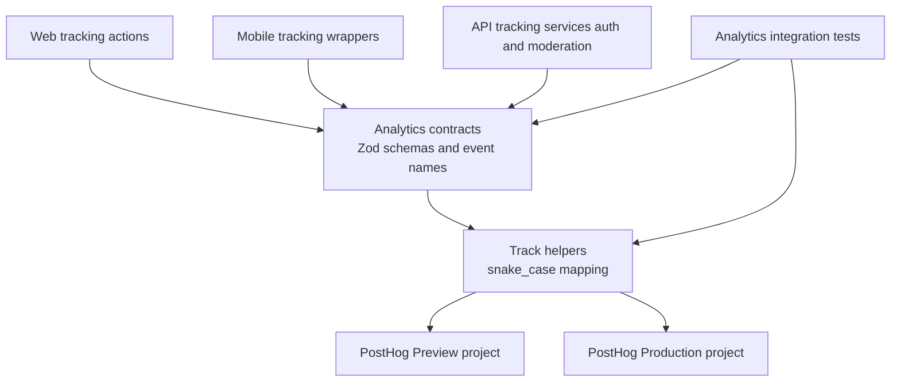
```mermaid
flowchart TD
  web["Web tracking actions"] --> contracts["Analytics contracts\nZod schemas and event names"]
  mobile["Mobile tracking wrappers"] --> contracts
  api_services["API tracking services auth and moderation"] --> contracts
  contracts --> wrappers["Track helpers\nsnake_case mapping"]
  wrappers --> ph_preview["PostHog Preview project"]
  wrappers --> ph_prod["PostHog Production project"]
  tests["Analytics integration tests"] --> contracts
  tests --> wrappers
```

## Step 9: Observability bootstrap with OpenTelemetry

User/business impact:

OpenTelemetry from process startup gives full-path visibility, enabling faster detection and
diagnosis when user-impacting issues occur. The business reduces downtime and MTTR with
standardized traces and metrics flowing to one observability backend.

Key takeaways:

1. Bootstrap order is the control point: OpenTelemetry starts before Nest app creation so startup
   and request paths are instrumented from the first tick.
2. Guardrails prevent noisy telemetry: missing `GRAFANA_OTLP_ENDPOINT`, `GRAFANA_INSTANCE_ID`, or
   `GRAFANA_API_KEY`, `NODE_ENV=test`, `OTEL_SDK_DISABLED=true`, or prior SDK init all no-op
   safely.
3. Root env loading is part of the local contract: the API now reads root `.env.local`, `.env.preview`
   / `.env.prod`, and `.env` before OTEL startup, so env changes require a full API restart.
   Hosted Vercel deployments do not read those repo files at runtime; they must be configured in
   Vercel project environment variables separately.
4. Exported identity matters: set a stable OpenTelemetry `service.name` so Grafana shows
   `couturecast-api` instead of `unknown_service:node`.
5. Vendor-neutral observability is explicit: W3C trace propagation + Node auto-instrumentations +
   OTLP exporters stream metrics/traces to Grafana with minimal app-level coupling.

Story/Task mapping:

- Story 0.7
- Task 4 (OpenTelemetry setup in NestJS)

Story reference:

- `_bmad-output/implementation-artifacts/0-7-configure-posthog-opentelemetry-and-grafana-cloud.md`

Cross-links:

- Step 7 carries the required OTLP credentials into CI and hosted environments.
- Step 10 consumes the traces and metrics emitted here.
- Step 11 layers structured logs on the same observability foundation.

Sequence to follow:

1. Load the OTLP credential and env-loading rules first.
2. Read instrumentation bootstrap before `main.ts` so startup order stays clear.
3. Verify the guardrails and tests before relying on hosted telemetry.

Task owner map:

- Story 0.7 Task 4 step 1 owner: define OTLP backend endpoint + auth resolution in `apps/api/src/instrumentation.ts`
- Story 0.7 Task 4 step 2 owner: create OTLP exporters for traces and metrics in `apps/api/src/instrumentation.ts`
- Story 0.7 Task 4 step 3 owner: enable instrumentation + W3C propagation in `apps/api/src/instrumentation.ts`
- Story 0.7 Task 4 step 4 owner: initialize the SDK before app bootstrap in `apps/api/src/instrumentation.ts`
- Step 9 bootstrap order owner: preserve pre-Nest startup ordering in `apps/api/src/main.ts`
- Step 9 env-loading owner: keep root env loading aligned with OTEL startup in `apps/api/src/load-env.ts`
- Step 9 verification owner: validate instrumentation and env-loading behavior in `apps/api/src/instrumentation.spec.ts` and `apps/api/src/load-env.spec.ts`

Tests that cover this step:

Bootstrap unit tests:

- [`apps/api/src/instrumentation.spec.ts`](../../apps/api/src/instrumentation.spec.ts):
  proves OTLP credential resolution, exporter URLs,
  diagnostics, stable resources, W3C propagation, and one-time startup behavior.
- [`apps/api/src/load-env.spec.ts`](../../apps/api/src/load-env.spec.ts):
  proves development, local-test, and production environment-file
  precedence before telemetry bootstrap.

Integration test:

- [`apps/api/integration/observability.integration.spec.ts`](../../apps/api/integration/observability.integration.spec.ts):
  proves an instrumented API exports an
  OTLP trace to the configured collector endpoint.

Architecture diagram:

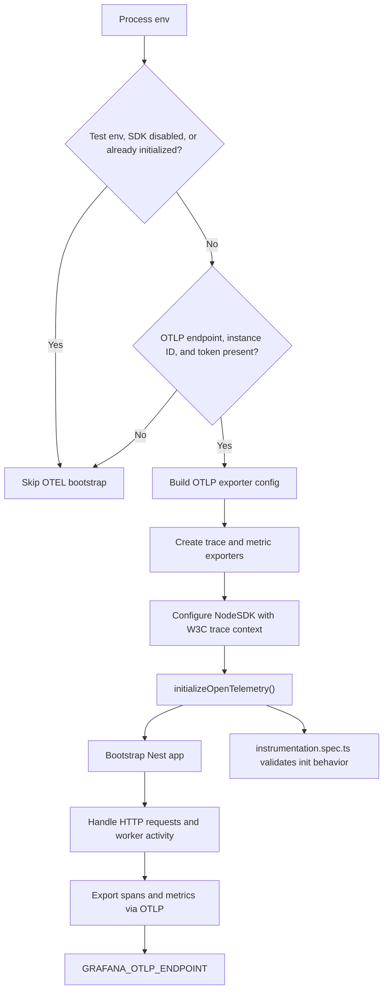
```mermaid
flowchart TD
  env["Process env"] --> skip{"Test env, SDK disabled, or already initialized?"}
  skip -- Yes --> noop["Skip OTEL bootstrap"]
  skip -- No --> creds{"OTLP endpoint, instance ID, and token present?"}
  creds -- No --> noop
  creds -- Yes --> cfg["Build OTLP exporter config"]
  cfg --> exporters["Create trace and metric exporters"]
  exporters --> sdk_cfg["Configure NodeSDK with W3C trace context"]
  sdk_cfg --> start["initializeOpenTelemetry()"]
  start --> nest["Bootstrap Nest app"]
  nest --> app["Handle HTTP requests and worker activity"]
  app --> otlp["Export spans and metrics via OTLP"]
  otlp --> grafana["GRAFANA_OTLP_ENDPOINT"]
  start --> tests["instrumentation.spec.ts validates init behavior"]
```

## Step 10: Grafana Cloud setup, telemetry inventory, and dashboard planning

User/business impact:

A working Grafana Cloud stack turns local OpenTelemetry instrumentation into an actual
observability workflow the team can use. The business gets faster debugging and safer rollout
decisions once traces and metrics can be verified in a shared hosted backend instead of only in
local code.

Key takeaways:

1. Grafana Cloud account setup is part of the implementation, not an external prerequisite:
   without a stack and OTLP credentials, the API's OpenTelemetry bootstrap safely no-ops.
2. This repository uses three exact placeholders for Grafana OTLP setup:
   `GRAFANA_OTLP_ENDPOINT`, `GRAFANA_INSTANCE_ID`, and `GRAFANA_API_KEY`.
3. Those same three names must be used across local root env files, GitHub Actions repository
   secrets, and Vercel API project environment variables so local, CI, Preview, and Production all
   read the same contract.
4. Grafana Cloud usually provisions the core stack data sources already, including Tempo
   (traces), Loki (logs), and Prometheus/Mimir (metrics), and it may also add other
   Grafana-managed sources such as alert history, profiles, or usage views. First-time setup
   should verify those built-in data sources before creating duplicates.
5. Dashboard work starts with telemetry inventory, not panel creation: use the Prometheus metric
   browser/selector to record what actually exists under prefixes like `http`, `nodejs`, and
   `v8js` before writing PromQL.
6. Honest dashboards are better than empty charts: if queue/cache/socket/database metrics are not
   instrumented yet, use a `Text` panel that says so instead of implying coverage that the repo
   does not have.
7. Manual Grafana verification is trace-first in this repo: confirm Tempo traces in Grafana, but
   do not treat Loki as a required success signal yet because log ingestion is not wired.

Story/Task mapping:

- Story 0.7
- Task 6 (Grafana Cloud account setup)
- Task 6.5 (telemetry inventory before dashboards)
- Task 7 (Grafana dashboards built from real metrics)

Story reference:

- `_bmad-output/implementation-artifacts/0-7-configure-posthog-opentelemetry-and-grafana-cloud.md`

Cross-links:

- Step 9 is the source of the telemetry this step inspects.
- Step 11 adds correlated logs to the same operational picture.
- Step 7 is where these checks can later become stricter automation.

Sequence to follow:

1. Provision or verify the Grafana stack and OTLP credentials.
2. Confirm traces and real metric families from the local verification path.
3. Import dashboards only after the inventory matches what the repo actually emits.

Task owner map:

- Step 10 step 1 owner: emit traces and metrics toward Grafana Cloud in `apps/api/src/instrumentation.ts`
- Step 10 step 2 owner: provide the local verification endpoint in `apps/api/src/controllers/health.controller.ts`
- Step 10 step 3 owner: define the first queue-related telemetry inventory targets in `apps/api/src/config/queues.ts` and `apps/api/src/admin/admin.service.ts`
- Step 10 step 4 owner: define the realtime telemetry inventory target in `apps/api/src/modules/gateway/connection-manager.service.ts`
- Step 10 step 5 owner: keep local and hosted Grafana credentials aligned in `.env.local`, `.env.preview`, and `.env.prod`
- Step 10 support owner: document the manual verification workflow in `_bmad-output/project-knowledge/observability.md`

Tests that cover this step:

Integration test:

- [`apps/api/integration/observability.integration.spec.ts`](../../apps/api/integration/observability.integration.spec.ts):
  proves that an instrumented API exports
  OTLP traces to the configured collector endpoint.

Hosted Grafana stack creation, credentials, Explore inspection, and dashboard construction remain
manual operational evidence. The integration suite does not assert the hosted dashboards.

Architecture diagram:

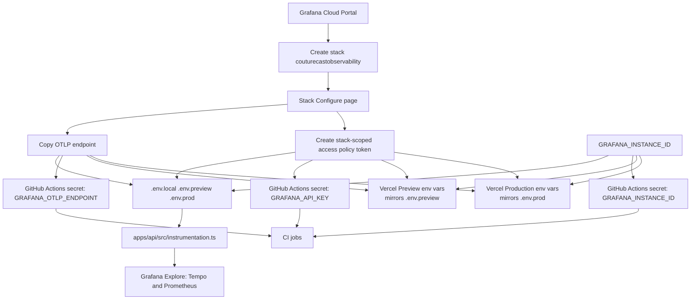
```mermaid
flowchart TD
  portal["Grafana Cloud Portal"] --> stack["Create stack couturecastobservability"]
  stack --> configure["Stack Configure page"]
  configure --> endpoint["Copy OTLP endpoint"]
  configure --> token["Create stack-scoped access policy token"]
  endpoint --> envfiles[".env.local .env.preview .env.prod"]
  id --> envfiles
  token --> envfiles
  endpoint --> gh["GitHub Actions secret: GRAFANA_OTLP_ENDPOINT"]
  id["GRAFANA_INSTANCE_ID"] --> gh2["GitHub Actions secret: GRAFANA_INSTANCE_ID"]
  token --> gh3["GitHub Actions secret: GRAFANA_API_KEY"]
  endpoint --> vercelPreview["Vercel Preview env vars<br/>mirrors .env.preview"]
  id --> vercelPreview
  token --> vercelPreview
  endpoint --> vercelProd["Vercel Production env vars<br/>mirrors .env.prod"]
  id --> vercelProd
  token --> vercelProd
  envfiles --> api["apps/api/src/instrumentation.ts"]
  gh --> ci["CI jobs"]
  gh2 --> ci
  gh3 --> ci
  api --> grafana["Grafana Explore: Tempo and Prometheus"]
```

## Step 11: API observability with structured logging

User/business impact:

Structured request logging makes production failures diagnosable without guesswork across API,
trace, and queue activity. The business gets faster incident response and stronger release
confidence because every request can be tied to a request ID, user context, feature area, and
OpenTelemetry trace.

Key takeaways:

1. Structured logs are part of the contract: API logs emit stable JSON fields including
   `timestamp`, `requestId`, `userId`, `feature`, `level`, and `message`.
2. Request context survives the full request lifecycle: middleware generates or reuses
   `x-request-id`, auth guards enrich `userId`, and later logs inherit that context automatically.
3. Trace correlation is built into the logger: active OpenTelemetry span IDs are attached so logs
   and traces line up in Grafana during debugging.
4. Environment policy matters: local defaults to `debug`, dev to `info`, and prod to `warn`,
   keeping signal-to-noise appropriate per environment.
5. Verification now has two layers: automated integration coverage proves OTLP trace export and
   `requestId` log correlation locally, while the manual Grafana check confirms Tempo visibility in
   the hosted stack. Loki remains optional until log ingestion is wired.

Story/Task mapping:

- Story 0.7
- Task 5 (Pino structured logging)
- Task 10 (observability tests)

Story reference:

- `_bmad-output/implementation-artifacts/0-7-configure-posthog-opentelemetry-and-grafana-cloud.md`

Cross-links:

- Step 9 provides the trace context this logger attaches to.
- Step 10 is where those correlated traces and logs are inspected operationally.
- Step 7 is where observability verification can become a stronger gate over time.

Sequence to follow:

1. Start with log-level policy and the base logger shape.
2. Trace request ID and AsyncLocalStorage propagation.
3. Finish with the middleware and tests that prove log/trace correlation.

Task owner map:

- Story 0.7 Task 5 step 1 owner: resolve environment-driven log level policy in `apps/api/src/logger/pino.config.ts`
- Story 0.7 Task 5 step 2 owner: inject request + trace context via the shared logger mixin in `apps/api/src/logger/pino.config.ts`
- Story 0.7 Task 5 step 3 owner: keep the base logger reusable for HTTP middleware and feature-specific child loggers in `apps/api/src/logger/pino.config.ts`
- Step 11 request-context owner: handle request ID and AsyncLocalStorage propagation in `apps/api/src/logger/request-context.ts`
- Step 11 HTTP-boundary owner: apply the shared logger contract in `apps/api/src/logger/request-logger.middleware.ts`
- Step 11 verification owner: validate logger behavior and observability integration in `apps/api/integration/observability.integration.spec.ts`, `apps/api/src/logger/pino.config.spec.ts`, `apps/api/src/logger/request-context.spec.ts`, `apps/api/src/logger/request-logger.middleware.spec.ts`, and `packages/api-client/src/testing/observability-assertions.ts`

Tests that cover this step:

Logging unit tests:

- [`apps/api/src/logger/pino.config.spec.ts`](../../apps/api/src/logger/pino.config.spec.ts):
  proves environment log levels, trace correlation,
  structured fields, and redaction of upload credentials, paths, URLs, and image data.
- [`apps/api/src/logger/request-context.spec.ts`](../../apps/api/src/logger/request-context.spec.ts):
  proves request ID reuse and generation, feature
  inference, authenticated identity precedence, and async-context isolation.
- [`apps/api/src/logger/request-logger.middleware.spec.ts`](../../apps/api/src/logger/request-logger.middleware.spec.ts):
  proves lifecycle logs, response request
  IDs, normalized upload paths, and removal of query values.

Integration test:

- [`apps/api/integration/observability.integration.spec.ts`](../../apps/api/integration/observability.integration.spec.ts):
  proves emitted request logs retain the
  request ID across a real API request.

Architecture diagram:

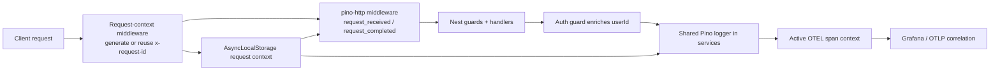
```mermaid
flowchart LR
  client["Client request"] --> reqid["Request-context middleware<br/>generate or reuse x-request-id"]
  reqid --> httplog["pino-http middleware<br/>request_received / request_completed"]
  httplog --> nest["Nest guards + handlers"]
  nest --> auth["Auth guard enriches userId"]
  auth --> svc["Shared Pino logger in services"]
  svc --> trace["Active OTEL span context"]
  trace --> grafana["Grafana / OTLP correlation"]

  reqid --> context["AsyncLocalStorage request context"]
  context --> httplog
  context --> svc
```

## Step 12: Cross-surface E2E confidence

User/business impact:

Cross-surface smoke E2E coverage catches critical web and mobile regressions before users hit them
in production. The business can release more frequently with less manual QA effort and clearer
pass/fail evidence.

Key takeaways:

1. Cross-surface execution is standardized at the root: Playwright (`test:pw-local`) and Maestro
   (`test:mobile:e2e`) run from shared workspace scripts.
2. Smoke coverage is purpose-built by surface: web validates API health, core hero rendering, and
   accessibility; Playwright API specs validate boundary-critical backend contracts such as auth and
   moderation; mobile validates Expo launch/connect and basic tab navigation flow.
3. Confidence comes from artifacts plus policy: Playwright HTML/trace outputs and Maestro
   screenshots/logs support fast triage, while web is PR-gated and mobile remains manual/local by
   default.
4. Expo Go orchestration is part of the test harness: `scripts/run-maestro.mjs` now resolves the
   active mobile target, waits for Expo Go on iOS when needed, and reuses a healthy Metro server
   before running Maestro.

Story/Task mapping:

- Story 0.13
- Task 1 (Playwright harness), Task 2 (Maestro harness), Task 4 (CI integration)

Story reference:

- `_bmad-output/implementation-artifacts/0-13-scaffold-cross-surface-e2e-automation.md`

Cross-links:

- Step 6 defines the realtime fallback behavior this step exercises.
- Step 7 connects these smoke flows to PR automation.

Sequence to follow:

1. Read the shared web and mobile harness config first.
2. Inspect the Playwright smoke specs and Maestro flow.
3. Trace how artifacts and CI wiring turn these runs into release confidence.

Task owner map:

- Step 12 step 1 owner: define shared Playwright harness behavior in `playwright/config/base.config.ts` and `playwright/config/local.config.ts`
- Step 12 step 2 owner: define the core web and API smoke flows in `playwright/tests/home.spec.ts`, `playwright/tests/web-health-sha.spec.ts`, `playwright/tests/api/auth-moderation-security.spec.ts`, and `playwright/tests/api/auth-signup-age-gate.spec.ts`
- Step 12 step 3 owner: define the mobile smoke flow in `maestro/sanity.yaml`
- Step 12 step 4 owner: orchestrate the mobile test harness in `scripts/run-maestro.mjs` and `scripts/start-mobile-server.sh`
- Step 12 step 5 owner: keep the mobile fallback runtime behavior aligned in `apps/mobile/src/realtime/mobile-fallback-controller.ts`
- Step 12 step 6 owner: connect web and mobile E2E execution to CI in `.github/workflows/pr-pw-e2e-local.yml` and `.github/workflows/pr-mobile-e2e.yml`

Tests that cover this step:

Playwright browser and API E2E tests:

- [`playwright/tests/home.spec.ts`](../../playwright/tests/home.spec.ts):
  proves the healthy Web hero renders and passes its accessibility
  scan.
- [`playwright/tests/web-health-sha.spec.ts`](../../playwright/tests/web-health-sha.spec.ts):
  proves deployed health and revision metadata.
- [`playwright/tests/api/auth-moderation-security.spec.ts`](../../playwright/tests/api/auth-moderation-security.spec.ts):
  proves missing-auth, role, actor-identity,
  and authorized-request boundaries for security-sensitive API routes.
- [`playwright/tests/api/auth-signup-age-gate.spec.ts`](../../playwright/tests/api/auth-signup-age-gate.spec.ts):
  proves the under-13 rejection, guardian-consent
  state, active-account state, and duplicate-email boundary over HTTP.

Mobile E2E test:

- [`maestro/sanity.yaml`](../../maestro/sanity.yaml):
  exercises the core mobile smoke path through the built application.

Current repo note:

- Playwright is intentionally doing two different jobs now: thin browser smoke for stable
  user-visible pages and thin API contract coverage for boundary-critical write paths. The signup
  age-gate check in `playwright/tests/api/auth-signup-age-gate.spec.ts` is the pattern to copy
  when the real risk is backend policy enforcement, not a long multi-page browser journey.
- Do not force browser E2E onto scheduled backend state changes. The guardian adulthood sweep in
  `apps/api/integration/guardian-emancipation.integration.spec.ts` is the better pattern when the
  risk sits at the Nest guard/controller boundary plus a cron-driven policy transition; without a
  deterministic trigger or injectable clock, browser coverage adds more flake than signal.
- Keep these API specs time-stable and isolated: use dynamic dates for age boundaries, unique IDs
  or emails for create flows, and skip production for tests that mutate real state.

Architecture diagram:

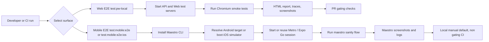
```mermaid
flowchart LR
  trigger["Developer or CI run"] --> pick{"Select surface"}
  pick --> web_e2e["Web E2E test:pw-local"]
  pick --> mobile_e2e["Mobile E2E test:mobile:e2e or test:mobile:e2e:ios"]
  web_e2e --> web_server["Start API and Web test servers"]
  web_server --> web_smoke["Run Chromium smoke tests"]
  web_smoke --> web_artifacts["HTML report, traces, screenshots"]
  web_artifacts --> web_gate["PR gating checks"]
  mobile_e2e --> maestro_install["Install Maestro CLI"]
  maestro_install --> target["Resolve Android target or boot iOS simulator"]
  target --> metro["Start or reuse Metro / Expo Go session"]
  metro --> mobile_smoke["Run maestro sanity flow"]
  mobile_smoke --> mobile_artifacts["Maestro screenshots and logs"]
  mobile_artifacts --> mobile_policy["Local manual default, non gating CI"]
```

**Overall goal for Steps 13-15**

This is the contract loop the repo is trying to enforce:

`Zod contracts -> inferred types + runtime validation + OpenAPI registration -> canonical spec -> live docs + generated SDK -> app usage`

CI is adjacent to that loop, not part of the authoring chain. Its job is to regenerate derived
artifacts, detect drift, and enforce breaking-change policy automatically.

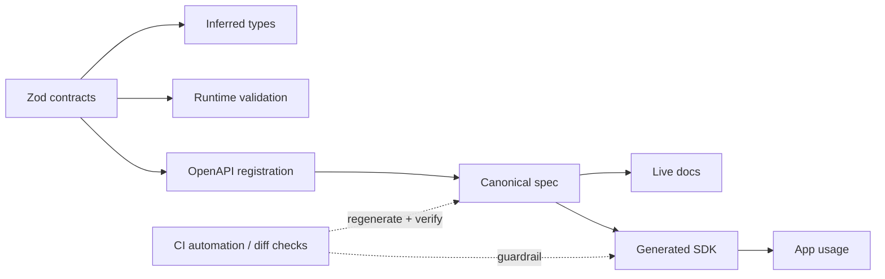
```mermaid
flowchart LR
  Z["Zod contracts"]
  T["Inferred types"]
  V["Runtime validation"]
  O["OpenAPI registration"]
  S["Canonical spec"]
  D["Live docs"]
  G["Generated SDK"]
  A["App usage"]
  C["CI automation / diff checks"]

  Z --> T
  Z --> V
  Z --> O
  O --> S
  S --> D
  S --> G
  G --> A
  C -. regenerate + verify .-> S
  C -. guardrail .-> G
```

## Step 13: Serve one canonical OpenAPI contract from the API boundary

User/business impact:

Frontend, mobile, CI, and human docs should all see the same contract. If the API serves one
canonical contract instead of authoring a second one at runtime, the business gets fewer invisible
drift bugs and a cleaner upgrade path for every client.

Key takeaways:

1. `/api/v1/openapi.json` and `/api/docs` should be two views of the same contract, not two
   independently authored specs.
2. The API app publishes the canonical contract that comes from shared Zod modules; it should not
   become a second contract authoring system.
3. `main.ts` owns when the OpenAPI surface is attached during bootstrap, and `openapi.ts` owns how
   the canonical contract is served or rendered.
4. Swagger UI can still be useful as a renderer, but Swagger decorators are not part of the
   permanent authoring model for public REST endpoints.
5. The right verification is parity testing: prove that the served `/api/v1/openapi.json` contract
   matches the canonical contract builder output.

Story/Task mapping:

- Story 0.9
- Task 4 (replace Swagger-authored live docs with the canonical contract output)
- Task 6 (add canonical contract parity tests for the live API)

Story reference:

- `_bmad-output/implementation-artifacts/0-9-initialize-openapi-spec-generation-and-api-client-sdk.md`

Cross-links:

- Step 2 clarifies why `apps/api/src/main.ts` is the API bootstrap boundary.
- Step 7 frames contract publication as part of the repo quality-gates story.
- Step 14 defines where contracts are authored.
- Step 15 shows how SDKs and apps consume the same published contract.

Sequence to follow:

1. Start from the canonical contract builder, not the runtime docs endpoint.
2. Trace how `main.ts` and `openapi.ts` publish JSON and rendered docs.
3. Verify parity between the published API contract and the canonical spec output.

Task owner map:

- Story 0.9 Task 1 step 3 owner: attach the OpenAPI publication seam during API bootstrap in `apps/api/src/main.ts`
- Story 0.9 Task 1 step 2 owner: serve or render the API-facing contract outputs in `apps/api/src/openapi.ts`
- Step 13 step 3 owner: assemble the canonical contract from shared Zod registrations in `packages/api-client/src/contracts/http/openapi.ts`
- Step 13 step 4 owner: write the canonical contract artifact to disk in `packages/api-client/scripts/generate-http-openapi.ts`
- Story 0.9 Task 1 step 5 owner: prove the published API contract surface in `apps/api/src/openapi.spec.ts`

Tests that cover this step:

API publication unit test:

- [`apps/api/src/openapi.spec.ts`](../../apps/api/src/openapi.spec.ts):
  proves the API serves the canonical contract-derived document,
  renders Swagger UI, and disables publication by default in production.

Integration test:

- [`apps/api/integration/http-contract-parity.integration.spec.ts`](../../apps/api/integration/http-contract-parity.integration.spec.ts):
  proves representative live API
  responses validate against the shared health, events, error, and user schemas.

Current repo note:

- Today `apps/api/src/openapi.ts` publishes the canonical document from
  `@couture/api-client/contracts/http` to both `/api/v1/openapi.json` and `/api/docs`, and
  `apps/api/src/openapi.spec.ts` proves the served JSON equals the canonical builder output.
  Swagger is still present only as the UI renderer, not as the contract authoring path for new
  REST endpoints.

Architecture diagram:

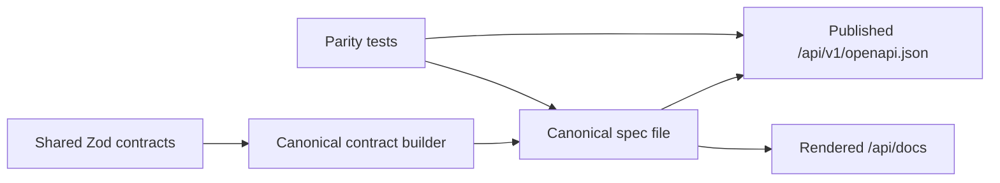
```mermaid
flowchart LR
  contracts["Shared Zod contracts"]
  builder["Canonical contract builder"]
  spec["Canonical spec file"]
  json["Published /api/v1/openapi.json"]
  docs["Rendered /api/docs"]
  parity["Parity tests"]

  contracts --> builder
  builder --> spec
  spec --> json
  spec --> docs
  parity --> spec
  parity --> json
```

## Step 14: Author public REST contracts in shared Zod modules

User/business impact:

If Couture Cast is meant to be a reference-quality foundation, public REST contracts cannot live in
controllers, generated clients, or one-off DTOs. They have to live in one shared contract layer
that every runtime trusts.

Key takeaways:

1. The permanent order is: define Zod contracts first, register them into OpenAPI second, generate
   the canonical document third, then derive SDKs and adapters from that stable output.
2. The shared contract package owns request schemas, response schemas, error envelopes, inferred
   TypeScript types, and OpenAPI metadata in one place.
3. Each contract slice should keep schema definition and path registration close together, so the
   module that owns an endpoint also owns its OpenAPI description.
4. Nest controllers and services should stay thin: parse inputs, shape outputs, and delegate real
   work. They are adapters, not contract authors.
5. The first migrated slice is only the proof point. The architecture is not finished until every
   public REST endpoint used by web/mobile follows the same model.
6. Keep pure business-policy helpers separate from the contract layer. Shared policy logic such as
   age calculation belongs in `packages/utils`; the contract layer still owns request/response
   schemas, inferred types, and OpenAPI metadata.

Story/Task mapping:

- Story 0.9
- Task 2 (establish the Zod-first contract foundation)
- Task 5 (finish migrating the remaining public REST slices)

Story reference:

- `_bmad-output/implementation-artifacts/0-9-initialize-openapi-spec-generation-and-api-client-sdk.md`

Cross-links:

- Step 2 explains why package boundaries matter before contract authoring starts.
- Step 13 shows how the API should publish the contract once it exists.
- Step 15 shows what happens downstream after the contract is validated.

Sequence to follow:

1. Start with reusable primitives before endpoint-specific schemas.
2. Register paths next to the schema definitions and compose them into one canonical builder.
3. Write and validate the canonical document before any downstream consumer uses it.
4. Keep Nest controllers and services thin by consuming the shared schemas instead of redefining them.

Task owner map:

- Story 0.9 Task 2 step 1 owner: define reusable HTTP primitives in `packages/api-client/src/contracts/http/common.ts`
- Story 0.9 Task 2 step 2 owner: define endpoint-specific health contracts in `packages/api-client/src/contracts/http/health.ts`
- Story 0.9 Task 2 step 3 owner: define endpoint-specific feature contracts in `packages/api-client/src/contracts/http/events.ts`
- Story 0.9 Task 2 step 4 owner: compose slice registrations into one canonical builder in `packages/api-client/src/contracts/http/openapi.ts`
- Story 0.9 Task 2 step 5 owner: write the canonical contract artifact to disk in `packages/api-client/scripts/generate-http-openapi.ts`
- Story 0.9 Task 2 step 6 owner: validate the canonical contract in `packages/api-client/testing/http-openapi.spec.ts`
- Story 0.9 Task 2 step 7 owner: consume the shared schemas from the API adapter boundary in `apps/api/src/contracts/http.ts`
- Story 0.9 Task 5 step 1 owner: define the shared auth REST contract slice in `packages/api-client/src/contracts/http/auth.ts`
- Story 0.9 Task 5 step 2 owner: define the shared moderation REST contract slice in `packages/api-client/src/contracts/http/moderation.ts`
- Story 0.9 Task 5 step 3 owner: define the first shared user REST contract slice in `packages/api-client/src/contracts/http/user.ts`
- Story 0.9 Task 5 step 4 owner: shape the DB-backed authenticated user profile through shared contracts in `apps/api/src/modules/user/user.service.ts`
- Story 0.9 Task 5 step 5 owner: expose the thin authenticated user REST adapter in `apps/api/src/modules/user/user.controller.ts`

Tests that cover this step:

Shared contract unit tests:

- [`packages/api-client/testing/http-openapi.spec.ts`](../../packages/api-client/testing/http-openapi.spec.ts):
  proves the contract builder emits valid
  OpenAPI and remains synchronized with the checked-in canonical document.
- [`packages/api-client/testing/contract-invariants-documented.spec.ts`](../../packages/api-client/testing/contract-invariants-documented.spec.ts):
  proves runtime-only Zod
  refinements are represented in published OpenAPI descriptions.
- [`packages/api-client/testing/auth-contract.spec.ts`](../../packages/api-client/testing/auth-contract.spec.ts):
  proves strict signup, age-gate, response
  union, and guardian-consent contract boundaries.

API adapter unit tests:

- [`apps/api/src/modules/user/user.controller.spec.ts`](../../apps/api/src/modules/user/user.controller.spec.ts):
  proves profile reads and preference updates
  delegate through validated controller inputs.
- [`apps/api/src/modules/user/user.service.spec.ts`](../../apps/api/src/modules/user/user.service.spec.ts):
  proves shared response shaping, missing-profile
  behavior, and atomic locale preference merging.

Current repo note:

- Health, polling, auth, moderation, and the first authenticated user profile slice now follow
  this model. The auth slice now includes signup age verification as well as guardian consent, with
  `packages/api-client/src/contracts/http/auth.ts` owning the public request/response contract while
  `packages/utils/src/age.ts` owns the reusable age-policy calculation. Guardian invitation and
  revoke flows now live in `packages/api-client/src/contracts/http/guardian.ts`, with the generated
  `packages/api-client/docs/http.openapi.json` publishing the matching `/api/v1/guardian/*`
  endpoints. That contract path is now backed by guardian-aware DB enforcement in
  `packages/db/prisma/migrations/20260420113000_add_guardian_shared_rls_policies/migration.sql`,
  including the Supabase-JWT-to-app-user bridge required by the repo's text `User.id` model, plus
  the revoke-specific follow-up in
  `packages/db/prisma/migrations/20260421090000_block_revoked_teens_from_self_access/migration.sql`
  and persona coverage in `packages/db/test/rls-policies.spec.ts`. The remaining work is to migrate
  later public REST endpoints as they land so every web/mobile-facing API starts in the same
  shared-contract path. Task 6 also reinforced that shared Zod modules are not enough on their
  own: parity tests and runtime guard checks were both needed to make revoked-consent behavior real
  at the Nest adapter boundary.

Architecture diagram:

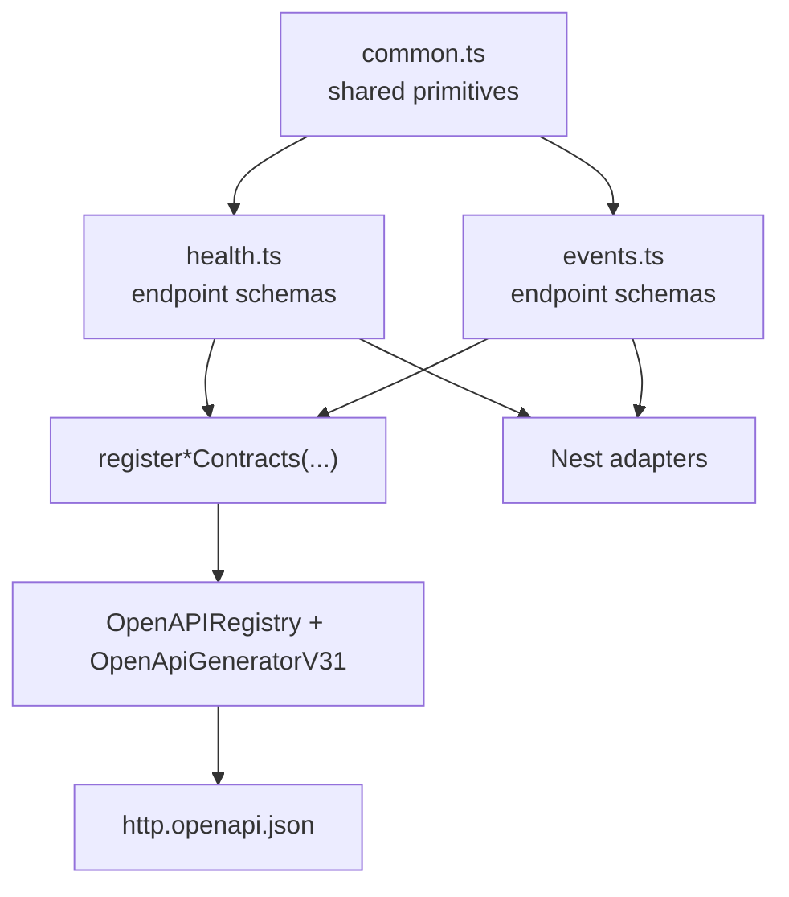
```mermaid
flowchart TD
  common["common.ts\nshared primitives"] --> health["health.ts\nendpoint schemas"]
  common --> events["events.ts\nendpoint schemas"]
  health --> registry["register*Contracts(...)"]
  events --> registry
  registry --> builder["OpenAPIRegistry + OpenApiGeneratorV31"]
  builder --> document["http.openapi.json"]
  health --> api["Nest adapters"]
  events --> api
```

## Step 15: Validate, generate, and consume the canonical contract

User/business impact:

A canonical contract only becomes valuable once every downstream consumer trusts it. Generated SDKs,
CI diff checks, and real app usage turn the contract from documentation into an enforced delivery
boundary.

Key takeaways:

1. SDK generation is a downstream operation. It starts only after the canonical contract has been
   generated and validated.
2. Root-level **npm scripts and the lockfile** should orchestrate contract regeneration (not “npm
   hoisting” of arbitrary packages) so developers and CI do not need a manually running API server.
3. Generated output is not the package's final public API. The repo should keep a small
   human-authored wrapper surface such as `createApiClient(...)`, then let each app wrap that
   again with runtime-local base URL and auth defaults.
4. CI breaking-change checks, live API parity tests, repo-level validation commands, and
   web/mobile runtime usage should all depend on the same canonical spec file and normalized
   generated surface.
5. The contract loop closes only when real app flows use the generated client instead of handwritten
   request typing.

Story/Task mapping:

- Story 0.9
- Task 3 (generate SDK from the canonical contract-derived spec and add wrapper exports)
- Task 6 (add contract parity tests)
- Task 7 (integrate the generated SDK into real web/mobile flows)
- Task 8 (implement canonical OpenAPI diff checks in CI)
- Task 9 (document versioning and regeneration workflow)

Story reference:

- `_bmad-output/implementation-artifacts/0-9-initialize-openapi-spec-generation-and-api-client-sdk.md`

Cross-links:

- Step 13 explains how the API publishes the contract.
- Step 14 explains how the contract is authored.
- Step 7 frames CI automation here as part of the repo quality-gates model.

Sequence to follow:

1. Keep canonical spec generation and validation green first.
2. Generate and normalize the SDK from the checked-in canonical spec, not from a live URL.
3. Consume the stable wrapper surface from app-local factories, typed helpers, and tests.
4. Re-run repo-level `typecheck`, `lint`, and `test` after regeneration so generator drift is
   caught where real consumers compile.
5. Use CI only to regenerate, detect drift, and enforce contract guardrails automatically.

Task owner map:

- Story 0.9 Task 3 step 1 owner: install and expose generator tooling from the repo root in `package.json` and `package-lock.json`
- Story 0.9 Task 3 step 2 owner: point the generator at the checked-in canonical spec in `openapitools.json`
- Story 0.9 Task 3 step 3 owner: normalize raw generated output and prune generator-only import noise in `packages/api-client/scripts/postprocess-generated-sdk.ts`
- Story 0.9 Task 3 step 4 owner: publish the stable human-authored client factory in `packages/api-client/src/client.ts`
- Step 15 step 4 owner: re-export the stable package surface in `packages/api-client/src/index.ts`
- Step 15 step 5 owner: validate the canonical spec before downstream consumption in `packages/api-client/testing/http-openapi.spec.ts`
- Story 0.9 Task 3 step 5 owner: prove the generated wrapper surface in `packages/api-client/testing/generated-client.spec.ts`
- Story 0.9 Task 7 step 1 owner: wrap the generated client for web runtime defaults in `apps/web/src/lib/api-client.ts`
- Story 0.9 Task 7 step 2 owner: wrap the generated client for mobile runtime defaults in `apps/mobile/src/lib/api-client.ts`
- Story 0.9 Task 7 step 3 owner: route web polling through the generated client in `apps/web/src/lib/events-client.ts`
- Story 0.9 Task 7 step 4 owner: consume generated polling in the web analytics runtime flow in `apps/web/src/app/components/analytics-event-actions.tsx`
- Story 0.9 Task 7 step 5 owner: route mobile API health checks through the generated client in `apps/mobile/src/lib/api-health.ts`
- Story 0.9 Task 7 step 6 owner: consume generated-client health state in the mobile tab runtime in `apps/mobile/app/(tabs)/two.tsx`

Tests that cover this step:

Contract generation unit tests:

- [`packages/api-client/testing/http-openapi.spec.ts`](../../packages/api-client/testing/http-openapi.spec.ts):
  proves canonical document validity and checked-in
  artifact synchronization.
- [`packages/api-client/testing/generated-client.spec.ts`](../../packages/api-client/testing/generated-client.spec.ts):
  proves the stable generated-client factory,
  configuration overrides, token handling, and authenticated generated methods.
- [`apps/api/src/openapi.spec.ts`](../../apps/api/src/openapi.spec.ts):
  proves the API-published document equals the canonical builder output.

Integration test:

- [`apps/api/integration/http-contract-parity.integration.spec.ts`](../../apps/api/integration/http-contract-parity.integration.spec.ts):
  proves representative live routes
  return bodies accepted by the shared schemas.

Web and Mobile client tests:

- [`apps/web/src/lib/api-client.test.ts`](../../apps/web/src/lib/api-client.test.ts):
  proves public-base-URL and same-origin Web client defaults.
- [`apps/mobile/src/lib/api-client.test.ts`](../../apps/mobile/src/lib/api-client.test.ts):
  proves Mobile base-URL selection, explicit overrides,
  bearer-token forwarding, and missing-configuration rejection.
- [`apps/mobile/src/lib/api-health.test.ts`](../../apps/mobile/src/lib/api-health.test.ts):
  proves Mobile health loading through the generated client.
- [`apps/mobile/src/screens/tab-two-screen.test.tsx`](../../apps/mobile/src/screens/tab-two-screen.test.tsx):
  proves the Settings surface renders generated-client
  health data and its unavailable fallback.
- [`apps/mobile/components/msw-network.test.tsx`](../../apps/mobile/components/msw-network.test.tsx):
  proves generated client consumers can use default and
  per-test MSW network handlers.

Current repo note:

- The repo now enforces a four-layer contract loop: package-level builder validation and checked-in
  spec sync in `packages/api-client/testing/http-openapi.spec.ts`, API-published OpenAPI parity in
  `apps/api/src/openapi.spec.ts`, representative API integration parity in
  `apps/api/integration/http-contract-parity.integration.spec.ts`, and thin live-endpoint smoke in
  `playwright/tests/api/*.spec.ts` including signup age-gate coverage. The SDK postprocess layer
  also strips unused generated model imports so repo-level `npm run typecheck`, `npm run lint`, and
  `npm run test` stay green after regeneration. Task 7 also landed app-local SDK factories plus
  real web/mobile runtime consumers, so the generated surface now reaches production-facing paths
  instead of package-only tests. The remaining work is CI diff enforcement and the
  versioning/regeneration documentation closeout.

Architecture diagram:

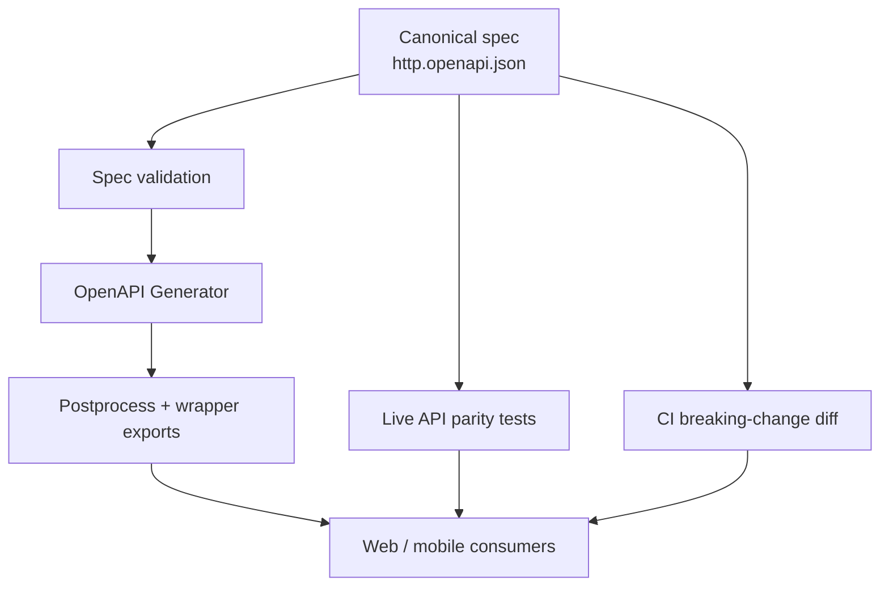
```mermaid
flowchart TD
  spec["Canonical spec\nhttp.openapi.json"] --> validate["Spec validation"]
  validate --> sdk["OpenAPI Generator"]
  sdk --> normalize["Postprocess + wrapper exports"]
  normalize --> apps["Web / mobile consumers"]
  spec --> parity["Live API parity tests"]
  spec --> diff["CI breaking-change diff"]
  parity --> apps
  diff --> apps
```

## Step 16: Weather API ingestion service and durable worker ingestion

User/business impact:

Ingesting real-time, accurate current and hourly weather conditions is the
foundation of CoutureCast's outfit intelligence. Implementing a modular
provider system with transactional persistence, bounded failover, and durable
worker scheduling keeps outfit guidance useful even when a weather provider is
slow, rate-limited, or temporarily unavailable.

Key takeaways:

1. A single unified interface (`IWeatherProvider`) decouples the core worker
   orchestrator from specific provider implementation quirks.
2. Provider responses must be parsed and strictly validated with Zod before
   normalization. Invalid payloads are rejected entirely to avoid partial
   or corrupted state persistence.
3. Coordinates must be rounded to a standard precision (e.g., 4 decimal
   places) at the provider boundary to ensure consistent cache and lookups,
   while raw coordinates and API keys must be scrubbed from errors and logs
   to preserve user privacy.
4. Normalized snapshots and exactly 48 hourly forecast segments are persisted
   transactionally with a location/provider/provider-update uniqueness key so
   repeated worker attempts are idempotent.
5. Provider retries are bounded in the ingestion service, not multiplied by
   BullMQ retries: three primary attempts for timeout/retryable HTTP failures,
   immediate failover on `429`, and one secondary attempt before fallback.
6. Latest-weather reads are a freshness union: `fresh`, `cached`, `stale`, or
   `unavailable`, with the exact 60-minute boundary and user-safe fallback
   messages.
7. Durable scheduling belongs to BullMQ 5 Job Schedulers in the standalone
   worker runtime; Vercel HTTP instances do not satisfy periodic ingestion.
8. The public read surface is contract-first: `GET /api/v1/weather/{locationKey}`
   returns the shared `{ data }` latest-weather union and the generated SDK exposes
   `WeatherApi`.
9. Operational weather telemetry belongs in OpenTelemetry/Grafana, not PostHog,
   and uses bounded provider/outcome/status attributes with no coordinates, raw
   payloads, provider keys, or user identifiers.
10. Provider-call budgeting is part of the operational design: at a 30-minute
    cadence each canonical target consumes up to 48 primary forecast calls per day
    before retry/failover.

Story/Task mapping:

- Story 1.1
- Task 1 (provider contracts, adapters, and configuration)
- Task 2 (normalized persistence model and shared fixtures)
- Task 3 (bounded provider orchestration and freshness fallback)
- Task 4 (durable scheduling, target fan-out, and real worker processor)
- Task 5 (canonical latest-weather read contract)
- Task 6 (privacy-safe operational telemetry)
- Task 7 (provider, persistence, scheduling, fallback, and telemetry proof)
- Task 8 (architecture and operational documentation)

Story reference:

- `_bmad-output/implementation-artifacts/1-1-weather-api-ingestion-service.md`

Cross-links:

- Step 3 frames weather snapshot and forecast segment database tables.
- Step 4 documents environment configuration loading.
- Step 5 details BullMQ worker concurrency and queuing defaults.
- Step 9 and Step 10 provide the OpenTelemetry/Grafana foundation that Task 6
  extends with weather-specific metrics and alerts.
- Step 15 explains the OpenAPI and generated SDK flow used by Task 5.

Sequence to follow:

1. Define clean interfaces and normalized data models in a provider-agnostic
   way.
2. Implement adapters for the primary (OpenWeather) and secondary (WeatherAPI)
   providers.
3. Handle vendor-specific unit normalization (e.g., wind speed in m/s) and
   time epoch parsing.
4. Persist validated normalized snapshots and all 48 hourly entries in one
   Prisma transaction.
5. Implement retry/failover and freshness fallback using injected providers,
   repository, clock, sleeper, logger, and meter.
6. Fan out canonical weather targets through BullMQ sweep and location jobs,
   using stable interval-bucketed job IDs.
7. Run the standalone worker runtime with `npm run start:workers:prod` in a
   non-serverless process group.
8. Author comprehensive test mock fixtures covering success, missing fields,
   429 rate limit, 500 server error, and malformed responses.
9. Verify behavior with robust unit tests that block live network access.
10. Publish the latest-weather read contract through the canonical OpenAPI
    registry before controller code, then regenerate checked-in SDK artifacts.
11. Wire weather telemetry through stable log event names and OpenTelemetry
    counters/histograms, then back it with Grafana panels and alerting.
12. Keep provider-call budgets and rollback procedures in the worker runbook.

Task owner map:

- Story 1.1 Task 1 step 1 owner: define `IWeatherProvider` and normalized weather
  target/forecast types in
  `apps/api/src/modules/weather/providers/weather-provider.interface.ts` and
  `apps/api/src/modules/weather/providers/weather.types.ts`
- Story 1.1 Task 1 step 2 owner: implement the primary OpenWeather adapter in
  `apps/api/src/modules/weather/providers/openweather.provider.ts`
- Story 1.1 Task 1 step 3 owner: implement the secondary WeatherAPI adapter in
  `apps/api/src/modules/weather/providers/weatherapi.provider.ts`
- Story 1.1 Task 1 step 4 owner: validate provider payloads and normalized forecasts in
  `apps/api/src/modules/weather/providers/weather.schemas.ts`
- Story 1.1 Task 2 step 1 owner: model normalized weather snapshots and forecast segments
  in `packages/db/prisma/schema.prisma`
- Story 1.1 Task 2 step 2 owner: backfill and constrain normalized weather persistence in
  `packages/db/prisma/migrations/20260707104000_normalize_weather_persistence/migration.sql`
- Story 1.1 Task 2 step 3 owner: keep shared weather factories aligned with the migrated
  persistence shape in `packages/testing/src/factories/weather.factory.ts`
- Story 1.1 Task 2 step 4 owner: persist normalized snapshots and segments transactionally
  in `apps/api/src/modules/weather/weather.repository.ts`
- Story 1.1 Task 3 step 1 owner: implement bounded provider retry and failover in
  `apps/api/src/modules/weather/weather-ingestion.service.ts`
- Story 1.1 Task 3 step 2 owner: classify latest-weather freshness and fallback responses
  in `apps/api/src/modules/weather/weather-query.service.ts`
- Story 1.1 Task 4 step 1 owner: load configured bootstrap ingestion targets in
  `apps/api/src/modules/weather/weather-target-source.ts`
- Story 1.1 Task 4 step 2 owner: coalesce targets and enqueue interval-bucketed location
  jobs in `apps/api/src/modules/weather/weather-processor.ts`
- Story 1.1 Task 4 step 3 owner: register the durable BullMQ weather sweep scheduler in
  `apps/api/src/modules/weather/weather-scheduler.ts`
- Story 1.1 Task 4 step 4 owner: wire the real weather worker processor and scheduler
  startup in `apps/api/src/workers/bootstrap.ts`
- Story 1.1 Task 4 step 5 owner: document the non-serverless weather worker runtime in
  `apps/api/README.md`
- Story 1.1 Task 5 step 1 owner: define the shared latest-weather HTTP contract in
  `packages/api-client/src/contracts/http/weather.ts`
- Story 1.1 Task 5 step 2 owner: register `GET /api/v1/weather/{locationKey}` in
  `packages/api-client/src/contracts/http/openapi.ts`
- Story 1.1 Task 5 step 3 owner: expose the authenticated weather read adapter in
  `apps/api/src/modules/weather/weather.controller.ts` and `weather.module.ts`
- Story 1.1 Task 6 step 1 owner: define privacy-safe weather metrics and log events in
  `apps/api/src/modules/weather/weather-telemetry.ts`
- Story 1.1 Task 6 step 2 owner: dashboard and alert evidence lives in
  `infra/grafana/dashboards/couturecast-weather-ingestion.json`
- Story 1.1 Task 7 step 1 owner: weather API integration proof lives in
  `apps/api/integration/weather.integration.spec.ts`

Tests that cover this step:

Shared contract and fixture unit tests:

- [`packages/api-client/testing/weather-contract.spec.ts`](../../packages/api-client/testing/weather-contract.spec.ts):
  proves the latest-weather success and
  freshness union plus authenticated OpenAPI route registration.
- [`packages/testing/test/weather.factory.spec.ts`](../../packages/testing/test/weather.factory.spec.ts):
  proves 48-hour fixture shape, caller-supplied
  segments, alert JSON, persistence, and cleanup registration.

Provider, service, repository, and worker unit tests:

- [`apps/api/src/modules/weather/providers/openweather.provider.spec.ts`](../../apps/api/src/modules/weather/providers/openweather.provider.spec.ts):
  proves normalization,
  validation, retry classifications, privacy-safe failures, and location matching for OpenWeather.
- [`apps/api/src/modules/weather/providers/weatherapi.provider.spec.ts`](../../apps/api/src/modules/weather/providers/weatherapi.provider.spec.ts):
  proves the same adapter
  boundaries for WeatherAPI, including missing and malformed forecast horizons.
- [`apps/api/src/modules/weather/providers/weather.config.spec.ts`](../../apps/api/src/modules/weather/providers/weather.config.spec.ts):
  proves typed provider settings,
  validated canonical targets, and safe defaults.
- [`apps/api/src/modules/weather/providers/weather-condition.mapper.spec.ts`](../../apps/api/src/modules/weather/providers/weather-condition.mapper.spec.ts):
  proves condition and
  severity normalization across provider payloads.
- [`apps/api/src/modules/weather/weather-ingestion.service.spec.ts`](../../apps/api/src/modules/weather/weather-ingestion.service.spec.ts):
  proves bounded primary retries,
  failover, cached fallback, abort handling, and privacy-safe logs and metrics.
- [`apps/api/src/modules/weather/weather.repository.spec.ts`](../../apps/api/src/modules/weather/weather.repository.spec.ts):
  proves transactional snapshot and
  segment persistence, idempotency, race recovery, public reads, and provider state.
- [`apps/api/src/modules/weather/weather-query.service.spec.ts`](../../apps/api/src/modules/weather/weather-query.service.spec.ts):
  proves fresh, cached, stale, and
  unavailable classifications at their time boundary.
- [`apps/api/src/modules/weather/weather-target-source.spec.ts`](../../apps/api/src/modules/weather/weather-target-source.spec.ts):
  proves validated targets,
  cross-source deduplication, and saved-primary-location discovery.
- [`apps/api/src/modules/weather/weather-processor.spec.ts`](../../apps/api/src/modules/weather/weather-processor.spec.ts):
  proves stable bucketed job IDs, target
  coalescing, location processing, durable alert dispatch, and enqueue failure handling.
- [`apps/api/src/modules/weather/weather-scheduler.spec.ts`](../../apps/api/src/modules/weather/weather-scheduler.spec.ts):
  proves durable weather refresh and alert
  outbox scheduler registration.
- [`apps/api/src/modules/weather/weather.controller.spec.ts`](../../apps/api/src/modules/weather/weather.controller.spec.ts):
  proves authentication, canonical success
  and fallback envelopes, and invalid location rejection.
- [`apps/api/src/modules/weather/weather-telemetry.spec.ts`](../../apps/api/src/modules/weather/weather-telemetry.spec.ts):
  proves bounded provider, ingestion,
  rate-limit, fallback, and snapshot-age metrics.

Real PostgreSQL and HTTP integration tests:

- [`apps/api/integration/weather.integration.spec.ts`](../../apps/api/integration/weather.integration.spec.ts):
  proves transactional persistence,
  idempotency, concurrent-race recovery, authentication, and canonical HTTP response validation.

Current repo note:

- Story 1.1 is implemented through Task 8. The provider adapters produce one
  normalized forecast response, the Prisma model stores canonical snapshots and
  hourly segments, the ingestion service owns provider retry/failover, the
  standalone worker owns durable scheduling and target fan-out, and the public
  latest-weather read contract is available through the canonical OpenAPI/SDK
  pipeline.
- Weather-specific telemetry now flows through stable Pino event names and
  OpenTelemetry metrics, with a Grafana weather-ingestion dashboard and a
  five-minute provider error-rate alert above 2%.

Architecture diagram:

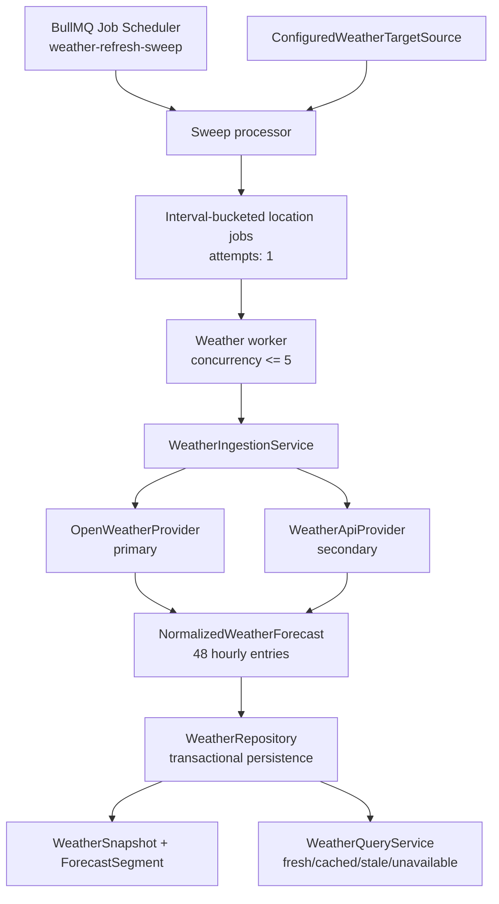
```mermaid
flowchart TD
  Scheduler["BullMQ Job Scheduler\nweather-refresh-sweep"] --> Sweep["Sweep processor"]
  Targets["ConfiguredWeatherTargetSource"] --> Sweep
  Sweep --> LocationJobs["Interval-bucketed location jobs\nattempts: 1"]
  LocationJobs --> Worker["Weather worker\nconcurrency <= 5"]

  Worker --> Ingestion["WeatherIngestionService"]
  Ingestion --> OpenWeather["OpenWeatherProvider\nprimary"]
  Ingestion --> WeatherApi["WeatherApiProvider\nsecondary"]
  OpenWeather --> Normalized["NormalizedWeatherForecast\n48 hourly entries"]
  WeatherApi --> Normalized
  Normalized --> Repository["WeatherRepository\ntransactional persistence"]
  Repository --> DB["WeatherSnapshot + ForecastSegment"]
  Repository --> Query["WeatherQueryService\nfresh/cached/stale/unavailable"]
```

## Step 17: Weather alert rules and notification pipeline

User/business impact:

Realtime and push weather alerts notify users immediately of severe weather or precipitation transitions so they can protect themselves and adjust their wardrobe choices. Quiet hours support preserves user trust and prevents alert fatigue, while duplicate suppression and transactional handoffs ensure reliable, spam-free notification delivery.

Key takeaways:

1. Alert rules (e.g. temperature delta, precipitation start, severe conditions) are stored in the database per-user and evaluated hourly after weather ingestion.
2. Ingestion-triggered alerts are written to a transactional outbox (`AlertDeliveryOutbox`) linked to `EventEnvelope` with channel `alert:weather`, ensuring atomicity before BullMQ fanout.
3. BullMQ `alert-fanout` workers process the delivery: checking user notification preferences and active realtime Socket.io sessions.
4. Active Socket.io realtime clients successfully receiving the alert (`realtime.published` is `true` via Redis relay channel `ALERT_WEATHER_RELAY_CHANNEL`) suppress subsequent push notifications to avoid double alerting.
5. Inactive or offline clients fall back to push notification delivery via Expo Push API (batched, retried, and pruned for invalid tokens), unless suppressed by user-configured local quiet hours or duplicate checks.
6. The entire alert rule, preference management, and event delivery pipeline is backed by a manual DB-level cascade delete constraint on user deletion, preventing silent database leaks.

Story/Task mapping:

- Story 1.3
- Task 1 (Prisma schema, migrations, and user preferences)
- Task 2 (Alerts API contracts and OpenAPI schemas)
- Task 3 (NestJS Alerts module API and RLS validation)
- Task 4 (Inconsistent database location field alignment)
- Task 5 (Weather alert processing and rule trigger engine)
- Task 6 (Quiet hours and push notification dispatch pipeline)
- Task 7 (Test coverage, worker integration, and validation)

Story reference:

- `_bmad-output/implementation-artifacts/1-3-alert-rules-notification-pipeline.md`

Cross-links:

- Step 3 frames the database schemas that alert rules and preferences extend.
- Step 5 defines BullMQ concurrency policies that the fanout queue uses.
- Step 6 details the Socket.io and Expo Push infrastructure that this pipeline orchestrates.
- Step 15 explains the OpenAPI generated SDK client flow.

Sequence to follow:

1. Add database models (`AlertRule`, `NotificationPreference`, `EventEnvelope`, `AlertDeliveryOutbox`, `AlertCooldownReservation`) with Cascade constraints and migrations.
2. Define Zod HTTP read/write contracts for alert rules and preferences, and generate the SDK.
3. Build the NestJS alerts API module, enforcing RLS queries filtered by authenticated `userId`.
4. Trigger rules evaluation engine (`WeatherAlertProcessingService`) concurrently inside transactions, reserving rolling 1-hour cooldowns.
5. Implement the BullMQ `alert-fanout` worker to process events: checking timezone-aware quiet hours start/end boundaries via cached DateTimeFormatters.
6. Relay real-time socket events over namespace `/alert:weather` using Redis Pub/Sub, and suppress push notifications when realtime is successfully published.
7. Implement automated cleanup for test databases in the testing packages, ensuring all temporary outbox and reservation tables are purged.

Task owner map:

- Story 1.3 Task 1 step 1 owner: define Prisma models for alert rules and preferences in `packages/db/prisma/schema.prisma`
- Story 1.3 Task 1 step 2 owner: write manual migration for cascade deletion on user delete in `packages/db/prisma/migrations/20260713180000_cascade_delete_user_event_envelopes/migration.sql`
- Story 1.3 Task 2 step 1 owner: declare alerts HTTP schemas and routes in `packages/api-client/src/contracts/http/alerts.ts`
- Story 1.3 Task 3 step 1 owner: implement user alerts controllers and RLS repository queries in `apps/api/src/modules/alerts/alerts.controller.ts` and `apps/api/src/modules/alerts/alerts.repository.ts`
- Story 1.3 Task 5 step 1 owner: evaluate temperature, precipitation, and severe alert rules in `apps/api/src/modules/alerts/weather-alert-evaluator.ts`
- Story 1.3 Task 5 step 2 owner: orchestrate weather alert processing and BullMQ dispatch in `apps/api/src/modules/alerts/weather-alert-processing.service.ts`
- Story 1.3 Task 6 step 1 owner: implement quiet-hours checks using cached formatters in `apps/api/src/modules/alerts/quiet-hours.ts`
- Story 1.3 Task 6 step 2 owner: execute realtime relay, push suppression, and Expo dispatch in `apps/api/src/modules/alerts/alert-fanout.processor.ts`
- Story 1.3 Task 6 step 3 owner: broadcast realtime updates over `/alert:weather` in `apps/api/src/modules/gateway/gateway.gateway.ts`
- Story 1.3 Task 7 step 1 owner: clean up event envelopes and alert tables on teardown in `packages/testing/src/cleanup.ts`
- Story 1.3 Task 7 step 2 owner: verify realtime push suppression and quiet hours boundaries in `apps/api/src/modules/alerts/alert-fanout.processor.spec.ts`

Tests that cover this step:

Database structure and security tests:

- [`packages/db/test/alert-schema.spec.ts`](../../packages/db/test/alert-schema.spec.ts):
  proves user-owned alert rule and preference models,
  constraints, opt-out storage, and self-only RLS migration shape.
- [`packages/db/test/alert-outbox-schema.spec.ts`](../../packages/db/test/alert-outbox-schema.spec.ts):
  proves durable queue handoff state, rolling cooldown
  reservations, and rule-specific database thresholds.
- [`packages/db/test/alert-delivery-security.spec.ts`](../../packages/db/test/alert-delivery-security.spec.ts):
  proves self-only push tokens, owned or global
  event reads, and worker-only cooldown reservations in migration SQL.

Shared contract and fixture unit tests:

- [`packages/api-client/testing/alerts-contract.spec.ts`](../../packages/api-client/testing/alerts-contract.spec.ts):
  proves strict alert rule and preference HTTP
  contracts plus canonical OpenAPI registration.
- [`packages/testing/test/alert.factory.spec.ts`](../../packages/testing/test/alert.factory.spec.ts):
  proves valid alert fixtures and persistence cleanup.

API pipeline unit and repository tests:

- [`apps/api/src/modules/alerts/weather-alert-evaluator.spec.ts`](../../apps/api/src/modules/alerts/weather-alert-evaluator.spec.ts):
  proves temperature, precipitation,
  severe-weather, change, and non-match rule evaluation.
- [`apps/api/src/modules/alerts/alerts.controller.spec.ts`](../../apps/api/src/modules/alerts/alerts.controller.spec.ts):
  proves authenticated, validated rule and
  preference controller flows.
- [`apps/api/src/modules/alerts/alerts.service.spec.ts`](../../apps/api/src/modules/alerts/alerts.service.spec.ts):
  proves rule and preference orchestration.
- [`apps/api/src/modules/alerts/alerts.repository.spec.ts`](../../apps/api/src/modules/alerts/alerts.repository.spec.ts):
  proves owner-scoped rule and preference
  persistence.
- [`apps/api/src/modules/alerts/quiet-hours.spec.ts`](../../apps/api/src/modules/alerts/quiet-hours.spec.ts):
  proves timezone-aware quiet-hour boundaries.
- [`apps/api/src/modules/alerts/weather-alert-processing.service.spec.ts`](../../apps/api/src/modules/alerts/weather-alert-processing.service.spec.ts):
  proves evaluation,
  transactional outbox creation, cooldown handling, and queue dispatch orchestration.
- [`apps/api/src/modules/alerts/weather-alert-processing.repository.spec.ts`](../../apps/api/src/modules/alerts/weather-alert-processing.repository.spec.ts):
  proves alert envelope,
  outbox, and cooldown persistence behavior.
- [`apps/api/src/modules/alerts/weather-alert-fanout.queue.spec.ts`](../../apps/api/src/modules/alerts/weather-alert-fanout.queue.spec.ts):
  proves stable fanout job identity
  and queue options.
- [`apps/api/src/modules/alerts/alert-fanout.processor.spec.ts`](../../apps/api/src/modules/alerts/alert-fanout.processor.spec.ts):
  proves realtime-first delivery, push
  suppression, quiet hours, and Expo fallback.
- [`apps/api/src/modules/alerts/alert-fanout.repository.spec.ts`](../../apps/api/src/modules/alerts/alert-fanout.repository.spec.ts):
  proves outbox claim and delivery-state
  persistence.
- [`apps/api/src/modules/alerts/redis-alert-realtime.publisher.spec.ts`](../../apps/api/src/modules/alerts/redis-alert-realtime.publisher.spec.ts):
  proves Redis publication and
  failure handling for the alert relay.
- [`apps/api/src/modules/gateway/alert-weather-relay.service.spec.ts`](../../apps/api/src/modules/gateway/alert-weather-relay.service.spec.ts):
  proves Redis messages are
  validated and relayed only to their target user.
- [`apps/api/src/modules/gateway/gateway.gateway.spec.ts`](../../apps/api/src/modules/gateway/gateway.gateway.spec.ts):
  proves the static alert namespace and
  server-owned user room delivery.
- [`apps/api/src/modules/notifications/notifications.test.ts`](../../apps/api/src/modules/notifications/notifications.test.ts):
  proves batching, retries, timeouts,
  mixed Expo tickets, and provider failures.
- [`apps/api/src/modules/notifications/push-token.repository.spec.ts`](../../apps/api/src/modules/notifications/push-token.repository.spec.ts):
  proves user token lookup and
  invalid-token removal.

Real PostgreSQL integration tests:

- [`apps/api/integration/weather-alert-cooldown.integration.spec.ts`](../../apps/api/integration/weather-alert-cooldown.integration.spec.ts):
  proves cross-hour suppression,
  atomic admission under races, and reservation rollback.
- [`apps/api/integration/alerts.integration.spec.ts`](../../apps/api/integration/alerts.integration.spec.ts):
  proves HTTP settings persistence, bearer-token
  ownership, cross-owner isolation, and transactional rule-update rollback against PostgreSQL.
- [`apps/api/integration/alert-pipeline-latency.integration.spec.ts`](../../apps/api/integration/alert-pipeline-latency.integration.spec.ts):
  proves the instrumented alert
  pipeline remains within its declared latency test boundary.

Current repo note:

- Realtime Socket.io connections are namespace-scoped to `/alert:weather`. Push notifications are suppressed with reason `realtime_active` if realtime publish resolves successfully.
- Database cleanups during tests explicitly purge `EventEnvelope`, `AlertDeliveryOutbox`, and `AlertCooldownReservation` to ensure no database state pollution between test runs.
- Mock token bypasses (like `test-token-` and `k6-`) are enabled only in local and Vercel Preview environments (`TEST_ENV=local` or `VERCEL_ENV=preview`). They are strictly disabled in production to prevent security vulnerabilities. Testing in production requires authenticating real registered user accounts against the live Supabase instance to retrieve valid JWT access tokens.

Architecture diagram:

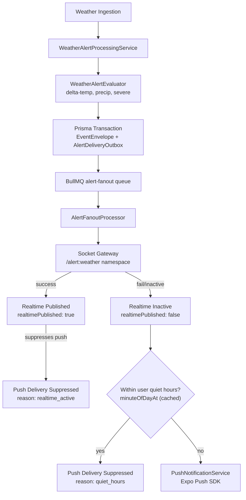
```mermaid
flowchart TD
  Ingest["Weather Ingestion"] --> Process["WeatherAlertProcessingService"]
  Process --> Evaluate["WeatherAlertEvaluator\ndelta-temp, precip, severe"]
  Evaluate --> Outbox["Prisma Transaction\nEventEnvelope + AlertDeliveryOutbox"]
  Outbox --> Queue["BullMQ alert-fanout queue"]

  Queue --> Worker["AlertFanoutProcessor"]
  Worker --> Realtime["Socket Gateway\n/alert:weather namespace"]
  Realtime -->|success| Active["Realtime Published\nrealtimePublished: true"]
  Active -->|suppresses push| PushSuppressed["Push Delivery Suppressed\nreason: realtime_active"]

  Realtime -->|fail/inactive| Offline["Realtime Inactive\nrealtimePublished: false"]
  Offline --> QuietHours{"Within user quiet hours?\nminuteOfDayAt (cached)"}
  QuietHours -->|yes| PushQuiet["Push Delivery Suppressed\nreason: quiet_hours"]
  QuietHours -->|no| Expo["PushNotificationService\nExpo Push SDK"]
```

## Step 18: Telemetry and audit baseline

User/business impact:

Type-safe telemetry tracking enables the product and business teams to evaluate user activation funnels (such as signup completion and outfit recommendation engagement) and operational reliability. Concurrently, a local Postgres telemetry table acts as a reliable audit log for key events with a scheduled 24-hour retention pruner to prevent database bloat, while Postgres Row-Level Security (RLS) restricts access so authenticated users can only view their own events and system-level processes can safely persist anonymous records.

Key takeaways:

1. Telemetry events (e.g. `profile_completed`, `first_outfit_generated`, `forecast_viewed`, `alert_sent`, `location_switched`, `api_error_occurred`) are defined in type-safe contracts inside `@couture/api-client`.
2. `TelemetryService` orchestrates dual-destination delivery: writing to the local Postgres `telemetry_events` table and forwarding events to PostHog via `AnalyticsClient`.
3. To prevent service blocking, database persistence and PostHog capture execute concurrently. If the database or PostHog fails, the errors are caught, logged, and isolated to prevent user request disruption.
4. Duplicate event tracking for first-outfit generation is prevented using an advisory-lock transaction (`pg_advisory_xact_lock` hash derived from `userId`) to coordinate concurrent recommendation triggers.
5. Ingestion of telemetry event inserts is secured by split RLS policies: authenticated users can insert only their own rows (matching their `user_id`), while a dedicated policy grants `service_role` insertion capabilities for anonymous/system telemetry (where `user_id` is null).
6. Local database events are automatically pruned by a Cron scheduler task running hourly to delete records older than 24 hours.

Story/Task mapping:

- Story 1.4
- Task 1 (Prisma schema, migrations, RLS, and service_role telemetry policies)
- Task 2 (Type-safe analytics event contracts and track wrappers)
- Task 3 (NestJS Telemetry service, retention scheduler, and error isolation)
- Task 4 (Feature module instrumentation: auth signup, weather views, alert dispatches, location switches)
- Task 5 (Global API exception filter route sanitization and error code mapping)
- Task 6 (Test suite coverage, mock protection, and RLS integration verification)

Story reference:

- `_bmad-output/implementation-artifacts/1-4-telemetry-audit-baseline.md`

Cross-links:

- Step 3 defines the database schema and RLS baseline that this model extends.
- Step 7 covers the CI/CD and test validation pipeline that tests this module.
- Step 8 establishes the shared analytics contracts that this telemetry service implements.
- Step 11 outlines the NestJS global filters and structured logging.

Sequence to follow:

1. Create the `TelemetryEvent` model in Prisma, run migrations, and define RLS policies (including `service_role` insert grants).
2. Register the Zod schemas and track wrappers in `packages/api-client` to guarantee type-safety.
3. Build the NestJS `TelemetryModule` and `TelemetryService` with concurrent database/PostHog execution.
4. Implement the cron pruner method to delete events older than 24 hours.
5. Instrument existing modules (auth, weather, location, alerts) and configure the global exception filter.
6. Verify RLS behavior and telemetry persistence using integration tests.

Task owner map:

- Story 1.4 Task 1 step 1 owner: define Prisma model for telemetry events in `packages/db/prisma/schema.prisma`
- Story 1.4 Task 1 step 2 owner: write manual migration for RLS policies and service role grants in `packages/db/prisma/migrations/20260714100000_add_telemetry_event/migration.sql`
- Story 1.4 Task 2 step 1 owner: declare telemetry event schemas and trackers in `packages/api-client/src/types/analytics-events.ts`
- Story 1.4 Task 3 step 1 owner: implement telemetry service database and PostHog concurrent delivery in `apps/api/src/modules/telemetry/telemetry.service.ts`
- Story 1.4 Task 3 step 2 owner: coordinate posthogService cleanup in worker shutdown routine in `apps/api/src/workers/bootstrap.ts`
- Story 1.4 Task 4 step 1 owner: integrate signup telemetry in `apps/api/src/modules/auth/auth.service.ts`
- Story 1.4 Task 5 step 1 owner: implement global api exception filter in `apps/api/src/filters/api-exception.filter.ts`
- Story 1.4 Task 6 step 1 owner: verify telemetry RLS policies for authenticated users and the service role in `packages/db/test/rls-policies.spec.ts`

Tests that cover this step:

Real PostgreSQL security integration tests:

- [`packages/db/test/rls-policies.spec.ts`](../../packages/db/test/rls-policies.spec.ts):
  proves authenticated-user and service-role telemetry
  policy boundaries against real PostgreSQL.
- [`packages/db/test/audit-log-immutability.spec.ts`](../../packages/db/test/audit-log-immutability.spec.ts):
  proves administrator-only audit reads and blocks
  direct update, delete, and truncate operations.

Shared telemetry contract unit test:

- [`packages/api-client/testing/analytics-events.spec.ts`](../../packages/api-client/testing/analytics-events.spec.ts):
  proves canonical telemetry event names,
  schemas, normalized properties, subject handling, and invalid-input rejection.

API unit tests:

- [`apps/api/src/modules/telemetry/telemetry.service.spec.ts`](../../apps/api/src/modules/telemetry/telemetry.service.spec.ts):
  proves independent database and PostHog
  delivery, strict event mapping, pseudonymous garment telemetry, and 24-hour pruning.
- [`apps/api/src/filters/api-exception.filter.spec.ts`](../../apps/api/src/filters/api-exception.filter.spec.ts):
  proves exception telemetry extraction,
  normalized routes, safe degradation, and continued HTTP responses during telemetry failure.

Current repo note:

- Telemetry calls run fire-and-forget in the main application flow, and are defensively wrapped to check if `telemetryPromise !== undefined` to prevent crash triggers in tests that use unmocked or stubbed service definitions.
- RLS policy checks explicitly verify that standard users cannot insert telemetry events under another user's ID or with a null user ID, while the backend `service_role` retains permissions to insert anonymous metrics.

Architecture diagram:

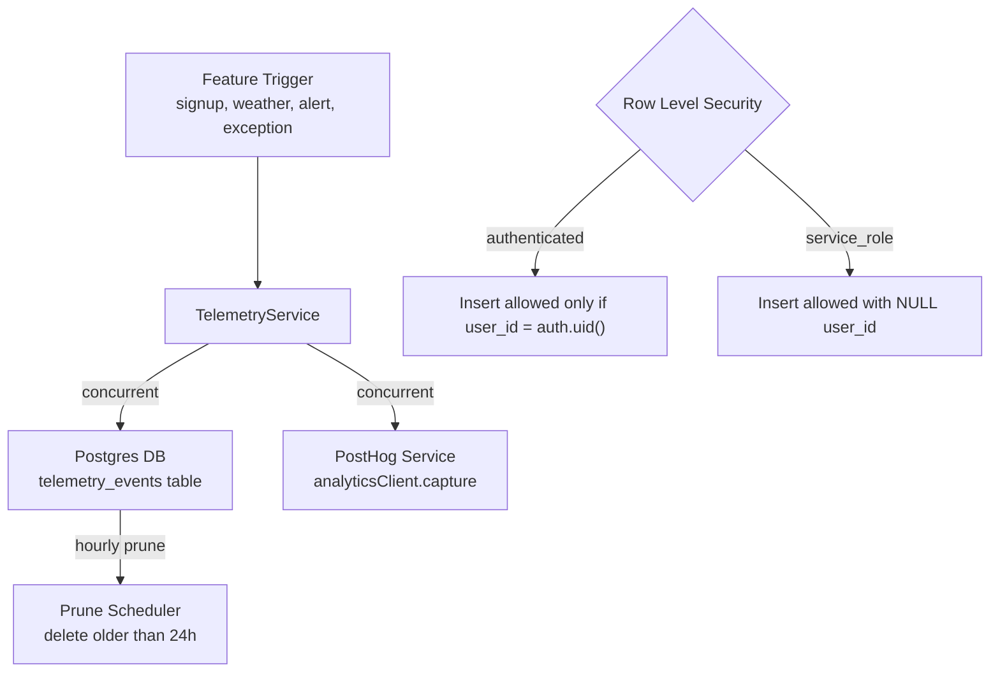
```mermaid
flowchart TD
  Trigger["Feature Trigger\nsignup, weather, alert, exception"] --> Service["TelemetryService"]
  Service -->|concurrent| DB["Postgres DB\ntelemetry_events table"]
  Service -->|concurrent| PH["PostHog Service\nanalyticsClient.capture"]
  DB -->|hourly prune| Pruner["Prune Scheduler\ndelete older than 24h"]
  RLS{"Row Level Security"} -->|authenticated| UserOnly["Insert allowed only if user_id = auth.uid()"]
  RLS -->|service_role| AnonAllowed["Insert allowed with NULL user_id"]
```

## Step 19: Scenario outfit generator

User/business impact:

The ritual endpoint delivers three personalized outfit cards (morning, midday, evening) per requested
day, each matched to forecast segment conditions, comfort preferences, and the user's real wardrobe.
For users this means actionable, context-aware outfit suggestions at every part of their day without
manual browsing. For the business it activates the core personalization loop that drives daily
engagement and differentiates Couture Cast from generic weather apps.

Key takeaways:

1. Shared Zod contract first: the `ritualResponseSchema` and `ritualQueryParamsSchema` are defined
   in `@couture/api-client` so web, mobile, and API all share the same validated shape; the SDK and
   OpenAPI spec are regenerated from those schemas.
2. Timezone-aware segment lookup: forecast hours are resolved in the location's IANA timezone
   (8 AM, 1 PM, 7 PM local) against the active weather snapshot, not UTC wall-clock time.
3. Layered garment matching: effective feels-like temperature is adjusted ±3°C for cold/warm runners
   before category rules (Outerwear / Top+Bottom+Shoes / Dress+Shoes) select from real garments, with
   type-safe fallback placeholders when the closet is empty.
4. Cache-before-generate: Redis is checked for `ritual:{userId}:{locationKey}` before any DB or
   algorithm work; a cache hit short-circuits everything and returns in sub-millisecond time.
5. Idempotent DB writes: `OutfitRecommendation` rows are looked up by `(user_id, forecast_segment_id,
scenario)` before creation; duplicate generation is prevented without a unique constraint.
6. Explicit type annotation over implicit inference: TypeScript's control-flow narrowing fails when a
   variable is reassigned inside a conditional block; declaring the outer variable as
   `OutfitRecommendation | null` and using a post-creation non-null assertion resolves the compiler
   confusion cleanly.
7. Strict ESLint in tests: `@typescript-eslint/no-unsafe-*` rules require mock objects to be cast
   through explicit intermediate types instead of `as any`; unbound-method warnings are suppressed by
   asserting the mock variable directly rather than accessing a property of a mocked service.

Story/Task mapping:

- Story 2.1
- Task 1 (Zod HTTP contract + SDK regeneration)
- Task 2 (RitualController + module scaffold)
- Task 3 (RitualService algorithm + DB persistence)
- Task 4 (Redis caching layer)
- Task 5 (unit + integration test suite)

Story reference:

- `_bmad-output/implementation-artifacts/2-1-scenario-outfit-generator.md`

Cross-links:

- Step 3 defines the `OutfitRecommendation` and `ForecastSegment` Prisma models consumed here.
- Step 4 explains the Supabase environment used by the Prisma client in this service.
- Step 5 explains the Redis/BullMQ infrastructure that backs the caching layer.
- Step 8 provides the api-client contract conventions this step follows.
- Step 17 shows how the `WeatherQueryService` and timezone lookups introduced there are reused here.
- Step 18 shows how the `TelemetryService` can be wired into the ritual response path in future stories.

Sequence to follow:

1. Read `packages/api-client/src/contracts/http/ritual.ts` for the shared Zod schemas and run
   `npm run generate:api-client` to see how the SDK is regenerated.
2. Open `apps/api/src/modules/personalization/ritual.controller.ts` to see how query params are
   parsed, Zod errors are mapped to `BadRequestException`, and the response is validated before
   returning.
3. Read `apps/api/src/modules/personalization/ritual.service.ts` method `getOrCreateRitual`:
   - cache check → weather snapshot → segment lookup → comfort prefs → garment fetch → algorithm →
     DB upsert → cache write.
4. Trace the garment-matching block to understand the category composition rules and the fallback
   placeholder path when the closet is empty.
5. Read `apps/api/src/modules/personalization/ritual.service.spec.ts` for unit coverage of the
   algorithm (cold/warm offsets, fallback, badge mapping, segment finder).
6. Read `apps/api/src/modules/personalization/ritual.controller.spec.ts` for integration coverage
   of auth guards, Redis cache lifecycle, and DB persistence.

Task owner map:

- Story 2.1 Task 1 step 1 owner: define Zod request/response schemas for the ritual endpoint in `packages/api-client/src/contracts/http/ritual.ts`
- Story 2.1 Task 1 step 2 owner: register the ritual contract in the api-client barrel in `packages/api-client/src/contracts/http/index.ts`
- Story 2.1 Task 1 step 3 owner: re-export ritual contracts into the API workspace in `apps/api/src/contracts/http.ts`
- Story 2.1 Task 2 step 1 owner: scaffold the NestJS personalization module in `apps/api/src/modules/personalization/personalization.module.ts`
- Story 2.1 Task 2 step 2 owner: implement the ritual GET route with Zod-validated query and response in `apps/api/src/modules/personalization/ritual.controller.ts`
- Story 2.1 Task 3 step 1 owner: implement the full recommendation algorithm with DB persistence in `apps/api/src/modules/personalization/ritual.service.ts`
- Story 2.1 Task 4 step 1 owner: add Redis cache check and write with 15-minute TTL to RitualService in `apps/api/src/modules/personalization/ritual.service.ts`
- Story 2.1 Task 5 step 1 owner: unit-test the algorithm, fallbacks, badges, and segment resolution in `apps/api/src/modules/personalization/ritual.service.spec.ts`
- Story 2.1 Task 5 step 2 owner: integration-test the controller, Redis lifecycle, and DB persistence in `apps/api/src/modules/personalization/ritual.controller.spec.ts`

Tests that cover this step:

Shared contract and fixture unit tests:

- [`packages/api-client/testing/ritual-contract.spec.ts`](../../packages/api-client/testing/ritual-contract.spec.ts):
  proves exactly one outfit per scenario,
  strict scenario and query values, badge bullet requirements, and optional capsule attribution.
- [`packages/testing/test/ritual.factory.spec.ts`](../../packages/testing/test/ritual.factory.spec.ts):
  proves scenario fixtures, reasoning badge shape,
  optional forecast links, persistence, and cleanup registration.

API unit tests:

- [`apps/api/src/modules/personalization/ritual.service.spec.ts`](../../apps/api/src/modules/personalization/ritual.service.spec.ts):
  proves timezone segment selection,
  garments, persistence races, cache behavior, degradation, and complete scenario generation.
- [`apps/api/src/modules/personalization/ritual.controller.spec.ts`](../../apps/api/src/modules/personalization/ritual.controller.spec.ts):
  proves authentication, validated
  queries, persisted recommendations, and Redis-backed controller behavior.

Playwright API E2E test:

- [`playwright/tests/api/ritual-daily-outfits.spec.ts`](../../playwright/tests/api/ritual-daily-outfits.spec.ts):
  proves unauthenticated rejection, canonical
  three-scenario responses, and the optional location query over HTTP.

Pact contract tests:

- [`pact/http/consumer/mobile-api-client.pacttest.ts`](../../pact/http/consumer/mobile-api-client.pacttest.ts):
  proves the Mobile consumer expects the daily
  Ritual interaction from its generated client.
- [`pact/http/consumer/web-api-client.pacttest.ts`](../../pact/http/consumer/web-api-client.pacttest.ts):
  proves the Web consumer expects the same Ritual
  interaction.
- [`pact/http/provider/api-provider.pacttest.ts`](../../pact/http/provider/api-provider.pacttest.ts):
  replays the generated consumer Pacts against the
  provider controller boundary and its configured provider states.

Performance test:

- [`k6/tests/couture-api-baseline.k6test.ts`](../../k6/tests/couture-api-baseline.k6test.ts):
  exercises cold and cached Ritual reads, asserts three
  outfits with reasoning and weather data, and applies environment-adjusted latency thresholds.

Current repo note:

- The `ritual.controller.ts` uses `RitualQueryParams` (imported from the shared Zod contract) as the
  explicit type for `parsedQuery` instead of `any`, satisfying `@typescript-eslint/no-unsafe-*` rules
  while still allowing `ritualQueryParamsSchema.parse(query)` to infer the shape at runtime.
- `GarmentItem` is imported from `@prisma/client` and used as `GarmentItem | null` for `latestGarment`
  in the cache-freshness check, removing the last `any` in the service.
- The `outfitRecommendationCreateMock` in the controller spec uses an explicit intermediate type cast
  (not `as any`) to access `.user.connect?.id` and `.forecast_segment?.connect?.id`, keeping the mock
  both type-safe and lint-clean.
- `npm run build` must be run at least once per session before `npm run lint` so that `eslint-plugin-import`
  can resolve the generated declaration files (e.g. `socket-events.d.ts`) in `packages/api-client/dist`.

Architecture diagram:

```mermaid
flowchart TD
  Client["GET /api/v1/ritual?locationId=..."] --> Controller["RitualController\n@UseGuards RequestAuthGuard"]
  Controller --> Service["RitualService\ngetOrCreateRitual(userId, locationId?)"]

  Service --> Redis{{"Redis\nritual:{userId}:{locationKey}"}}
  Redis -->|hit| Response["Cached RitualResponse"]
  Redis -->|miss| WeatherQ["WeatherQueryService\ngetLatestWeather(locationKey)"]

  WeatherQ --> Segments["Timezone-aware segment lookup\n8AM / 1PM / 7PM local"]
  Segments --> Comfort["ComfortPreferences\nruns_cold_warm ±3°C"]
  Comfort --> Garments["GarmentItem fetch\n(real closet or fallback placeholders)"]
  Garments --> Algo["Category matching\nOuterwear / Top+Bottom+Shoes / Dress+Shoes"]
  Algo --> Badges["Reasoning badges\n+ comfort notes"]
  Badges --> DB[("OutfitRecommendation\nDB upsert per segment+scenario")]
  DB --> Cache["Redis write\nTTL 900s"]
  Cache --> Response
```

## Step 20: Comfort calibration settings

User/business impact:

Allows users who "run cold or warm" to fine-tune their comfort preferences. For the business, this improves suggestion quality, increases customer satisfaction, and ensures the recommendation engine adapts dynamically to personalized user comfort parameters.

Key takeaways:

1. Shared Zod contract first: define all preferences enums (`runsColdWarm`, `windTolerance`, `precipPreparedness`) in `packages/api-client/src/contracts/http/comfort.ts` to ensure consistency.
2. Chunk-based Redis invalidation: clear caches safely using scan cursor and chunk delete to prevent blocking Redis threads in multi-tenant environments.
3. Comfort-aware staleness tracking: the recommendation engine tracks comfort preference update timestamps (`ComfortPreferences.updated_at`) to force database regeneration and override cached recommendations.

Story/Task mapping:

- Story 2.2
- Task 1 (Shared Zod HTTP Contract for Comfort Preferences)
- Task 2 (Comfort Preferences Controller and Service)
- Task 3 (Unit and Integration Test Verification)

Story reference:

- `_bmad-output/implementation-artifacts/2-2-comfort-calibration-settings.md`

Cross-links:

- Step 19 introduces the base daily outfit recommendation and caching mechanism.
- Step 21 maps these comfort parameters to reasoning explanation triggers.

Sequence to follow:

1. Open `packages/api-client/src/contracts/http/comfort.ts` to inspect the preferences schema enums and route registrations.
2. Read `apps/api/src/modules/personalization/comfort.service.ts` to see how settings are upserted or defaulted.
3. Read the `invalidateUserCache` method in `apps/api/src/modules/personalization/ritual.service.ts` to trace the Redis SCAN iteration.
4. Read `apps/api/src/modules/personalization/comfort.controller.ts` to see input validation and response parsing.
5. Review tests in `apps/api/src/modules/personalization/comfort.service.spec.ts` and `comfort.controller.spec.ts`.

Task owner map:

- Story 2.2 Task 1 step 1 owner: define Zod schemas and request/response contracts for comfort preferences in `packages/api-client/src/contracts/http/comfort.ts`
- Story 2.2 Task 2 step 1 owner: implement ComfortService persistence and cache invalidation in `apps/api/src/modules/personalization/comfort.service.ts`
- Story 2.2 Task 2 step 2 owner: implement ComfortController route handlers in `apps/api/src/modules/personalization/comfort.controller.ts`
- Story 2.2 Task 2 step 3 owner: implement chunk-based Redis key invalidation in `apps/api/src/modules/personalization/ritual.service.ts`
- Story 2.2 Task 3 step 1 owner: unit-test default fallbacks, upserts, and cache invalidation in `apps/api/src/modules/personalization/comfort.service.spec.ts`
- Story 2.2 Task 3 step 2 owner: integration-test controller endpoints and validation boundaries in `apps/api/src/modules/personalization/comfort.controller.spec.ts`

Tests that cover this step:

API unit tests:

- [`apps/api/src/modules/personalization/comfort.service.spec.ts`](../../apps/api/src/modules/personalization/comfort.service.spec.ts):
  proves default preferences, stored
  value mapping, upsert, and Ritual cache invalidation.
- [`apps/api/src/modules/personalization/comfort.controller.spec.ts`](../../apps/api/src/modules/personalization/comfort.controller.spec.ts):
  proves authentication, request
  validation, defaults, existing values, updates, and cache invalidation delegation.
- [`apps/api/src/modules/personalization/ritual.service.spec.ts`](../../apps/api/src/modules/personalization/ritual.service.spec.ts):
  proves hot and cold calibration,
  wind tolerance, precipitation preparedness, and preference-driven cache invalidation.

Playwright API E2E test:

- [`playwright/tests/api/comfort-preferences.spec.ts`](../../playwright/tests/api/comfort-preferences.spec.ts):
  proves unauthenticated rejection and the comfort
  preference read and update lifecycle over HTTP.

Pact contract tests:

- [`pact/http/consumer/mobile-api-client.pacttest.ts`](../../pact/http/consumer/mobile-api-client.pacttest.ts):
  proves the Mobile consumer's comfort preference
  read and update interactions.
- [`pact/http/consumer/web-api-client.pacttest.ts`](../../pact/http/consumer/web-api-client.pacttest.ts):
  proves the Web consumer's matching interactions.
- [`pact/http/provider/api-provider.pacttest.ts`](../../pact/http/provider/api-provider.pacttest.ts):
  replays those generated Pacts against the provider
  controller boundary and configured provider states.

Performance test:

- [`k6/tests/couture-api-baseline.k6test.ts`](../../k6/tests/couture-api-baseline.k6test.ts):
  exercises default comfort reads and updated preference
  writes with environment-adjusted latency thresholds.

## Step 21: Reasoning badges and explanations

User/business impact:

Gives users a clear, localized explanation of why recommendations are suggested, building transparency and trust in the platform. The business drives ritual engagement and retention by showing user-centric justification for suggested outfits.

Key takeaways:

1. Dynamic bullet rationale: reasoning badges generate dynamic explanatory bullet points interpolating actual conditions against user settings thresholds.
2. Type-safe mock factories and seeds: update testing factories and seed structures synchronously to prevent database validation failures.
3. Pact consumer-provider alignment: verification of consumer contract expectations against provider mock states for complex array response contracts.

Story/Task mapping:

- Story 2.3
- Task 1 (Shared Zod Http Contract Update)
- Task 2 (API Personalization Module & Seed Updates)
- Task 3 (Pact Consumer & Provider Interaction Verification)
- Task 4 (Test Suite Validation & Verification)

Story reference:

- `_bmad-output/implementation-artifacts/2-3-reasoning-badges-explanations.md`

Cross-links:

- Step 19 introduces the outfit generator service.
- Step 20 sets up the user comfort calibration thresholds.

Sequence to follow:

1. Open `packages/api-client/src/contracts/http/ritual.ts` and view the updated `reasoningBadges` property schema.
2. Read the badge evaluation rules in `apps/api/src/modules/personalization/ritual.service.ts` to see dynamic bullet string generation.
3. Read the mock factory in `packages/testing/src/factories/ritual.factory.ts` and seed script in `packages/db/prisma/seeds/rituals.ts`.
4. Inspect consumer/provider mock expectations in `pact/http/consumer/api-contract-interactions.ts` and `pact/http/provider/provider-helper.ts`.
5. Trace unit assertions verifying bullet rationales in `apps/api/src/modules/personalization/ritual.service.spec.ts`.

Task owner map:

- Story 2.3 Task 1 step 1 owner: update reasoningBadges property in the HTTP contracts schema in `packages/api-client/src/contracts/http/ritual.ts`
- Story 2.3 Task 2 step 1 owner: refactor dynamic badge generation and interpolation in `apps/api/src/modules/personalization/ritual.service.ts`
- Story 2.3 Task 2 step 2 owner: update reasoning badges test factory schema in `packages/testing/src/factories/ritual.factory.ts`
- Story 2.3 Task 2 step 3 owner: update database seeding structures in `packages/db/prisma/seeds/rituals.ts`
- Story 2.3 Task 3 step 1 owner: update consumer contract pact expectations in `pact/http/consumer/api-contract-interactions.ts`
- Story 2.3 Task 3 step 2 owner: update provider mock responses in `pact/http/provider/provider-helper.ts`
- Story 2.3 Task 4 step 1 owner: test badge keys, labels, and bullet interpolation rules in `apps/api/src/modules/personalization/ritual.service.spec.ts`

Tests that cover this step:

Shared contract and fixture unit tests:

- [`packages/api-client/testing/ritual-contract.spec.ts`](../../packages/api-client/testing/ritual-contract.spec.ts):
  proves each reasoning badge has at least one
  bullet and rejects malformed scenario collections.
- [`packages/testing/test/ritual.factory.spec.ts`](../../packages/testing/test/ritual.factory.spec.ts):
  proves fixture badges match the UI-facing key,
  label, and bullet shape.

API unit test:

- [`apps/api/src/modules/personalization/ritual.service.spec.ts`](../../apps/api/src/modules/personalization/ritual.service.spec.ts):
  proves badge mapping, dynamic labels,
  interpolation, fallback keys, and integer-safe wind and precipitation copy.

Mobile component test:

- [`apps/mobile/src/screens/hero-experience.test.tsx`](../../apps/mobile/src/screens/hero-experience.test.tsx):
  proves the recommendation card renders a
  reasoning badge in the loaded hero state.

Playwright API E2E test:

- [`playwright/tests/api/ritual-daily-outfits.spec.ts`](../../playwright/tests/api/ritual-daily-outfits.spec.ts):
  proves every returned outfit carries
  structured badge keys, labels, and non-empty bullet arrays over HTTP.

Pact contract tests:

- [`pact/http/consumer/mobile-api-client.pacttest.ts`](../../pact/http/consumer/mobile-api-client.pacttest.ts):
  pins Ritual response badge keys, labels, and bullets in Mobile consumer expectations.
- [`pact/http/consumer/web-api-client.pacttest.ts`](../../pact/http/consumer/web-api-client.pacttest.ts):
  pins Ritual response badge keys, labels, and bullets in Web consumer expectations.
- [`pact/http/provider/api-provider.pacttest.ts`](../../pact/http/provider/api-provider.pacttest.ts):
  replays those expectations against the provider
  controller boundary and configured Ritual state.

Performance test:

- [`k6/tests/couture-api-baseline.k6test.ts`](../../k6/tests/couture-api-baseline.k6test.ts):
  asserts a generated Ritual has at least one reasoning
  badge while exercising the environment-adjusted Ritual latency threshold.

## Step 22: Localization infrastructure and quality gates

User/business impact:

Allows CoutureCast to expand across multiple regions (Turkish, German, Italian, Portuguese) with localized language resources, currency settings, and regional measurement metrics. The business gains absolute global scalability and avoids broken layouts, missing dictionary entries, or translation drifts by enforcing rigorous automated quality checks.

Key takeaways:

1. Multi-locale formatting engine: Dynamic locales and fallback rules mapped in frontend i18n configurations and currency/temperature formatting libraries.
2. Typo-safe and complete dictionary assertions: Programmatic unit tests validating key parity and replacement variable placeholders ({feelsLike}) across all supported languages.
3. Realtime browser layout overflow verification: Headless browser integration tests asserting scroll width matches view boundaries to catch text-overflow or layout breakage automatically on CI/CD PR checks.
4. Contextual contract headers: Pact HTTP consumer/provider integrations ensuring locale selection header (Accept-Language) propagates correctly from Expo to NestJS.

Story/Task mapping:

- Story 3.2
- Task 1 (Client i18n framework & Translation Catalogs)
- Task 2 (Dynamic unit, currency formatting, and layout assertions)
- Task 3 (Backend API interceptors, dictionaries, and contract checks)
- Task 4 (Quality gates, unit validations, and verification checklists)

Story reference:

- `_bmad-output/implementation-artifacts/3-2-localization-infrastructure.md`

Cross-links:

- Step 19 introduces the outfit recommendations service.
- Step 20 defines comfort preferences settings.

Sequence to follow:

1. Review translation keys registration inside `apps/mobile/src/lib/i18n.ts` and language assets.
2. Inspect dynamic unit formatter logic and test suites in `apps/mobile/src/lib/formatters.ts` and `apps/mobile/src/lib/formatters.test.ts`.
3. Look at translation parity and placeholder replacement verification test suite in `apps/api/src/modules/personalization/ritual.service.spec.ts`.
4. Inspect the custom headless browser layout testing in `apps/mobile/src/screens/tab-two-screen.test.tsx` verifying scroll boundaries across all locales.
5. Check consumer and provider Pact validation rules in `pact/http/consumer/api-contract-interactions.ts` and `pact/http/provider/provider-helper.ts`.

Task owner map:

- Step 22 step 1 owner: define language resources and system defaults in `apps/mobile/src/lib/i18n.ts`
- Step 22 step 2 owner: implement locale-aware currency and temperature formatting in `apps/mobile/src/lib/formatters.ts`
- Step 22 step 3 owner: define localized comfort notes and intercept headers in `apps/api/src/modules/personalization/ritual.service.ts`
- Step 22 step 4 owner: verify translation key parity and placeholder replacements in `apps/api/src/modules/personalization/ritual.service.spec.ts`
- Step 22 step 5 owner: check Accept-Language header propagation in Pact consumer tests in `pact/http/consumer/api-contract-interactions.ts`
- Step 22 step 6 owner: mock localized database state response in Pact provider tests in `pact/http/provider/provider-helper.ts`
- Step 22 step 7 owner: verify Settings screen layout boundaries in headless Chromium in `apps/mobile/src/screens/tab-two-screen.test.tsx`

Tests that cover this step:

Shared and API unit tests:

- [`packages/api-client/testing/localization-contract.spec.ts`](../../packages/api-client/testing/localization-contract.spec.ts):
  proves supported locale values,
  normalization, weighted `Accept-Language` negotiation, and explicit Ritual locale overrides.
- [`apps/api/src/modules/personalization/ritual.service.spec.ts`](../../apps/api/src/modules/personalization/ritual.service.spec.ts):
  proves locale precedence, localized
  notes and badges, cache isolation, translation-key parity, and placeholder parity.
- [`apps/api/src/modules/personalization/ritual.controller.spec.ts`](../../apps/api/src/modules/personalization/ritual.controller.spec.ts):
  proves explicit locale handling,
  localized cache isolation, and unsupported-locale rejection.
- [`apps/api/src/modules/user/user.controller.spec.ts`](../../apps/api/src/modules/user/user.controller.spec.ts):
  proves valid locale updates and unsupported
  locale rejection.
- [`apps/api/src/modules/user/user.service.spec.ts`](../../apps/api/src/modules/user/user.service.spec.ts):
  proves locale merging preserves unrelated profile
  preferences.

Mobile client and component tests:

- [`apps/mobile/src/lib/formatters.test.ts`](../../apps/mobile/src/lib/formatters.test.ts):
  proves locale-aware temperature, currency, and measurement
  formatting plus a safe formatter fallback.
- [`apps/mobile/src/lib/i18n.test.ts`](../../apps/mobile/src/lib/i18n.test.ts):
  proves ranked device-locale resolution, first-launch adoption,
  translation loading, persisted selection, and initialization memoization.
- [`apps/mobile/src/lib/i18n-init-fallback.test.ts`](../../apps/mobile/src/lib/i18n-init-fallback.test.ts):
  proves initialization can retry after total
  failure and recover in English when a device locale bundle fails.
- [`apps/mobile/src/screens/localization.test.tsx`](../../apps/mobile/src/screens/localization.test.tsx):
  proves runtime language switching, English fallback,
  regional device locale selection, and absence of a stored override.
- [`apps/mobile/src/screens/tab-two-screen.test.tsx`](../../apps/mobile/src/screens/tab-two-screen.test.tsx):
  proves locale persistence, sync retries, local
  fallback, analytics, and layout without truncation across supported locales.

Pact contract tests:

- [`pact/http/consumer/mobile-api-client.pacttest.ts`](../../pact/http/consumer/mobile-api-client.pacttest.ts):
  proves explicit localized Ritual and locale
  preference interactions from the Mobile consumer.
- [`pact/http/provider/api-provider.pacttest.ts`](../../pact/http/provider/api-provider.pacttest.ts):
  replays the localized consumer Pacts against the
  provider controller boundary and configured states.

Mobile E2E test:

- [`maestro/localization.yaml`](../../maestro/localization.yaml):
  exercises language selection and localized visible copy in the built
  Mobile application.

## Step 23: Home and lock-screen widgets

User/business impact:

Glanceable widgets on the home and lock screen keep outfit recommendations and real-time weather details front and center for users without opening the app. The business drives application engagement and retention by providing premium glanceable content that deep links directly into localized, context-aware plans.

Key takeaways:

1. Widget Isolation Principle: Keep Kotlin/Swift native widget code purely as a presenter layer. Avoid calling APIs or running formatting logic natively. Serialize and sync formatted state from the main JavaScript/TypeScript layer.
2. Cross-Platform Native Modules: Expose custom bridge interfaces (`WidgetSharedModule`) to persist weather/outfit state to Shared SharedPreferences (Android) and App Group UserDefaults (iOS).
3. Background Fetch Sync: Run lightweight task loops (`expo-background-fetch`) to keep widget state fresh even when the app is suspended, respecting system battery optimization.
4. Deep-Link Hydration: Hydrate active scenario context automatically and trigger telemetry captures when users navigate from a widget tap.

Story/Task mapping:

- Story 3.3
- Task 1 (Shared Widget Data Utility)
- Task 2 (Native Widget Implementations)
- Task 3 (Background Sync Task)
- Task 4 (App Deep-Link Hydration & Telemetry)
- Task 5 (Vitest & Maestro Verification)

Story reference:

- `_bmad-output/implementation-artifacts/3-3-home-lock-screen-widgets.md`

Cross-links:

- Step 22 establishes localization dictionary files and currency/temperature formatters.
- Step 8 defines shared analytics tracking contracts.

Sequence to follow:

1. Inspect the serialization schema and time-of-day scenario mapping in `apps/mobile/src/lib/widget-share.ts`.
2. Trace the widget-sharing hook integrated within `saveRitualCache` in `apps/mobile/src/lib/ritual-cache.ts`.
3. Check the custom bridge package definition and widget providers under `apps/mobile/android/app/src/main/java/com/anonymous/mobile/`.
4. Review the SwiftUI widget layout views and the iOS App Group entitlements configuration in `apps/mobile/targets/widgets/OutfitWidget.swift` and `apps/mobile/plugins/with-widgets.js`.
5. Trace the background fetch loop registration on app start in `apps/mobile/app/_layout.tsx` and the task logic in `apps/mobile/src/lib/background-fetch.ts`.
6. Inspect the parameter parsing logic and PostHog capture triggers in `apps/mobile/app/(tabs)/index.tsx`.
7. Verify screen-level deep-link routing assertions in `apps/mobile/src/screens/widget-deep-link.test.tsx` and E2E flows in `maestro/widget-deep-link.yaml`.

Task owner map:

- Story 3.3 Task 1 step 1 owner: implement the shareWidgetData serialization utility in `apps/mobile/src/lib/widget-share.ts`
- Story 3.3 Task 1 step 2 owner: call the widget share utility inside saveRitualCache in `apps/mobile/src/lib/ritual-cache.ts`
- Story 3.3 Task 2 step 1 owner: implement base OutfitWidgetProvider update and deep-link launcher logic in `apps/mobile/android/app/src/main/java/com/anonymous/mobile/OutfitWidgetProvider.kt`
- Story 3.3 Task 2 step 2 owner: configure iOS App Group entitlements and Swift bridge files copy during prebuilds in `apps/mobile/plugins/with-widgets.js`
- Story 3.3 Task 2 step 3 owner: define SwiftUI small and medium layouts in `apps/mobile/targets/widgets/OutfitWidget.swift`
- Story 3.3 Task 3 step 1 owner: define background fetch task using task manager in `apps/mobile/src/lib/background-fetch.ts`
- Story 3.3 Task 4 step 1 owner: read deep link query parameters to hydrate active scenario in `apps/mobile/app/(tabs)/index.tsx`
- Story 3.3 Task 5 step 1 owner: verify widget deep link hydration and telemetry triggers in screen tests in `apps/mobile/src/screens/widget-deep-link.test.tsx`
- Story 3.3 Task 5 step 2 owner: define E2E Maestro routing verification scenarios in `maestro/widget-deep-link.yaml`

Tests that cover this step:

Native generation integration test:

- [`apps/mobile/plugins/with-widgets.test.js`](../../apps/mobile/plugins/with-widgets.test.js):
  proves a clean Expo prebuild generates iOS and Android
  widget targets, bridges, entitlements, fonts, native registrations, and localized fallback copy.

Mobile client unit and component tests:

- [`apps/mobile/src/lib/background-fetch.test.ts`](../../apps/mobile/src/lib/background-fetch.test.ts):
  proves freshness boundaries, task registration,
  refresh and publication, locale reuse, degraded preferences, and failure preservation.
- [`apps/mobile/src/lib/native-file-storage.test.ts`](../../apps/mobile/src/lib/native-file-storage.test.ts):
  proves durable Ritual and settings storage plus
  cache preservation when widget publication fails.
- [`apps/mobile/src/lib/widget-share.test.ts`](../../apps/mobile/src/lib/widget-share.test.ts):
  proves localized payload serialization, next-hour
  selection, severe-alert filtering, preference failure behavior, and timezone fallback.
- [`apps/mobile/src/screens/widget-deep-link.test.tsx`](../../apps/mobile/src/screens/widget-deep-link.test.tsx):
  proves current and next widget hydration,
  telemetry, repeated links, and rejection of malformed parameters.

Mobile E2E test:

- [`maestro/widget-deep-link.yaml`](../../maestro/widget-deep-link.yaml):
  opens the current and next widget links and verifies the scenario
  surface remains available after each route.

## Step 24: watchOS glance companion app and complications

User/business impact:

Delivers an instant wrist glance of current feels-like conditions and outfit recommendations without pulling out a smartphone. The business increases daily active engagement and user touchpoints by embedding CoutureCast context into watchOS watch faces and complications.

Key takeaways:

1. Watch Isolation Principle: watchOS companion targets do not invoke remote API endpoints directly; they rely strictly on `WatchConnectivity` transfers from the iOS host app to preserve watch battery life and load instantaneously.
2. Bi-directional WatchConnectivity: iOS updates transmit cached payload dictionaries using `updateApplicationContext` for state sync and `transferCurrentComplicationUserInfo` for high-priority complication updates.
3. WatchKit Complications: Complications read serialized payload data from a watch-scoped App Group container (`group.com.anonymous.mobile.watch`) supporting circular, modular, and rectangular complication families.
4. Severe Alert Haptics & Quiet Hours: Severe weather notifications play wrist haptic feedback (`WKInterfaceDevice.current().play(.notification)`) only after validating against user quiet-hour window rules.

Story/Task mapping:

- Story 3.4
- Task 1 (iOS-side WatchConnectivity Integration)
- Task 2 (watchOS Companion App SwiftUI)
- Task 3 (watchOS Complications & WidgetKit)
- Task 4 (Expo Config Plugin for watchOS)
- Task 5 (Verification & Documentation)

Story reference:

- `_bmad-output/implementation-artifacts/3-4-watchos-glance.md`

Cross-links:

- Step 23 introduces the shared widget serialization payload and iOS App Group bridge.
- Step 25 extends responsive surface coverage across desktop, tablet, and mobile.

Sequence to follow:

1. Read `apps/mobile/plugins/with-watchos.js` to see how the Expo config plugin configures watchOS Xcode targets and App Group entitlements.
2. Inspect `apps/mobile/targets/widgets/WidgetSharedModule.swift` to trace `WCSessionDelegate` activation and `WatchConnectivity` transfers.
3. Open `apps/mobile/targets/watchos/WatchConnectivityManager.swift` to see payload reception, App Group persistence, and timeline reloads on watchOS.
4. Read `apps/mobile/targets/watchos/WatchContentView.swift` for the SwiftUI layout displaying current and next-hour outfit cues with haptic alerts.
5. Inspect `apps/mobile/targets/watchos/WatchComplication.swift` to trace circular, modular, and rectangular complication timeline providers.

Task owner map:

- Story 3.4 Task 1 step 1 owner: activate WatchConnectivity session and transfer payloads in `apps/mobile/targets/widgets/WidgetSharedModule.swift`
- Story 3.4 Task 2 step 1 owner: handle watch-side WCSession delegate callbacks and App Group storage in `apps/mobile/targets/watchos/WatchConnectivityManager.swift`
- Story 3.4 Task 2 step 2 owner: render watchOS SwiftUI glance and next-hour forecast views in `apps/mobile/targets/watchos/WatchContentView.swift`
- Story 3.4 Task 3 step 1 owner: provide WidgetKit watch complications reading from watch App Group in `apps/mobile/targets/watchos/WatchComplication.swift`
- Story 3.4 Task 4 step 1 owner: generate watchOS targets and link font resources in Expo config plugin in `apps/mobile/plugins/with-watchos.js`

Tests that cover this step:

Native generation and Swift integration test:

- [`apps/mobile/plugins/with-watchos.test.js`](../../apps/mobile/plugins/with-watchos.test.js):
  proves repeatable Expo prebuild generation, target
  embedding, entitlements, sources, fonts, WatchConnectivity linking, payload decoding, and native
  Swift behavior tests.

Mobile payload and component tests:

- [`apps/mobile/src/lib/widget-share.test.ts`](../../apps/mobile/src/lib/widget-share.test.ts):
  proves the localized current and next forecast payload
  that the phone makes available to glance surfaces.
- [`apps/mobile/src/lib/widget-alert-preferences.test.ts`](../../apps/mobile/src/lib/widget-alert-preferences.test.ts):
  proves canonical preference parsing and
  fail-closed behavior when preferences are unavailable or invalid.
- [`apps/mobile/src/screens/widget-deep-link.test.tsx`](../../apps/mobile/src/screens/widget-deep-link.test.tsx):
  proves a watch handoff hydrates the next outfit
  and records a `watch_tap` interaction without widget dimensions.

There is no automated physical watch or simulator E2E file in the repository. The listed suites
cover generated native projects, native Swift test entrypoints, payload preparation, and phone-side
handoff behavior.

Architecture diagram:

```mermaid
flowchart TD
  iOSApp[iOS App / WidgetSharedModule] -->|WCSession updateApplicationContext| WCSession[WatchConnectivity Session]
  WCSession -->|transferCurrentComplicationUserInfo| WatchManager[WatchConnectivityManager.swift]
  WatchManager -->|persists JSON payload| WatchGroup[App Group: group.com.anonymous.mobile.watch]
  WatchGroup --> WatchView[WatchContentView.swift\nSwiftUI Glance & Forecast]
  WatchGroup --> WatchWidget[WatchComplication.swift\nWidgetKit Complications]
```

## Step 25: Lookbook Prism responsive layout and community grid

User/business impact:

Ensures the hero ritual and living community lookbook adapt seamlessly across desktop, tablet, mobile, and ultrawide viewports. The business enhances cross-device user retention, content discovery, and engagement by providing fluid split layouts, side-by-side outfit comparison modes, and inline mobile preview tools.

Key takeaways:

1. Lookbook Prism Orchestrator: Combines hero outfit ritual recommendations and community lookbook feeds into a unified, non-blocking responsive engine (`grid grid-cols-1 md:grid-cols-2 lg:grid-cols-2 xl:grid-cols-[1fr_1fr_320px]`).
2. Luxury Design System & Token Compliance: Applies CoutureCast Surface tokens (`#FFFFFF` background, `#F5F5F7` elevated surface, `#111111` Onyx text, `#C9A14A` Gold accent, `#E6E6ED` Cloud rules) with 8px corner radii and 2dp elevations.
3. Interactive Comparison & Preview Controls: Allows users to inspect two outfit options side-by-side in Comparison Mode, or constrain desktop layout to a simulated 375px Mobile Preview container.
4. Accessible & Motion-Aware UI: Hardens WCAG 2.1 AA compliance with gold (`#C9A14A`) focus rings, `aria-live="polite"` status announcements for filter shifts, and `prefers-reduced-motion` detection.

Story/Task mapping:

- Story 3.5
- Task 1 (Shared Layout Engine & Breakpoint Strategy)
- Task 2 (Responsive Community Lookbook Component)
- Task 3 (Interactive Comparison Mode & Mobile Viewport Toggle)
- Task 4 (Performance, Motion, & Accessibility Hardening)
- Task 5 (Cross-Surface Synchronization & Telemetry)
- Task 6 (Vitest & Quality Gate Test Automation)

Story reference:

- `_bmad-output/implementation-artifacts/3-5-lookbook-prism-responsive-layout.md`

Cross-links:

- Step 23 provides home and lock-screen widget deep-linking into hero ritual contexts.
- Step 24 provides wrist-based glanceable outfit cues.

Sequence to follow:

1. Read `apps/web/src/app/components/lookbook-prism-layout.tsx` to understand the multi-breakpoint grid orchestrator, reduced motion handling, and telemetry integration.
2. Inspect `apps/web/src/app/components/community-lookbook-grid.tsx` for filter tab navigation (`New`, `Following`, `Near me`, `Brands`), ARIA status regions, and card grids.
3. Read `apps/web/src/app/components/layout-controls.tsx` for Comparison Mode and Mobile Preview toggle triggers and PostHog event dispatches.
4. Inspect `apps/web/src/app/components/planner-rail.tsx` for the ultrawide (`≥1440px`) 7-day outfit planning drawer.
5. Review test suites in `apps/web/src/app/components/layout-controls.test.tsx`, `community-lookbook-grid.test.tsx`, `lookbook-prism-layout.test.tsx`, and `playwright/tests/lookbook-prism.spec.ts`.

Task owner map:

- Story 3.5 Task 1 step 1 owner: orchestrate responsive grid breakpoints and hero/community panels in `apps/web/src/app/components/lookbook-prism-layout.tsx`
- Story 3.5 Task 1 step 2 owner: implement ultrawide 7-day planning drawer in `apps/web/src/app/components/planner-rail.tsx`
- Story 3.5 Task 2 step 1 owner: implement community lookbook filter chips, card grid, and ARIA live regions in `apps/web/src/app/components/community-lookbook-grid.tsx`
- Story 3.5 Task 3 step 1 owner: implement comparison mode and mobile preview toggle controls with telemetry in `apps/web/src/app/components/layout-controls.tsx`
- Story 3.5 Task 6 step 1 owner: unit-test layout controls and PostHog event triggers in `apps/web/src/app/components/layout-controls.test.tsx`
- Story 3.5 Task 6 step 2 owner: unit-test community lookbook filter chip interactions and ARIA status in `apps/web/src/app/components/community-lookbook-grid.test.tsx`
- Story 3.5 Task 6 step 3 owner: integration-test Lookbook Prism responsive layout, comparison mode, and focus rings in `apps/web/src/app/components/lookbook-prism-layout.test.tsx`
- Story 3.5 Task 6 step 4 owner: E2E smoke test responsive layout boundaries across viewports in `playwright/tests/lookbook-prism.spec.ts`

Tests that cover this step:

Web unit and component tests:

- [`apps/web/src/app/components/layout-controls.test.tsx`](../../apps/web/src/app/components/layout-controls.test.tsx):
  proves the comparison and mobile-preview toggles, ARIA state, callbacks, and
  `layout_interaction` telemetry.
- [`apps/web/src/app/components/community-lookbook-grid.test.tsx`](../../apps/web/src/app/components/community-lookbook-grid.test.tsx):
  proves filter state, polite announcements, click updates, and keyboard-safe image-failure
  cards.
- [`apps/web/src/app/components/lookbook-prism-layout.test.tsx`](../../apps/web/src/app/components/lookbook-prism-layout.test.tsx):
  proves responsive regions, comparison cards, mobile preview, planner restoration, reduced
  motion, semantic order, and chip synchronization.

Playwright end-to-end test:

- [`playwright/tests/lookbook-prism.spec.ts`](../../playwright/tests/lookbook-prism.spec.ts):
  proves the layout and its controls render across desktop and mobile viewport boundaries.

Architecture diagram:

```mermaid
flowchart TD
  Page["apps/web/src/app/page.tsx"] --> Layout["LookbookPrismLayout"]
  Layout --> Controls["LayoutControls\nComparison Mode & Mobile Preview Toggles"]
  Layout --> HeroSlot["Hero Ritual Canvas\n(Primary Recommended Look / Dual Comparison Cards)"]
  Layout --> CommunitySlot["CommunityLookbookGrid\n(Filter Chips + Responsive Lookbook Cards)"]
  Layout --> PlannerSlot["PlannerRail\n(Ultrawide ≥1440px Container)"]
```

## Step 26: Chip navigation and sticky bottom nav

User/business impact:

Keeps category filters and mobile primary navigation accessible during rapid browsing, touch scrolling, and keyboard-driven site exploration. The business drives view engagement, content pivot speed, and retention across mobile and web surfaces by enforcing touch snap points, sticky positioning, safe-area insets, and robust analytics event dispatches.

Key takeaways:

1. Category Chip Filtering: Pinned sticky chip navigation bar presenting `Personal`, `Community`, and `Sponsored` filter chips with CSS scroll-snap (`snap-x snap-mandatory`).
2. Accessibility & Keyboard Traversal: Full keyboard arrow navigation (`ArrowLeft`, `ArrowRight`, `Home`, `End`) with `aria-pressed` states, visible gold focus rings (`focus-visible:outline-[#C9A14A]`), and screen reader status announcements via hidden `aria-live="polite"` regions.
3. Mobile Sticky Bottom Navigation: Viewport-anchored bottom navigation bar (`fixed bottom-0 left-0 right-0 z-30`) visible on mobile viewports (`<768px`) and mobile preview, featuring a solid gold active underline indicator (`#C9A14A`) and safe-area inset bottom padding (`pb-[env(safe-area-inset-bottom,0.75rem)]`).
4. Cross-Surface Telemetry & Resilience: Dispatches `chip_changed` and `bottom_nav_clicked` PostHog events wrapped in exception-isolation guards so analytics non-availability never breaks rendering.

Story/Task mapping:

- Story 3.6
- Task 1 (Web Chip Navigation Component)
- Task 2 (Web Mobile Sticky Bottom Navigation Component)
- Task 3 (Mobile Expo Bottom Tab Bar & Chip Component)
- Task 4 (State Sync & Feed Module Filtering)
- Task 5 (Vitest Unit & Integration Test Automation)
- Task 6 (E2E Playwright & Maestro Test Verification)

Story reference:

- `_bmad-output/implementation-artifacts/3-6-chip-navigation-sticky-bottom-nav.md`

Cross-links:

- Step 25 provides the Lookbook Prism multi-breakpoint grid and community lookbook card feeds that chip filters pivot.
- Step 21 provides the mobile hero landing screen and scenario recommendation cards.

Sequence to follow:

1. Read `apps/web/src/app/components/chip-navigation.tsx` to understand the sticky container, scroll-snap layout, keyboard arrow listeners, and PostHog event dispatches.
2. Inspect `apps/web/src/app/components/sticky-bottom-nav.tsx` for fixed mobile positioning, gold active underline styling, and safe-area inset handling.
3. Inspect `apps/mobile/components/chip-navigation.tsx` and `apps/mobile/app/(tabs)/_layout.tsx` for React Native ScrollView chips and Expo gold active tint configuration.
4. Read `apps/web/src/app/components/lookbook-prism-layout.tsx` to see state sync between chip selection, hero recommendations, and community lookbook feeds.
5. Review test suites in `apps/web/src/app/components/chip-navigation.test.tsx`, `sticky-bottom-nav.test.tsx`, `apps/mobile/components/chip-navigation.test.tsx`, and `playwright/tests/chip-navigation-bottom-nav.spec.ts`.

Task owner map:

- Story 3.6 Task 1 step 1 owner: implement sticky chip navigation with keyboard arrow traversal and telemetry in `apps/web/src/app/components/chip-navigation.tsx`
- Story 3.6 Task 2 step 1 owner: implement mobile sticky bottom navigation bar with gold active indicator and safe-area insets in `apps/web/src/app/components/sticky-bottom-nav.tsx`
- Story 3.6 Task 3 step 1 owner: implement mobile React Native chip navigation component with touch snap scrolling in `apps/mobile/components/chip-navigation.tsx`
- Story 3.6 Task 5 step 1 owner: unit-test web chip navigation keyboard traversal, ARIA live updates, and telemetry error isolation in `apps/web/src/app/components/chip-navigation.test.tsx`
- Story 3.6 Task 5 step 2 owner: unit-test web sticky bottom navigation mobile visibility and telemetry in `apps/web/src/app/components/sticky-bottom-nav.test.tsx`
- Story 3.6 Task 5 step 3 owner: unit-test mobile React Native chip navigation pressables and selection state in `apps/mobile/components/chip-navigation.test.tsx`
- Story 3.6 Task 6 step 1 owner: E2E test sticky bottom nav viewport visibility, chip keyboard navigation, and reduced motion in `playwright/tests/chip-navigation-bottom-nav.spec.ts`

Tests that cover this step:

Web unit and component tests:

- [`apps/web/src/app/components/chip-navigation.test.tsx`](../../apps/web/src/app/components/chip-navigation.test.tsx):
  proves chip semantics, arrow-key focus movement, clean Tab exit, announcements, telemetry, and
  analytics failure isolation.
- [`apps/web/src/app/components/sticky-bottom-nav.test.tsx`](../../apps/web/src/app/components/sticky-bottom-nav.test.tsx):
  proves four-tab rendering, route-derived active state, the gold indicator, responsive
  visibility classes, and click telemetry.
- [`apps/web/src/app/components/lookbook-prism-layout.test.tsx`](../../apps/web/src/app/components/lookbook-prism-layout.test.tsx):
  proves chip selection stays synchronized with the visible hero and community content.

Mobile component tests:

- [`apps/mobile/components/chip-navigation.test.tsx`](../../apps/mobile/components/chip-navigation.test.tsx):
  proves the native chips render and report the selected value on press.
- [`apps/mobile/src/screens/hero-experience.test.tsx`](../../apps/mobile/src/screens/hero-experience.test.tsx):
  proves mobile chip selection changes the displayed recommendation.

Playwright end-to-end test:

- [`playwright/tests/chip-navigation-bottom-nav.spec.ts`](../../playwright/tests/chip-navigation-bottom-nav.spec.ts):
  proves viewport visibility, sticky chip state, keyboard focus movement, focus appearance, and
  reduced-motion behavior.

Mobile end-to-end test:

- [`maestro/chip-navigation-bottom-nav.yaml`](../../maestro/chip-navigation-bottom-nav.yaml):
  exercises native chip selection and bottom-tab navigation to the Community screen.

Architecture diagram:

```mermaid
flowchart TD
  Page["apps/web/src/app/page.tsx"] --> PrismLayout["LookbookPrismLayout"]
  PrismLayout --> StickyChips["ChipNavigation\n(Personal / Community / Sponsored)"]
  PrismLayout --> BottomNav["StickyBottomNav\n(Mobile Viewport / Preview Fixed Anchor)"]
  StickyChips --> FeedSync["Recommendation & Community Feed Sync"]
  StickyChips --> PostHog["PostHog chip_changed"]
  BottomNav --> PostHogNav["PostHog bottom_nav_clicked"]
```

## Step 27: Widget and notification deep-link handling

User/business impact:

Preserves user intent when launching Couture Cast from home-screen widgets, watch glanceables, severe weather alerts, or community pings. The business drives re-engagement, feature discovery, and retention by seamlessly hydrating hero recommendations, focusing weather alert banners, and highlighting target community lookbook cards across web and mobile surfaces without blank/error fallback states.

Key takeaways:

1. Shared Deep-Link Kernel: `packages/utils/src/deep-link.ts` exposes Zod schemas (`deepLinkSchema`), parser (`parseDeepLink`), and scenario resolver (`resolveDeepLinkScenario`) handling widget slots (`am`, `pm`, `evening`, `now`, `next`) and notification types (`severe_weather`, `community`).
2. Web Deep-Link Hydration & Focus Management: `apps/web/src/app/lib/deep-link-handler.ts` parses query parameters on launch, hydrates hero recommendation cards, autoscrolls/focuses severe weather alerts, and highlights target community lookbook cards.
3. Mobile Expo Router Handling: `apps/mobile/src/lib/mobile-deep-link-handler.ts` processes Expo Router search parameters, clears processed params via `router.setParams()`, focuses `WeatherAlertBanner`, and routes to `community.tsx` with card highlights.
4. Resilient Fallbacks & Info Banners: Invalid or expired deep-link payloads gracefully fall back to default hero ritual view while rendering an accessible `<InfoBanner>` ("We refreshed your data after reconnecting") and firing PostHog `deep_link_invalid` telemetry.
5. Cross-Surface Telemetry & ARIA Announcements: Fires `deep_link_handled` PostHog event on valid navigation and announces state transitions via ARIA live regions (`aria-live="polite"`, `role="status"`).

Story/Task mapping:

- Story 3.7
- Task 1 (Shared Deep-Link Parsing & Validation Utility)
- Task 2 (Web Deep-Link Hydration, Alert Focus & Community Card Highlighting)
- Task 3 (Mobile Expo Router Deep-Link Hydration & Focus Management)
- Task 4 (Invalid & Expired Info Banner Component)
- Task 5 (Vitest & Component Unit Tests)
- Task 6 (E2E Playwright & Maestro Automation)

Story reference:

- `_bmad-output/implementation-artifacts/3-7-widget-notification-deep-link-handling.md`

Cross-links:

- Step 23 provides home/lock-screen widget configuration (`source=widget&size=small|medium&slot=now|next`).
- Step 26 provides sticky chip navigation (`Personal`, `Community`, `Sponsored`) synchronized with deep-link scenario hydration.

Sequence to follow:

1. Read `packages/utils/src/deep-link.ts` to understand Zod deep link schemas, source/slot/type validation, parameter array normalization, expiry checks, and scenario resolution.
2. Inspect `apps/web/src/app/lib/deep-link-handler.ts` and `apps/web/src/app/components/lookbook-prism-layout.tsx` for web search parameter parsing, alert autoscroll, and community card highlight borders.
3. Inspect `apps/mobile/src/lib/mobile-deep-link-handler.ts`, `apps/mobile/app/(tabs)/index.tsx`, and `apps/mobile/app/(tabs)/community.tsx` for Expo Router deep-link processing and route handoffs.
4. Read `apps/web/src/app/components/info-banner.tsx` and `apps/mobile/components/info-banner.tsx` for cross-platform invalid deep-link banner rendering.
5. Review test suites in `packages/utils/src/deep-link.spec.ts`, `apps/web/src/app/components/deep-link-handling.test.tsx`, `apps/mobile/src/screens/deep-link-handling.test.tsx`, `apps/mobile/src/lib/mobile-deep-link-handler.test.ts`, and `playwright/tests/deep-link-handling.spec.ts`.

Task owner map:

- Story 3.7 Task 1 step 1 owner: implement shared Zod deep-link parser, slot mapping, and expiry validation in `packages/utils/src/deep-link.ts`
- Story 3.7 Task 2 step 1 owner: implement web deep-link handler, alert autoscroll, and community card highlight in `apps/web/src/app/lib/deep-link-handler.ts`
- Story 3.7 Task 3 step 1 owner: implement mobile deep-link handler and Expo Router parameter processing in `apps/mobile/src/lib/mobile-deep-link-handler.ts`
- Story 3.7 Task 4 step 1 owner: implement web reusable info banner for invalid deep link notifications in `apps/web/src/app/components/info-banner.tsx`
- Story 3.7 Task 4 step 2 owner: implement mobile reusable info banner for invalid deep link notifications in `apps/mobile/components/info-banner.tsx`
- Story 3.7 Task 5 step 1 owner: unit-test web deep-link hydration, severe weather focus, and invalid banner in `apps/web/src/app/components/deep-link-handling.test.tsx`
- Story 3.7 Task 5 step 2 owner: unit-test mobile deep-link hydration, severe weather alert focus, and community card highlight in `apps/mobile/src/screens/deep-link-handling.test.tsx`
- Story 3.7 Task 5 step 3 owner: unit-test mobile deep-link handler orchestration logic across all branches in `apps/mobile/src/lib/mobile-deep-link-handler.test.ts`
- Story 3.7 Task 6 step 1 owner: E2E Playwright test widget tap, severe weather alert focus, community lookbook highlight, and invalid deep link fallback in `playwright/tests/deep-link-handling.spec.ts`

Tests that cover this step:

Shared parser and target-resolution unit tests:

- [`packages/utils/src/deep-link.spec.ts`](../../packages/utils/src/deep-link.spec.ts):
  proves parameter normalization, widget and notification validation, expiry handling, scenario
  resolution, and deep-link intent detection.
- [`packages/api-client/testing/deep-link-targets.spec.ts`](../../packages/api-client/testing/deep-link-targets.spec.ts):
  proves newest and requested target selection, missing targets, channel exclusion, malformed
  socket payload handling, and duplicate-event recency.

Web component test:

- [`apps/web/src/app/components/deep-link-handling.test.tsx`](../../apps/web/src/app/components/deep-link-handling.test.tsx):
  proves widget hydration, severe-alert focus, community targeting, invalid-link telemetry, and
  degraded fallbacks.

Mobile unit and screen tests:

- [`apps/mobile/src/lib/mobile-deep-link-handler.test.ts`](../../apps/mobile/src/lib/mobile-deep-link-handler.test.ts):
  proves every orchestration branch for widget, watch, severe-weather, community, invalid,
  missing, and failed target resolution.
- [`apps/mobile/src/screens/deep-link-handling.test.tsx`](../../apps/mobile/src/screens/deep-link-handling.test.tsx):
  proves visible focus, highlight, banner, and fallback states for notification links.
- [`apps/mobile/src/screens/widget-deep-link.test.tsx`](../../apps/mobile/src/screens/widget-deep-link.test.tsx):
  proves `now`, `next`, watch, later-link, and invalid widget hydration while the Home tab
  remains mounted.

Playwright end-to-end test:

- [`playwright/tests/deep-link-handling.spec.ts`](../../playwright/tests/deep-link-handling.spec.ts):
  proves widget hero hydration, severe-alert focus, community highlighting, and invalid-link
  fallback in the browser.

Mobile end-to-end test:

- [`maestro/deep-link-handling.yaml`](../../maestro/deep-link-handling.yaml):
  exercises severe-weather notification focus and the invalid-link information banner in a built
  app.
- [`maestro/widget-deep-link.yaml`](../../maestro/widget-deep-link.yaml):
  opens native `now` and `next` widget links and verifies the scenario surface remains visible.

Architecture diagram:

```mermaid
flowchart TD
  URL["Deep Link URL\n(?source=widget|notification&slot=...|type=...)"] --> Parser["parseDeepLink\n(packages/utils/src/deep-link.ts)"]
  Parser -->|Valid Widget| Hydrate["Hydrate Hero Canvas\n& Active Category Chip"]
  Parser -->|Valid Weather Alert| FocusAlert["Focus WeatherAlertBanner\n& Autoscroll into View"]
  Parser -->|Valid Community Ping| HighlightCard["Navigate to Community Grid\n& Highlight Target Card"]
  Parser -->|Invalid / Expired| InfoBanner["Render InfoBanner\n& Capture deep_link_invalid"]
  Hydrate --> Telemetry["Capture deep_link_handled"]
  FocusAlert --> Telemetry
  HighlightCard --> Telemetry
```

## Step 28: Accessibility hardening

User/business impact:

Hardens Couture Cast against WCAG 2.1 Level A and AA requirements across mobile and web.
Automated checks provide regression evidence. The release record states the limits of that
evidence and the approved manual-testing exception, so it does not claim audited conformance.

Key takeaways:

1. Shared Localized Formatting Kernel: `packages/utils/src/accessibility.ts` provides `formatWeatherAltText`, `formatGarmentAltText`, and `getAnnouncementUrgency` for consistent accessible text generation across surfaces.
2. Web Structure and Keyboard Traversal: Every route exposes the same skip target and one
   main landmark. Ordinary cards remain outside routine Tab order. The baseline web route
   inventory contains no production modal, so no generic focus trap exists.
3. Contrast and Motion Tokens: `apps/web/src/app/globals.css` uses an Onyx essential outline
   on light surfaces, a white outline on dark surfaces, and a decorative gold halo. Forced
   colors remove the halo. Reduced motion disables nonessential movement.
4. Native Mobile Accessibility Hooks: The rendered announcement provider localizes,
   deduplicates, and coalesces updates. The reduced-motion hook defaults safely, handles
   query failure and event races, and controls scrolling and modal animation.
5. Verification and Evidence: The Story 3.8 Playwright matrix passed 21 cases. Lighthouse
   scored 1.00 on all four primary routes. The repository validation gate passed. The Maestro
   flow is selectable and blocking. Native-device and human assistive-technology checks are
   closed through permanent Compliance exception `A11Y-EX-001`.

Story/Task mapping:

- Story 3.8
- Task 1 (Shared localized accessibility formatting)
- Task 2 (Web structure and keyboard flow)
- Task 3 (Web focus appearance, contrast, and reduced motion)
- Task 4 (Native mobile semantics, modal behavior, and reduced motion)
- Task 5 (Browser component and interaction tests)
- Task 6 (Lighthouse CI and workflow enforcement)
- Task 7 (Mobile tests and executable Maestro flow)
- Task 8 (Manual protocol and executed release evidence)
- Task 9 (Workspace verification and completion gate)

Story reference:

- `_bmad-output/implementation-artifacts/3-8-accessibility-hardening.md`

Cross-links:

- Step 22 provides localization infrastructure (`apps/mobile/assets/locales/`).
- Step 25 provides Lookbook Prism responsive layout components.
- Step 26 provides chip filter arrow key navigation and sticky bottom bar.
- Step 27 provides deep-link focus management and alert banner scrolling.

Sequence to follow:

1. Read `packages/utils/src/accessibility.ts` for standardized weather/garment alt text generation and live announcement urgency helpers.
2. Inspect `apps/web/src/app/components/skip-to-content.tsx`, route-level main landmarks,
   and `apps/web/src/app/globals.css` for web structure and surface-aware focus styling.
3. Inspect `apps/mobile/src/hooks/use-accessibility-announcer.ts` and `apps/mobile/src/hooks/use-reduced-motion.ts` for native screen reader and motion preference integration.
4. Review test suites in `packages/utils/src/accessibility.spec.ts`, `apps/web/src/app/components/accessibility-hardening.test.tsx`, `apps/mobile/src/screens/accessibility-hardening.test.tsx`, and `playwright/tests/accessibility-hardening.spec.ts`.

Task owner map:

- Story 3.8 Task 1 step 1 owner: implement shared localized accessibility formatting, alt text, and live announcement urgency helpers in `packages/utils/src/accessibility.ts`
- Story 3.8 Task 2 step 1 owner: implement SkipToContent link and main landmark focus target in `apps/web/src/app/components/skip-to-content.tsx`
- Story 3.8 Task 3 step 1 owner: define focus ring contrast tokens, forced-colors mode, and prefers-reduced-motion overrides in `apps/web/src/app/globals.css`
- Story 3.8 Task 4 step 1 owner: implement native mobile accessibility announcer hook in `apps/mobile/src/hooks/use-accessibility-announcer.ts`
- Story 3.8 Task 4 step 2 owner: implement native mobile reduced motion listener hook in `apps/mobile/src/hooks/use-reduced-motion.ts`
- Story 3.8 Task 5 step 1 owner: unit-test the web skip-link contract in `apps/web/src/app/components/accessibility-hardening.test.tsx`
- Story 3.8 Task 7 step 1 owner: unit-test mobile accessibility announcer and reduced motion hook in `apps/mobile/src/screens/accessibility-hardening.test.tsx`
- Story 3.8 Task 5 step 2 owner: E2E Playwright test skip-link activation, main landmark focus, and reduced-motion emulation in `playwright/tests/accessibility-hardening.spec.ts`
- Story 3.8 Task 5 step 3 owner: implement reusable AxeBuilder accessibility scanning helper in `playwright/support/helpers/accessibility.ts`

Tests that cover this step:

Shared accessibility unit test:

- [`packages/utils/src/accessibility.spec.ts`](../../packages/utils/src/accessibility.spec.ts):
  proves localized weather and garment descriptions, invalid-value fallbacks, Fahrenheit output,
  and announcement urgency.

Web unit and component tests:

- [`apps/web/src/app/components/accessibility-hardening.test.tsx`](../../apps/web/src/app/components/accessibility-hardening.test.tsx):
  proves the skip link and route content share one focusable main target.
- [`apps/web/src/app/components/community-lookbook-grid.test.tsx`](../../apps/web/src/app/components/community-lookbook-grid.test.tsx):
  proves failed-image cards remain programmatically focusable without adding a routine Tab stop.
- [`apps/web/src/app/components/lookbook-prism-layout.test.tsx`](../../apps/web/src/app/components/lookbook-prism-layout.test.tsx):
  proves semantic reading order, static-card Tab behavior, and reduced-motion rendering.
- [`apps/web/src/app/components/chip-navigation.test.tsx`](../../apps/web/src/app/components/chip-navigation.test.tsx):
  proves pressed-state semantics, arrow-key traversal, visible focus targets, status
  announcements, and clean Tab exit.

Mobile unit and component tests:

- [`apps/mobile/src/screens/accessibility-hardening.test.tsx`](../../apps/mobile/src/screens/accessibility-hardening.test.tsx):
  proves announcement coalescing, assertive priority, deduplication, and reduced-motion default,
  update, and rejection behavior.
- [`apps/mobile/components/chip-navigation.test.tsx`](../../apps/mobile/components/chip-navigation.test.tsx):
  proves native chip accessibility state follows selection.

Playwright end-to-end tests:

- [`playwright/tests/accessibility-hardening.spec.ts`](../../playwright/tests/accessibility-hardening.spec.ts):
  proves route landmarks, Axe results, skip-link order, keyboard paths, deep-link focus,
  validation status, reduced motion, forced colors, focus outlines, and contrast across the
  tested viewport matrix.
- [`playwright/tests/chip-navigation-bottom-nav.spec.ts`](../../playwright/tests/chip-navigation-bottom-nav.spec.ts):
  proves the browser chip path is keyboard operable and exposes a visible focus ring.

Mobile end-to-end test:

- [`maestro/accessibility-hardening.yaml`](../../maestro/accessibility-hardening.yaml):
  exercises identifiers and selected state across bottom tabs, chips, garment swapping, and
  modal close behavior. It does not verify screen-reader speech or visual contrast.

Architecture diagram:

```mermaid
flowchart TD
  User[User / Screen Reader / Keyboard] --> Web[apps/web / apps/mobile]
  Web --> SkipLink["SkipToContent (#main-content)"]
  Web --> FocusRing["Surface Contrast Outline\nDecorative Gold Halo"]
  Web --> ReducedMotion["Prefers Reduced Motion Overrides"]
  Web --> AltText["formatWeatherAltText & formatGarmentAltText\n(packages/utils/src/accessibility.ts)"]
  Web --> Announcer["aria-live / AccessibilityInfo.announceForAccessibility"]
```

## Step 29: Garment capture flow

User/business impact:

Enables users to photograph or upload clothing items into their private digital wardrobe via camera or file picker with interactive aspect ratio cropping, auto background cleanup matting, real-time byte progress, and guardian consent enforcement. For the business, it unlocks personalized outfit matching and weather-driven recommendations while guaranteeing COPPA/GDPR teen compliance, strict private storage isolation, and zero privacy leaks in telemetry or server logs.

Key takeaways:

1. Consent-Aware Authorization & Guardian Verification: `GuardianService.assertWardrobeUploadAllowed` checks user age and active unrevoked guardian consent directly from Postgres before issuing upload sessions or committing garments for teen accounts (ages 13–15).
2. Opaque HMAC Single-Use Upload Relay: Client apps request signed sessions (`POST /api/v1/wardrobe/upload-url`) and stream binary image bytes (`PUT /api/v1/wardrobe/uploads/{uploadSessionId}`) directly to NestJS server memory with single-use HMAC token validation, SHA-256 checksum verification, and 10MB payload bounds.
3. Strict OpenAPI & Shared HTTP Contracts: `@couture/api-client/contracts/http` defines strict Zod schemas (`.strict()`) for session allocation, binary relay, and garment commit, rejecting unknown or client-controlled ownership parameters.
4. Responsive Web & Mobile Capture UI: `GarmentCaptureModal` on web and native capture components on mobile provide live camera capture (`MediaDevices.getUserMedia`), image cropper (`1:1` & `4:3`), background matting preview toggle, accessibility status regions (`aria-live="polite"`), and retry error recovery.
5. Privacy Telemetry & Redaction: `garment_upload_completed` event captures only pseudonymous subject ID, `garment_id`, `file_size_bytes`, `mime_type`, `has_cropping`, `has_bg_cleanup`, and `duration_ms` with PostHog IP capture disabled and Pino logger token redaction.

Story/Task mapping:

- Story 4.1
- Task 1 (Database schema & lifecycle migration)
- Task 2 (Private storage configuration & RLS policies)
- Task 3 (Fresh wardrobe-consent authorization guard)
- Task 4 (Canonical Wardrobe HTTP contracts & Zod schemas)
- Task 5 (NestJS Wardrobe API controller, service & upload relay)
- Task 6 (Processing lifecycle integration)
- Task 7 (Strict telemetry & logger redaction)
- Task 8 (Responsive web capture modal & page)
- Task 9 (Native mobile capture experience)
- Task 10 (Retention cleanup & deletion workflow)
- Task 11 (Quality matrix & accessibility validation)

Story reference:

- `_bmad-output/implementation-artifacts/4-1-garment-capture-flow.md`

Cross-links:

- Step 3 provides Prisma schema conventions (`GarmentItem`, `GarmentUploadStatus`, `GarmentRetentionStatus`).
- Step 4 provides Supabase environment isolation and private RLS policies (`wardrobe-images` bucket).
- Step 14 provides guardian consent state management and teen role verification.
- Step 28 provides accessible modal structure, landmark focus targets, and `aria-live` status regions.

Sequence to follow:

1. Read `packages/db/prisma/schema.prisma` to understand `GarmentUploadStatus` enums and `GarmentItem` database fields (`object_path`, `upload_session_id`, `upload_status`, `retention_status`).
2. Read `packages/api-client/src/contracts/http/wardrobe.ts` for strict Zod input/output schemas and `uploadGarmentBytes` transport helper.
3. Inspect `apps/api/src/modules/guardian/guardian.service.ts` and `apps/api/src/modules/wardrobe/wardrobe.guard.ts` for teen guardian consent verification.
4. Inspect `apps/api/src/modules/wardrobe/wardrobe.service.ts` and `wardrobe.controller.ts` for HMAC token generation, binary upload relay, checksum validation, and garment commit.
5. Read `apps/web/src/app/components/garment-capture-modal.tsx` and `apps/web/src/app/wardrobe/page.tsx` for web capture UI, cropping, background matting preview, and progress feedback.
6. Review test suites in `packages/api-client/testing/wardrobe-contract.spec.ts`, `apps/api/src/modules/wardrobe/wardrobe.service.spec.ts`, `apps/web/src/app/components/garment-capture-modal.test.tsx`, `playwright/tests/wardrobe-garment-capture.spec.ts`, and `maestro/garment-capture-flow.yaml`.

Task owner map:

- Story 4.1 Task 3 step 1 owner: assertWardrobeUploadAllowed for teen guardian consent verification in `apps/api/src/modules/guardian/guardian.service.ts`
- Story 4.1 Task 4 step 1 owner: define Zod request and response envelope schemas and uploadGarmentBytes helper in `packages/api-client/src/contracts/http/wardrobe.ts`
- Story 4.1 Task 5 step 1 owner: expose Wardrobe API endpoints for upload url allocation, binary upload relay, and garment commit in `apps/api/src/modules/wardrobe/wardrobe.controller.ts`
- Story 4.1 Task 5 step 2 owner: implement HMAC upload tokens, checksum validation, and garment commit logic in `apps/api/src/modules/wardrobe/wardrobe.service.ts`
- Story 4.1 Task 5 step 3 owner: implement WardrobeUploadGuard after auth guard in `apps/api/src/modules/wardrobe/wardrobe.guard.ts`
- Story 4.1 Task 7 step 1 owner: define garment_upload_completed analytics event and track wrapper in `packages/api-client/src/types/analytics-events.ts`
- Story 4.1 Task 8 step 1 owner: implement web garment capture modal component with camera, cropping, background cleanup preview, and ARIA live regions in `apps/web/src/app/components/garment-capture-modal.tsx`
- Story 4.1 Task 8 step 2 owner: implement web wardrobe hub page in `apps/web/src/app/wardrobe/page.tsx`
- Story 4.1 Task 8 step 3 owner: unit-test web garment capture modal dialog rendering and close interaction in `apps/web/src/app/components/garment-capture-modal.test.tsx`
- Story 4.1 Task 8 step 4 owner: E2E Playwright test for wardrobe capture modal accessibility and landmark visibility in `playwright/tests/wardrobe-garment-capture.spec.ts`
- Story 4.1 Task 9 step 1 owner: Maestro E2E test script for mobile garment capture flow in `maestro/garment-capture-flow.yaml`

Tests that cover this step:

Real-PostgreSQL database tests:

- [`packages/db/test/garment-upload-schema.spec.ts`](../../packages/db/test/garment-upload-schema.spec.ts):
  proves upload lifecycle defaults, constraints, private storage setup, grants, and supporting
  indexes against PostgreSQL.
- [`packages/db/test/rls-policies.spec.ts`](../../packages/db/test/rls-policies.spec.ts):
  proves owner, guardian, admin, and cross-user wardrobe access rules against PostgreSQL.

Fixture and shared contract unit tests:

- [`packages/testing/test/wardrobe-item.factory.spec.ts`](../../packages/testing/test/wardrobe-item.factory.spec.ts):
  proves fixture lifecycle states, persistence mappings, relationships, and cleanup
  registration.
- [`packages/utils/src/wardrobe-object-path.spec.ts`](../../packages/utils/src/wardrobe-object-path.spec.ts):
  proves garment object paths stay inside the expected user and garment namespace.
- [`packages/api-client/testing/wardrobe-contract.spec.ts`](../../packages/api-client/testing/wardrobe-contract.spec.ts):
  proves upload allocation, binary relay, commit schemas, route metadata, and the byte-upload
  helper contract.
- [`packages/api-client/testing/analytics-events.spec.ts`](../../packages/api-client/testing/analytics-events.spec.ts):
  proves upload analytics keep the subject out of the provider property bag and preserve only
  the canonical upload fields.

API unit and boundary tests:

- [`apps/api/src/modules/guardian/guardian.service.spec.ts`](../../apps/api/src/modules/guardian/guardian.service.spec.ts):
  proves wardrobe upload eligibility follows age and fresh guardian consent.
- [`apps/api/src/modules/wardrobe/wardrobe.guard.spec.ts`](../../apps/api/src/modules/wardrobe/wardrobe.guard.spec.ts):
  proves the authenticated actor reaches the wardrobe authorization decision and denials stop
  the request.
- [`apps/api/src/modules/wardrobe/wardrobe-image-validation.spec.ts`](../../apps/api/src/modules/wardrobe/wardrobe-image-validation.spec.ts):
  proves decoded image bytes must agree with declared MIME type, size, dimensions, and checksum.
- [`apps/api/src/modules/wardrobe/wardrobe-storage.adapter.spec.ts`](../../apps/api/src/modules/wardrobe/wardrobe-storage.adapter.spec.ts):
  proves private-bucket writes, reads, removals, credential failure, and normalized storage
  errors.
- [`apps/api/src/modules/wardrobe/wardrobe-upload-token.spec.ts`](../../apps/api/src/modules/wardrobe/wardrobe-upload-token.spec.ts):
  proves upload-token signing, verification, expiry, tamper rejection, and secret requirements.
- [`apps/api/src/modules/wardrobe/wardrobe-processing.queue.spec.ts`](../../apps/api/src/modules/wardrobe/wardrobe-processing.queue.spec.ts):
  proves garment processing jobs carry stable payloads and deduplicate the same upload attempt.
- [`apps/api/src/modules/wardrobe/wardrobe.controller.spec.ts`](../../apps/api/src/modules/wardrobe/wardrobe.controller.spec.ts):
  proves allocation, raw-byte upload, commit validation, delegation, and fresh-versus-replay
  statuses at the controller boundary.
- [`apps/api/src/modules/wardrobe/wardrobe.service.regression.spec.ts`](../../apps/api/src/modules/wardrobe/wardrobe.service.regression.spec.ts):
  proves the allocation, byte upload, checksum, commit, idempotency, and processing-enqueue
  lifecycle.
- [`apps/api/src/modules/wardrobe/wardrobe.service.failure-paths.spec.ts`](../../apps/api/src/modules/wardrobe/wardrobe.service.failure-paths.spec.ts):
  proves upload and commit failures release claims, clean stored objects, preserve retryability,
  and surface stable errors.
- [`apps/api/src/modules/wardrobe/wardrobe-retention.service.spec.ts`](../../apps/api/src/modules/wardrobe/wardrobe-retention.service.spec.ts):
  proves deletion purges source and derived garment data, legal hold preserves it, and expired
  pending uploads are claimed idempotently.
- [`apps/api/src/modules/telemetry/telemetry.service.spec.ts`](../../apps/api/src/modules/telemetry/telemetry.service.spec.ts):
  proves upload events use a pseudonymous subject, validated properties, independent sinks, and
  disabled provider IP capture.

Web and Mobile component/client tests:

- [`apps/web/src/app/components/garment-capture-modal.test.tsx`](../../apps/web/src/app/components/garment-capture-modal.test.tsx):
  proves camera and file capture, crop and cleanup choices, validation, progress, retry, dialog
  semantics, and focus restoration.
- [`apps/web/src/app/wardrobe/page.test.tsx`](../../apps/web/src/app/wardrobe/page.test.tsx):
  proves the wardrobe hub opens capture, reconciles committed garments, polls processing state,
  and renders failure recovery.
- [`apps/web/src/lib/wardrobe.test.ts`](../../apps/web/src/lib/wardrobe.test.ts):
  proves allocation, binary upload, and commit requests use canonical schemas, headers, status
  handling, and abort signals.
- [`apps/mobile/components/wardrobe/garment-capture-modal.test.tsx`](../../apps/mobile/components/wardrobe/garment-capture-modal.test.tsx):
  proves native camera and library capture, upload lifecycle, progress, retry, consent errors,
  and accessible modal controls.

Playwright end-to-end test:

- [`playwright/tests/wardrobe-garment-capture.spec.ts`](../../playwright/tests/wardrobe-garment-capture.spec.ts):
  proves the wardrobe page opens the capture dialog with the expected landmark and accessible
  surface.

Mobile end-to-end test:

- [`maestro/garment-capture-flow.yaml`](../../maestro/garment-capture-flow.yaml):
  exercises fixture photo selection, crop options, capture completion, and return to the garment
  list in a built app.

Architecture diagram:

```mermaid
flowchart TD
  Client["Web / Mobile App\n(GarmentCaptureModal / Camera)"] --> Alloc["POST /api/v1/wardrobe/upload-url\n(WardrobeUploadGuard + GuardianService)"]
  Alloc --> Session["GarmentItem (pending_upload)\n+ Opaque HMAC Token"]
  Client --> Upload["PUT /api/v1/wardrobe/uploads/{sessionId}\n(Binary Upload Relay + SHA-256 Checksum)"]
  Upload --> Storage["Write to Supabase Storage\nwardrobe-images/wardrobe/{userId}/{garmentId}.png"]
  Upload --> BytesUploaded["GarmentItem (bytes_uploaded)"]
  Client --> Commit["POST /api/v1/wardrobe/garments\n(Commit & Telemetry)"]
  Commit --> Processing["GarmentItem (processing)\n+ garment_upload_completed Event"]
```

## Step 30: Smart tagging and comfort metadata

User/business impact:

1. User uploads clothing photo.
2. Backend AI compares photo with fixed clothing labels.
3. AI guesses category and material.
4. Normal TypeScript rules turn those guesses into a comfort range.
5. User confirms or fixes the tags. User has final say.

What "AI" means here:

- FashionCLIP is a pretrained image classifier. It runs through ONNX and Transformers.js.
- It compares the image with fixed text prompts such as `a photo of a coat` and `a garment made
from wool`. It returns scores rather than free-form text.
- It is not an LLM. It does not generate content, learn from wardrobe photos, or fine-tune itself.
- “Local” means local to the backend wardrobe worker. The model does not run on the phone or in the
  browser.
- Model preparation downloads one pinned FashionCLIP snapshot from Hugging Face and verifies its
  SHA-256 hashes. Runtime inference loads those local files with remote model access disabled.

How the app uses it:

1. Garment commit adds a BullMQ `color-extraction` job.
2. A dedicated wardrobe worker process downloads the stored image.
3. `FashionClipTaggingEngine` sends the image to a separate Node worker thread. The thread runs one
   inference request at a time so model work does not block API requests or overlap in memory.
4. FashionCLIP scores six category prompts and nine material prompts. The API converts the scores
   into probabilities and confidence flags.
5. Category is confident at score `0.55` with a `0.15` lead. Material is confident at score `0.45`
   with a `0.10` lead. Low-confidence values require user review.
6. TypeScript rules derive `cold`, `cool`, `mild`, `warm`, or `hot`. For example, wool maps to
   `cold` and linen maps to `hot`. FashionCLIP does not predict this field directly.
7. The worker stores the suggestions and changes the garment to `awaiting_tags`.
8. Web or Mobile asks the user to confirm or correct the tags. Both clients support ten locales,
   accessible radio choices, and screen reader status. Confirmation uses
   `PATCH /api/v1/wardrobe/garments/{garmentId}/tags` and changes the garment to `ready`.
9. Confirmation records telemetry and clears the Ritual cache so future outfits use the new tags.
10. If inference fails, the garment still moves to `awaiting_tags`. The user can enter tags
    manually. If the dedicated wardrobe worker is not running, queued garments remain in
    `processing`, so production must deploy the worker and verified model snapshot with the API.

Stored data:

- `tag_suggestions`: values, confidence scores, confidence flags, and model version.
- `tagging_failure_code`: why inference failed, when applicable.
- `tags_confirmed_at`: when the user accepted or corrected the tags.
- `awaiting_tags`: processing finished and user confirmation is required.

Story/Task mapping:

- Story 4.2
- Task 1 (Database schema & lifecycle migration)
- Task 2 (ONNX tagging engine & worker thread isolation)
- Task 3 (BullMQ queue processing & failure recovery)
- Task 4 (Canonical Wardrobe HTTP contracts & Zod schemas)
- Task 5 (NestJS Wardrobe API controller & service methods)
- Task 6 (Telemetry & ritual cache invalidation integration)
- Task 7 (Responsive web tagging modal & hub page)
- Task 8 (Native mobile tagging experience & 10 locale translations)
- Task 9 (Quality matrix & accessibility validation)

Story reference:

- `_bmad-output/implementation-artifacts/4-2-smart-tagging-comfort-metadata.md`

Cross-links:

- Step 3 provides Prisma schema conventions (`GarmentItem`, `GarmentCategory`, `GarmentMaterial`, `GarmentComfortRange`).
- Step 5 provides BullMQ worker concurrency and DLQ-style failure capture patterns.
- Step 22 provides mobile multi-locale translation infrastructure (`apps/mobile/assets/locales/`).
- Step 29 provides the garment upload relay and `processing` state that triggers color extraction and AI tagging.

Sequence to follow:

1. Read `packages/db/prisma/schema.prisma` to understand `GarmentCategory`, `GarmentMaterial`, `GarmentComfortRange` enums and `GarmentItem` smart tagging fields.
2. Inspect `apps/api/src/modules/wardrobe/garment-tagging.engine.ts` and `apps/api/src/modules/wardrobe/fashion-clip-tagging.engine.ts` for pluggable inference engine architecture and worker thread execution.
3. Inspect `apps/api/src/modules/wardrobe/wardrobe-color.processor.ts` for BullMQ job handling, AI tag inference, and recoverable failure fallback (`TAGGING_INFERENCE_FAILED`).
4. Read `packages/api-client/src/contracts/http/wardrobe.ts` for `suggestGarmentTags` and `updateGarmentTags` contracts.
5. Inspect `apps/api/src/modules/wardrobe/wardrobe.service.ts` and `wardrobe.controller.ts` for tag suggestion fetching, user override calculation (`wasOverridden`), telemetry emission, and ritual cache invalidation.
6. Read `apps/web/src/app/components/garment-tagging-modal.tsx` and `apps/mobile/components/wardrobe/garment-tagging-modal.tsx` for web and mobile UI modal flows.
7. Review test suites in `apps/api/src/modules/wardrobe/fashion-clip-tagging.engine.spec.ts`, `apps/api/src/modules/wardrobe/wardrobe-color.processor.spec.ts`, `apps/api/src/modules/wardrobe/wardrobe.service.spec.ts`, `packages/api-client/testing/wardrobe-contract.spec.ts`, `apps/web/src/app/components/garment-tagging-modal.test.tsx`, `apps/mobile/components/wardrobe/garment-tagging-modal.test.tsx`, and `playwright/tests/wardrobe-smart-tagging.spec.ts`.

Task owner map:

- Story 4.2 Task 1 step 1 owner: add garment smart tagging metadata fields and awaiting_tags upload status to Prisma schema in packages/db/prisma/schema.prisma
- Story 4.2 Task 2 step 1 owner: implement pluggable GarmentTaggingEngine interface and confidence scoring in apps/api/src/modules/wardrobe/garment-tagging.engine.ts
- Story 4.2 Task 2 step 2 owner: implement FashionClipTaggingEngine ONNX inference engine in apps/api/src/modules/wardrobe/fashion-clip-tagging.engine.ts
- Story 4.2 Task 2 step 3 owner: implement FixtureGarmentTaggingEngine fallback engine in apps/api/src/modules/wardrobe/fixture-garment-tagging.engine.ts
- Story 4.2 Task 3 step 1 owner: integrate smart tagging inference into BullMQ wardrobe color processor in apps/api/src/modules/wardrobe/wardrobe-color.processor.ts
- Story 4.2 Task 4 step 1 owner: define suggestGarmentTags and updateGarmentTags HTTP contracts and Zod schemas in packages/api-client/src/contracts/http/wardrobe.ts
- Story 4.2 Task 5 step 1 owner: implement suggestGarmentTags and updateGarmentTags service methods in apps/api/src/modules/wardrobe/wardrobe.service.ts
- Story 4.2 Task 5 step 2 owner: expose suggestGarmentTags and updateGarmentTags API endpoints in apps/api/src/modules/wardrobe/wardrobe.controller.ts
- Story 4.2 Task 6 step 1 owner: define garment_tagging_completed analytics event schema in packages/api-client/src/types/analytics-events.ts
- Story 4.2 Task 7 step 1 owner: implement web garment tagging modal dialog component in apps/web/src/app/components/garment-tagging-modal.tsx
- Story 4.2 Task 8 step 1 owner: implement native mobile garment tagging modal component in apps/mobile/components/wardrobe/garment-tagging-modal.tsx
- Story 4.2 Task 9 step 1 owner: E2E Playwright test for smart tagging modal accessibility and flow in playwright/tests/wardrobe-smart-tagging.spec.ts

Tests that cover this step:

Real-PostgreSQL database tests:

- [`packages/db/test/garment-upload-schema.spec.ts`](../../packages/db/test/garment-upload-schema.spec.ts):
  proves smart-tagging enums, lifecycle columns, JSON constraints, confirmation fields, and
  supporting indexes against PostgreSQL.
- [`packages/db/test/rls-policies.spec.ts`](../../packages/db/test/rls-policies.spec.ts):
  proves tagging metadata remains scoped by the wardrobe row-level security policy.

Shared contract unit tests:

- [`packages/api-client/testing/wardrobe-contract.spec.ts`](../../packages/api-client/testing/wardrobe-contract.spec.ts):
  proves suggestion, confirmation, lifecycle, failure-code, and OpenAPI route schemas.
- [`packages/api-client/testing/analytics-events.spec.ts`](../../packages/api-client/testing/analytics-events.spec.ts):
  proves tagging analytics normalization, null-suggestion handling, override invariants,
  duplicate rejection, and privacy-safe provider properties.

Inference and worker unit tests:

- [`apps/api/src/modules/wardrobe/garment-tagging.engine.spec.ts`](../../apps/api/src/modules/wardrobe/garment-tagging.engine.spec.ts):
  proves confidence thresholds, lead margins, probability normalization, and comfort-range
  derivation.
- [`apps/api/src/modules/wardrobe/fashion-clip-tagging.engine.spec.ts`](../../apps/api/src/modules/wardrobe/fashion-clip-tagging.engine.spec.ts):
  proves snapshot-resolution failures, direct-logit extraction, embedding-derived logits, and
  invalid or non-finite output rejection.
- [`apps/api/src/modules/wardrobe/fashion-clip-tagging.engine.lifecycle.spec.ts`](../../apps/api/src/modules/wardrobe/fashion-clip-tagging.engine.lifecycle.spec.ts):
  proves worker startup, request correlation, validated suggestion projection, timeouts, failure
  replacement, reuse, and shutdown behavior.
- [`apps/api/src/modules/wardrobe/fashion-clip-inference.worker.spec.ts`](../../apps/api/src/modules/wardrobe/fashion-clip-inference.worker.spec.ts):
  proves model-session loading, serialized inference, tensor output parsing, and worker error
  replies.
- [`apps/api/src/modules/wardrobe/garment-tagging.smoke.spec.ts`](../../apps/api/src/modules/wardrobe/garment-tagging.smoke.spec.ts):
  exercises the prepared FashionCLIP snapshot when the optional real-model smoke environment is
  available.
- [`apps/api/src/modules/wardrobe/wardrobe-color.processor.spec.ts`](../../apps/api/src/modules/wardrobe/wardrobe-color.processor.spec.ts):
  proves image download, tag inference, `awaiting_tags` persistence, failure fallback, and retry
  boundaries in the BullMQ processor.

API unit and boundary tests:

- [`apps/api/src/modules/wardrobe/wardrobe.controller.spec.ts`](../../apps/api/src/modules/wardrobe/wardrobe.controller.spec.ts):
  proves suggestion and confirmation routes validate ids, bodies, output envelopes, delegation,
  and HTTP status behavior.
- [`apps/api/src/modules/wardrobe/wardrobe.service.spec.ts`](../../apps/api/src/modules/wardrobe/wardrobe.service.spec.ts):
  proves eligible suggestion reads, confirmation overrides, ready-state transitions, telemetry,
  and Ritual cache invalidation.
- [`apps/api/src/modules/wardrobe/wardrobe.service.regression.spec.ts`](../../apps/api/src/modules/wardrobe/wardrobe.service.regression.spec.ts):
  proves tagging remains connected to the pre-existing garment upload lifecycle.
- [`apps/api/src/modules/wardrobe/wardrobe.service.failure-paths.spec.ts`](../../apps/api/src/modules/wardrobe/wardrobe.service.failure-paths.spec.ts):
  proves invalid lifecycle states, stale or missing garments, telemetry failures, and
  cache-clear failures do not corrupt confirmed tags.
- [`apps/api/src/modules/personalization/ritual.service.spec.ts`](../../apps/api/src/modules/personalization/ritual.service.spec.ts):
  proves only ready, tagged garments are eligible for outfit selection and cache reuse respects
  wardrobe changes.
- [`apps/api/src/modules/telemetry/telemetry.service.spec.ts`](../../apps/api/src/modules/telemetry/telemetry.service.spec.ts):
  proves garment-tagging events are pseudonymized and restricted to allowlisted properties.

Web and Mobile component/client tests:

- [`apps/web/src/app/components/garment-tagging-modal.test.tsx`](../../apps/web/src/app/components/garment-tagging-modal.test.tsx):
  proves suggestions, confidence guidance, manual overrides, validation, save states, errors,
  accessibility, and focus restoration.
- [`apps/web/src/app/wardrobe/page.test.tsx`](../../apps/web/src/app/wardrobe/page.test.tsx):
  proves the hub moves a processed garment through `awaiting_tags` to `ready` and refreshes its
  displayed metadata.
- [`apps/web/src/lib/wardrobe.test.ts`](../../apps/web/src/lib/wardrobe.test.ts):
  proves suggestion and confirmation client calls validate canonical requests and responses.
- [`apps/mobile/components/wardrobe/garment-tagging-modal.test.tsx`](../../apps/mobile/components/wardrobe/garment-tagging-modal.test.tsx):
  proves the native suggestion, correction, save, error, and accessibility flow.
- [`apps/mobile/src/lib/wardrobe.test.ts`](../../apps/mobile/src/lib/wardrobe.test.ts):
  proves the native suggestion client preserves structured API error codes used by the tagging
  modal.
- [`apps/mobile/src/i18n/wardrobe-tagging-locales.spec.ts`](../../apps/mobile/src/i18n/wardrobe-tagging-locales.spec.ts):
  proves all supported Mobile catalogs contain complete, non-placeholder tagging copy.

Pact contract tests:

- [`pact/http/consumer/mobile-api-client.pacttest.ts`](../../pact/http/consumer/mobile-api-client.pacttest.ts):
  defines Mobile's expected suggestion and tag-confirmation interactions against the Pact mock
  server.
- [`pact/http/consumer/web-api-client.pacttest.ts`](../../pact/http/consumer/web-api-client.pacttest.ts):
  defines Web's expected suggestion and tag-confirmation interactions against the Pact mock
  server.
- [`pact/http/provider/api-provider.pacttest.ts`](../../pact/http/provider/api-provider.pacttest.ts):
  replays generated tagging interactions against the Nest provider controllers and
  scenario-controlled service doubles.

Playwright end-to-end test:

- [`playwright/tests/wardrobe-smart-tagging.spec.ts`](../../playwright/tests/wardrobe-smart-tagging.spec.ts):
  proves upload, background processing, suggested tags, user override, save, ready-state
  persistence, and accessibility through the browser flow.

Mobile end-to-end test:

- [`maestro/garment-smart-tagging-flow.yaml`](../../maestro/garment-smart-tagging-flow.yaml):
  exercises capture, suggestion review, tag correction, save, app restart, and persisted ready
  state in a built app.

Current repo note:

The standalone AI section near the top owns the plain-English explanation and architecture diagram.
This numbered step remains the traceability and code-reading reference for Story 4.2.

## Step 31: Outfit capsule builder

User/business impact:

Lets a user group ready garments into reusable outfit capsules tagged by occasion
(work, casual, formal, sport, travel, evening, outdoor, home), then find, reuse,
favorite, repair, and delete them across web and mobile. Qualifying capsules feed
the weather-aware recommendation engine. For the business it drives retention by
making outfit selection a saved decision rather than a daily one.

Key takeaways:

1. **Composite same-owner keys.** `OutfitCapsule` and `OutfitCapsuleGarment` bind
   every relation by `(id, user_id)`, so a join can never cross tenants. A capsule
   holds 2 to 10 distinct garments in an explicit order, with a database check
   constraining `garment_order` to 0 through 9.
2. **Strong ETags, checked under lock.** Mutations require
   `If-Match: "capsule:<capsuleId>:<revision>"`. The precondition is re-asserted
   _inside_ the transaction while the row is locked. Checking it before the
   transaction lets two callers holding the same ETag both commit, which is a
   lost update that no test with a mocked database can catch.
3. **One shared lock order.** Capsule mutation and `WardrobeRetentionService`
   acquire the same rows in the same order: owner `UserProfile`, then affected
   capsules by id, then garments by id. A different order between the two paths
   deadlocks; no lock at all leaves the garment eligibility check racing a purge.
4. **Eligibility is two conditions.** A garment may join a capsule only when
   `upload_status = 'ready'` **and** `retention_status = 'active'`. Checking
   retention alone admits a garment whose upload never finished.
5. **Durable telemetry, not fire-and-forget.** Every state change writes a
   `CapsuleTelemetryClaim` row inside its own transaction, keyed uniquely on
   capsule id, committed revision, and event name. Delivery happens after commit
   and is retried from the claim. An in-process `capture()` call loses the event
   if the process dies between commit and flush.
6. **Two independent freshness mechanisms.** The capsule revision is stamped into
   both the Redis payload and the persisted recommendation and compared on read;
   clearing Redis after a mutation is only an optimization. Revision comparison
   is what makes a degraded Redis unable to serve a stale capsule.
7. **Accessible reordering, never drag-only.** Each selected garment exposes
   labelled Move up and Move down controls. After a move, focus stays on a
   _usable_ control: at a boundary the control just pressed becomes disabled, and
   focusing a disabled button is a silent no-op that drops the user on `<body>`.

Hard-won lessons from the code review of this story:

- A green suite over mocked persistence proves nothing about persistence. This
  story shipped 530 passing tests while every capsule write raised
  `relation "user_profiles" does not exist`, because the lock code sat behind
  `if (typeof tx.$executeRaw === 'function')` and the mock had no such method.
  Test doubles must model the real client surface; see
  `apps/api/src/testing/prisma-mock.ts`.
- Assert index _availability_, not index _usage_, at low volume. On a small table
  PostgreSQL correctly prefers a sequential scan, so "must use the GIN index"
  is a flaky assertion. Explain the predicate in isolation with
  `enable_seqscan = off` instead.
- Prefer a database constraint the ORM can express. A column-specific
  `ON DELETE SET NULL` is valid PostgreSQL but inexpressible in `schema.prisma`,
  which would leave permanent `migrate diff` drift.

Story/Task mapping:

- Story 4.3
- Task 1 (Prisma schema, migration, RLS, revisioning)
- Task 2 (Wardrobe, ritual, and analytics contracts)
- Task 3 (Capsule authorization, controller, and service)
- Task 4 (Deterministic recommendation integration)
- Task 5 (Web capsule experience and localization)
- Task 6 (Mobile capsule experience and localization)
- Task 7 (Consumer and provider contracts)
- Task 8 (End-to-end and accessibility automation)
- Task 9 (Performance, determinism, and CI evidence)
- Task 10 (Verification gate)

Story reference:

- `_bmad-output/implementation-artifacts/4-3-outfit-capsule-builder.md`
- `_bmad-output/test-artifacts/story-4.3-release-qa.md`

Cross-links:

- Step 3 provides Prisma schema modeling and migration conventions.
- Step 4 provides Supabase environment isolation and guardian-aware RLS helpers.
- Step 19 provides the scenario outfit generator this story extends.
- Step 22 provides the localization pipeline and parity-test pattern.
- Step 28 provides the accessibility baseline the reorder controls build on.
- Steps 29 and 30 provide garment capture and smart tagging.

Sequence to follow:

1. `packages/db/prisma/schema.prisma` and
   `packages/db/prisma/migrations/20260807080000_add_outfit_capsules/migration.sql`
   for the models, composite keys, GIN and trigram indexes, RLS policies, and the
   telemetry claim table.
2. `packages/api-client/src/contracts/http/wardrobe.ts` for the canonical Zod
   contracts, including grapheme-bounded text via `Intl.Segmenter`.
3. `apps/api/src/modules/wardrobe/wardrobe-capsule.locks.ts` for the shared lock
   protocol, then `wardrobe-capsule.repository.ts` for how it is applied.
4. `wardrobe-capsule.service.ts` for ETag parsing, canonical normalization, and
   response projection; `wardrobe-capsule.outbox.ts` for durable telemetry.
5. `apps/api/src/modules/personalization/capsule-recommendation.engine.ts` for
   pure scoring and slot filling, then `ritual.service.ts` for how the winner is
   persisted and returned.
6. `apps/web/src/app/wardrobe/capsules/page.tsx` and
   `apps/mobile/app/wardrobe-capsules.tsx` for the two surfaces.
7. Tests, in order of what they prove:
   - `apps/api/integration/wardrobe-capsules.integration.spec.ts` (real
     PostgreSQL: locks, concurrency, rollback, idempotency races)
   - `apps/api/integration/wardrobe-capsules-query-plan.integration.spec.ts`
     (`EXPLAIN` evidence)
   - `apps/web/src/i18n/wardrobe-capsules-locales.spec.ts` and the mobile twin
     (49-key parity, placeholders, plurals, untranslated-value detection)

Task owner map:

- Story 4.3 Task 1 step 1 owner: define OutfitCapsule and OutfitCapsuleGarment models in packages/db/prisma/schema.prisma
- Story 4.3 Task 2 step 1 owner: define Outfit Capsule HTTP contracts and Zod schemas in packages/api-client/src/contracts/http/wardrobe.ts
- Story 4.3 Task 3 step 1 owner: implement the shared capsule lock protocol in apps/api/src/modules/wardrobe/wardrobe-capsule.locks.ts
- Story 4.3 Task 3 step 2 owner: implement WardrobeCapsuleRepository persistence and locking in apps/api/src/modules/wardrobe/wardrobe-capsule.repository.ts
- Story 4.3 Task 3 step 3 owner: implement WardrobeCapsuleService domain rules and ETag semantics in apps/api/src/modules/wardrobe/wardrobe-capsule.service.ts
- Story 4.3 Task 3 step 4 owner: expose WardrobeCapsuleController REST endpoints in apps/api/src/modules/wardrobe/wardrobe-capsule.controller.ts
- Story 4.3 Task 3 step 5 owner: persist and dispatch durable telemetry claims in apps/api/src/modules/wardrobe/wardrobe-capsule.outbox.ts
- Story 4.3 Task 4 step 1 owner: implement pure capsule scoring and slot filling in apps/api/src/modules/personalization/capsule-recommendation.engine.ts
- Story 4.3 Task 5 step 1 owner: implement web CapsuleBuilderModal component in apps/web/src/app/components/capsule-builder-modal.tsx
- Story 4.3 Task 5 step 2 owner: implement web wardrobe capsules page in apps/web/src/app/wardrobe/capsules/page.tsx
- Story 4.3 Task 5 step 3 owner: implement web locale resolution in apps/web/src/i18n/index.ts
- Story 4.3 Task 6 step 1 owner: implement native mobile CapsuleBuilderModal component in apps/mobile/components/wardrobe/capsule-builder-modal.tsx
- Story 4.3 Task 6 step 2 owner: implement the mobile capsule screen in apps/mobile/app/wardrobe-capsules.tsx
- Story 4.3 Task 8 step 1 owner: integration-test capsule locking and concurrency against real PostgreSQL in apps/api/integration/wardrobe-capsules.integration.spec.ts

Tests that cover this step:

Real-PostgreSQL database tests:

- [`packages/db/test/outfit-capsule-schema.spec.ts`](../../packages/db/test/outfit-capsule-schema.spec.ts):
  proves capsule defaults, ordered joins, constraints, indexes, cascades, row-level security,
  and grants against PostgreSQL.
- [`packages/db/test/rls-policies.spec.ts`](../../packages/db/test/rls-policies.spec.ts):
  proves owner, guardian, admin, stranger, and spoofing boundaries for capsules and ordered
  garment joins.

Shared contract unit tests:

- [`packages/api-client/testing/wardrobe-capsule-contract.spec.ts`](../../packages/api-client/testing/wardrobe-capsule-contract.spec.ts):
  proves grapheme-aware normalization and create, update, favorite, list, filter, response, and
  error schemas.
- [`packages/api-client/testing/wardrobe-capsule-analytics.spec.ts`](../../packages/api-client/testing/wardrobe-capsule-analytics.spec.ts):
  proves capsule analytics accept only the canonical privacy-safe property allowlists.

API unit and repository tests:

- [`apps/api/src/modules/wardrobe/wardrobe-access.service.spec.ts`](../../apps/api/src/modules/wardrobe/wardrobe-access.service.spec.ts):
  proves owner, admin, read-only guardian, full-consent guardian, and masked stranger
  authorization.
- [`apps/api/src/modules/wardrobe/wardrobe-capsule.normalize.spec.ts`](../../apps/api/src/modules/wardrobe/wardrobe-capsule.normalize.spec.ts):
  proves Unicode normalization, whitespace handling, canonical ordering, and stable payload
  hashing.
- [`apps/api/src/modules/wardrobe/wardrobe-capsule.controller.spec.ts`](../../apps/api/src/modules/wardrobe/wardrobe-capsule.controller.spec.ts):
  proves authentication, request validation, idempotency keys, ETags, `If-Match`, and
  create/list/update/favorite/delete status behavior.
- [`apps/api/src/modules/wardrobe/wardrobe-capsule.repository.spec.ts`](../../apps/api/src/modules/wardrobe/wardrobe-capsule.repository.spec.ts):
  proves owner scoping, shared lock order, eligibility, ordered joins, filtering, idempotency
  races, optimistic revisions, no-op detection, durable claims, and deletion.
- [`apps/api/src/modules/wardrobe/wardrobe-capsule.service.spec.ts`](../../apps/api/src/modules/wardrobe/wardrobe-capsule.service.spec.ts):
  proves strong ETag parsing, canonical payload rules, access checks, image signing, cache
  invalidation, telemetry dispatch, and mutation failure isolation.
- [`apps/api/src/modules/wardrobe/wardrobe-capsule.outbox.spec.ts`](../../apps/api/src/modules/wardrobe/wardrobe-capsule.outbox.spec.ts):
  proves in-transaction claim identity, delivery, replay suppression, failure recording, and
  bounded retry sweeps.
- [`apps/api/src/modules/personalization/capsule-recommendation.engine.spec.ts`](../../apps/api/src/modules/personalization/capsule-recommendation.engine.spec.ts):
  proves eligibility, occasion filters, comfort scoring, slot filling, favorite scoring,
  deterministic tie-breaks, and invalid-data exclusions.
- [`apps/api/src/modules/personalization/ritual.service.spec.ts`](../../apps/api/src/modules/personalization/ritual.service.spec.ts):
  proves capsule recommendations enter Rituals, report saved-capsule context, survive telemetry
  failure, and reject stale cached revisions.
- [`apps/api/src/modules/telemetry/telemetry.service.spec.ts`](../../apps/api/src/modules/telemetry/telemetry.service.spec.ts):
  proves capsule events remain persisted when no PostHog mapping exists and analytics delivery is
  skipped.

Real-infrastructure integration tests:

- [`apps/api/integration/wardrobe-capsules.integration.spec.ts`](../../apps/api/integration/wardrobe-capsules.integration.spec.ts):
  proves real-PostgreSQL locks, concurrent revisions, rollback, eligibility, ordered
  replacement, telemetry claims, idempotency races, and hard deletion.
- [`apps/api/integration/wardrobe-capsules-query-plan.integration.spec.ts`](../../apps/api/integration/wardrobe-capsules-query-plan.integration.spec.ts):
  proves the listing, search, occasion, favorite, and garment-filter indexes support their
  intended query shapes.

Web unit, component, and localization tests:

- [`apps/web/src/lib/wardrobe.test.ts`](../../apps/web/src/lib/wardrobe.test.ts):
  proves capsule client wrappers preserve idempotency keys, ETags, filters, canonical responses,
  and server errors.
- [`apps/web/src/app/components/capsule-builder-modal.test.tsx`](../../apps/web/src/app/components/capsule-builder-modal.test.tsx):
  proves garment selection, occasion choices, limits, accessible reordering, validation,
  mutation states, and focus restoration.
- [`apps/web/src/app/wardrobe/capsules/page.test.tsx`](../../apps/web/src/app/wardrobe/capsules/page.test.tsx):
  proves create, edit, favorite, delete, filtering, ETag conflict repair, focus refresh, and
  superseded-request handling.
- [`apps/web/src/i18n/wardrobe-capsules-locales.spec.ts`](../../apps/web/src/i18n/wardrobe-capsules-locales.spec.ts):
  proves all supported Web catalogs have complete, meaningful capsule copy and valid plural
  forms.

Mobile unit, component, and localization tests:

- [`apps/mobile/src/lib/wardrobe.test.ts`](../../apps/mobile/src/lib/wardrobe.test.ts):
  proves the native client builds the documented strong capsule ETag.
- [`apps/mobile/components/wardrobe/capsule-builder-modal.test.tsx`](../../apps/mobile/components/wardrobe/capsule-builder-modal.test.tsx):
  proves native selection, occasion, limits, accessible move controls, save states, and
  validation.
- [`apps/mobile/src/screens/wardrobe-capsules-screen.test.tsx`](../../apps/mobile/src/screens/wardrobe-capsules-screen.test.tsx):
  proves native listing, create/edit, filtering, favorite, deletion, conflict repair, and
  lifecycle refresh.
- [`apps/mobile/src/i18n/wardrobe-capsules-locales.spec.ts`](../../apps/mobile/src/i18n/wardrobe-capsules-locales.spec.ts):
  proves all supported Mobile catalogs have complete, meaningful capsule copy and valid plural
  forms.

Pact contract tests:

- [`pact/http/consumer/mobile-api-client.pacttest.ts`](../../pact/http/consumer/mobile-api-client.pacttest.ts):
  defines Mobile's expected capsule CRUD, filter, conflict, and error interactions against the
  Pact mock server.
- [`pact/http/consumer/web-api-client.pacttest.ts`](../../pact/http/consumer/web-api-client.pacttest.ts):
  defines Web's expected capsule CRUD, filter, conflict, and error interactions against the Pact
  mock server.
- [`pact/http/provider/api-provider.pacttest.ts`](../../pact/http/provider/api-provider.pacttest.ts):
  replays generated capsule interactions against the Nest provider controllers and
  scenario-controlled service doubles.

Playwright end-to-end tests:

- [`playwright/tests/wardrobe-capsule-create.spec.ts`](../../playwright/tests/wardrobe-capsule-create.spec.ts):
  proves create, persisted garment order, second-client refresh, and combined filtering.
- [`playwright/tests/wardrobe-capsule-repair.spec.ts`](../../playwright/tests/wardrobe-capsule-repair.spec.ts):
  proves repair, favorite, and confirmed deletion journeys.
- [`playwright/tests/wardrobe-capsule-accessibility.spec.ts`](../../playwright/tests/wardrobe-capsule-accessibility.spec.ts):
  proves Axe results, keyboard-only creation, reorder focus and announcements, target size,
  dialog focus restoration, and named confirmation semantics.

Mobile end-to-end tests:

- [`maestro/garment-capsule-create-flow.yaml`](../../maestro/garment-capsule-create-flow.yaml):
  exercises native capsule creation and visible persistence.
- [`maestro/garment-capsule-repair-flow.yaml`](../../maestro/garment-capsule-repair-flow.yaml):
  exercises native repair, favorite, and saved-capsule recommendation handoff.
- [`maestro/garment-capsule-localization-flow.yaml`](../../maestro/garment-capsule-localization-flow.yaml):
  exercises localized capsule labels in a built app.

Performance test:

- [`k6/tests/couture-api-baseline.k6test.ts`](../../k6/tests/couture-api-baseline.k6test.ts):
  exercises capsule list, detail, search, create, update, favorite, delete, and cold-Ritual
  paths with endpoint-specific error-rate and environment-adjusted P95 thresholds.

Architecture diagram:

```mermaid
flowchart TD
  Client["Web / Mobile\n(CapsuleBuilderModal + capsule screen)"] --> MW["CapsuleCacheHeadersMiddleware\n(private, no-store on success and error)"]
  MW --> API["WardrobeCapsuleController\n(If-Match, Idempotency-Key, strong ETag)"]
  API --> Access["WardrobeAccessService\n(owner / guardian / admin, masked 404)"]
  API --> Service["WardrobeCapsuleService\n(NFC + grapheme rules, payload hash)"]
  Service --> Repo["WardrobeCapsuleRepository"]
  Repo --> Locks["lockOwnerProfile -> lockCapsules -> lockGarments"]
  Locks --> DB[("PostgreSQL\nOutfitCapsule, OutfitCapsuleGarment,\nCapsuleTelemetryClaim")]
  Retention["WardrobeRetentionService\n(same lock order)"] --> Locks
  Repo --> Claim["Telemetry claim written in-transaction"]
  Claim --> Outbox["CapsuleTelemetryOutbox\n(dispatch after commit, retry from claim)"]
  Service --> Cache["Clear Redis ritual keys\n(best effort)"]
  DB --> Engine["capsule-recommendation.engine\n(comfort, slots, tie-breaks)"]
  Engine --> Ritual["RitualService\n(capsule revision gates cache reuse)"]
```

## Step 32: Wardrobe onboarding and silhouette setup

User/business impact:

Guides a first-time user through closet setup: capture (or skip to) a starter
wardrobe, tag garments, then model their body either with two sliders (height,
build) or by uploading a "My Form" photo processed into a moderated silhouette.
Both a guided onboarding screen and a standalone silhouette-settings surface
reuse the same slider/My-Form editor, since bodies and closets change after
onboarding too. The silhouette feeds the fit/comfort logic Steps 19-21 already
use. For the business, a completed silhouette is the single strongest signal
that a user will return, so the flow is deliberately forgiving: every step is
independently resumable, and the last step ("Use starter wardrobe") lets a user
skip capture entirely without abandoning the flow.

Key takeaways:

1. **Advisory locks, not `SELECT ... FOR UPDATE`, for singleton-per-user rows.**
   `WardrobeOnboardingState` and `SilhouetteProfile` are one row per user, and
   that row does not exist yet on a user's very first PATCH/PUT. Row-level
   locking cannot lock a row that is not there; `pg_advisory_xact_lock(hashtext(
'wardrobe_onboarding:' || userId))` locks the _key_, present row or not, so
   the create-or-advance branch inside the same transaction is race-free from
   the first call. `$queryRaw` cannot deserialize the lock function's `void`
   return (Prisma P2010); use `$executeRaw`.
2. **A job id keyed on a stable entity, not an attempt, silently drops retries.**
   `SilhouettePhotoProcessingQueue` originally keyed its BullMQ job on
   `silhouetteProfileId`. `GarmentItem` gets a fresh row per upload attempt, so
   the equivalent garment queue is safe with that pattern; `SilhouetteProfile`
   is one row per _account_, stable for its lifetime. `Queue.add` with an
   already-used job id is a silent no-op while the prior job sits in the
   7-day retained completed set, so every My Form photo a user committed after
   their first — delete-and-reupload, or a retry after a flagged photo — was
   never enqueued, and the row sat in `processing` forever with no error
   anywhere. The fix keys on `buildSilhouettePhotoJobId(profileId,
uploadSessionId)` instead (BullMQ rejects `:` in a custom job id, so the
   separator is `__` — caught by a test, not by inspection). The general
   lesson: a BullMQ job id must be unique per _unit of work_, and "unique per
   entity" is only the same thing when the entity is recreated per attempt.
3. **Exactly-once telemetry needs its own guard, and the guard must be cleared
   on failure.** Row creation alone makes "onboarding started" exactly-once
   only on the happy path; a crash between the state-machine commit and the
   analytics call needs an independent guard column
   (`started_telemetry_emitted_at` / `completed_telemetry_emitted_at`,
   mirroring `GarmentItem.completion_telemetry_emitted_at`). The guard must be
   stamped _and_ cleared symmetrically: stamping it before the emit call and
   never clearing it on a thrown/rejected emit makes the event unrecoverable
   forever, which is worse than the at-least-once duplicate the guard exists
   to prevent.
4. **A library bug can hide inside a "correct-looking" pipeline.** Sharp
   0.34.5's `.stats()` chained directly after `.extract()` on the same
   pipeline reports the _pre-crop_ image's statistics, not the extracted
   region's — confirmed by comparing raw pixel bytes against the reported
   stats, not by trusting the API. The moderation engine's border-vs-center
   contrast check materializes each crop to its own buffer via
   `.raw().toBuffer()` and reopens it with a fresh `sharp()` instance (and
   explicit `{ raw: { width, height, channels } }`) before calling `.stats()`
   again. Documented at the call site so a later "simplification" doesn't put
   the bug back.
5. **The state machine is forward-only and server-authoritative, including
   its own completion payload.** `advanceStep` accepts a `targetStep` but
   never accepts a client-supplied garment count for the completion
   telemetry event; it recomputes real `ready`/`awaiting_tags` `GarmentItem`
   rows created since `started_at` at the transition into `silhouette`. An
   optional flag that only matters on one transition (`usedStarterWardrobe`,
   meaningful only on capture → silhouette) still needs to be _sticky_
   (`input.usedStarterWardrobe ?? existing.used_starter_wardrobe`) rather than
   defaulted to `false` when omitted on a later PATCH — an omitted optional
   field is not the same as an explicit `false`, and treating it as one
   silently overwrites a real prior answer.
6. **A photo-session's own state changes need the same revision discipline as
   the resource they attach to.** `createMyFormUploadUrl` and
   `uploadMyFormBytes` mutate `SilhouetteProfile.my_form_status` without
   incrementing `revision`, so a client's cached ETag stays valid across a
   state transition that meaningfully changed the response body (`myForm:
null` to `myForm.status: 'pending_upload'`). If a route's response shape
   depends on a sub-object's status, that status is part of what the ETag
   must cover, not just the top-level fields.

Hard-won lessons from the code review of this story:

- The bug above (BullMQ job-id collision) was independently found by all
  three layers of an isolated adversarial review — a diff-only reviewer with
  zero project context, one with project read access, and one against this
  story's own acceptance criteria — which is a strong signal it was real,
  not a matter of interpretation. When multiple independently-blinded
  reviewers converge on the same finding without seeing each other's output,
  treat it as ground truth and reproduce it before touching anything.
- A commit-vs-replay status-code fix (`201` fresh, `200` idempotent replay,
  matching the existing `createMyFormUploadUrl`/`commitGarment` convention)
  shipped with _no test that ever exercised the real wire response_ — the
  unit test asserted a spy on a hand-built mock `res` object that never
  modeled Express's or Nest's actual status-setting behavior, and the
  integration test called the service directly, skipping the controller
  entirely. Both stayed green even when the controller was mutated back to
  an unconditional `201`. A fix to HTTP-visible behavior needs one assertion
  that actually goes over HTTP (a real Nest `TestingModule` + `supertest`),
  not only a unit test of the function that computes the status.
- Draining a real, shared external queue (Redis-backed BullMQ) as test
  cleanup must run even when the test's own assertions throw, or a single
  real failure manufactures a second, unrelated-looking failure in whichever
  sibling test's `Worker` happens to run next and picks up the leaked job.
  `vitest`'s `onTestFinished(...)` registered _before_ any assertion (not a
  trailing statement after them) is the fix; a `beforeAll` that also clears
  the queue at suite start catches the case where the run that leaked the
  job has already ended by the time the next run starts.
- Squash-merging a stacked branch's base breaks git ancestry for every
  sibling branch that shared that history: a plain `git merge`/`git rebase`
  against the new squashed history then produces one add/add conflict per
  file that both sides touched, even for files whose content barely
  changed. Cherry-picking only the sibling branch's own unique commits onto
  the fresh base avoids this — a 3-way diff against the commit's real
  parent applies cleanly far more often than a whole-branch merge against an
  unrelated history does.

Story/Task mapping:

- Story 4.4
- Task 1 (Prisma schema, migration, RLS)
- Task 2 (Wardrobe contracts, fixtures, factories)
- Task 3 (Onboarding-state and silhouette API)
- Task 4 (My Form processing pipeline)
- Task 5 (Web onboarding and silhouette experience)
- Task 6 (Mobile onboarding and silhouette experience)
- Task 7 (Consumer and provider contracts)
- Task 8 (End-to-end and accessibility automation)
- Task 9 (Verification gate)

Story reference:

- `_bmad-output/implementation-artifacts/4-4-wardrobe-onboarding-silhouette-setup.md`
- `_bmad-output/test-artifacts/test-reviews/wardrobe-onboarding-silhouette-pact-test-review-2026-08-10.md`

Cross-links:

- Step 3 provides Prisma schema modeling and migration conventions.
- Step 4 provides Supabase environment isolation and guardian-aware RLS helpers.
- Step 5 provides the BullMQ queue/worker conventions this story's moderation
  pipeline reuses (and whose job-id assumptions it stress-tested).
- Step 18 provides the durable-telemetry pattern the onboarding guard columns
  extend.
- Step 22 provides the localization pipeline and parity-test pattern.
- Step 28 provides the accessibility baseline the guided-flow screens build on.
- Step 29 provides the garment capture flow this story's onboarding checklist
  reuses without duplicating.
- Step 30 provides smart tagging, gating onboarding's capture → silhouette
  transition.
- Step 31 provides the ETag/`If-Match` concurrency pattern this story's
  onboarding and silhouette resources both follow.

Sequence to follow:

1. `packages/db/prisma/schema.prisma` and
   `packages/db/prisma/migrations/20260809090000_add_wardrobe_onboarding_silhouette/migration.sql`
   for the `WardrobeOnboardingState`/`SilhouetteProfile` models, the five new
   enums, and the telemetry-guard columns added in a follow-up migration.
2. `packages/api-client/src/contracts/http/wardrobe.ts` for the onboarding
   and silhouette Zod contracts, including the commit route's `201`
   fresh/`200` replay pair.
3. `apps/api/src/modules/wardrobe/wardrobe-onboarding.service.ts` for the
   advisory-lock create-or-advance transaction and server-authoritative
   garment counting, then `wardrobe-onboarding.controller.ts` for the HTTP
   surface.
4. `apps/api/src/modules/wardrobe/wardrobe-silhouette.service.ts` for slider
   persistence and the My Form upload/commit/delete lifecycle, then
   `wardrobe-silhouette.controller.ts`.
5. `apps/api/src/modules/wardrobe/heuristic-silhouette-photo-moderation.engine.ts`
   for the border-contrast and bare-skin heuristics (and the Sharp
   `.stats()`-after-`.extract()` workaround), then
   `silhouette-photo-processing.queue.ts` and `silhouette-photo.processor.ts`
   for the BullMQ producer/consumer pair.
6. `apps/web/src/app/wardrobe/onboarding/page.tsx` and
   `apps/mobile/src/features/wardrobe/wardrobe-onboarding-screen.tsx` for the
   two guided-flow surfaces; `silhouette-settings-panel.tsx` (web) and
   `silhouette-editor.tsx` (mobile) for the shared slider/My-Form editor both
   the onboarding step and the standalone settings screen reuse.
7. `pact/http/consumer/api-contract-interactions.ts` and
   `pact/http/provider/provider-helper.ts` for the consumer/provider contract
   proof, once Task 3/4's real controllers exist to verify against.
8. Tests, in order of what they prove:
   - `apps/api/integration/wardrobe-onboarding.integration.spec.ts` and
     `wardrobe-silhouette.integration.spec.ts` (real PostgreSQL: advisory-lock
     serialization, revision races; real Redis: the one real-`Worker`
     end-to-end BullMQ test in this repo before this story)
   - `apps/api/src/modules/wardrobe/wardrobe-silhouette.controller.spec.ts`
     plus a `supertest` round trip for the commit route's real wire status
     code
   - `apps/web/src/i18n/wardrobe-onboarding-silhouette-locales.spec.ts` and
     the mobile twin

Task owner map:

- Story 4.4 Task 1 step 1 owner: define WardrobeOnboardingState and SilhouetteProfile models, enums, and RLS policies in packages/db/prisma/schema.prisma
- Story 4.4 Task 2 step 1 owner: define onboarding-state and silhouette HTTP contracts and Zod schemas in packages/api-client/src/contracts/http/wardrobe.ts
- Story 4.4 Task 3 step 1 owner: implement the advisory-lock onboarding state machine in apps/api/src/modules/wardrobe/wardrobe-onboarding.service.ts
- Story 4.4 Task 3 step 2 owner: expose WardrobeOnboardingController REST endpoints in apps/api/src/modules/wardrobe/wardrobe-onboarding.controller.ts
- Story 4.4 Task 3 step 3 owner: implement silhouette slider persistence and My Form lifecycle in apps/api/src/modules/wardrobe/wardrobe-silhouette.service.ts
- Story 4.4 Task 3 step 4 owner: expose WardrobeSilhouetteController REST endpoints in apps/api/src/modules/wardrobe/wardrobe-silhouette.controller.ts
- Story 4.4 Task 4 step 1 owner: implement the heuristic silhouette photo moderation engine in apps/api/src/modules/wardrobe/heuristic-silhouette-photo-moderation.engine.ts
- Story 4.4 Task 4 step 2 owner: implement the BullMQ producer with per-attempt job ids in apps/api/src/modules/wardrobe/silhouette-photo-processing.queue.ts
- Story 4.4 Task 4 step 3 owner: implement the moderation-review worker consumer in apps/api/src/modules/wardrobe/silhouette-photo.processor.ts
- Story 4.4 Task 5 step 1 owner: implement the web guided onboarding screen in apps/web/src/app/wardrobe/onboarding/page.tsx
- Story 4.4 Task 5 step 2 owner: implement the shared web silhouette settings panel in apps/web/src/app/components/silhouette-settings-panel.tsx
- Story 4.4 Task 6 step 1 owner: implement the mobile guided onboarding screen in apps/mobile/src/features/wardrobe/wardrobe-onboarding-screen.tsx
- Story 4.4 Task 6 step 2 owner: implement the shared mobile silhouette editor in apps/mobile/components/wardrobe/silhouette-editor.tsx
- Story 4.4 Task 7 step 1 owner: wire real provider verification for onboarding and silhouette in pact/http/provider/provider-helper.ts
- Story 4.4 Task 8 step 1 owner: real-PostgreSQL and real-Redis integration coverage in apps/api/integration/wardrobe-silhouette.integration.spec.ts

Tests that cover this step:

Real-PostgreSQL database tests:

- [`packages/db/test/wardrobe-onboarding-schema.spec.ts`](../../packages/db/test/wardrobe-onboarding-schema.spec.ts):
  proves onboarding and silhouette defaults, singleton and upload uniqueness, cascades,
  moderation linkage, indexes, row-level security, and grants against PostgreSQL.
- [`packages/db/test/rls-policies.spec.ts`](../../packages/db/test/rls-policies.spec.ts):
  proves owner, guardian, admin, stranger, spoofing, and service-role boundaries for onboarding
  and silhouette rows.

Shared contract unit tests:

- [`packages/utils/src/wardrobe-object-path.spec.ts`](../../packages/utils/src/wardrobe-object-path.spec.ts):
  proves My Form object paths stay inside the expected user and silhouette-profile namespace.
- [`packages/api-client/testing/wardrobe-onboarding-contract.spec.ts`](../../packages/api-client/testing/wardrobe-onboarding-contract.spec.ts):
  proves valid state-machine shapes, impossible-state rejection, transition input, response
  envelopes, OpenAPI routes, and precondition errors.
- [`packages/api-client/testing/wardrobe-silhouette-contract.spec.ts`](../../packages/api-client/testing/wardrobe-silhouette-contract.spec.ts):
  proves slider, My Form lifecycle, upload declaration, commit, failure reason, binary route,
  ETag, and error schemas.
- [`packages/api-client/testing/wardrobe-onboarding-analytics.spec.ts`](../../packages/api-client/testing/wardrobe-onboarding-analytics.spec.ts):
  proves onboarding analytics accept canonical properties and reject photo, body-detail, and
  non-allowlisted fields.

API unit and boundary tests:

- [`apps/api/src/modules/wardrobe/wardrobe-onboarding.controller.spec.ts`](../../apps/api/src/modules/wardrobe/wardrobe-onboarding.controller.spec.ts):
  proves GET and PATCH validation, `If-Match` forwarding, response envelopes, and ETag headers.
- [`apps/api/src/modules/wardrobe/wardrobe-onboarding.service.spec.ts`](../../apps/api/src/modules/wardrobe/wardrobe-onboarding.service.spec.ts):
  proves strong ETags, forward-only transitions, server-authoritative garment counts, sticky
  starter choice, revision races, no-op replay, and recoverable exactly-once telemetry.
- [`apps/api/src/modules/wardrobe/wardrobe-silhouette.controller.spec.ts`](../../apps/api/src/modules/wardrobe/wardrobe-silhouette.controller.spec.ts):
  proves slider, upload allocation, raw-byte relay, commit, delete, request validation, ETags,
  and real fresh-versus-replay wire statuses.
- [`apps/api/src/modules/wardrobe/wardrobe-silhouette.service.spec.ts`](../../apps/api/src/modules/wardrobe/wardrobe-silhouette.service.spec.ts):
  proves slider persistence, optimistic revisions, My Form allocation/upload/commit/delete,
  guardian consent, validation, idempotency, queue recovery, and signed ready-image access.
- [`apps/api/src/modules/wardrobe/wardrobe-silhouette-image-validation.spec.ts`](../../apps/api/src/modules/wardrobe/wardrobe-silhouette-image-validation.spec.ts):
  proves decodable portrait framing and rejects declaration or geometry mismatches.
- [`apps/api/src/modules/wardrobe/wardrobe-upload-token.spec.ts`](../../apps/api/src/modules/wardrobe/wardrobe-upload-token.spec.ts):
  proves the shared HMAC token handles My Form session payloads, multibyte subjects, tampering,
  expiry, and weak secrets.
- [`apps/api/src/modules/wardrobe/silhouette-photo-moderation.engine.spec.ts`](../../apps/api/src/modules/wardrobe/silhouette-photo-moderation.engine.spec.ts):
  proves contrast and privacy verdict heuristics plus test-fixture engine environment guards.
- [`apps/api/src/modules/wardrobe/silhouette-photo-processing.queue.spec.ts`](../../apps/api/src/modules/wardrobe/silhouette-photo-processing.queue.spec.ts):
  proves unique, stable, BullMQ-safe per-attempt job-id derivation and job-payload validation.
- [`apps/api/src/modules/wardrobe/silhouette-photo.processor.spec.ts`](../../apps/api/src/modules/wardrobe/silhouette-photo.processor.spec.ts):
  proves ready, contrast, privacy, guardian-notification, stale-job, and storage-failure
  processing paths.
- [`apps/api/src/workers/wardrobe.bootstrap.spec.ts`](../../apps/api/src/workers/wardrobe.bootstrap.spec.ts):
  proves the worker source registers one moderation-review consumer and selects the configured
  moderation engine with stable failure classification.

Real-infrastructure integration tests:

- [`apps/api/integration/wardrobe-onboarding.integration.spec.ts`](../../apps/api/integration/wardrobe-onboarding.integration.spec.ts):
  proves the virtual default, full and starter paths, advisory-lock concurrency, revision
  conflicts, forward-only state, sticky choices, and telemetry recovery against PostgreSQL.
- [`apps/api/integration/wardrobe-silhouette.integration.spec.ts`](../../apps/api/integration/wardrobe-silhouette.integration.spec.ts):
  proves slider serialization, guardian denial, the real PostgreSQL and Redis/BullMQ My Form
  pipeline, per-attempt jobs, deletion, and idempotent commit behavior.

Web unit, component, and localization tests:

- [`apps/web/src/lib/wardrobe.test.ts`](../../apps/web/src/lib/wardrobe.test.ts):
  proves onboarding and silhouette client wrappers preserve schemas, ETags, idempotency keys,
  raw uploads, statuses, and abort signals.
- [`apps/web/src/app/components/silhouette-settings-panel.test.tsx`](../../apps/web/src/app/components/silhouette-settings-panel.test.tsx):
  proves slider saves, My Form guidance, upload and processing, deletion, conflicts, retries,
  accessibility, and stale-result suppression.
- [`apps/web/src/app/wardrobe/onboarding/page.test.tsx`](../../apps/web/src/app/wardrobe/onboarding/page.test.tsx):
  proves permission, capture, tagging, starter, silhouette, completion, resume, polling, focus,
  announcements, concurrency guards, and error states.
- [`apps/web/src/app/wardrobe/onboarding/page.bootstrap-failures.test.tsx`](../../apps/web/src/app/wardrobe/onboarding/page.bootstrap-failures.test.tsx):
  proves bootstrap and transition failures render useful copy and late results are ignored after
  unmount.
- [`apps/web/src/app/wardrobe/onboarding/page.remaining-paths.test.tsx`](../../apps/web/src/app/wardrobe/onboarding/page.remaining-paths.test.tsx):
  proves rejected camera permission and the remaining tagging-to-silhouette branch.
- [`apps/web/src/app/wardrobe/page.test.tsx`](../../apps/web/src/app/wardrobe/page.test.tsx):
  proves the wardrobe hub exposes onboarding and standalone silhouette entry points with the
  correct current state.
- [`apps/web/src/i18n/wardrobe-onboarding-locales.spec.ts`](../../apps/web/src/i18n/wardrobe-onboarding-locales.spec.ts):
  proves all supported Web catalogs have complete, meaningful onboarding and silhouette copy.

Mobile unit, component, and localization tests:

- [`apps/mobile/src/lib/wardrobe.test.ts`](../../apps/mobile/src/lib/wardrobe.test.ts):
  proves onboarding and silhouette request wrappers, ETags, upload sessions, commit statuses,
  and error normalization.
- [`apps/mobile/components/wardrobe/garment-capture-modal.test.tsx`](../../apps/mobile/components/wardrobe/garment-capture-modal.test.tsx):
  proves the reusable native capture modal reports committed garments back to onboarding and
  handles consent, progress, retry, and accessibility.
- [`apps/mobile/components/wardrobe/silhouette-editor.test.tsx`](../../apps/mobile/components/wardrobe/silhouette-editor.test.tsx):
  proves slider boundaries and saves, My Form guidance, upload, processing, retries, deletion,
  announcements, and stale-response handling.
- [`apps/mobile/src/features/wardrobe/wardrobe-onboarding-screen.test.tsx`](../../apps/mobile/src/features/wardrobe/wardrobe-onboarding-screen.test.tsx):
  proves permission, capture, tagging, starter, silhouette, completion, resume, polling,
  consent, offline, and stale-revision paths.
- [`apps/mobile/src/features/wardrobe/wardrobe-silhouette-screen.test.tsx`](../../apps/mobile/src/features/wardrobe/wardrobe-silhouette-screen.test.tsx):
  proves the standalone screen resolves authentication and exposes the shared editor or sign-in
  state.
- [`apps/mobile/src/features/wardrobe/wardrobe-hub-screen.test.tsx`](../../apps/mobile/src/features/wardrobe/wardrobe-hub-screen.test.tsx):
  proves the hub reflects onboarding progress and routes to onboarding or My Form settings.
- [`apps/mobile/src/i18n/wardrobe-onboarding-silhouette-locales.spec.ts`](../../apps/mobile/src/i18n/wardrobe-onboarding-silhouette-locales.spec.ts):
  proves all supported Mobile catalogs have complete, meaningful onboarding and silhouette copy.

Pact contract tests:

- [`pact/http/consumer/mobile-api-client.pacttest.ts`](../../pact/http/consumer/mobile-api-client.pacttest.ts):
  defines Mobile's expected onboarding, slider, My Form upload, commit, replay, and deletion
  interactions against the Pact mock server.
- [`pact/http/consumer/web-api-client.pacttest.ts`](../../pact/http/consumer/web-api-client.pacttest.ts):
  defines Web's expected onboarding, slider, My Form upload, commit, replay, and deletion
  interactions against the Pact mock server.
- [`pact/http/provider/api-provider.pacttest.ts`](../../pact/http/provider/api-provider.pacttest.ts):
  replays generated onboarding and silhouette interactions against real Nest controllers with
  scenario-controlled service doubles.

Playwright end-to-end tests:

- [`playwright/tests/wardrobe-onboarding-flow.spec.ts`](../../playwright/tests/wardrobe-onboarding-flow.spec.ts):
  proves the guided permission, capture, tagging, silhouette-slider, completion, redirect, and
  persisted-resume journey.
- [`playwright/tests/wardrobe-onboarding-my-form.spec.ts`](../../playwright/tests/wardrobe-onboarding-my-form.spec.ts):
  proves My Form upload through ready, slider fallback to the mannequin, contrast-failure
  recovery, and transient-network retry.
- [`playwright/tests/wardrobe-onboarding-accessibility.spec.ts`](../../playwright/tests/wardrobe-onboarding-accessibility.spec.ts):
  proves keyboard navigation, focus movement and restoration, announcements, target sizes, and
  Axe results for onboarding and silhouette surfaces.

Mobile end-to-end tests:

- [`maestro/wardrobe-onboarding-flow.yaml`](../../maestro/wardrobe-onboarding-flow.yaml):
  exercises the native guided onboarding path through completion.
- [`maestro/wardrobe-onboarding-my-form-flow.yaml`](../../maestro/wardrobe-onboarding-my-form-flow.yaml):
  exercises native My Form guidance, upload, ready result, removal, and mannequin fallback.
- [`maestro/wardrobe-onboarding-localization-flow.yaml`](../../maestro/wardrobe-onboarding-localization-flow.yaml):
  exercises localized onboarding and silhouette labels in a built app.

Architecture diagram:

```mermaid
flowchart TD
  Client["Web / Mobile\n(onboarding screen + silhouette settings panel/editor)"] --> OC["WardrobeOnboardingController\n(If-Match, forward-only targetStep)"]
  Client --> SC["WardrobeSilhouetteController\n(sliders, My Form upload/commit/delete)"]
  OC --> OS["WardrobeOnboardingService\n(pg_advisory_xact_lock, server-authoritative garment count)"]
  SC --> SS["WardrobeSilhouetteService\n(advisory lock, upload-token HMAC, revision)"]
  OS --> DB[("PostgreSQL\nWardrobeOnboardingState, telemetry guard columns")]
  SS --> DB2[("PostgreSQL\nSilhouetteProfile, my_form_* lifecycle fields")]
  SS -- "commitMyForm" --> Queue["SilhouettePhotoProcessingQueue\n(jobId: profileId + uploadSessionId)"]
  Queue --> Worker["moderation-review Worker\n(SilhouettePhotoProcessor, exactly-one consumer)"]
  Worker --> Engine["HeuristicSilhouettePhotoModerationEngine\n(border contrast, bare-skin ratio)"]
  Worker --> DB2
  Worker -- "on flag, teen actor" --> Guardian["Guardian outbox notification"]
  OS -- "started/completed" --> Telemetry["Guarded telemetry emission\n(started_telemetry_emitted_at / completed_telemetry_emitted_at)"]
```

## Step 33: Affiliate "Shop this look" CTA

User/business impact:

Turns an outfit card into qualified traffic for a brand partner. An eligible
card carries a disclosed "Shop this look" control naming the partner; tapping it
mints one attributed click, hands off to an in-app browser, and the partner
reports the resulting purchase back over a signed webhook. A single settings
toggle on Mobile and Web hides every affiliate suggestion, enforced on the
server so it takes effect on the next request rather than the next cache
expiry. This is the first revenue surface in the product, so the guardrails
carry as much weight as the feature: disclosure renders before the control in
reading order, the click and conversion records are durable commercial facts
retained for two years, and no URL, product title, garment id, or raw user id
ever reaches an analytics property.

Key takeaways:

1. **Commerce is assembled after personalization.** `RitualService` owns the
   cacheable outfit recommendation. `RitualController` adds `shopThisLook`
   after every cold or warm service path has returned. This keeps catalog and
   preference state out of Redis while giving every response one eligibility
   checkpoint.
2. **Opt-out is enforced on the server and protected on the device.** The
   preferences API is always reachable, including when the affiliate feature
   flag is disabled. Mobile removes `shopThisLook` before saving its device
   cache, so cached and offline recommendations cannot revive a hidden CTA.
3. **Attribution begins with a durable click.** The Ritual response carries no
   partner URL. A click request rechecks eligibility, inserts or reuses one
   `AffiliateClick`, mints an opaque HMAC token, validates the destination host,
   and only then returns the redirect URL.
4. **Product dedupe and concurrency dedupe are separate rules.** The service
   enforces a rolling 60-second window. A partial unique index over the click's
   minute bucket decides simultaneous insert races. The service still handles
   taps that straddle adjacent minute buckets.
5. **Webhook verification starts with the exact request bytes.** The public
   conversion route authenticates with a timestamped HMAC over `rawBody`. Its
   partner record can reference only an allowlisted environment variable name,
   and the database never stores the secret value.
6. **Commercial facts outlive analytics.** Clicks and conversions remain in
   append-only commercial storage for 24 months. Telemetry receives strict,
   privacy-safe properties and never receives redirect URLs, product titles,
   garment ids, or raw user ids.
7. **Commerce data is owner-only.** Guardians cannot read a user's preference
   or purchase-intent trail. Catalog and conversion tables are server-only, and
   negative RLS tests prove that the expected grants existed before revocation.
8. **Offer selection is deterministic.** The lookup checks partner activity,
   publication windows in a single UTC frame, exact locale before the `'*'`
   fallback, priority, and id as the final tie-breaker. Shared seed data is
   isolated by test-owned garment categories instead of being deleted or
   parked while parallel suites are running.

Hard-won lessons from the implementation and code review of this story:

1. **A green test suite does not mean the code compiles.** Making
   `shopThisLook` a required field on `scenarioOutfitSchema` broke
   `RitualService`, which declares a return type it no longer satisfied. All
   1271 API tests still passed, because Vitest transpiles through esbuild
   without type checking, and lint says nothing about assignability.
   `npm run typecheck` is a separate gate and belongs in the same breath as the
   test run for any change that touches a shared contract type. This one shipped to a
   branch four other sessions then built on.

2. **`timestamp without time zone` compared against `now()` silently shifts by
   the session time zone.** Prisma writes `DateTime` columns as UTC instants
   into `timestamp(3)`, which carries no zone. PostgreSQL's `now()` returns
   `timestamptz`. Comparing the two makes PostgreSQL read the naive side in the
   session's `TimeZone`, so on a container set to `America/Chicago` every
   affiliate publication window moved five hours and the sixty-second click
   dedupe window could not match at all. The correct comparison is
   `now() AT TIME ZONE 'UTC'`, which yields a naive timestamp whose wall-clock
   reading is the UTC instant, matching the frame the column was written in. What exposed
   it was a pair of boundary tests that failed roughly half the time depending
   on whether `now()`'s sub-millisecond remainder rounded up on write. A test
   that is flaky at a boundary is often reporting a real frame mismatch rather
   than a timing nuisance.

3. **Parallel branches can each fix the same break correctly and merge into a
   defect.** Two sessions independently repaired the compile error above, one by
   widening the service's return type to exclude the commerce field and one by
   writing `shopThisLook: null` in the service. Git auto-merged both without a
   conflict, because they touched different lines. The combination compiles and
   is wrong: writing the key inside the service puts it into the Redis payload
   and the persisted `OutfitRecommendation` rows, which is exactly the cache
   poisoning the whole assembly-point design exists to prevent. When branches
   are worked in parallel, a clean merge of a shared file is a prompt to read
   the result rather than evidence that nothing collided.

4. **A wildcard sentinel is only a wildcard if the query says so.** The offer
   catalog publishes globally with `locale_region = '*'`, and the seed exists
   precisely so the feature is demonstrable end to end. The first implementation
   compared `locale_region` for exact equality, so every seeded row matched
   nothing, because a real user always resolves to a country subtag. The feature
   looked correct in unit tests, which asserted the SQL text, and would have
   failed the first end-to-end run. A sentinel value needs a test that exercises
   it from both directions: a global row reaching a regional request, and a
   request with no resolvable region reaching a global row.

5. **A shared seed and an integration test that asserts emptiness cannot both be
   right.** Once the sentinel worked, the seeded global catalog matched every
   query, and eight offer-selection tests that asserted "no offer was selected"
   started failing for a correct reason. On a database that carries a globally
   published catalog, emptiness is not a statement a test can make. Temporarily
   parking the shared rows also fails under parallel execution because it races
   any suite creating new offers. The stable fix isolates each test with a
   test-owned garment category while leaving the shared catalog intact for
   Playwright, Maestro, and other integration suites.

6. **Reading `process.env[<value from a database row>]` is an unbounded
   environment read.** Each affiliate partner names its own webhook signing
   secret through `CommercePartner.webhook_secret_ref`. Left unconstrained,
   whoever can write a catalog row can read any variable in the process,
   including `DATABASE_URL` and the Supabase service-role key. It is bounded
   twice on purpose: a database check constraint pinning the name to
   `^COMMERCE_PARTNER_[A-Z0-9_]{1,40}_WEBHOOK_SECRET$`, and a runtime guard
   re-checking the same pattern before the lookup. Secret values never enter the
   database; only the variable name does.

7. **`NestFactory.create` is called in three places and the deployed one is not
   `src/main.ts`.** `apps/api/vercel.json` maps the function to
   `apps/api/api/index.ts` and rewrites every path to it, so preview and
   production never execute the bootstrap that local development does. Signature
   verification needs `rawBody: true` in all three, including each test's own
   `moduleFixture.createNestApplication(...)`, or the proof test passes against a
   `rawBody === undefined` path for the wrong reason. Auditing that difference
   also surfaced something much larger and older: the deployed bootstrap installs
   no `ApiExceptionFilter`, so `api_error_occurred` telemetry has never been
   emitted outside local development, on any route, since Step 4. Dashboards
   built on that event have been showing local traffic only.

8. **Put the request-scoped decision after the cache, not inside the thing that
   caches.** `RitualService` returns its cached payload hundreds of lines before
   response assembly and has no single post-cache point, so the commerce block is
   assembled in `RitualController` between the service call and the schema parse.
   Every path, cold generate and both warm-cache reads, passes through that line,
   which is what makes the opt-out take effect immediately while a cached
   recommendation is still being served. The rejected alternative, a commerce
   revision in the cache key, multiplies entries by preference state and makes
   one catalog edit evict every user's personalization cache. The client cache
   needed the same treatment: the block is stripped before `saveRitualCache`,
   because a device cache served for fifteen minutes online and indefinitely
   offline would otherwise read as a broken opt-out.

9. **A uniqueness index that enforces concurrency is not the same rule as the
   product's window.** Click dedupe is a sixty-second sliding window, enforced by
   a read-then-insert that two simultaneous taps both pass. The backstop is a
   unique index on
   `(user_id, offer_id, recommendation_id, date_trunc('minute', created_at))`,
   which guarantees exactly one row survives a race. It is
   deliberately not the product rule: two taps at 10:00:59 and 10:01:01 fall in
   different buckets and both insert, and the service's own window check is what
   catches those. Both facts are asserted, so the gap between them is visible in
   the suite rather than rediscovered as a bug.

10. **Owner-only is a deliberate exception in a guardian-shared schema.** Every
    other wardrobe-adjacent table here is readable by a consenting guardian.
    `CommercePreference` and `AffiliateClick` are not, because a purchase-intent
    trail is not something this story has a mandate to expose. Since the default
    assumption a reader brings is the opposite, the actor matrix asserts that
    both consent levels are denied rather than leaving the exception implicit in
    a policy name.

11. **A test that cannot fail is worse than one that fails loudly.** The commerce
    migration revokes the client roles' access to the three catalog tables, and
    the RLS suite asserts they cannot reach them. Adding an ephemeral
    `postgres:16-alpine` to CI so those suites could run at all quietly made
    those assertions vacuous: stock PostgreSQL grants client roles nothing by
    default, so on that container there was nothing for the REVOKEs to revoke and
    they became no-ops. Deleting all three from the migration left the suite
    49/49 green. The same blindness covered the equivalent negative assertions in
    Steps 31 and 32, so three stories carried a control that could not fail.
    Fixed by giving the container Supabase's default-privilege behaviour, scoped
    by measurement in both directions: `GRANT ALL` reintroduces the
    `REFERENCES`/`TRIGGER`/`TRUNCATE` artefact and fails 8 tests, and including
    `anon` breaks the zero-grant requirement and fails 6. The general lesson is
    that a negative assertion needs its own mutation test. Coverage reports an
    untested control as untested; nothing reports an unfalsifiable one, because
    it looks green forever.

12. **Two free-tier limits pulled this work in opposite directions.** CodeRabbit
    declined to review the implementation pull request because 142 files exceed
    its 100-file cap, which argues for splitting work into smaller pull
    requests. Vercel's build rate limit was reached by the pushes that splitting
    across four branches generated, which argues for fewer. Neither constraint is
    visible when planning the work, both surface only at integration time, and
    they cannot both be satisfied by the same shape. Worth deciding up front
    which one a given story is more willing to pay.

13. **`done` must keep its evidence boundaries visible.** The automated API,
    database, contract, Playwright, and k6 evidence is recorded. The Maestro flow
    has not completed end to end, VoiceOver and TalkBack were not observed, the
    nine non-English disclosure translations still need human review, and Pact
    provider verification retains a pre-existing intermittent Linux failure.
    Story completion records those limits instead of turning them into implied
    proof.

Story/Task mapping:

- Story 5.1
- Task 1 (Prisma schema, migration, RLS, and reachable seed)
- Task 2 (Contracts, analytics registries, fixtures, and factories)
- Task 3 (Commerce module, preferences, eligibility, and retention)
- Task 4 (Attributed click endpoint)
- Task 5 (Conversion webhook)
- Task 6 (Mobile CTA and settings)
- Task 7 (Web settings surface)
- Task 8 (Consumer and provider contracts)
- Task 9 (End-to-end, accessibility, and performance evidence)
- Task 10 (Verification gate)

Story reference:

- `_bmad-output/implementation-artifacts/5-1-affiliate-shop-this-look-cta.md`
- `_bmad-output/implementation-artifacts/5-1-review-log.md`
- `_bmad-output/test-artifacts/story-5.1-release-qa.md`

Cross-links:

- Step 3 provides the Prisma modeling, migration, deterministic seed, and RLS
  foundation for the five commerce models.
- Step 7 provides the quality gates that must include type checking alongside
  lint and tests.
- Step 8 provides the shared analytics contracts and privacy allowlists.
- Step 15 provides the canonical contract validation and generated-client flow.
- Step 18 provides the audit and durable telemetry conventions.
- Step 19 provides the cached Ritual recommendation that commerce decorates at
  the controller boundary.
- Step 22 provides localization parity across ten Web and Mobile catalogs.
- Step 28 provides the keyboard, focus, and assistive-technology baseline.
- Step 32 provides the negative-test and real-infrastructure review discipline
  carried into this story.

Sequence to follow:

1. Read `packages/db/prisma/schema.prisma`,
   `packages/db/prisma/migrations/20260811090000_add_commerce_affiliate/migration.sql`,
   and `packages/db/prisma/seeds/commerce.ts` for the commercial record model,
   constraints, policies, indexes, and globally reachable seed.
2. Read `packages/api-client/src/contracts/http/commerce.ts`,
   `packages/api-client/src/contracts/http/ritual.ts`, and
   `packages/api-client/src/contracts/http/openapi.ts` for the public schemas,
   nullable response decoration, status codes, and generated API boundary.
3. Read `apps/api/src/modules/commerce/affiliate-offer.service.ts` for ordered
   eligibility and offer selection, then `commerce-preferences.service.ts` and
   `commerce-retention.service.ts` for opt-out, audit, and 24-month retention.
4. Read `apps/api/src/modules/personalization/ritual.controller.ts` for the
   post-cache assembly point. Then inspect `apps/mobile/src/lib/ritual-cache.ts`
   and `apps/mobile/app/(tabs)/index.tsx` for device-cache stripping.
5. Read `apps/api/src/modules/commerce/affiliate-click.service.ts`,
   `commerce-click-token.ts`, and `affiliate-deep-link.ts` for dedupe, opaque
   attribution, and redirect validation.
6. Read `apps/api/src/modules/commerce/affiliate-webhook-signature.ts` and
   `affiliate-webhook.service.ts`, then compare `apps/api/src/main.ts` with
   `apps/api/api/index.ts` to see why raw-body configuration belongs in every
   bootstrap.
7. Read `apps/mobile/components/hero/outfit-recommendation-card.tsx`,
   `apps/mobile/app/(tabs)/settings.tsx`, and
   `apps/web/src/app/components/commerce-preferences-section.tsx` for disclosure,
   browser handoff, accessibility, and immediate preference updates.
8. Read the evidence in this order:
   `apps/api/integration/commerce-affiliate-offers.integration.spec.ts`,
   `commerce-affiliate-clicks.integration.spec.ts`,
   `commerce-affiliate-webhook.integration.spec.ts`,
   `packages/db/test/commerce-schema.spec.ts`,
   `playwright/tests/api/commerce-affiliate.api.spec.ts`, and
   `_bmad-output/test-artifacts/story-5.1-release-qa.md`.

Task owner map:

- Story 5.1 Task 1 step 1 owner: define commerce models, constraints, indexes,
  and RLS policies in `packages/db/prisma/schema.prisma` and its migration.
- Story 5.1 Task 1 step 2 owner: seed the partner, global offer, and feature flag
  in `packages/db/prisma/seeds/commerce.ts` and `feature-flags.ts`.
- Story 5.1 Task 2 step 1 owner: define commerce HTTP and Ritual response
  contracts in `packages/api-client/src/contracts/http/commerce.ts` and
  `ritual.ts`.
- Story 5.1 Task 2 step 2 owner: register privacy-safe commerce analytics in
  `packages/api-client/src/types/analytics-events.ts`.
- Story 5.1 Task 3 step 1 owner: resolve eligible offers in
  `apps/api/src/modules/commerce/affiliate-offer.service.ts`.
- Story 5.1 Task 3 step 2 owner: persist preference changes and audit rows in
  `apps/api/src/modules/commerce/commerce-preferences.service.ts`.
- Story 5.1 Task 3 step 3 owner: assemble `shopThisLook` after the cached service
  result in `apps/api/src/modules/personalization/ritual.controller.ts`.
- Story 5.1 Task 4 step 1 owner: deduplicate clicks and mint attribution in
  `apps/api/src/modules/commerce/affiliate-click.service.ts`.
- Story 5.1 Task 5 step 1 owner: verify signatures and persist conversions in
  `apps/api/src/modules/commerce/affiliate-webhook.service.ts`.
- Story 5.1 Task 6 step 1 owner: render the disclosed Mobile CTA in
  `apps/mobile/components/hero/outfit-recommendation-card.tsx`.
- Story 5.1 Task 6 step 2 owner: strip commerce before device caching in
  `apps/mobile/app/(tabs)/index.tsx`.
- Story 5.1 Tasks 6 and 7 step 1 owner: implement Mobile and Web preference
  controls in their settings surfaces.
- Story 5.1 Task 8 step 1 owner: prove consumer and provider compatibility in
  `pact/http/consumer/` and `pact/http/provider/`.
- Story 5.1 Tasks 9 and 10 step 1 owner: record E2E, accessibility, query-plan,
  performance, and verification evidence in the test suites and release QA
  artifact.

Tests that cover this step:

Each file below starts with a Step 33 cross-link. Open the test before the
implementation when you want to learn the behavior from executable examples.
The map describes what each test asserts. Execution evidence and known gaps remain
authoritative in `_bmad-output/test-artifacts/story-5.1-release-qa.md`.

Configuration and fixture unit tests:

- [`packages/config/src/flags.spec.ts`](../../packages/config/src/flags.spec.ts): proves the affiliate kill switch is
  registered and defaults to off when remote and stored values are unavailable.
- [`packages/testing/test/commerce.factory.spec.ts`](../../packages/testing/test/commerce.factory.spec.ts): proves
  constraint-safe fixture defaults, Prisma mappings, relationship wiring, and
  cleanup registration.
- [`packages/testing/test/cleanup.spec.ts`](../../packages/testing/test/cleanup.spec.ts): proves tracked user cleanup reaches
  preference and click delegates in the expected dependency order and clears the
  registry afterward.

Real-PostgreSQL database tests:

- [`packages/db/test/commerce-schema.spec.ts`](../../packages/db/test/commerce-schema.spec.ts): proves defaults, constraints,
  uniqueness, cascades, indexes, RLS enablement, and client grants.
- [`packages/db/test/commerce-seed.spec.ts`](../../packages/db/test/commerce-seed.spec.ts): proves the non-production seed creates
  active wildcard offers for four slots and never stores a real secret.
- [`packages/db/test/rls-policies.spec.ts`](../../packages/db/test/rls-policies.spec.ts): proves owner access, guardian denial,
  admin access, spoofing resistance, and server-only catalog/conversion tables.

Shared contract and analytics tests:

- [`packages/api-client/testing/commerce-contract.spec.ts`](../../packages/api-client/testing/commerce-contract.spec.ts): proves the
  `shopThisLook`, preference, click, webhook, status, and error-envelope schemas.
- [`packages/api-client/testing/commerce-analytics.spec.ts`](../../packages/api-client/testing/commerce-analytics.spec.ts): proves canonical
  event builders and rejects URLs, titles, garment ids, and raw user ids.
- [`packages/api-client/testing/ritual-contract.spec.ts`](../../packages/api-client/testing/ritual-contract.spec.ts): proves the existing
  Ritual collection rules still accept outfits carrying `shopThisLook: null`.

API unit and boundary tests:

- [`apps/api/src/filters/api-exception.filter.spec.ts`](../../apps/api/src/filters/api-exception.filter.spec.ts): proves webhook rejections
  are excluded from generic API-error telemetry while neighboring routes remain
  observable.
- [`apps/api/src/modules/commerce/affiliate-click.controller.spec.ts`](../../apps/api/src/modules/commerce/affiliate-click.controller.spec.ts): proves
  authentication, locale forwarding, exception-to-status mapping, and `201`
  versus `200`.
- [`apps/api/src/modules/commerce/affiliate-click.service.spec.ts`](../../apps/api/src/modules/commerce/affiliate-click.service.spec.ts): proves click
  eligibility precedence, recent-click replay behavior, race recovery, token
  minting, and telemetry.
- [`apps/api/src/modules/commerce/affiliate-click.telemetry.spec.ts`](../../apps/api/src/modules/commerce/affiliate-click.telemetry.spec.ts): proves click
  analytics uses the pseudonymous subject and privacy-safe properties.
- [`apps/api/src/modules/commerce/affiliate-deep-link.spec.ts`](../../apps/api/src/modules/commerce/affiliate-deep-link.spec.ts): proves template
  substitution and the outbound host allowlist.
- [`apps/api/src/modules/commerce/affiliate-offer.service.spec.ts`](../../apps/api/src/modules/commerce/affiliate-offer.service.spec.ts): proves every
  eligibility short-circuit, slot derivation, and locale fallback.
- [`apps/api/src/modules/commerce/affiliate-webhook-signature.spec.ts`](../../apps/api/src/modules/commerce/affiliate-webhook-signature.spec.ts): proves
  raw-byte HMAC verification and constant-time signature handling.
- [`apps/api/src/modules/commerce/affiliate-webhook.controller.spec.ts`](../../apps/api/src/modules/commerce/affiliate-webhook.controller.spec.ts): proves
  raw bytes and all three signing headers reach the verification service unchanged.
- [`apps/api/src/modules/commerce/affiliate-webhook.service.spec.ts`](../../apps/api/src/modules/commerce/affiliate-webhook.service.spec.ts): proves the
  five verification stages, append-only idempotency, matching, and fail-open
  analytics behavior.
- [`apps/api/src/modules/commerce/commerce-cache-headers.middleware.spec.ts`](../../apps/api/src/modules/commerce/commerce-cache-headers.middleware.spec.ts):
  proves the middleware sets a private, non-cacheable policy before continuing.
- [`apps/api/src/modules/commerce/commerce-click-token.spec.ts`](../../apps/api/src/modules/commerce/commerce-click-token.spec.ts): proves click-token
  HMAC construction, secret strength, and test-only fallback rules.
- [`apps/api/src/modules/commerce/commerce-preferences.controller.spec.ts`](../../apps/api/src/modules/commerce/commerce-preferences.controller.spec.ts): proves
  authenticated preference reads and writes plus response contract parsing.
- [`apps/api/src/modules/commerce/commerce-retention.service.spec.ts`](../../apps/api/src/modules/commerce/commerce-retention.service.spec.ts): proves the
  24-month commercial retention cutoff and failure isolation.
- [`apps/api/src/modules/commerce/commerce.repository.spec.ts`](../../apps/api/src/modules/commerce/commerce.repository.spec.ts): proves the SQL
  predicates for UTC windows, wildcard regions, dedupe, and persistence.
- [`apps/api/src/modules/feature-flags/feature-flags.service.spec.ts`](../../apps/api/src/modules/feature-flags/feature-flags.service.spec.ts): proves the
  PostHog, database, and safe-default fallback chain used by the kill switch.
- [`apps/api/src/modules/personalization/ritual.controller.spec.ts`](../../apps/api/src/modules/personalization/ritual.controller.spec.ts): proves
  commerce is assembled after cache reads and never written into Ritual caches.
- [`apps/api/src/modules/telemetry/telemetry.service.spec.ts`](../../apps/api/src/modules/telemetry/telemetry.service.spec.ts): proves click and
  conversion pseudonymization, property validation, and independent sinks.

Real-infrastructure integration tests:

- [`apps/api/integration/commerce-affiliate-offers.integration.spec.ts`](../../apps/api/integration/commerce-affiliate-offers.integration.spec.ts): proves
  deterministic offer selection, UTC publication windows, wildcard regions, and
  shared-seed isolation against real PostgreSQL.
- [`apps/api/integration/commerce-affiliate-offers-query-plan.integration.spec.ts`](../../apps/api/integration/commerce-affiliate-offers-query-plan.integration.spec.ts):
  proves the lookup indexes are usable, buffer reads stay bounded, and the
  assertions fail when the index contract is removed.
- [`apps/api/integration/commerce-affiliate-clicks.integration.spec.ts`](../../apps/api/integration/commerce-affiliate-clicks.integration.spec.ts): proves
  real HTTP statuses, 60-second dedupe boundaries, concurrent taps, and redirect
  safety against real PostgreSQL.
- [`apps/api/integration/commerce-affiliate-webhook.integration.spec.ts`](../../apps/api/integration/commerce-affiliate-webhook.integration.spec.ts): proves
  unauthenticated delivery, raw-body fidelity, signature boundaries, replay
  races, telemetry exclusion, and separation from the 24-hour telemetry pruner
  against real HTTP and PostgreSQL.

Web unit and component tests:

- [`apps/web/src/app/settings/page.test.tsx`](../../apps/web/src/app/settings/page.test.tsx): proves disclosure order, signed-out
  behavior, optimistic toggling, persistence, confirmation, and error recovery.
- [`apps/web/src/lib/commerce.test.ts`](../../apps/web/src/lib/commerce.test.ts): proves Web preference request and response
  validation at the API-client boundary.
- [`apps/web/src/i18n/commerce-locales.spec.ts`](../../apps/web/src/i18n/commerce-locales.spec.ts): proves all ten Web catalogs have
  complete, non-placeholder commerce copy.

Mobile unit and component tests:

- [`apps/mobile/components/hero/outfit-recommendation-card.test.tsx`](../../apps/mobile/components/hero/outfit-recommendation-card.test.tsx): proves the
  disclosed CTA, partner label, pending state, failure state, and browser handoff.
- [`apps/mobile/src/lib/commerce.test.ts`](../../apps/mobile/src/lib/commerce.test.ts): proves locale derivation, network-only
  CTA rendering, preference calls, click calls, and in-app browser opening.
- [`apps/mobile/src/lib/native-file-storage.test.ts`](../../apps/mobile/src/lib/native-file-storage.test.ts): proves persisted Ritual data
  cannot retain a `shopThisLook` block.
- [`apps/mobile/src/screens/hero-affiliate-cta.test.tsx`](../../apps/mobile/src/screens/hero-affiliate-cta.test.tsx): proves network versus
  cached rendering, once-per-recommendation impressions, cache stripping, and
  CTA removal on the first Ritual load after opt-out.
- [`apps/mobile/src/screens/tab-two-screen.test.tsx`](../../apps/mobile/src/screens/tab-two-screen.test.tsx): proves the Mobile settings
  disclosure, preference round trip, accessibility, and all-locale layout bounds.
- [`apps/mobile/src/i18n/commerce-locales.spec.ts`](../../apps/mobile/src/i18n/commerce-locales.spec.ts): proves all ten Mobile catalogs
  have complete, non-placeholder commerce copy.

Pact contract tests:

- [`pact/http/consumer/mobile-api-client.pacttest.ts`](../../pact/http/consumer/mobile-api-client.pacttest.ts): defines Mobile's expected
  eligible Ritual, preference, click mint/replay, and webhook interactions against
  the Pact mock server.
- [`pact/http/consumer/web-api-client.pacttest.ts`](../../pact/http/consumer/web-api-client.pacttest.ts): defines Web's expected eligible
  Ritual, preference, click mint/replay, and webhook interactions against the
  Pact mock server.
- [`pact/http/provider/api-provider.pacttest.ts`](../../pact/http/provider/api-provider.pacttest.ts): replays generated consumer contracts
  against real Nest controllers with scenario-controlled service doubles.

Playwright end-to-end tests:

- [`playwright/tests/api/commerce-affiliate.api.spec.ts`](../../playwright/tests/api/commerce-affiliate.api.spec.ts): proves the seeded public
  API flow from Ritual eligibility through click dedupe and signed conversion.
- [`playwright/tests/commerce-affiliate-preferences.spec.ts`](../../playwright/tests/commerce-affiliate-preferences.spec.ts): proves the real Web
  disclosure and opt-out journey, persistence, Axe checks, and keyboard focus.

Mobile end-to-end test:

- [`maestro/commerce-affiliate.yaml`](../../maestro/commerce-affiliate.yaml): exercises the visible Mobile CTA,
  browser-handoff disclosure text, and settings opt-out flow on a built app. It
  does not tap the CTA or verify the browser opens. Story 5.1 records that this
  flow has not completed end to end.

Performance test:

- [`k6/tests/couture-api-baseline.k6test.ts`](../../k6/tests/couture-api-baseline.k6test.ts): exercises an affiliate-eligible warm
  Ritual read and enforces the environment-adjusted P95 threshold for the
  commerce path.

Architecture diagram:

```mermaid
flowchart TD
  Ritual["GET /api/v1/ritual"] --> Svc["RitualService\n(caches payload, no commerce)"]
  Svc --> Ctrl["RitualController\nassembly point"]
  Ctrl --> Elig{"Eligibility, short-circuit\n1 flag, 2 preference, 3 one offer"}
  Elig -- "any failure" --> Null["shopThisLook: null"]
  Elig -- "all pass" --> Block["shopThisLook block\n(no URL)"]
  Block --> Card["Mobile card\ndisclosure before control"]
  Card -- "strip before saveRitualCache" --> Cache["Device cache\nnever renders a CTA"]
  Card --> Click["POST /commerce/affiliate/clicks"]
  Click --> Mint["Mint AffiliateClick\nHMAC token over row id"]
  Mint --> Redirect["redirectUrl on allowed_host"]
  Redirect --> Browser["WebBrowser.openBrowserAsync"]
  Partner["Affiliate partner"]
  Hook["POST /commerce/affiliate/webhook\nno guard, HMAC only"]
  Partner -- "signed over raw bytes" --> Hook
  Hook --> Conv["AffiliateConversion\nappend-only, per (partner, eventId)"]
  Toggle["Settings toggle\nMobile + Web"]
  Pref["CommercePreference\n+ AuditLog in one transaction"]
  Toggle --> Pref
  Pref --> Elig
```
