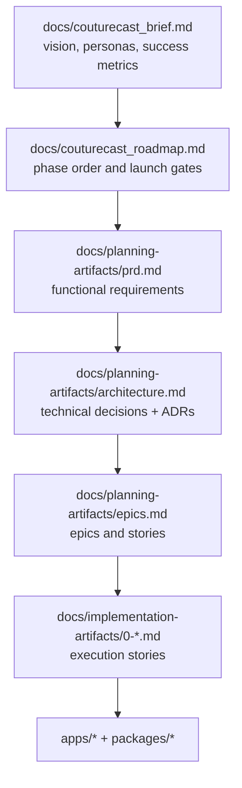
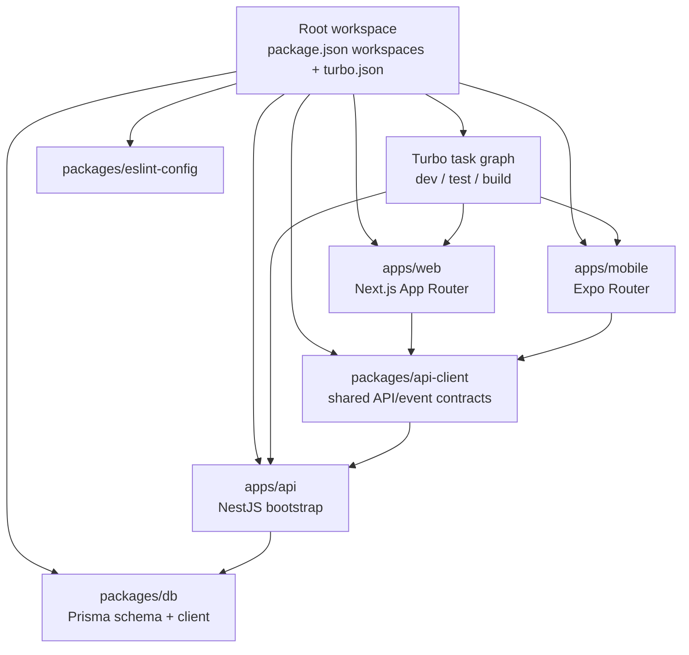
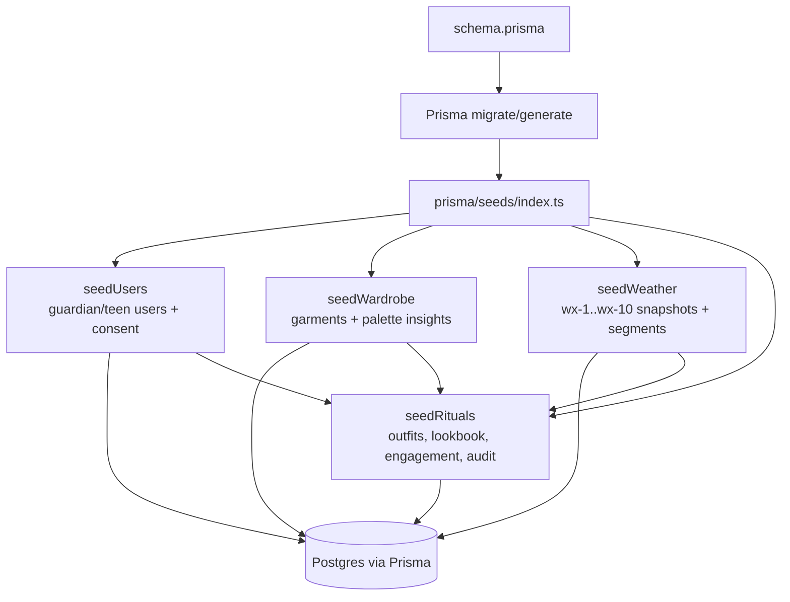
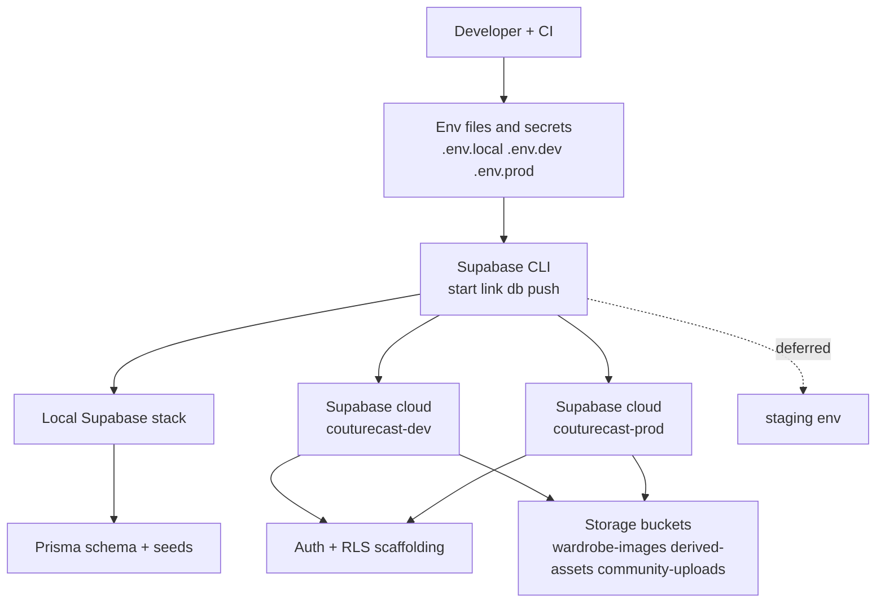
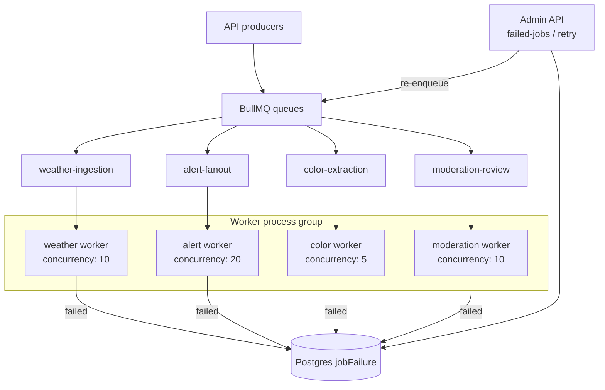
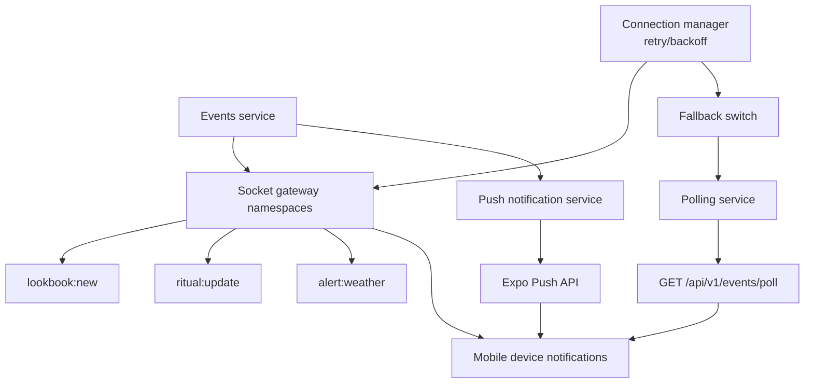
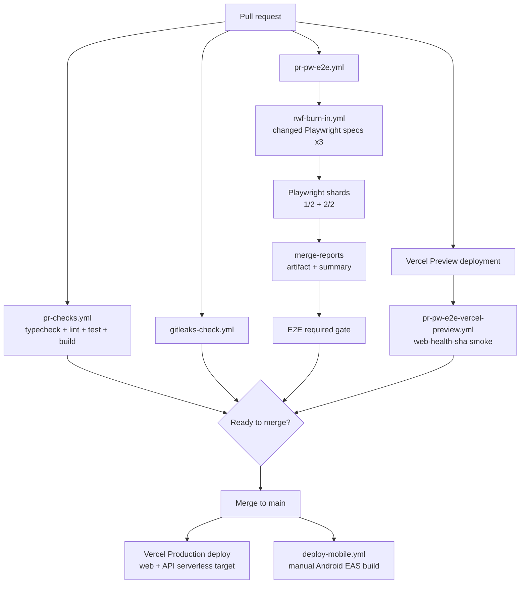
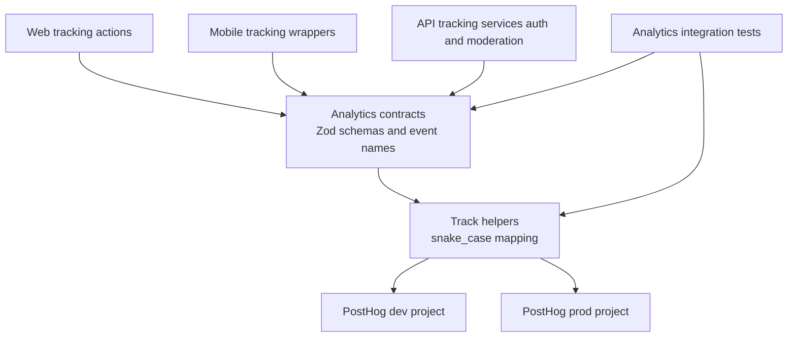
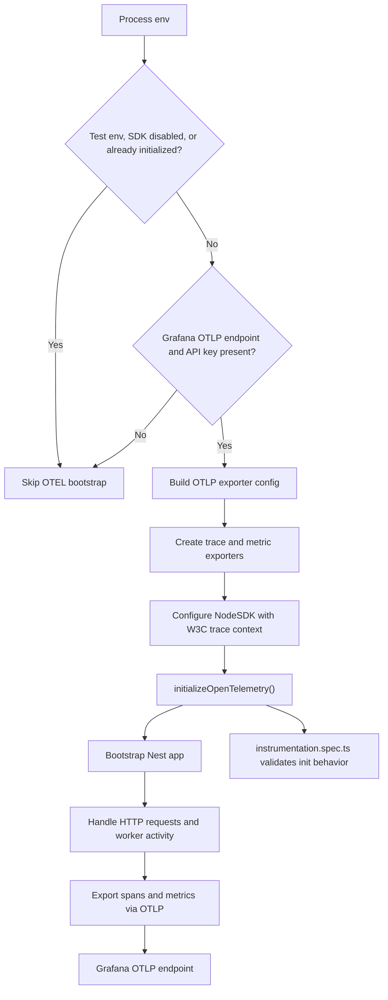
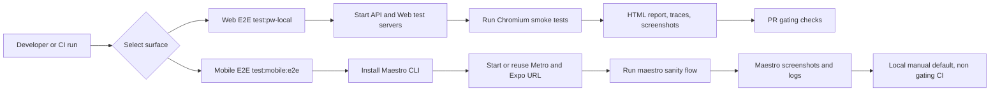

# Couture Cast Learning Path (step by step)

Updated: 2026-03-05 - synthesized from docs + code agent scan

## How to use this

1. Follow steps in order.
2. For each step, read the story first, then open the evidence files.
3. Complete the exercise before moving on.

## Step 1 - Understand product-to-engineering traceability

User/business impact:

Clear traceability from brief to implementation keeps the team building features users actually
need, not speculative work. The business avoids scope drift and costly rework by tying every
delivery decision to defined goals and KPIs.

Key takeaways:

1. Traceability: `docs/couturecast_brief.md` defines vision/KPIs, and downstream planning docs
  must map back to it.
2. Sequencing: `couturecast_roadmap.md` phase order drives `prd.md` scope and `epics.md` story
  decomposition.
3. Delivery alignment: implementation stories in `docs/implementation-artifacts/` should be
  explainable as outcomes of PRD + architecture decisions.

Story/Task mapping:

- Pre-story planning artifacts (source of truth before implementation stories)

Read first:

- `docs/couturecast_brief.md`
- `docs/couturecast_roadmap.md`
- `docs/planning-artifacts/prd.md`
- `docs/planning-artifacts/architecture.md`
- `docs/planning-artifacts/epics.md`

Architecture diagram:

## Step 2 - Monorepo and app boundaries

User/business impact:

Strong app/package boundaries reduce cross-surface breakage, so users get more consistent behavior
across web, mobile, and API. The business gets faster parallel delivery because teams can ship
independently with fewer integration surprises.

Key takeaways:

1. Boundary clarity: `apps/web`, `apps/mobile`, and `apps/api` are separate runtime surfaces with
  distinct entrypoints.
2. Shared contracts: common logic/types flow through workspace packages (not cross-app direct
  imports), especially `packages/api-client` and `packages/db`.
3. Monorepo operations: root npm workspaces + `turbo.json` coordinate consistent `dev`, `test`,
  and `build` behavior.

Story/Task mapping:

- Story 0.1
- Task 2 (mobile app init), Task 3 (web app init), Task 4 (API app init), Task 5 (workspace
config)

Story reference:

- `docs/implementation-artifacts/0-1-initialize-turborepo-monorepo.md`

Code evidence:

- `apps/web/src/app/layout.tsx`
- `apps/mobile/app/_layout.tsx`
- `apps/mobile/app/(tabs)/_layout.tsx`
- `apps/api/src/main.ts`

Architecture diagram:

## Step 3 - Data model and deterministic seeds

User/business impact:

A stable schema plus deterministic seeds makes user-facing logic like recommendations and lookbook
flows predictable in every environment. The business gains safer releases and faster debugging
because test data and migrations are reproducible.

Key takeaways:

1. Schema-first modeling: `packages/db/prisma/schema.prisma` is the single source for relational
  models, enums, and user-scoped tables.
2. Deterministic seeding: seeds use stable IDs and seeded randomness (`faker.seed(4242)`) with
  `upsert` to keep reruns reproducible.
3. Dependency-safe order: `seedUsers -> seedWardrobe -> seedWeather -> seedRituals` ensures
  foreign-key-ready data for recommendations and lookbook flows.

Story/Task mapping:

- Story 0.2
- Task 2 (core schema tables), Task 5 (seed scripts), Task 7 (validation/testing)

Story reference:

- `docs/implementation-artifacts/0-2-configure-prisma-schema-migrations-and-seed-data.md`

Code evidence:

- `packages/db/prisma/schema.prisma`
- `packages/db/prisma/seeds/index.ts`
- `packages/db/prisma/seeds/weather.ts`

Architecture diagram:

## Step 4 - Environment setup and Supabase operations

Supabase is the managed backend platform in this repo that provides PostgreSQL, Auth, and Storage.

User/business impact:

Disciplined Supabase environment and secret management reduces auth, storage, and database
misconfiguration issues that users experience as outages or login failures. The business gets more
reliable deployments and cleaner recovery operations across dev and prod.

Key takeaways:

1. Supabase env isolation is explicit: local/CI stacks plus cloud `couturecast-dev` and
  `couturecast-prod`, with staging deferred until plan/budget allows.
2. Reliability depends on env-aware operations: `npx supabase start/link/db push`, pool targets
  (dev 50, prod 100), and plan-gated PITR/backups.
3. Config hygiene is a core skill: keep `SUPABASE_URL`, `SUPABASE_ANON_KEY`,
  `SUPABASE_SERVICE_KEY`, and `DATABASE_URL` aligned across `.env.local`, `.env.dev`, `.env.prod`,
   and secrets manager.

Story/Task mapping:

- Story 0.3
- Task 3 (Supabase CLI), Task 4 (pooling/backups), Task 5 (env configuration)

Story reference:

- `docs/implementation-artifacts/0-3-set-up-supabase-projects-dev-staging-prod.md`

Code and config evidence:

- `packages/db/prisma/schema.prisma`
- root env conventions in implementation docs

Architecture diagram:

## Step 5 - Queueing and worker reliability

BullMQ is the Redis-backed job queue system in this repo for background work like weather ingestion,
alert fan-out, and moderation processing. It separates slow/retryable workloads from request
handling so the API stays responsive under load.

User/business impact:

Queue retries, backoff, and failure replay ensure critical async tasks still complete during spikes
or transient failures, so users do not miss core updates. The business protects engagement and
operations by preventing silent job loss and shortening incident recovery.

Key takeaways:

1. Parallelization: workers process jobs concurrently outside request threads.
2. Resiliency: retries, backoff, and DLQ-style failure capture prevent job loss.
3. Debuggability/operability: persisted failures + admin replay/prune flows make incidents
  traceable and recoverable.

Story/Task mapping:

- Story 0.4
- Task 2 (BullMQ queues), Task 3 (DLQ), Task 4 (concurrency), Task 5 (worker process group)

Story reference:

- `docs/implementation-artifacts/0-4-configure-redis-upstash-and-bullmq-queues.md`

Code evidence:

- `apps/api/src/config/queues.ts`
- `apps/api/src/workers/base.worker.ts`
- `apps/api/src/workers/bootstrap.ts`
- `apps/api/src/admin/admin.service.ts`
- `apps/api/src/admin/admin.controller.ts`

Architecture diagram:

## Step 6 - Realtime and push delivery

User/business impact:

For users, Step 6 means faster ritual updates and more reliable alerts even when connectivity is
unstable. For the business, it protects engagement and retention by reducing missed notifications
and delivery-related churn.

Ritual context:

- In Couture Cast, a ritual is the daily outfit + weather decision loop a user follows.
- Available ritual-related streams are `ritual:update`, `alert:weather`, and `lookbook:new`.
- They exist to keep recommendations timely, alerts trustworthy, and daily engagement high.

Key takeaways:

1. Delivery is intentionally redundant with Socket+Push+Polling so alerts survive disconnects and
  degraded networks.
2. Shared payload contracts keep channels aligned: `lookbook:new`, `ritual:update`, and
  `alert:weather` all use `{ version, timestamp, userId, data }`.
3. Runtime fallback is deterministic: reconnect backoff (1s/3s/9s, max 5) then polling
  `GET /api/v1/events/poll` until socket recovery.

Story/Task mapping:

- Story 0.5
- Task 1 (Socket.io server), Task 2 (connection lifecycle), Task 3 (Expo Push), Task 4 (shared
payload schema), Task 5 (fallback)

Story reference:

- `docs/implementation-artifacts/0-5-initialize-socketio-gateway-and-expo-push-api.md`

Code evidence:

- `apps/api/src/modules/gateway/gateway.gateway.ts`
- `apps/api/src/modules/gateway/connection-manager.service.ts`
- `apps/api/src/modules/events/events.service.ts`
- `apps/api/src/modules/notifications/push-token.repository.ts`
- `apps/api/src/modules/notifications/push-notification.service.ts`
- `packages/api-client/src/realtime/polling-service.ts`

Architecture diagram:

## Step 7 - CI/CD and automated quality gates

User/business impact:

Automated CI/CD quality gates catch regressions before merge and release, so users encounter fewer
broken core flows. The business lowers hotfix load and ships faster with predictable release
confidence.

Key takeaways:

1. PR quality gates are split intentionally: `pr-checks.yml` blocks typecheck/lint/test/build,
  while `pr-pw-e2e.yml` runs sharded Playwright and enforces the required E2E gate.
2. Flake control is explicit: `rwf-burn-in.yml` reruns changed Playwright specs 3x (with
  `SKIP_BURN_IN` override) before full E2E proceeds.
3. Deployment confidence is surface-aware: Vercel Preview smoke runs from `deployment_status`
  (`pr-pw-e2e-vercel-preview.yml`), while mobile deploy remains manual via `deploy-mobile.yml`.

Story/Task mapping:

- Story 0.6 (status: review)
- Task 1 (test workflow), Task 2 (parallelization), Task 12 (PR preview smoke), Task 13 (API
deployment prep)

Story reference:

- `docs/implementation-artifacts/0-6-scaffold-cicd-pipelines-github-actions.md`

Code evidence:

- `.github/workflows/pr-checks.yml`
- `.github/workflows/pr-pw-e2e.yml`
- `.github/workflows/rwf-burn-in.yml`
- `.github/workflows/pr-pw-e2e-vercel-preview.yml`
- `.github/workflows/gitleaks-check.yml`
- `.github/workflows/deploy-mobile.yml`
- `.github/actions/install/action.yml`
- `.github/actions/setup-playwright-browsers/action.yml`

Supporting docs:

- `docs/test-artifacts/ci-cd-pipeline.md`

Architecture diagram:

## Step 8 - Shared analytics contracts and event tracking

PostHog is the product analytics and feature-flag platform in this repo, used to capture behavior
events consistently across web, mobile, and API. It gives the team reliable funnel and retention
signals for product decisions and experiment rollout control.

User/business impact:

Shared analytics contracts keep event names and payloads consistent across web, mobile, and API,  
reducing tracking bugs that can affect user journeys. The business gets trustworthy funnel and  
retention data for faster, higher-confidence product decisions.

Key takeaways:

1. Analytics contracts are centralized in `packages/api-client/src/types/analytics-events.ts` to
  prevent event-name and payload drift.
2. Contract wrappers validate inputs, normalize to snake_case PostHog properties, and emit
  consistent payloads across web, mobile, and API.
3. Governance comes from integration checks that enforce the five core events and catch schema
  regressions early.

Story/Task mapping:

- Story 0.7
- Task 2 (event schema), Task 3 (event tracking in apps)

Story reference:

- `docs/implementation-artifacts/0-7-configure-posthog-opentelemetry-and-grafana-cloud.md`

Code evidence:

- `packages/api-client/src/types/analytics-events.ts`
- `apps/mobile/src/analytics/track-events.ts`
- `apps/web/src/app/components/analytics-event-actions.tsx`
- `apps/web/src/app/components/posthog-click-tracker.tsx`
- `apps/api/src/modules/auth/auth.service.ts`
- `apps/api/integration/analytics-tracking.integration.spec.ts`

Architecture diagram:

## Step 9 - Observability bootstrap with OpenTelemetry

User/business impact:

OpenTelemetry from process startup gives full-path visibility, enabling faster detection and
diagnosis when user-impacting issues occur. The business reduces downtime and MTTR with
standardized traces and metrics flowing to one observability backend.

Key takeaways:

1. Bootstrap order is the control point: OpenTelemetry starts before Nest app creation so startup
  and request paths are instrumented from the first tick.
2. Guardrails prevent noisy telemetry: missing Grafana OTLP credentials, `NODE_ENV=test`,
  `OTEL_SDK_DISABLED=true`, or prior SDK init all no-op safely.
3. Vendor-neutral observability is explicit: W3C trace propagation + Node auto-instrumentations +
  OTLP exporters stream metrics/traces to Grafana with minimal app-level coupling.

Story/Task mapping:

- Story 0.7
- Task 4 (OpenTelemetry setup in NestJS)

Story reference:

- `docs/implementation-artifacts/0-7-configure-posthog-opentelemetry-and-grafana-cloud.md`

Code evidence:

- `apps/api/src/instrumentation.ts`
- `apps/api/src/main.ts`
- `apps/api/src/instrumentation.spec.ts`

Architecture diagram:

## Step 10 - Cross-surface E2E confidence

User/business impact:

Cross-surface smoke E2E coverage catches critical web and mobile regressions before users hit them
in production. The business can release more frequently with less manual QA effort and clearer
pass/fail evidence.

Key takeaways:

1. Cross-surface execution is standardized at the root: Playwright (`test:pw-local`) and Maestro
  (`test:mobile:e2e`) run from shared workspace scripts.
2. Smoke coverage is purpose-built by surface: web validates API health, core hero rendering, and
  accessibility; mobile validates Expo launch/connect and basic tab navigation flow.
3. Confidence comes from artifacts plus policy: Playwright HTML/trace outputs and Maestro
  screenshots/logs support fast triage, while web is PR-gated and mobile remains manual/local by
   default.

Story/Task mapping:

- Story 0.13
- Task 1 (Playwright harness), Task 2 (Maestro harness), Task 4 (CI integration)

Story reference:

- `docs/implementation-artifacts/0-13-scaffold-cross-surface-e2e-automation.md`

Supporting docs:

- `docs/test-artifacts/test-design-system.md`

Code evidence:

- `playwright/config/base.config.ts`
- `playwright/config/local.config.ts`
- `playwright/tests/home.spec.ts`
- `playwright/tests/web-health-sha.spec.ts`
- `maestro/sanity.yaml`
- `scripts/run-maestro.mjs`
- `.github/workflows/pr-pw-e2e.yml`
- `.github/workflows/pr-mobile-e2e.yml`

Architecture diagram:

