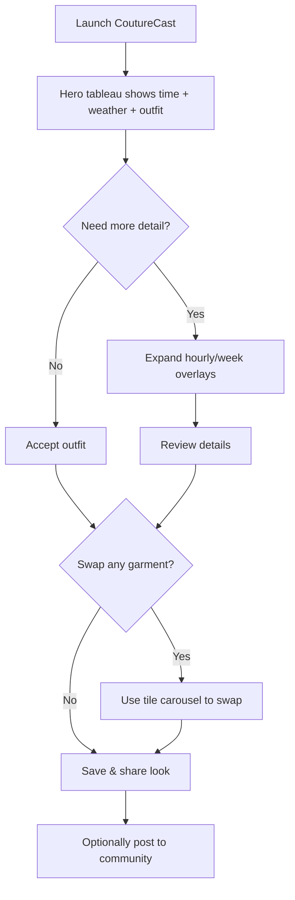
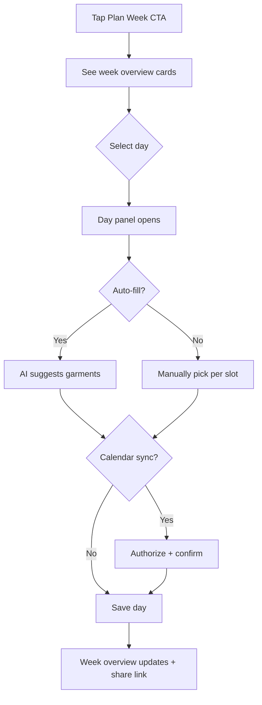
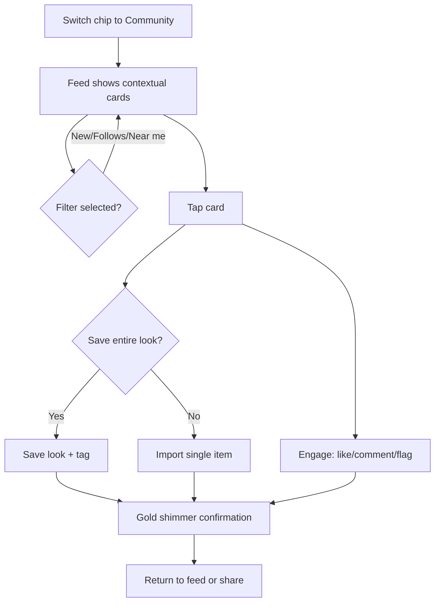
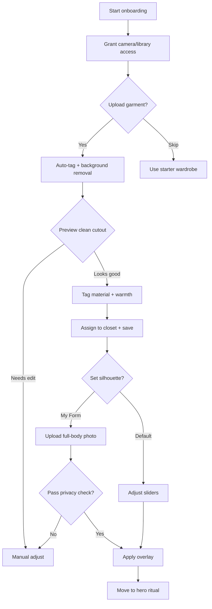

# couture-cast UX Design Specification

_Created on 2025-11-10 by BMad-user_
_Generated using BMad Method - Create UX Design Workflow v1.0_

---

## Executive Summary

CoutureCast delivers a couture-grade daily ritual that fuses precise local weather insights with AI-personalized wardrobe guidance across mobile, widget, and wearable touchpoints so every user starts the day confident and prepared. The product intentionally balances quick utility with fashion inspiration, moderated community energy, and privacy-first guardrails for teen users while teeing up a future CoutureCast Jr. track once COPPA workflows are ready.

---

## 1. Design System Foundation

### 1.1 Design System Choice

We will anchor CoutureCast on a hybrid native foundation:

- **iOS:** Apple Human Interface Guidelines (latest 2025 update) for navigation, typography scaling, and motion defaults.
- **Android:** Material 3 (Material You) for adaptive color harmonization, responsive grids, and stateful components.
- **CoutureCast Surface Layer:** Shared token set for couture color stories, silhouette treatments, and micro-interactions so both platforms express a single brand voice.

This keeps development velocity high (ready-made components, accessibility baked in) while giving us room to craft distinctive garment tiles, silhouette modules, and weather-driven motion themes. Custom work concentrates on modular outfit tiles, the premium theme orchestrator, and the editorial look-book grid.

---

## 2. Core User Experience

### 2.1 Defining Experience

The launch surface compresses CoutureCast’s promise into an instant ritual: local time, real-time weather deltas, and a hero outfit tile appear immediately so users never hunt for context. Hourly and weekly strips sit one tap away, and users can hide them to stay in a minimal, “right-now” focus whenever they prefer. Outfit suggestions render as modular tiles on crisp white or transparent backgrounds, making each garment feel merchandised yet shoppable; free-tier mannequins use adjustable black silhouettes (body type + height sliders), and Premium unlocks a silhouette-toggle plus a “My Form” upload where users can ghost their own photo (white/black basewear required) beneath the layered look. Premium themes layer expressive palettes and motion microstates, while every outfit tile supports one-touch swaps so planning for the day or week stays effortless.

### 2.2 Novel UX Patterns

Dynamic look-book shuffling learns from previous outfit approvals to surface smarter alternates; overlay toggles let users glide between minimal and full-detail weather modes; and contextual premium skins introduce subtle aura glows or fabric-inspired textures tied to weather states (e.g., mist, sunburst) without compromising clarity. Hero copy anchors the signature promise: “It’s the app where the weather instantly becomes a couture outfit that fits my day.”

### 2.3 Desired Emotional Response

Free users land in calm couture inspiration—a serene, editorial mood that builds trust through restraint. Premium unlocks tastefully kinetic themes: seasonal palettes and delicate motion backdrops (fog drift, sunrays, soft rain) that mirror live weather while keeping the core ritual composed and focused.

### 2.4 Inspiration Benchmarks

- **WeatherWare (Android)** — Tall hero photography with inline weather stats, left-rail garment toggles, and a bottom 7-day strip show how couture imagery and meteorological data can coexist without clutter.
- **Clothing Suggestions layout** — Each garment floats on white/transparent tiles, reinforcing our modular outfit card vision and keeping swap gestures intuitive.
- **Outfit look-book grid** — Community feed concept mixes “New” and “Following” tabs with soft-shadow cards, mirroring the social inspiration loop we want for trends and nearby looks.
- **Outfit builder onboarding** — Lightweight editing controls (background removal, front/back toggle) demonstrate how to expose power features while preserving breathing room.

These references inform the CoutureCast signature: hero-led weather visuals, modular outfit tiles, and community grids that feel editorial yet scannable.

### 2.5 Core Experience Principles

- **Speed:** Weather + outfit context loads in under two seconds, with every swap or hide action responding immediately so the ritual never feels laggy.
- **Guidance:** Subtle onboarding tips and microcopy explain silhouette controls and premium themes, then fade so daily use stays clutter-free.
- **Flexibility:** Users can collapse ribbons, change silhouettes, or shuffle outfits without leaving the hero view—control without UI sprawl.
- **Feedback:** Soft haptics, silhouette glows, and gold micro-accents confirm actions; celebrations stay refined unless a major milestone (e.g., premium unlock) warrants a richer motion moment.

---

## 3. Visual Foundation

### 3.1 Color System

**Core palette (all tiers)**

- Background `#FFFFFF` and elevated surface `#F5F5F7` keep layouts bright and gallery-clean.
- Primary typography `#111111` (Onyx) for headings and body copy; secondary text `#44444F` for supportive detail.
- Signature accent `#C9A14A` gold—applied to the CoutureCast logotype, key CTAs, and appointment moments like the hero outfit card badge.
- Utility grayscale ladder for structure: `#0D0D12` (Black Tie), `#1E1E26` (Graphite), `#3A3A45` (Charcoal), `#5C5C68` (Slate), `#8A8A95` (Fog), `#B8B8C3` (Mist), `#E6E6ED` (Cloud).

**Usage guidance**

- Reserve gold for primary actions, accent dividers, and premium upsell cues to preserve its luxury impact.
- Weather icons, data glyphs, card outlines, and controls live within the grayscale ladder for maximum clarity against the white canvas.
- Typography stays pure black/gray; color is never used for copy except for links, which adopt a deep charcoal underline.

**Premium seasonal palettes (upsell unlocks)**

1. **Jewel Radiance** — Emerald `#0D6F62`, Sapphire `#1F4E79`, Wine Red `#722F37`; applied to silhouette overlays, gradients, and premium chart accents.
2. **Autumn Umber** — Maple `#B1683A`, Chestnut `#8C5331`, Wheat `#D9B38C`; introduces warm neutrals, suede textures, and cozy spotlight frames.
3. **Winter Metallic** — Platinum `#C9CDD8`, Steel `#7E889A`, Ice `#E9EDF6`; powers subtle motion backdrops (fog, snow shimmer) and hero card treatments.
4. **Spring Bloom (future)** — Soft Coral `#F29BA8`, Mist Lilac `#C9B7E5`, Morning Dew `#B8E3D3`; queued for future drops to keep the ritual fresh.

Premium themes inherit the monochrome base for typography and structure, layering these palettes through gradients, fabric-inspired motion, and accessory highlights without jeopardizing readability.

### 3.2 Typography System

- **Hero + outfit names:** Canela (or Playfair Display fallback) at optical sizes 44/52/64 for hero, 28/36 for section titles; weight regular for a couture editorial feel, uppercase tracking +20 for labels.
- **System text:** SF Pro Text (iOS) / Inter (Android + web) for body copy, captions, and controls; weights 400/500/600 with 1.4 line-height for readability.
- **Numerics + data glyphs:** Space Grotesk (or SF Mono fallback) for temperatures, wind speeds, and timestamps to reinforce precision.
- **Type scale tokens:** `display-xxl 64/72`, `display-xl 48/56`, `heading-lg 32/40`, `heading-md 24/32`, `heading-sm 20/28`, `body-lg 18/28`, `body 16/24`, `body-sm 14/20`, `micro 12/16`.
- **Accessibility:** Minimum contrast 4.5:1 by keeping text purely black/gray; Dynamic Type and Material’s typography scaling remain enabled.

### 3.3 Spacing & Layout

- **Spacing unit:** 4px base with 8px rhythm for major steps; scale tokens `xxs 4`, `xs 8`, `sm 12`, `md 16`, `lg 24`, `xl 32`, `2xl 48`, `3xl 64`.
- **Layout grid:** 12-column, 72px max column width, 24px gutters on desktop; collapses to 6-column on tablets, 4-column on mobile. Widgets use a 2-column micro grid.
- **Containers:** Desktop max width 1360px, tablet 960px, mobile edge padding 24px (free) / 20px (widget); hero module spans full width with 80px top/bottom breathing room.
- **Component spacing:** Card padding 24px (free) / 28px (premium), list rows 16px vertical, silhouette controls 20px spacing to keep toggles touch-friendly.
- **Elevation + dividers:** Use 2dp drop on cards, 1px `#E6E6ED` rules, and 8px corner radius to maintain softness.

### 3.4 Button hierarchy

- **Primary CTA (standard + premium):** Solid `#111111` fill with white label, 999px pill radius, subtle drop shadow, and gold (`#C9A14A`) 2px focus ring. Keeps the hero action high contrast without overusing gold.
- **Secondary:** Ghost button with 1px black stroke on transparent fill; hover introduces a `rgba(17,17,17,0.05)` wash so it still feels tactile.
- **Tertiary/text:** Charcoal link button (`#3A3A45`) with underline on hover; no fill to preserve a lightweight feel for low-risk actions.
- **Destructive:** Solid merlot (`#B04A4A`) fill with white text and matching hover darken for clarity.

**Rationale:** This catalogue maintains the couture monochrome palette, reserves gold for key highlights (logo, hero badge, focus ring), and delivers WCAG-ready contrast for every state. Users always know the primary path (bold black pill), while secondary/tertiary actions remain legible without competing for attention.

**Interactive Visualizations:**

- Color Theme Explorer: [ux-color-themes.html](refs/ux/ux-color-themes.html) – swatches plus live button, chip, input, and card demos for each palette

---

## 4. Design Direction

### 4.1 Chosen Design Approach

**Selected direction: Lookbook Prism** — a split layout that balances the personal ritual with a living community surface so weather, outfits, and inspiration stay co-present.

**Layout + hierarchy**

- Desktop: hero ritual module (time, weather, modular outfit tiles) anchors the left column; community lookbook grid occupies the right column with tabs for New / Following / Near me / Brands. Planner rail can slide in on ultrawide screens but stays hidden by default.
- Tablet: hero sits on top with chips pinned directly beneath, followed by a two-column lookbook grid. Outfit tiles scroll horizontally with 64px padding for stylus interactions.
- Mobile: hero, chips, and garment tiles stack vertically; community pulse cards follow immediately with gold-underlined bottom navigation.

**Interaction + motion themes**

- Inline chips manage Personal vs Community vs Sponsored views plus lookbook filters, eliminating page reloads.
- Outfit tiles support tap-to-swap gestures with subtle lift and gold focus ring; premium themes add weather-reactive gradients (fog drift, sunray shimmer) without overwhelming clarity.
- Community cards show success badges, sponsorship labels, and quick actions (save look, import item, applaud) with haptic feedback on mobile.

**Why it fits CoutureCast**

- Keeps the hero ritual sacred—users always land on weather + outfit context first.
- Provides immediate social inspiration and trend awareness, reinforcing the brand’s fashion credibility.
- Scales cleanly across devices while preserving the couture monochrome aesthetic.

**Interactive Mockups:**

- Design Direction Showcase: [ux-design-directions.html](./ux-design-directions.html)

---

## 5. User Journey Flows

### 5.1 Critical User Paths

#### Morning Outfit Ritual

- **Goal:** Launch app, understand immediate weather, confirm outfit, optionally tweak.
- **Key states:** hero ritual, hide/show overlays, garment swaps, save look.
- **Edge cases:** missing wardrobe items (show ghost silhouettes), severe weather alerts (merlot banner).

#### Weekly Planner (Hero CTA → Planner Rail)

- **Goal:** Map outfits for the next 3–7 days, sync with calendar, prep travel.
- **Key states:** day picker, AI auto-fill vs manual, calendar authorization, share/export.
- **Edge cases:** calendar API offline (show merlot inline error + retry), conflicting wardrobe item (warn + offer alternate), AI suggestion unavailable (fall back to saved looks).

#### Community Inspiration Loop

- **Goal:** Browse trending looks, engage socially, import pieces into wardrobe.
- **Key states:** chip filters, card modal, save/import actions, moderation cues.
- **Edge cases:** flagged content (toast + remove), network hiccup (retry banner), import failure (inline error with ghost fallback image).

#### Wardrobe Onboarding & Silhouette Setup

- **Goal:** Capture wardrobe photos, categorize garments, configure the default silhouette/my-form overlay.
- **Key states:** camera/upload permission, background removal, tagging, body type sliders, premium “My Form” upload.
- **Edge cases:** upload failure, background removal timeout, silhouette photo rejected (low contrast), teen account requiring guardian approval.

#### Alerts, Widgets, and Notification Entry Points

- **Goal:** Give users glanceable entry from widgets/watch/push without losing context.
- **Widget tap:** Tapping the iOS/Android widget deep-links to the hero ritual with state encoded (`/app?source=widget&slot=am`). When offline, app opens to cached data + toast explaining stale state.
- **Severe weather push:** Notification body previews the premium banner copy; tapping opens the hero canvas with the alert state focused and action buttons (“Adjust outfit”, “Plan week”).
- **Community ping:** Push opens directly into Lookbook Prism with the referenced card highlighted; keyboard focus and screen-reader cursor land on that card.
- **Error handling:** If deep-link payload is invalid, app falls back to the hero ritual and surfaces an info banner (“We refreshed your data after reconnecting”).

---

## 6. Component Library

### 6.1 Component Strategy

1. **Hero Ritual Canvas** – composite module containing weather glyphs, time, garment tiles, chip rail, hide/show toggles. Built as responsive container with tokenized paddings so it can collapse from split view to single column.
2. **Modular Outfit Tile** – reusable card for garments with state variations: default, hover, swap preview, locked (premium). Supports silhouette overlay slot + metadata (feels-like temp, fabric notes).
3. **Chip & Filter System** – pill controls for Personal/Community/Sponsored and lookbook filters; includes loading shimmer, overflow scroll, and icon variants.
4. **Lookbook Card** – media-first card with weather/location tags, engagement stats, and CTA cluster (save, import, applaud). Sponsorship label and moderation flag variants built in.
5. **Planner Day Card** – three-slot layout (morning/midday/evening) with auto-fill badges, manual edit buttons, and calendar sync status pill.
6. **Feedback Suite** – premium accent banners/toasts + inline validation rows that inherit the gold/merlot/fog palette rules.
7. **Widget Modules** – 2×2 quick glance and 4×2 weekly planner, sharing the same typography and icon tokens for platform parity.

All components inherit spacing tokens (4px base) and color/typography decisions documented earlier so engineering can wire them into a cross-platform design system (e.g., Figma library + code tokens).

**Detailed specifications**

- **Hero Ritual Canvas**

  - _Purpose/data_: surfaces time, precise weather deltas, outfit summary, hide/show controls, and entry CTAs (Plan Week, Share Look).
  - _User actions_: collapse ribbons, swap garments, open planner, post to community.
  - _States_: default, condensed (when user hides overlays), loading (skeleton for weather + garments), severe-weather alert (merlot top banner), premium theme applied.
  - _Variants_: split view (desktop), stacked (tablet/mobile), widget hero (2×2 module).
  - _Accessibility_: focus order hero → chips → garments; announce weather + outfit via aria-live when data refreshes.

- **Modular Outfit Tile**

  - _Purpose/data_: displays garment photo or silhouette overlay, garment name, material tags, temperature suitability icons.
  - _Actions_: tap to swap, long-press to edit garment, drag into look when building outfits (web/tablet).
  - _States_: default, hover, selected, swap-preview (showing alternate), locked (premium), error (missing image placeholder), disabled (wardrobe syncing).
  - _Variants_: single garment tile, outfit stack tile (multi-layer), widget micro-tile.
  - _Accessibility_: alt text for garment imagery, 44px minimum size, descriptive aria-label (“Swap pleated maxi skirt”).

- **Chip & Filter System**

  - _Purpose_: toggles between Personal/Community/Sponsored views and filters lookbook lists (New, Following, Near me, Brands).
  - _States_: default, hover/focus (gold ring), selected (filled chip), loading shimmer (data fetching), disabled (filter unavailable).
  - _Variants_: single-line scrollable row, multi-row filter drawer, icon-leading chip (e.g., location icon for Near me).
  - _Accessibility_: chips respond to keyboard arrows; aria-pressed communicates selection state.

- **Lookbook Card**

  - _Content_: hero image, weather/location pill, outfit description, engagement counts, CTA cluster (save/import/applaud/flag) plus sponsorship label when applicable.
  - _States_: default, hover (raise + show quick actions), saved (gold check), flagged (merlot border), loading skeleton, reported (overlay + moderation status).
  - _Variants_: square grid card, list row, widget “pulse” card.
  - _Accessibility_: card becomes a region with heading (`aria-labelledby`), CTAs reachable via tab order, sponsorship label announced to screen readers.

- **Planner Day Card**

  - _Content_: day label, weather summary, three slots (morning/midday/evening) each with garment chips + notes, AI auto-fill badge, calendar sync status pill.
  - _States_: default, AI-suggested (badge + gold glow), edited (pencil icon), conflict (merlot border), synced (check icon), offline (gray overlay).
  - _Variants_: vertical stack (mobile), horizontal row (desktop planner rail), widget snippet.
  - _Accessibility_: each slot uses button groups accessible via tab + arrow, success/error announced via polite aria-live.

- **Feedback Suite**

  - _Elements_: banner (success/info/error/loading), toast (success/error/info), inline validation row.
  - _States_: success (gold gradient), error (merlot), info (fog), loading (fog with gold progress), queued (stacked toasts with max three visible).
  - _Behavior_: banners slide from top with 300 ms animation; toasts auto-dismiss after 6 s unless required.
  - _Accessibility_: role="status" for success/info, role="alert" for errors; ensure focus moves to inline error on validation failure.

- **Widget Modules**
  - _Quick glance (2×2)_: temperature, look summary, single swap CTA.
  - _Weekly planner (4×2)_: four mini-cards with day abbreviation, weather glyph, outfit hint.
  - _Wearable card_: watch-safe layout with white background, charcoal text, gold sync ring.
  - _States_: default, sync-in-progress (fog overlay), warning (merlot border), offline (gray text).
  - _Accessibility_: provide text alternatives for complications, respect platform contrast guidelines.

**Native component tailoring**

- Buttons, navigation bars, and tabs originate from Apple HIG and Material 3 libraries but override token values (colors, radii, typography) using CoutureCast Surface tokens.
- Bottom navigation = Material 3 bottom bar with gold active indicator; iOS tab bar uses large titles disabled to keep layout minimal, but focus indicators adopt gold ring.
- Modals rely on UIKit sheet presentation / Material bottom sheet; we customize corner radius (24px) and overlay opacity (60%).
- Form controls inherit platform behavior yet adopt CoutureCast spacing and label rules (floating labels disabled in favor of stacked labels for consistency across OSs).

---

## 7. UX Pattern Decisions

### 7.1 Consistency Rules

**Feedback patterns (selected option: Premium accent feedback)**

- **Success:** Gold-forward gradient banner (white → #FFF9EF) with 1px gold border (#C9A14A) and soft drop shadow to reinforce premium wins; gold toast with charcoal text for short confirmations.
- **Error/destructive:** Deep merlot (#361F1F background, #B04A4A border) with light text for clear urgency; destructive toasts mirror the same palette to keep mental mapping consistent.
- **Informational/neutral:** Fog and silver neutrals (#EFF1F6, #CFD6E5) with charcoal icons; used for “forecast updating” or “sync in progress” states.
- **Loading:** Slim top progress indicator plus inline banner using fog background and gold shimmer to signal motion without anxiety.

**Form patterns**

- Inline labels above fields, secondary hint text below in Fog gray, immediate validation with red microcopy.
- Multi-step forms use progress chips near the hero to avoid modal traps.
- Uploaders include thumbnail previews with gold “processing” indicator.

**Modal patterns**

- Medium-width (640px) for settings, full height for closet management; always dim background to 60% opacity and lock scroll.
- Close via explicit X and swipe-down gesture on mobile; destructive modals require secondary confirm button.

**Navigation patterns**

- Hero chips manage Personal / Community / Sponsored views; bottom nav on mobile with active state gold underline.
- Back navigation defaults to OS gesture plus inline “Back to ritual” link on detail screens.

**Empty states**

- White canvas with gold-outline illustration, single sentence of empathetic copy, and a tertiary CTA encouraging action (e.g., “Add your first garment”).

**Confirmation patterns**

- Use inline banners for low-risk saves; modal confirmations only for destructive actions (delete closet, remove account) pairing merlot CTA with ghost secondary button.

**Notification patterns**

- In-app toasts pinned top-right on desktop, top-center on mobile; push notifications reuse monochrome + gold palette with concise copy.

**Search patterns**

- Omnisearch field in hero supports garments, looks, and weather—results split into tabs with most relevant surfaced first.

**Date/time patterns**

- Relative times (“Updated 2 min ago”) for freshness, absolute timestamps for forecasts/planner entries; calendar picker uses native OS control styled with gold focus rings. Time zones default to user locale with quick toggle for travel mode.

---

## 8. Responsive Design & Accessibility

### 8.1 Responsive Strategy

**Desktop / large (Option 1A — split ritual + lookbook):** Hero ritual and community lookbook stay visible side-by-side so users can glance at weather + outfits while browsing social inspiration. A planner rail can slide in as a third column on ≥1440px layouts when users need the weekly board, otherwise hero + lookbook each own ~45% of the width with generous guttering.

**Tablet (Option 2A — stacked hero, two-column grid):** Portrait stacks the hero module above a two-column lookbook grid; landscape keeps the hero wide with the grid below but pins the chip rail for fast filtering. Horizontal outfit shuttles remain scrollable with 64px edge padding so Apple Pencil/Android stylus gestures feel natural.

**Mobile (Option 3A — single column + sticky chips):** The hero module, chip row, and garment tiles form a single column with a sticky chip bar that stays just below the hero. Community pulse cards follow immediately and bottom navigation highlights the active tab with a gold underline. Bottom sheets only appear for deep dives (e.g., editing planner) to keep the daily ritual one-handed.

**Widgets & wearables (Option 4B + 4C, light skins):** Rich 4×2 widgets expose the weekly planner summary, while compact 2×2 widgets show current look + swap CTA. Wearable cards adopt the monochrome palette (white body, charcoal text, gold ring indicator) so the watch face feels consistent with the app without the heavy black background. All quick surfaces expose success/alert states via the same gold/merlot color cues as the main UI.

**Accessibility + performance:**

- All breakpoints respect 4.5:1 contrast via the monochrome palette; gold is limited to accents with fallback outlines when high-contrast mode is enabled.
- Hit targets remain ≥44px with extra spacing on mobile to support one-handed use and assistive touch.
- Prefers-reduced-motion suppresses premium motion backdrops in favor of static gradients; watch widgets fall back to solid fills.
- Screen-reader order mirrors visual hierarchy (hero → chips → garments → community), and ARIA live regions announce key feedback (forecast refresh, saved looks) without repeating static content.

**Accessibility commitments:**

- **Compliance target:** WCAG 2.1 Level AA for mobile + web surfaces (required for global consumer launch teams).
- **Keyboard navigation:** Tab order follows hero → chip rail → garment tiles → community cards; provide visible gold focus rings on every interactive element, skip-to-content links on desktop, and trap focus within modals until closed.
- **Alt-text strategy:** Weather glyphs and garment photography receive descriptive alt text (e.g., “Pleated maxi skirt in charcoal wool”); decorative background motion uses `aria-hidden="true"`.
- **Testing plan:** Automated audits with Lighthouse + axe DevTools per build, plus manual VoiceOver (iOS) and TalkBack (Android) sweeps for each release candidate; quarterly keyboard-only regression walkthroughs documented in QA notes.

---

## 9. Implementation Guidance

### 9.1 Completion Summary

The CoutureCast UX specification now captures:

- Hybrid native design system (HIG + Material 3 + CoutureCast Surface tokens) with monochrome + gold palette, typography, spacing, and button hierarchy.
- Core ritual definition, emotional intent, inspiration sources, and Lookbook Prism direction with responsive translations.
- Three end-to-end user journeys (morning ritual, weekly planner, community inspiration) plus component strategy and UX pattern decisions, including premium accent feedback.
- Interactive artifacts stored alongside this doc: `docs/refs/ux/ux-color-themes.html`, `docs/refs/ux/ux-design-directions.html`, `docs/refs/ux/ux-button-options.html`, and `docs/refs/ux/ux-feedback-options.html` for stakeholders to review visually.
- Color analysis pipeline confirmed as an in-house build using on-device palette detection so user imagery never leaves CoutureCast’s boundary and styling slots stay privacy-safe.

Next recommended actions:

1. Run usability walkthroughs using the responsive mockups to validate chip flows and garment swaps.
2. Feed component tokens into the design system (Figma + code) so engineering can build shared libraries.
3. Execute the workflow validation checklist and decide whether to trigger follow-up workflows (wireframes, prototype, AI frontend prompts).

---

## Appendix

### Related Documents

- Product Requirements: `/Users/murat/opensource/couture-cast/docs/bmm-PRD.md or PRD.md or product-requirements.md`
- Product Brief: `/Users/murat/opensource/couture-cast/docs/product-brief.md or brief.md or project-brief.md`
- Brainstorming: `/Users/murat/opensource/couture-cast/docs/brainstorming.md or brainstorm.md or ideation.md`

### Core Interactive Deliverables

This UX Design Specification was created through visual collaboration:

- **Color Theme Visualizer**: docs/refs/ux/ux-color-themes.html

  - Interactive HTML showing all color theme options explored
  - Live UI component examples in each theme
  - Side-by-side comparison and semantic color usage

- **Design Direction Mockups**: /Users/murat/opensource/couture-cast/docs/refs/ux/ux-design-directions.html
  - Interactive HTML with 6-8 complete design approaches
  - Full-screen mockups of key screens
  - Design philosophy and rationale for each direction

### Optional Enhancement Deliverables

_This section will be populated if additional UX artifacts are generated through follow-up workflows._

<!-- Additional deliverables added here by other workflows -->

### Next Steps & Follow-Up Workflows

This UX Design Specification can serve as input to:

- **Wireframe Generation Workflow** - Create detailed wireframes from user flows
- **Figma Design Workflow** - Generate Figma files via MCP integration
- **Interactive Prototype Workflow** - Build clickable HTML prototypes
- **Component Showcase Workflow** - Create interactive component library
- **AI Frontend Prompt Workflow** - Generate prompts for v0, Lovable, Bolt, etc.
- **Solution Architecture Workflow** - Define technical architecture with UX context

### Version History

| Date       | Version | Changes                         | Author    |
| ---------- | ------- | ------------------------------- | --------- |
| 2025-11-10 | 1.0     | Initial UX Design Specification | BMad-user |

---

_This UX Design Specification was created through collaborative design facilitation, not template generation. All decisions were made with user input and are documented with rationale._
